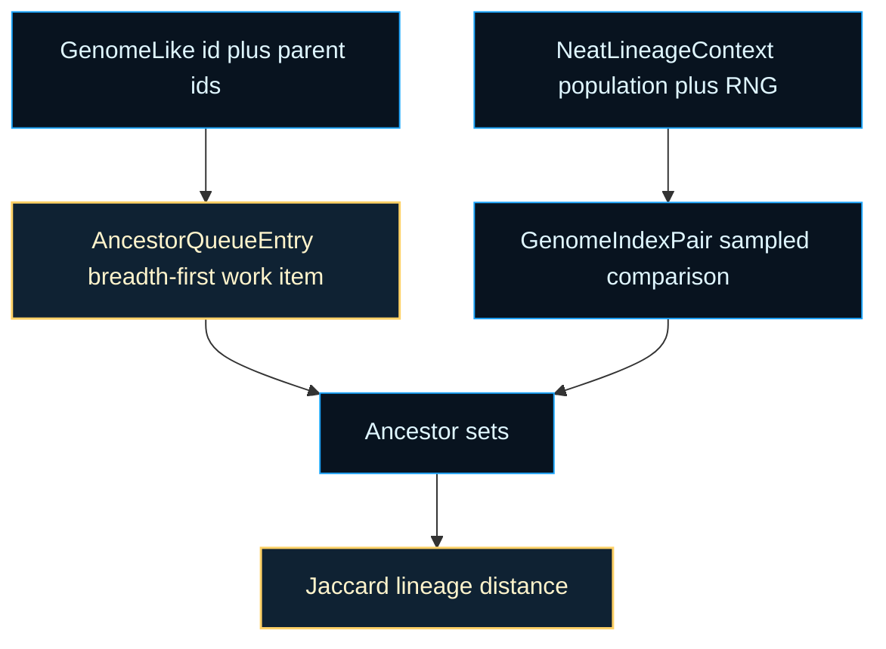
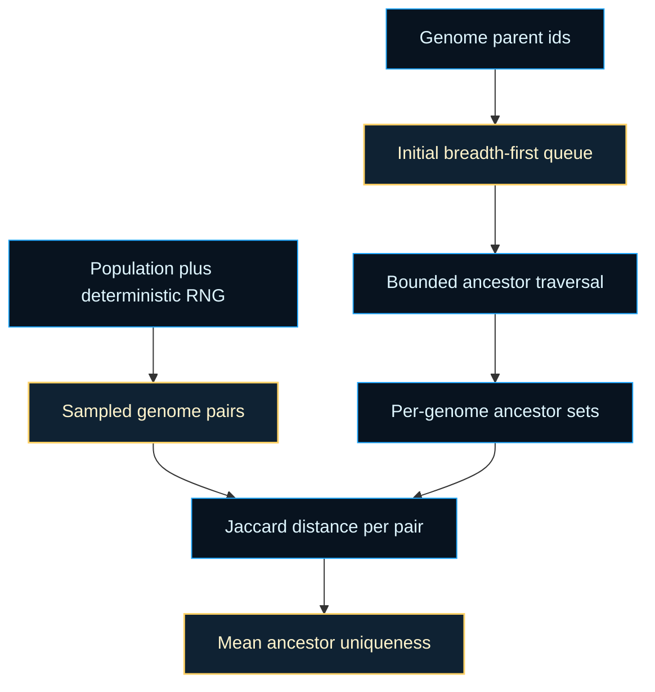

# neat/lineage/core

Core contracts for lineage-analysis mechanics.

This file defines the narrow data shapes behind the controller-facing
lineage helpers. The public lineage chapter talks about recent family
overlap as a runtime signal; this core contract layer explains which pieces
of state the mechanics actually need to produce that signal.

The important constraint is intentional minimalism. Ancestor traversal does
not need the full genome implementation, and sampled uniqueness does not need
the whole `Neat` controller. By describing only ids, parent links,
population access, and RNG access, this layer keeps the lineage utilities
reusable and easy to reason about.

Read the contracts in this order:

1. `GenomeLike` describes the smallest ancestry-bearing genome shape,
2. `NeatLineageContext` shows what the controller must supply for sampled
   lineage reads,
3. `AncestorQueueEntry` models one step in breadth-first ancestor expansion,
4. `GenomeIndexPair` models one sampled comparison between genomes.



## neat/lineage/core/lineage.types.ts

### AncestorQueueEntry

Queue entry used during breadth-first ancestor traversal.

Each entry records which ancestor id is being explored, how deep that
ancestor sits relative to the original genome, and an optional cached genome
reference so later traversal steps can enqueue that ancestor's parents.

### GenomeIndexPair

Index pair representing one sampled genome comparison.

The lineage uniqueness metric does not compare every possible pair in large
populations. Instead it samples a bounded set of pairs, then asks how much
recent ancestry overlaps inside each comparison.

### GenomeLike

Minimal genome shape used by lineage helpers.

Lineage analysis only needs two structural facts from each genome: a stable
identifier and the identifiers of its recorded parents. Everything else is
intentionally left open-ended so ancestry helpers can run against richer
runtime objects without importing or depending on all of their fields.

In practice this interface is the bridge between reproduction-time lineage
bookkeeping and read-side lineage metrics. If those ids are present and
stable, the rest of the ancestry pipeline can stay decoupled from mutation,
evaluation, telemetry, and speciation internals.

### NeatLineageContext

Minimal NEAT context required by lineage helpers.

The lineage boundary only needs the current population and the RNG provider
used for sampled ancestor uniqueness. That small host contract makes the
ownership model explicit: lineage reporting is a read-side controller
concern, not a stateful subsystem with its own storage or mutation rules.

The population supplies the ancestry graph to inspect. The RNG provider keeps
sampled uniqueness deterministic so the same run can replay the same sampled
comparisons during tests or exported-state debugging.

## neat/lineage/core/lineage.core.ts

Lineage-analysis mechanics used by NEAT ancestry helpers.

This chapter is the mechanics layer beneath the controller-facing lineage
helpers. Its job is to turn stored parent ids into a bounded ancestry signal
that is cheap enough for telemetry and adaptive policy to read during a run.

The pipeline has four stages:

1. normalize parent links into one consistent ancestry input shape,
2. walk outward through recent ancestors with a bounded breadth-first queue,
3. sample a limited set of genome pairs instead of exhaustively comparing the
   full population,
4. measure ancestor-set overlap with Jaccard distance and fold the result
   into one mean uniqueness signal.

That staged split is what keeps the public lineage chapter readable. The
root helpers can describe what lineage metrics mean, while this file owns the
exact traversal, sampling, and distance math that makes those metrics stable.

Read the chapter in this order: start with `normalizeParentIds()` and
`createInitialQueue()`, continue through `collectAncestorIds()` for the
breadth-first walk, then `sampleGenomePairs()` for the comparison budget, and
end with `computePairDistances()` plus `computeAverageDistance()` for the
final Jaccard-based fold.



### calculateMaxSamplePairs

```ts
calculateMaxSamplePairs(
  size: number,
): number
```

Compute the upper bound on sampled genome pairs.

The uniqueness metric is intentionally sampled rather than exhaustive. This
helper keeps that budget honest by capping the requested sample count to both
the true combinatorial maximum and the chapter's global runtime limit.

Parameters:
- `size` - - Population size.

Returns: Sample cap respecting both the combinatorial count and the global limit.

### collectAncestorIds

```ts
collectAncestorIds(
  queueEntries: AncestorQueueEntry[],
  population: GenomeLike[],
): Set<number>
```

Collect ancestor IDs encountered within the configured depth window.

This is the core ancestry walk. It uses a queue-backed breadth-first pass so
near ancestors are explored before deeper ones, which matches the meaning of
the metric: recent family overlap should dominate the signal more than very
old shared history.

The traversal stays bounded on purpose. Runtime lineage metrics do not need a
full genealogy of the run; they need a stable recent-neighborhood view that
remains cheap to recompute.

Parameters:
- `queueEntries` - - Breadth-first queue seeded with direct parents.
- `population` - - Current population for ID lookups.

Returns: Unique ancestor IDs encountered within the depth window.

### computeAverageDistance

```ts
computeAverageDistance(
  distances: number[],
): number
```

Compute the mean ancestor distance across sampled pairs.

This is the final fold from many local comparisons into one controller-facing
scalar. Rounding is intentional: the value is meant to be a stable telemetry
and adaptive-policy signal rather than a high-precision scientific output.

Parameters:
- `distances` - - Pairwise Jaccard distances.

Returns: Mean distance rounded to the configured decimal precision.

### computePairDistances

```ts
computePairDistances(
  pairs: GenomeIndexPair[],
  population: GenomeLike[],
  buildAncestorSet: (genome: GenomeLike) => Set<number>,
): number[]
```

Compute Jaccard distances for sampled genome pairs.

This stage turns sampled pair indices into actual lineage evidence. Each pair
is resolved to two genomes, each genome is expanded into a shallow ancestor
set, and those sets are compared using Jaccard distance so the final metric
reflects overlap rather than raw ancestor counts.

Parameters:
- `pairs` - - Sampled index pairs.
- `population` - - Current population.
- `buildAncestorSet` - - Helper that builds ancestor sets for genomes.

Returns: Jaccard distances for valid pairs.

### createInitialQueue

```ts
createInitialQueue(
  parentIds: number[],
  population: GenomeLike[],
): AncestorQueueEntry[]
```

Create the initial breadth-first queue from direct parent IDs.

This queue is the bridge between stored lineage metadata and the traversal
loop. Depth starts at the direct-parent layer because lineage uniqueness is a
recent-family metric first; later queue expansion can then walk outward while
still respecting the bounded depth window.

Parameters:
- `parentIds` - - Direct parent IDs to seed the queue.
- `population` - - Current population for ID lookups.

Returns: Queue entries at depth 1.

### hasMinimumPopulation

```ts
hasMinimumPopulation(
  size: number,
): boolean
```

Check whether the population is large enough to form a sampled pair.

This guard exists because ancestor uniqueness is defined over genome
comparisons, not individual genomes. A population smaller than two can still
have ancestry data, but it cannot produce a meaningful pairwise distance.

Parameters:
- `size` - - Population size.

Returns: `true` when at least two genomes exist.

### normalizeParentIds

```ts
normalizeParentIds(
  value: GenomeLike,
): number[]
```

Normalize the parent ID list for a genome.

This helper is the first seam in the pipeline: it turns "maybe has lineage
metadata" into a guaranteed array shape so the traversal code never needs to
branch on missing parent storage.

Parameters:
- `value` - - Genome to read parents from.

Returns: Parent ID list, or an empty array when absent.

### sampleGenomePairs

```ts
sampleGenomePairs(
  sampleCount: number,
  size: number,
  rngFactory: () => () => number,
): GenomeIndexPair[]
```

Sample genome index pairs for ancestor uniqueness.

The sampling policy chooses a bounded set of pair comparisons while keeping
replay deterministic through the caller-supplied RNG factory. The result is
not a canonical population ordering; it is a reproducible comparison budget
for the current generation.

Parameters:
- `sampleCount` - - Number of pairs to sample.
- `size` - - Population size for index bounds.
- `rngFactory` - - RNG provider used to obtain a random function.

Returns: Array of sampled index pairs.
