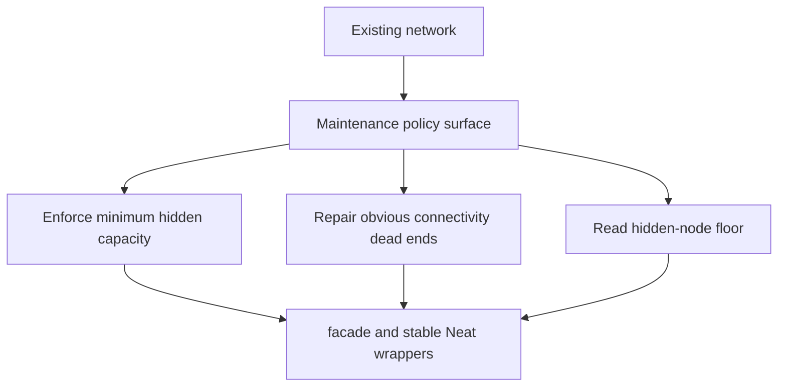

# neat/maintenance

Root bridge for NEAT maintenance and structural-viability surfaces.

Maintenance is the conservative counterpart to mutation. Mutation explores
new structure on purpose. Maintenance keeps a concrete network usable after
those edits, after imports, or after other topology-changing operations leave
the graph too sparse or locally broken.

This boundary is intentionally narrow. It does not choose mutation operators,
drive speciation, or reshape the broader controller loop. Instead it answers
one smaller question: once a network already exists, what is the minimal
policy surface for keeping that network structurally viable?

The current maintenance subtree is organized around one public facade:

- `facade/` keeps the stable `Neat` entrypoints that expose the hidden-node
  floor, enforce that floor, and repair obvious dead ends without asking the
  caller to drop into the broader mutation chapter.

Read this chapter when you want the policy story first. Jump to `facade/`
when you need the concrete public wrappers and the narrow host contract they
depend on.

Recommended reading inside maintenance:
- `./facade/README.md` for the public wrapper semantics and host contract
- `../mutation/repair/README.md` for the lower-level repair mechanics that
  the facade delegates to when work is actually needed

## neat/maintenance/maintenance.ts
