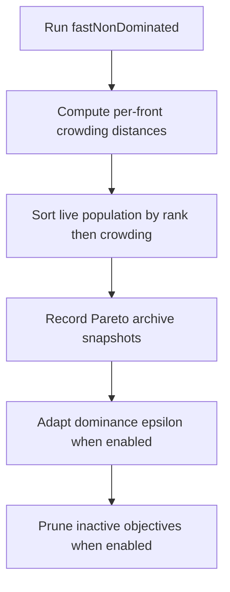

# neat/multiobjective/category

Evolution-policy helpers for multi-objective runs.

The root `multiobjective/` chapter answers one question: how are Pareto
fronts and crowding distances computed? This `category/` chapter answers the
next one: once those ranks exist, how should the evolve loop react to them?

It keeps the controller-facing policy in one place: stable rank+crowding
sorting, archive persistence, adaptive dominance-epsilon tuning, and
pruning of objectives that have gone structurally inactive.

That separation matters because this file does not decide Pareto ranks from
scratch. It treats the ranking helpers as an evidence-producing pipeline,
then applies the evolve-loop reactions that depend on that evidence:
reorder the live population, persist telemetry-friendly snapshots, tune the
dominance threshold when the leading front grows too wide or too narrow, and
remove objectives that have stopped contributing useful variation.

Read this chapter when the missing question is "what does the controller do
with Pareto ranks after ranking finishes?" Read `multiobjective/` first if
the missing context is how fronts and crowding were computed in the first
place.



## neat/multiobjective/category/multiobjective.category.ts

### adaptDominanceEpsilon

```ts
adaptDominanceEpsilon(
  internal: NeatControllerForEvolution,
  paretoFronts: GenomeWithMetadata[][],
  config: { targetFrontMin: number; targetFrontUpperRatio: number; targetFrontLowerRatio: number; defaultEpsilonAdjust: number; defaultEpsilonMin: number; defaultEpsilonMax: number; defaultEpsilonCooldown: number; },
): void
```

Adapt dominance epsilon based on Pareto front size.

This is the controller's feedback loop for keeping the leading front in a
useful size band. If too many genomes land on the first front, epsilon grows
so future dominance becomes stricter. If too few survive, epsilon shrinks so
the controller relaxes back toward a broader competitive set.

The cooldown gate matters because the frontier can oscillate from one
generation to the next. Waiting a few generations between adjustments keeps
the threshold from chattering.

Parameters:
- `internal` - NEAT controller instance.
- `paretoFronts` - Non-dominated fronts.
- `config` - Epsilon tuning constants.

Returns: void.

### computeCrowdingDistances

```ts
computeCrowdingDistances(
  internal: NeatControllerForEvolution,
  populationSnapshot: GenomeWithMetadata[],
  paretoFronts: GenomeWithMetadata[][],
  objectives: ObjectiveDescriptor[],
): number[]
```

Compute crowding distances for multi-objective fronts.

This helper replays the within-front spacing calculation in controller-local
coordinates so `processMultiObjective()` can sort the live population by
`(rank, crowding)` after fast non-dominated sorting finishes. The returned
array is aligned with the current population order, which is why the helper
works with front members and population indices together.

Small fronts receive `Infinity` immediately because every member is an edge
solution in that degenerate case. Larger fronts accumulate normalized
neighbor distance objective by objective.

Parameters:
- `internal` - NEAT controller instance.
- `populationSnapshot` - Current population reference.
- `paretoFronts` - Non-dominated fronts.
- `objectives` - Active objectives.

Returns: crowding distances aligned with population order.

### processMultiObjective

```ts
processMultiObjective(
  internal: NeatControllerForEvolution,
  config: { paretoArchiveMax: number; targetFrontMin: number; targetFrontUpperRatio: number; targetFrontLowerRatio: number; defaultEpsilonAdjust: number; defaultEpsilonMin: number; defaultEpsilonMax: number; defaultEpsilonCooldown: number; pruneWindowDefault: number; pruneRangeEpsDefault: number; },
): void
```

Apply the multi-objective evolution policy for the current generation.

This is the bridge between the generic Pareto-ranking helpers and the larger
evolve loop. It runs the ranking pass, reorders the live population by
`(rank, crowding)`, snapshots the best fronts for telemetry, optionally
adjusts dominance epsilon to keep the frontier size useful, and prunes
objectives that have gone flat for long enough to stop influencing search.

Conceptually, this helper owns the post-ranking reaction layer:
1. compute fresh fronts and crowding evidence,
2. convert that evidence into stable population order,
3. persist compact history for later reads,
4. tune or prune long-lived multi-objective policy state.

The function updates the controller in place because evolve needs the new
ordering, archive state, and adaptive settings immediately for the rest of
the generation loop.

Parameters:
- `internal` - NEAT controller instance.
- `config` - Multi-objective tuning constants.

Returns: Nothing. The controller is updated in place.

### pruneInactiveObjectives

```ts
pruneInactiveObjectives(
  internal: NeatControllerForEvolution,
  config: { pruneWindowDefault: number; pruneRangeEpsDefault: number; },
): void
```

Prune objectives that have collapsed ranges over a window.

This helper removes objectives that are no longer contributing meaningful
discrimination across the current population. An objective is considered
structurally inactive when its observed range stays below the configured
epsilon for enough consecutive generations.

The pruning pass is intentionally conservative:
- protected objectives such as `fitness` and `complexity` are never removed,
- stale counters must persist for a full window before removal,
- objective-cache invalidation happens only after an actual removal so later
  reads rebuild the descriptor list from the surviving objective set.

Parameters:
- `internal` - NEAT controller instance.
- `config` - Pruning constants.

Returns: void.

### recordParetoArchives

```ts
recordParetoArchives(
  internal: NeatControllerForEvolution,
  paretoFronts: GenomeWithMetadata[][],
  objectives: ObjectiveDescriptor[],
  archiveMax: number,
): void
```

Record Pareto front archives for telemetry.

This helper writes two compact history streams when the controller has the
corresponding archive arrays available: a lightweight first-front snapshot
for quick inspection and, when objectives exist, a parallel objective-vector
snapshot that preserves the frontier's raw tradeoff coordinates.

The stored data is intentionally smaller than the live population. It keeps
just enough evidence for telemetry and retrospective inspection without
retaining every dominated genome in every generation.

Parameters:
- `internal` - NEAT controller instance.
- `paretoFronts` - Non-dominated fronts.
- `objectives` - Active objectives.
- `archiveMax` - Maximum archive size.

Returns: void.

### sortPopulationByPareto

```ts
sortPopulationByPareto(
  internal: NeatControllerForEvolution,
  populationSnapshot: GenomeWithMetadata[],
  crowdingDistances: number[],
): void
```

Sort population by Pareto rank and crowding distance.

The ordering rule is lexicographic: lower `_moRank` wins first, then higher
crowding distance wins within the same front. This keeps the live population
aligned with NSGA-II style selection pressure while preserving one stable
index map from the pre-sort snapshot to the later crowding write-back.

Parameters:
- `internal` - NEAT controller instance.
- `populationSnapshot` - Current population reference.
- `crowdingDistances` - Crowding distances aligned with population order.

Returns: void.
