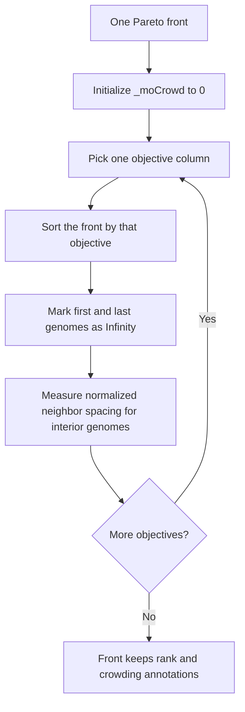

# neat/multiobjective/crowding

Crowding-distance assignment for NEAT multi-objective ranking.

This chapter answers the question that still remains after fronts have been
peeled: if two genomes share the same Pareto rank, which one lives in a less
crowded region of objective space? The helpers here compute the NSGA-II style
spacing signal stored in `_moCrowd`, giving the controller a tie-breaker that
favors spread along the frontier instead of collapsing onto one narrow patch.

The ownership split is intentionally strict:
- `objectives/` builds stable value vectors
- `dominance/` resolves pairwise wins and losses
- `fronts/` peels those relations into ordered fronts and writes `_moRank`
- this file computes within-front spacing once ranks are already known

That separation matters because crowding is not another dominance pass.
Crowding never changes which front a genome belongs to. It only measures how
isolated each genome is relative to its immediate neighbors inside one front
after the frontier structure is already fixed.

The core idea is simple:
1. work one front at a time,
2. sort that front by one objective at a time,
3. protect boundary solutions by assigning `Infinity`,
4. accumulate normalized neighbor spacing for the interior genomes,
5. repeat across objectives so broad tradeoff coverage rises to the top.



Read this chapter when the missing question is "why did these equally ranked
genomes receive different tie-break scores?" Read `fronts/` first if the
missing context is how the fronts themselves were constructed.

## neat/multiobjective/crowding/multiobjective.crowding.ts

### accumulateCrowdingForObjective

```ts
accumulateCrowdingForObjective(
  sortedFront: default[],
  valuesMatrixInput: number[][],
  genomeIndexByReference: Map<default, number>,
  objectiveIndex: number,
): void
```

Accumulates crowding distance contributions for a single objective.

Pre-conditions / expectations:
- `sortedFront` must be sorted ascending by the selected objective.
- {@link initializeCrowding} has already set `_moCrowd = 0` for the front.
- {@link markBoundaryCrowding} is typically called before this to set the
  boundary genomes to `Infinity`.

Edge cases:
- If the front has fewer than 2 genomes, this is a no-op.
- If the objective range is `0`, a range of `1` is used (see
  {@link resolveObjectiveRange}).

This helper deliberately ignores objective direction. Crowding measures raw
spacing between neighboring values, so the same frontier width matters
whether the controller is minimizing or maximizing that objective.

Parameters:
- `sortedFront` - Front sorted by objective.
- `valuesMatrixInput` - Values matrix.
- `genomeIndexByReference` - Lookup map.
- `objectiveIndex` - Objective column index.

### accumulateInteriorCrowding

```ts
accumulateInteriorCrowding(
  sortedFront: default[],
  valuesMatrixInput: number[][],
  genomeIndexByReference: Map<default, number>,
  objectiveIndex: number,
  valueRange: number,
): void
```

Accumulates crowding deltas for the interior genomes of a sorted front.

Interior genomes receive a normalized spacing delta:
`delta = (nextValue - previousValue) / valueRange`.

Looking at both neighbors matters because crowding is trying to estimate how
much empty objective-space surrounds the current genome, not merely whether
it differs from one adjacent point.

Parameters:
- `sortedFront` - Front sorted by objective.
- `valuesMatrixInput` - Values matrix.
- `genomeIndexByReference` - Lookup map.
- `objectiveIndex` - Objective column index.
- `valueRange` - Normalized objective range.

### applyCrowdingDelta

```ts
applyCrowdingDelta(
  currentGenome: NetworkWithMOAnnotations,
  previousValue: number,
  nextValue: number,
  valueRange: number,
): void
```

Applies a normalized crowding-distance delta to a genome.

If the genome’s crowding distance is `Infinity`, it will remain `Infinity`.
This helper only updates when `_moCrowd` is initialized.
That preserves the boundary-solutions rule while still allowing interior
genomes to accumulate spacing contributions across many objectives.

Parameters:
- `currentGenome` - Genome to update.
- `previousValue` - Objective value of previous genome.
- `nextValue` - Objective value of next genome.
- `valueRange` - Normalized objective range.

### applyCrowdingForObjective

```ts
applyCrowdingForObjective(
  front: default[],
  valuesMatrixInput: number[][],
  genomeIndexByReference: Map<default, number>,
  objectiveIndex: number,
): void
```

Applies crowding-distance accumulation for a single objective within a
single front.

The work happens in two phases: create the sorted frontier view for the
chosen objective, then protect its boundaries and accumulate interior
spacing. Keeping those phases together makes the per-objective flow easy to
audit in the generated chapter.

Parameters:
- `front` - Pareto front.
- `valuesMatrixInput` - Values matrix.
- `genomeIndexByReference` - Lookup map.
- `objectiveIndex` - Objective column index.

### assignCrowdingDistances

```ts
assignCrowdingDistances(
  fronts: default[][],
  valuesMatrixInput: number[][],
  descriptors: ObjectiveDescriptor[],
  population: default[],
): void
```

Assigns crowding-distance annotations for each Pareto front.

This implements the crowding distance component of NSGA-II selection. Each
genome in each front receives a `_moCrowd` value representing how isolated
it is in objective space within its front.

Conceptually this is a nested fold:
1. build one stable reference-to-index map for the population,
2. iterate each front in Pareto-rank order,
3. initialize crowding for that front,
4. accumulate spacing once per objective.

Notes:
- This function sorts each front by each objective (ascending raw values).
  Objective direction (min vs max) does not affect the computed spacing
  magnitude; extrema are treated as boundaries either way.
- Empty fronts are skipped.

Side effects:
- Writes `_moCrowd` on each genome in each front.

Parameters:
- `fronts` - Pareto fronts.
- `valuesMatrixInput` - Values matrix.
- `descriptors` - Objective descriptors (provides objective count).
- `population` - Population to resolve indices.

### assignCrowdingForFront

```ts
assignCrowdingForFront(
  front: default[],
  valuesMatrixInput: number[][],
  genomeIndexByReference: Map<default, number>,
  objectiveIndices: number[],
): void
```

Assigns crowding distances for a single front across all objectives.

This helper keeps the front-local story clear: once the front exists and its
crowding fields are initialized, simply walk the objective columns and let
each one contribute its own spacing signal.

Parameters:
- `front` - Pareto front.
- `valuesMatrixInput` - Values matrix.
- `genomeIndexByReference` - Lookup map.
- `objectiveIndices` - Objective indices to process.

### buildGenomeIndexByReference

```ts
buildGenomeIndexByReference(
  population: default[],
): Map<default, number>
```

Builds a stable mapping from genome object references to their population
index.

This relies on object identity (reference equality), not structural
equality. It is used to resolve objective values from a values matrix when
working with reordered views such as per-objective sorted fronts.
The map preserves the controller's original population order even while this
chapter temporarily reorders front-local views for spacing calculations.

Parameters:
- `population` - Genomes in population order.

Returns: Map from genome references to their index.

### buildInteriorIndexRange

```ts
buildInteriorIndexRange(
  frontLength: number,
): number[]
```

Builds the index range for interior genomes of a front.

Boundary genomes are excluded because their crowding distance is treated as
infinite.

Parameters:
- `frontLength` - Length of the sorted front.

Returns: Interior indices excluding boundary genomes.

### buildObjectiveIndexRange

```ts
buildObjectiveIndexRange(
  objectiveCount: number,
): number[]
```

Builds a stable objective index range.

Keeping objective iteration explicit makes the front-level accumulation order
easy to inspect and keeps the per-objective helper signatures small.

Parameters:
- `objectiveCount` - Number of objectives.

Returns: Objective indices `0..objectiveCount-1`.

### buildSortedFrontByObjective

```ts
buildSortedFrontByObjective(
  front: default[],
  valuesMatrixInput: number[][],
  genomeIndexByReference: Map<default, number>,
  objectiveIndex: number,
): default[]
```

Builds a copy of the front sorted by the specified objective.

Sorting is ascending by the raw objective value. This ordering is used for
computing neighbor spacing in objective space.
The original front array remains untouched so Pareto-rank grouping stays
stable while each objective gets its own temporary geometric view.

Parameters:
- `front` - Pareto front.
- `valuesMatrixInput` - Values matrix.
- `genomeIndexByReference` - Lookup map.
- `objectiveIndex` - Objective column index.

Returns: Front sorted by objective value.

### compareObjectiveValuesForCrowding

```ts
compareObjectiveValuesForCrowding(
  valuesMatrixInput: number[][],
  genomeIndexByReference: Map<default, number>,
  objectiveIndex: number,
  leftGenome: default,
  rightGenome: default,
): number
```

Comparator used to sort genomes by a specific objective value.

The comparator resolves values through the shared matrix so the sorted view
stays consistent with the same objective data used during dominance and
frontier construction.

Parameters:
- `valuesMatrixInput` - Values matrix.
- `genomeIndexByReference` - Lookup map.
- `objectiveIndex` - Objective column index.
- `leftGenome` - Left genome.
- `rightGenome` - Right genome.

Returns: Numeric sort comparison value (ascending).

### initializeCrowding

```ts
initializeCrowding(
  front: default[],
): void
```

Initializes crowding-distance annotations for a front.

This sets each genome’s `_moCrowd` to `0`. Later steps accumulate per-
objective spacing deltas.

Resetting the field once per front keeps the later per-objective helpers
additive and makes the final score easy to interpret as one accumulated
spacing signal across all objectives.

Parameters:
- `front` - Pareto front.

### markBoundaryCrowding

```ts
markBoundaryCrowding(
  sortedFront: default[],
): void
```

Marks the boundary genomes of a sorted front as infinitely crowded.

In NSGA-II style crowding distance, boundary solutions (extremes for the
objective) are assigned an infinite crowding distance to ensure they are
always preferred when ranks tie.

This preserves the ends of the tradeoff surface. Even when interior genomes
become densely packed, the extreme solutions remain available to later
selection because they carry unique objective-space coverage.

Parameters:
- `sortedFront` - Front sorted by the current objective.

### resolveBoundaryGenomes

```ts
resolveBoundaryGenomes(
  sortedFront: default[],
): { firstGenome: default; lastGenome: default; } | null
```

Resolves the boundary (first/last) genomes for a sorted front.

Parameters:
- `sortedFront` - Front sorted by objective.

Returns: Boundary genomes, or `null` if the front is empty.

### resolveGenomeIndex

```ts
resolveGenomeIndex(
  genomeIndexByReference: Map<default, number>,
  genomeItem: default,
): number
```

Resolves a genome’s index using a reference-based map.

Crowding works with reordered arrays of genome references, but the value
matrix still lives in population order. This lookup reconnects those two
views without copying the matrix.

Parameters:
- `genomeIndexByReference` - Lookup map created by
 *  {@link buildGenomeIndexByReference} .
- `genomeItem` - Genome to resolve.

Returns: The population index of the genome.

### resolveNeighborPair

```ts
resolveNeighborPair(
  sortedFront: default[],
  sortedIndex: number,
): { previousGenome: default; nextGenome: default; }
```

Resolves the neighbor genomes for an interior element of a sorted front.

Parameters:
- `sortedFront` - Front sorted by objective.
- `sortedIndex` - Current index in sorted front.

Returns: Previous and next neighbor genomes.

### resolveObjectiveRange

```ts
resolveObjectiveRange(
  minValue: number,
  maxValue: number,
): number
```

Resolves a non-zero objective range used to normalize crowding deltas.

If all genomes have the same objective value, the raw range is `0`. This
returns `1` in that case to avoid division by zero while still producing a
well-defined crowding delta of `0`.
The fallback means a flat objective contributes no spacing signal instead of
exploding numerically or distorting the remaining objectives.

Parameters:
- `minValue` - Minimum objective value.
- `maxValue` - Maximum objective value.

Returns: Normalized range with a non-zero floor.

### resolveObjectiveRangeFromBoundaries

```ts
resolveObjectiveRangeFromBoundaries(
  valuesMatrixInput: number[][],
  genomeIndexByReference: Map<default, number>,
  boundaryGenomes: { firstGenome: default; lastGenome: default; },
  objectiveIndex: number,
): number
```

Resolves the normalized objective range for a front from its boundary
genomes.

Because `sortedFront` is sorted by objective, the first and last genomes are
the extrema used for range normalization.

Parameters:
- `valuesMatrixInput` - Values matrix.
- `genomeIndexByReference` - Lookup map.
- `boundaryGenomes` - Boundary genomes for the front.
- `objectiveIndex` - Objective column index.

Returns: Normalized value range for the objective.

### resolveObjectiveValue

```ts
resolveObjectiveValue(
  valuesMatrixInput: number[][],
  genomeIndexByReference: Map<default, number>,
  genomeItem: default,
  objectiveIndex: number,
): number
```

Resolves an objective value for a genome from a values matrix.

This is a convenience helper for working with sorted/reordered views of the
population while keeping objective values in a dense matrix.
It lets the crowding pass ask "what is this genome's value on the current
objective?" without assuming the front is still in population order.

Parameters:
- `valuesMatrixInput` - Values matrix indexed by population index.
- `genomeIndexByReference` - Lookup map from genome reference to index.
- `genomeItem` - Genome to resolve.
- `objectiveIndex` - Objective column index.

Returns: The objective value for the genome.

### shouldSkipCrowdingFront

```ts
shouldSkipCrowdingFront(
  front: default[],
): boolean
```

Determines whether crowding-distance processing should be skipped for a
front.

Empty fronts are ignored because they carry no genomes to annotate and would
otherwise force needless setup work.

Parameters:
- `front` - Pareto front.

Returns: `true` if the front should be skipped.

## neat/multiobjective/crowding/multiobjective.crowding.errors.ts

Raised when crowding helpers cannot resolve a genome back to its source index.

### MultiobjectiveCrowdingGenomeIndexResolutionError

Raised when crowding helpers cannot resolve a genome back to its source index.
