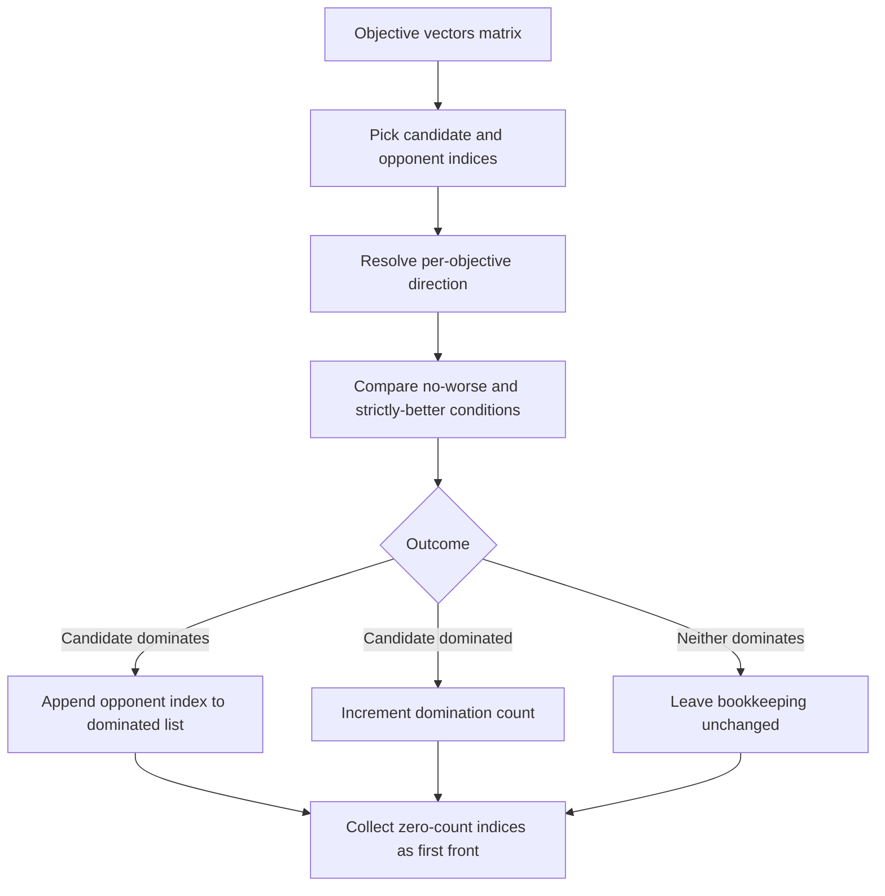

# neat/multiobjective/dominance

Pairwise dominance bookkeeping for NEAT multi-objective ranking.

This chapter owns the narrow middle of the NSGA-II style ranking pipeline:
once `objectives/` has produced one stable objective vector per genome, this
file decides which vectors dominate which others and records enough
bookkeeping for `fronts/` to peel the Pareto layers in order.

The boundary stays intentionally smaller than the full multi-objective story.
It does not read values from genomes, build fronts, assign crowding
distances, or archive anything. Instead, it answers three focused questions:

1. Given two aligned objective vectors, does one dominate the other?
2. Across the whole matrix, how many opponents dominate each genome?
3. Which genome indices are already non-dominated and therefore belong to
   the first front?

The stable ordering assumption matters here: row `i` in the value matrix
must continue to describe genome `i` for every later frontier and crowding
pass. This file preserves that index-based contract by storing only counts,
dominated-neighbor lists, and first-front indices instead of reshaping the
population itself.



Read this chapter before `fronts/` when the main question is "how did the
library decide which genomes belong to the first Pareto frontier at all?"
Read `objectives/` first when the missing context is where the vectors came
from or why descriptor order must stay fixed.

## neat/multiobjective/dominance/multiobjective.dominance.ts

### applyPairwiseDominance

```ts
applyPairwiseDominance(
  dominanceState: DominanceState,
  valuesMatrixInput: number[][],
  descriptors: ObjectiveDescriptor[],
  candidateIndex: number,
  opponentIndex: number,
): void
```

Applies a single pairwise dominance update between candidate and opponent.

If the candidate dominates the opponent, the opponent index is appended to
`dominatedIndicesByIndex[candidateIndex]`. If the candidate is dominated by
the opponent, `dominationCounts[candidateIndex]` is incremented.

That asymmetry is the key bookkeeping contract for the later frontier peel:

- the count answers whether the candidate can join the current front yet,
- the dominated-neighbor list tells later passes which counts to relax once
  the candidate is removed as a blocker.

Parameters:

- `dominanceState` - Dominance bookkeeping.
- `valuesMatrixInput` - Matrix of objective values.
- `descriptors` - Objective descriptors.
- `candidateIndex` - Candidate genome index.
- `opponentIndex` - Opponent genome index.

### buildDominanceState

```ts
buildDominanceState(
  valuesMatrixInput: number[][],
  descriptors: ObjectiveDescriptor[],
): DominanceState
```

Builds dominance bookkeeping structures used by fast non-dominated sorting.

This computes (pairwise):

- `dominationCounts[i]`: how many genomes dominate genome `i`.
- `dominatedIndicesByIndex[i]`: which genomes are dominated by genome `i`.
- `firstFrontIndices`: genomes with `dominationCounts[i] === 0`.

Conceptually the pass works in four steps:

1. allocate empty bookkeeping aligned to matrix row order,
2. build a stable candidate-index range,
3. compare every candidate against every opponent,
4. collect the rows that remain non-dominated after their full pairwise pass.

This file preserves stable ordering rather than reordering genomes on the
fly. That makes the resulting state safe for `fronts/` and `crowding/`,
which both rely on matrix row `i` continuing to refer to the same genome.

Complexity:

- Time: $O(n^2 \cdot m)$ where $n$ is population size and $m$ is objective
  count.
- Space: $O(n^2)$ in the worst case for the dominated adjacency lists.

Assumptions:

- Each row in `valuesMatrixInput` is a vector aligned with `descriptors`.
- Genome ordering in later steps is expected to match the matrix ordering.

Parameters:

- `valuesMatrixInput` - Matrix of objective values (row = genome).
- `descriptors` - Objective descriptors (direction semantics).

Returns: Dominance bookkeeping structures for ranking.

### buildIndexRange

```ts
buildIndexRange(
  populationSize: number,
): number[]
```

Builds a stable index range for iterating the population.

The returned range becomes the shared iteration order for candidate and
opponent loops. Using explicit indices instead of genome references keeps the
dominance state compact and guarantees later frontier code can look up rows
and genomes with the same integer keys.

Parameters:

- `populationSize` - Number of genomes.

Returns: Array of indices `0..populationSize-1`.

### compareObjectiveValues

```ts
compareObjectiveValues(
  direction: "max" | "min",
  candidateValue: number,
  opponentValue: number,
): { isDominated: boolean; isStrictlyBetter: boolean; }
```

Compares a candidate and opponent value for a single objective.

This does not compute full Pareto dominance; it returns per-objective flags
used by the vector-level dominance check.

The split is intentional: one helper decides whether the candidate is worse
on this objective, another decides whether it is strictly better, and the
outer vector fold turns those flags into a whole-pair outcome.

Parameters:

- `direction` - Objective direction.
- `candidateValue` - Candidate objective value.
- `opponentValue` - Opponent objective value.

Returns: Comparison flags for this objective.

### createEmptyDominanceState

```ts
createEmptyDominanceState(
  populationSize: number,
): DominanceState
```

Creates an empty dominance state container sized to the population.

Every array slot maps directly to one matrix row and therefore one genome in
the ranking pass. Initializing the structure once keeps later comparison
helpers focused on bookkeeping updates rather than allocation details.

Parameters:

- `populationSize` - Number of genomes.

Returns: An initialized dominance state with zeroed counts.

### DominanceState

Dominance bookkeeping structures for fast non-dominated sorting.

These structures are typically produced once per generation (from the values
matrix) and then consumed to build Pareto fronts.

They form the compact handoff between pairwise comparison mechanics and the
later frontier-construction pass:

- `dominationCounts` records how many opponents currently sit above each row
- `dominatedIndicesByIndex` records which rows should be relaxed when a
  front is peeled away
- `firstFrontIndices` captures the initial non-dominated frontier without
  re-running the full comparison loop

### isCandidateDominatedByObjective

```ts
isCandidateDominatedByObjective(
  direction: "max" | "min",
  candidateValue: number,
  opponentValue: number,
): boolean
```

Checks if the candidate is worse than the opponent for a single objective.

For dominance, being worse on one objective makes the candidate unable to
dominate the opponent.

Parameters:

- `direction` - Objective direction.
- `candidateValue` - Candidate objective value.
- `opponentValue` - Opponent objective value.

Returns: `true` if the candidate is dominated for this objective.

### isCandidateStrictlyBetterForObjective

```ts
isCandidateStrictlyBetterForObjective(
  direction: "max" | "min",
  candidateValue: number,
  opponentValue: number,
): boolean
```

Checks if the candidate is strictly better than the opponent for a single
objective.

Strict improvement in at least one objective is required for Pareto
dominance when the candidate is not worse on a single objective.

Parameters:

- `direction` - Objective direction.
- `candidateValue` - Candidate objective value.
- `opponentValue` - Opponent objective value.

Returns: `true` if the candidate is strictly better for this objective.

### isNonDominatedCandidate

```ts
isNonDominatedCandidate(
  dominanceState: DominanceState,
  candidateIndex: number,
): boolean
```

Determines whether a candidate has zero domination count.

A zero count means the current row survived every pairwise comparison without
finding a dominating opponent, which is exactly the criterion for first-front
membership before frontier peeling begins.

Parameters:

- `dominanceState` - Dominance bookkeeping.
- `candidateIndex` - Candidate genome index.

Returns: `true` if the candidate is currently non-dominated.

### resolveDominanceOutcome

```ts
resolveDominanceOutcome(
  candidateVector: number[],
  opponentVector: number[],
  descriptors: ObjectiveDescriptor[],
): "dominates" | "dominated" | "indifferent"
```

Resolves dominance outcome between two objective vectors.

Outcome meanings:

- `'dominates'`: candidate dominates opponent.
- `'dominated'`: candidate is dominated by opponent.
- `'indifferent'`: neither dominates the other.

Pareto dominance is directional, so this helper checks both directions in a
fixed order. That keeps ties and tradeoffs explicit: many pairs in a
multi-objective population are intentionally incomparable rather than simply
"better" or "worse."

Parameters:

- `candidateVector` - Candidate objective values.
- `opponentVector` - Opponent objective values.
- `descriptors` - Objective descriptors.

Returns: Dominance outcome between candidate and opponent.

### resolveObjectiveDirection

```ts
resolveObjectiveDirection(
  descriptors: ObjectiveDescriptor[],
  objectiveIndex: number,
): "max" | "min"
```

Resolves the objective direction for a given objective index.

If a descriptor omits `direction`, it is treated as maximization.
Keeping that default here ensures every comparison helper downstream reads
one normalized direction rule instead of repeating fallback logic.

Parameters:

- `descriptors` - Objective descriptors.
- `objectiveIndex` - Objective index.

Returns: Normalized objective direction.

### shouldSkipSelfComparison

```ts
shouldSkipSelfComparison(
  candidateIndex: number,
  opponentIndex: number,
): boolean
```

Determines whether a pairwise comparison should be skipped.

Currently this skips only self-comparisons.

Keeping the skip rule isolated makes it easier to audit the pairwise loop and
preserves the invariant that every stored relationship refers to two distinct
matrix rows.

Parameters:

- `candidateIndex` - Candidate genome index.
- `opponentIndex` - Opponent genome index.

Returns: `true` if the pair should be skipped.

### updateDominanceForCandidate

```ts
updateDominanceForCandidate(
  dominanceState: DominanceState,
  valuesMatrixInput: number[][],
  descriptors: ObjectiveDescriptor[],
  candidateIndex: number,
  candidateIndices: number[],
): void
```

Updates dominance bookkeeping for a candidate against all opponents.

This iterates every opponent index and applies a pairwise dominance update.
Self-comparisons are ignored.

The helper stays candidate-centric on purpose. Each pass answers "what does
the rest of the matrix imply about this row?" and leaves first-front
discovery to the outer orchestration once all opponent evidence has been
accumulated.

Parameters:

- `dominanceState` - Dominance bookkeeping.
- `valuesMatrixInput` - Matrix of objective values.
- `descriptors` - Objective descriptors.
- `candidateIndex` - Candidate genome index.
- `candidateIndices` - Indices to compare against.

### updateStrictImprovement

```ts
updateStrictImprovement(
  hasStrictImprovement: boolean,
  isStrictlyBetter: boolean,
): boolean
```

Accumulates whether the candidate has a strict improvement across
objectives.

Parameters:

- `hasStrictImprovement` - Current strict-improvement flag.
- `isStrictlyBetter` - Whether the candidate strictly improves on the
  current objective.

Returns: Updated strict-improvement flag.

### vectorDominates

```ts
vectorDominates(
  valuesA: number[],
  valuesB: number[],
  descriptors: ObjectiveDescriptor[],
): boolean
```

Determines whether vector A Pareto-dominates vector B.

A dominates B iff:

- A is **no worse** than B in every objective (respecting each objective’s
  direction: maximize/minimize), and
- A is **strictly better** in at least one objective.

This helper is deliberately pair-local. It does not mutate bookkeeping or
know anything about fronts; it only answers the comparison question that the
wider bookkeeping pass repeats across every pair of matrix rows.

Assumptions:

- `valuesA` and `valuesB` are aligned and have the same length.
- `descriptors` provides a descriptor for each objective index.
- If a descriptor has no `direction`, it defaults to `'max'`.

Parameters:

- `valuesA` - Objective values for candidate A.
- `valuesB` - Objective values for candidate B.
- `descriptors` - Objective descriptors defining direction semantics.

Returns: `true` if A dominates B; otherwise `false`.

Example:

```ts
// Maximize accuracy, minimize latency:
vectorDominates(
  [0.9, 120],
  [0.9, 150],
  [
    { accessor: () => 0, direction: 'max' },
    { accessor: () => 0, direction: 'min' },
  ],
);
// => true (equal accuracy, lower latency)
```
