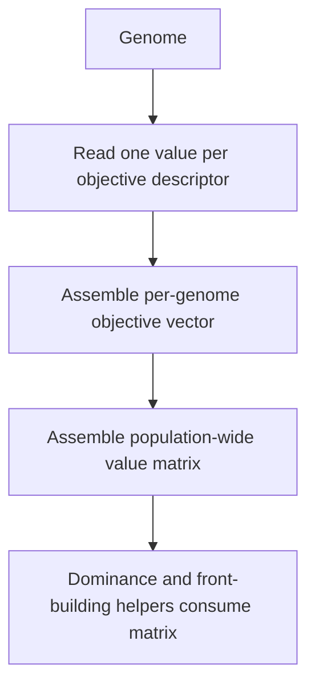

# neat/multiobjective/objectives

Objective-vector construction helpers for the NEAT multi-objective chapter.

The root `multiobjective/` chapter explains the full Pareto-ranking flow.
This narrower helper file explains how that flow gets its raw numbers: read
one value per objective, preserve schema order, and assemble population-wide
vectors and matrices that the dominance and crowding helpers can consume.

Read this chapter when you want to answer questions such as:
- How does the controller turn objective descriptors into numeric vectors?
- Why does value extraction stay separate from dominance and front building?
- What happens if one objective accessor throws during a long run?
- Why is preserving descriptor order so important for the rest of the
  multi-objective pipeline?

The mental model is a small three-step data-preparation flow:
1. read one safe value per objective descriptor,
2. assemble those values into one vector per genome,
3. assemble genome vectors into a population-wide matrix.

This boundary stays intentionally mechanical. It does not decide dominance,
front ordering, or crowding; it only guarantees that later ranking stages
receive a stable numeric view of the configured objective schema.



## neat/multiobjective/objectives/multiobjective.objectives.ts

### readObjectiveValue

```ts
readObjectiveValue(
  genomeItem: default,
  descriptor: ObjectiveDescriptor,
): number
```

Safely reads a single objective value for a given genome.

This wraps the descriptor `accessor` in a `try/catch` so that a buggy
objective function cannot crash multi-objective ranking.

Notes:
- If the accessor throws, this returns `0` (a neutral-ish fallback).
- Callers should prefer to surface accessor errors during development;
  this helper is intentionally defensive for long-running training loops.

Parameters:
- `genomeItem` - - Genome to evaluate.
- `descriptor` - - Objective descriptor providing an accessor.

Returns: Numeric objective value; `0` if the accessor throws.

Example:

```ts
const score = readObjectiveValue(genome, { accessor: (g) => g.score ?? 0 });
```

### buildGenomeValues

```ts
buildGenomeValues(
  genomeItem: default,
  descriptors: ObjectiveDescriptor[],
): number[]
```

Builds an objective vector for a single genome.

The resulting array order matches the `descriptors` order exactly.
Each component is read via {@link readObjectiveValue} so individual
objective accessors are fault-tolerant.

Preserving descriptor order is a hard requirement here. Every later helper in
the dominance and crowding pipeline assumes that the same objective occupies
the same index in every vector.

Parameters:
- `genomeItem` - - Genome to evaluate.
- `descriptors` - - Objective descriptors (vector schema).

Returns: Objective value vector (length equals `descriptors.length`).

### buildValuesMatrix

```ts
buildValuesMatrix(
  population: default[],
  descriptors: ObjectiveDescriptor[],
): number[][]
```

Builds a population-wide objective value matrix.

The resulting matrix is indexed as `[genomeIndex][objectiveIndex]` where
`genomeIndex` matches the input `population` order.

This matrix is the handoff format for the rest of the multi-objective stack:
rows preserve population order, columns preserve objective-schema order.

Parameters:
- `population` - - Genomes to evaluate (population order is preserved).
- `descriptors` - - Objective descriptors (column schema).

Returns: Objective values matrix.
