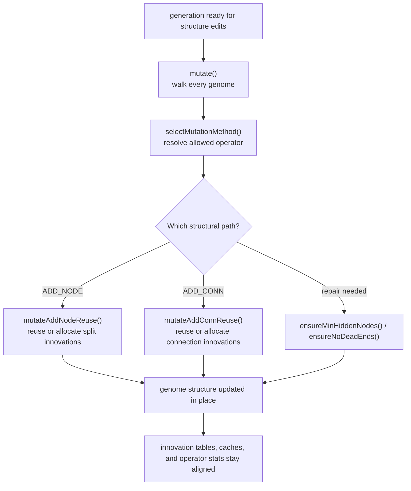

# neat/mutation

Root orchestration for NEAT mutation operations.

Mutation is the controller's "change the structure on purpose" chapter.
It owns the whole-population edit pass that happens after scoring and before
the next generation settles into its new topology.

The root file answers four controller-facing questions:

- when should each genome be offered mutation work at all?
- how is one concrete operator chosen from the configured policy?
- when should structural edits reuse innovation history instead of inventing
  brand-new ids?
- which maintenance repairs run so newly mutated genomes stay usable by the
  next evaluation, speciation, and crossover passes?

The root chapter stays orchestration-first because callers usually need the
whole structure-editing story, not just one isolated operator. The helper
folders own the narrower mechanics:

- `flow/` runs the per-genome mutation loop and keeps operator-side effects coherent.
- `select/` resolves which operator is even allowed or favored right now.
- `add-node/` and `add-conn/` own structural reuse and innovation bookkeeping.
- `repair/` keeps mutated networks connected enough to remain valid training candidates.

Read this root chapter when you want the controller view of mutation.
Follow `flow/` for the actual per-genome loop, `select/` for policy and
bandit-weighted operator choice, and `repair/` when you need to understand
why mutation sometimes adds maintenance edges after the main structural edit.

A practical reading order:

1. start with `mutate()` to see where the whole-population pass begins,
2. continue to `selectMutationMethod()` to understand how one operator is
   resolved for the current genome,
3. compare `mutateAddNodeReuse()` and `mutateAddConnReuse()` for the two main
   structural-growth paths,
4. finish with `ensureMinHiddenNodes()` and `ensureNoDeadEnds()` to see how
   the controller repairs fragile topologies before later stages inspect them.



## neat/mutation/mutation.ts

### mutate

```ts
mutate(): Promise<void>
```

Mutate every genome in the population according to configured policies.

This is the controller's whole-population mutation pass. It does not decide
one fixed operator up front for the entire generation. Instead it walks the
current population, lets the lower-level flow helpers resolve each genome's
effective mutation policy, and then applies whatever operator mix is valid
for that specific genome at that moment.

In practice, this is where several otherwise separate mutation concerns meet:
adaptive per-genome rates, structural innovation reuse, optional extra
structural exploration, and post-edit repair work. That is why the root
mutation chapter exists at all: the controller needs one place where those
per-genome edits stay coherent before later stages such as evaluation or
speciation inspect the changed population.

Educational notes:
- Adaptive mutation allows per-genome mutation rates/amounts to evolve so
  that successful genomes can reduce or increase plasticity over time.
- Structural mutations (ADD_NODE, ADD_CONN, etc.) may update global
  innovation bookkeeping; this function attempts to reuse specialized
  helper routines that preserve innovation ids across the population.
- Cache invalidation and operator statistics also live downstream of this
  pass, so `mutate()` is about consistency as much as randomness.

Returns: Promise that resolves after every genome has gone through the mutation flow for this pass.

Example:

```ts
// Called after evaluation and before the next generation is consumed.
neat.mutate();
```

### mutateAddNodeReuse

```ts
mutateAddNodeReuse(
  genome: GenomeWithMetadata,
): Promise<void>
```

Split a randomly chosen enabled connection and insert a hidden node.

This routine attempts to reuse a historical "node split" innovation record
so that identical splits across different genomes share the same
innovation ids. This preservation of innovation information is important
for NEAT-style speciation and genome alignment.

Use this helper when the controller wants a structural growth mutation that
stays compatible with prior history. The important state change is not only
the new hidden node inside one genome, but also the possible update to the
controller's split-innovation table when this exact split has never been seen
before.

Method steps (high-level):
- If the genome has no connections, connect an input to an output to
  bootstrap connectivity.
- Filter enabled connections and choose one at random.
- Disconnect the chosen connection and either reuse an existing split
  innovation record or create a new hidden node + two connecting
  connections (in->new, new->out) assigning new innovation ids.
- Insert the newly created node into the genome's node list at the
  deterministic position to preserve ordering for downstream algorithms.

Parameters:
- `genome` - Genome to modify in place.

Returns: Promise that resolves after the split has either reused an existing innovation record or created a new one.

Example:

```ts
neat._mutateAddNodeReuse(genome);
```

### mutateAddConnReuse

```ts
mutateAddConnReuse(
  genome: GenomeWithMetadata,
): void
```

Add a connection between two previously unconnected nodes, reusing a
stable innovation id per unordered node pair when possible.

Notes on behavior:
- The search space consists of node pairs (from, to) where `from` is not
  already projecting to `to` and respects the input/output ordering used by
  the genome representation.
- When a historical innovation exists for the unordered pair, the
  previously assigned innovation id is reused to keep different genomes
  compatible for downstream crossover and speciation.

Steps:
- Build a list of all legal (from,to) pairs that don't currently have a
  connection.
- Prefer pairs which already have a recorded innovation id (reuse
  candidates) to maximize reuse; otherwise use the full set.
- If the genome enforces acyclicity, simulate whether adding the connection
  would create a cycle; abort if it does.
- Create the connection and set its innovation id, either from the
  historical table or by allocating a new global innovation id.

This is the connection-growth companion to `mutateAddNodeReuse()`. Its main
controller value is innovation consistency: if two genomes discover the same
structural pair across time, the mutation system tries to keep that edit
comparable for later crossover and speciation rather than treating it as a
completely unrelated event.

Parameters:
- `genome` - Genome to modify in place.

Returns: Nothing. The genome may gain one new connection and the controller innovation map may be consulted or extended.

### ensureMinHiddenNodes

```ts
ensureMinHiddenNodes(
  network: GenomeWithMetadata,
  multiplierOverride: number | undefined,
): Promise<void>
```

Ensure the network has a minimum number of hidden nodes and connectivity.

This repair helper runs after structural edits when the controller wants to
keep a mutated genome above a minimum hidden-capacity floor. It is less about
exploration than about preserving a usable topology budget so later mutation,
evaluation, and selection steps do not inherit a trivially underbuilt graph.

The helper may add hidden nodes, wire missing edges, and rebuild cached
connection structures, so callers should treat it as a topology-maintenance
pass rather than a tiny invariant check.

Parameters:
- `network` - Genome whose hidden-node budget and connectivity should be repaired.
- `multiplierOverride` - Optional override for the configured hidden-node multiplier.

Returns: Promise that resolves after hidden-node and connectivity repairs have completed.

### ensureNoDeadEnds

```ts
ensureNoDeadEnds(
  network: GenomeWithMetadata,
): void
```

Ensure there are no dead-end nodes (input/output isolation) in the network.

Mutation can produce temporarily awkward graphs, especially after structural
growth or pruning-like simplification. This repair pass reconnects stranded
input, output, or hidden nodes so the genome remains a sensible candidate for
later evaluation and does not carry obviously broken topology into the next
controller stage.

Parameters:
- `network` - Genome whose endpoint and hidden-node connectivity should be repaired.

Returns: Nothing. The network may gain repair connections in place.

### selectMutationMethod

```ts
selectMutationMethod(
  genome: GenomeWithMetadata,
  rawReturnForTest: boolean,
): Promise<MutationMethod | MutationMethod[] | null>
```

Select a mutation method respecting structural constraints and adaptive controllers.

This is the policy gateway between "a genome is eligible for mutation" and
"here is the concrete operator to apply." The selector folds together legacy
fast-feed-forward behavior, phased-complexity biasing, adaptive operator
weighting, structural safety checks, and optional bandit-style operator
choice so the rest of the mutation flow can work with one resolved answer.

Mirrors legacy implementation from `neat.ts` to preserve test expectations.
`rawReturnForTest` retains historical behavior where the full FFW array is
returned for identity checks in tests.

Parameters:
- `genome` - Genome whose current structure constrains which operators are legal.
- `rawReturnForTest` - Preserves legacy array-return behavior for test-only FFW checks.

Returns: Resolved mutation method, legacy FFW array for compatibility tests, or `null` when no operator should run.

Example:

```ts
const method = await neat.selectMutationMethod(genome, false);
// The result already reflects policy gates such as phased complexity and
// structural limits, not just a random sample from the raw configured pool.
```

### DEFAULT_CONNECTION_WEIGHT

Default connection weight used when mutation must create a structural edge from scratch.

This keeps bootstrap connections and split in-edges deterministic at the
mutation boundary before later weight mutations or evaluation passes tune the
value more precisely.

### DEFAULT_GENE_ID

Default gene id used when mutation needs a stable fallback for node metadata.

The value is intentionally simple because it acts as compatibility padding,
not as a semantic innovation marker.

### DEFAULT_INNOVATION_ID

Default innovation id used when a connection lacks recorded innovation metadata.

This fallback prevents root mutation helpers from depending on missing ids
while the real innovation-tracking paths decide whether to reuse or allocate
new structural records.
