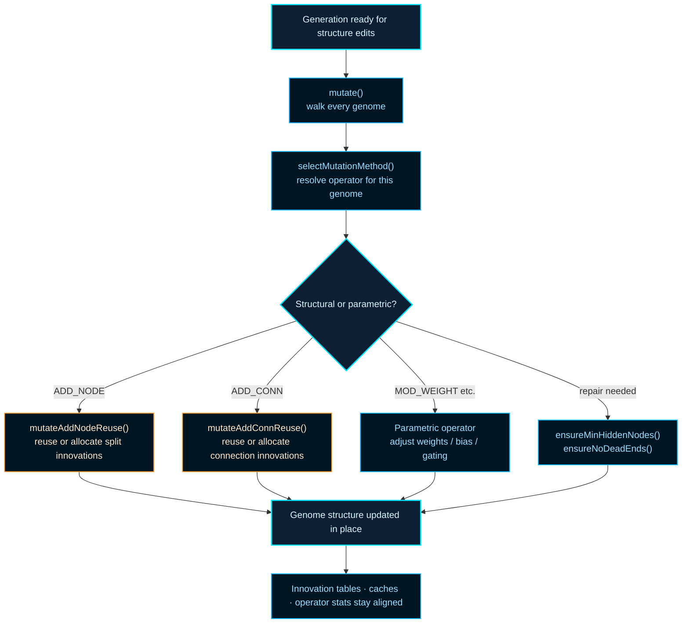

# neat/mutation

Root orchestration for NEAT mutation operations.

## Mutation in NEAT: More Than Weight Perturbation

In a fixed-topology network, mutation only adjusts weights. NEAT expands
this to include _structural_ mutations — adding nodes by splitting existing
connections and adding direct connections between previously unlinked nodes.
These structural changes are the engine of topology evolution.

The challenge structural mutation introduces is _alignment_: when two
genomes with different topologies produce offspring, which genes should
be crossed over? NEAT solves this with **innovation numbers** — every new
gene (node or connection) that appears anywhere in the population during a
generation receives a globally unique innovation number. When a node-split
mutation fires, instead of inventing a new id, the controller first checks
whether the same split was already performed by another genome this
generation. If so, both genomes reuse the same innovation number. This
keeps crossover alignment correct even across topologically diverse parents.
See Stanley and Miikkulainen,
[Evolving Neural Networks through Augmenting Topologies](https://nn.cs.utexas.edu/?stanley:ec02),
for the historical-markings mechanism and its role in enabling meaningful
crossover between structurally different genomes.

## Operator Families

Mutation operators fall into two broad families:

- **Structural** — ADD_NODE splits a connection and inserts a hidden unit;
  ADD_CONN adds a direct edge between existing nodes. Both update the
  innovation-number registry and may grow the genome by one or two genes.
- **Parametric** — MOD_WEIGHT, MOD_BIAS, and related operators perturb
  existing numeric values without changing topology. These are cheaper and
  run more frequently to tune structural changes already made.

## What This Boundary Owns

This root file answers four controller-facing questions:

- When should each genome receive mutation work at all?
- How is one concrete operator chosen from the configured policy?
- When should structural edits reuse innovation history rather than
  allocating brand-new ids?
- Which maintenance repairs run so mutated genomes remain valid for
  the next evaluation, speciation, and crossover passes?

The helper folders own the narrower mechanics:

- `flow/` — per-genome mutation loop, keeping operator side-effects coherent,
- `select/` — resolves which operator is allowed or favored for a genome,
- `add-node/` and `add-conn/` — structural reuse and innovation bookkeeping,
- `repair/` — ensures minimum connectivity and removes dead-end nodes.

A practical reading order:

1. `mutate()` — where the whole-population pass begins,
2. `selectMutationMethod()` — how one operator is resolved per genome,
3. `mutateAddNodeReuse()` and `mutateAddConnReuse()` — the two structural-growth paths,
4. `ensureMinHiddenNodes()` and `ensureNoDeadEnds()` — topology repair.



## neat/mutation/mutation.ts

### DEFAULT_CONNECTION_WEIGHT

Default connection weight used when mutation must create a structural edge from scratch.

This keeps bootstrap connections and split in-edges deterministic at the
mutation boundary before later weight mutations or evaluation passes tune the
value more precisely.

### DEFAULT_GENE_ID

Default gene id used when mutation needs a stable fallback for node metadata.

The value is intentionally simple because it acts as compatibility padding,
not as a semantic innovation marker.

### DEFAULT_INNOVATION_ID

Default innovation id used when a connection lacks recorded innovation metadata.

This fallback prevents root mutation helpers from depending on missing ids
while the real innovation-tracking paths decide whether to reuse or allocate
new structural records.

### ensureMinHiddenNodes

```ts
ensureMinHiddenNodes(
  network: GenomeWithMetadata,
  multiplierOverride: number | undefined,
): Promise<void>
```

Ensure the network has a minimum number of hidden nodes and connectivity.

This repair helper runs after structural edits when the controller wants to
keep a mutated genome above a minimum hidden-capacity floor. It is less about
exploration than about preserving a usable topology budget so later mutation,
evaluation, and selection steps do not inherit a trivially underbuilt graph.

The helper may add hidden nodes, wire missing edges, normalize feed-forward
node ordering, and rebuild cached connection structures, so callers should
treat it as a topology-maintenance pass rather than a tiny invariant check.
Those structural edits now stay on the canonical add-node/add-connection
identity paths so repair work cannot drift from the innovation tracker or
the explicit topology-policy bridge.

Parameters:

- `network` - Genome whose hidden-node budget and connectivity should be repaired.
- `multiplierOverride` - Optional override for the configured hidden-node multiplier.

Returns: Promise that resolves after hidden-node and connectivity repairs have completed.

### ensureNoDeadEnds

```ts
ensureNoDeadEnds(
  network: GenomeWithMetadata,
): void
```

Ensure there are no dead-end nodes (input/output isolation) in the network.

Mutation can produce temporarily awkward graphs, especially after structural
growth or pruning-like simplification. This repair pass reconnects stranded
input, output, or hidden nodes so the genome remains a sensible candidate for
later evaluation and does not carry obviously broken topology into the next
controller stage. Repair connections now reuse the canonical add-connection
identity path, and feed-forward runs normalize hidden/output ordering before
reconnecting edges so maintenance work still respects the innovation tracker
and the explicit topology-policy bridge.

Parameters:

- `network` - Genome whose endpoint and hidden-node connectivity should be repaired.

Returns: Nothing. The network may gain repair connections in place.

### mutate

```ts
mutate(): Promise<void>
```

Mutate every genome in the population according to configured policies.

This is the controller's whole-population mutation pass. It does not decide
one fixed operator up front for the entire generation. Instead it walks the
current population, lets the lower-level flow helpers resolve each genome's
effective mutation policy, and then applies whatever operator mix is valid
for that specific genome at that moment.

In practice, this is where several otherwise separate mutation concerns meet:
adaptive per-genome rates, structural innovation reuse, optional extra
structural exploration, and post-edit repair work. That is why the root
mutation chapter exists at all: the controller needs one place where those
per-genome edits stay coherent before later stages such as evaluation or
speciation inspect the changed population.

Educational notes:

- Adaptive mutation allows per-genome mutation rates/amounts to evolve so
  that successful genomes can reduce or increase plasticity over time.
- Structural mutations (ADD_NODE, ADD_CONN, etc.) may update global
  innovation bookkeeping; this function attempts to reuse specialized
  helper routines that preserve innovation ids across the population.
- Cache invalidation and operator statistics also live downstream of this
  pass, so `mutate()` is about consistency as much as randomness.

Returns: Promise that resolves after every genome has gone through the mutation flow for this pass.

Example:

```ts
// Called after evaluation and before the next generation is consumed.
neat.mutate();
```

### mutateAddConnReuse

```ts
mutateAddConnReuse(
  genome: GenomeWithMetadata,
): void
```

Add a connection between two previously unconnected nodes, reusing a
stable innovation id per exact directed edge when possible.

Notes on behavior:

- The search space consists of node pairs (from, to) where `from` is not
  already projecting to `to`.
- When recurrent growth is enabled, the candidate pool expands beyond
  forward-only pairs so the generic add-connection path follows the same
  topology contract as crossover and operator selection.
- When a historical innovation exists for the exact directed pair and that
  edge is currently absent, the previously assigned innovation id is reused
  so different genomes can recreate the same structural event.
- When the exact directed edge already exists in a disabled state,
  add-connection does not duplicate it. Revival stays an explicit re-enable
  concern elsewhere in the evolutionary flow.

Steps:

- Build a list of all legal (from,to) pairs that don't currently have a
  connection.
- Prefer pairs which already have a recorded innovation id (reuse
  candidates) to maximize reuse; otherwise use the full set.
- If the genome enforces acyclicity, simulate whether adding the connection
  would create a cycle; abort if it does.
- Create the connection and set its innovation id, either from the
  historical table or by allocating a new global innovation id.

This is the connection-growth companion to `mutateAddNodeReuse()`. Its main
controller value is innovation consistency: if two genomes discover the same
directed structural edit across time, the mutation system tries to keep that
edit comparable for later crossover and speciation rather than treating it
as a completely unrelated event.

Parameters:

- `genome` - Genome to modify in place.

Returns: Nothing. The genome may gain one new connection and the controller innovation map may be consulted or extended.

### mutateAddNodeReuse

```ts
mutateAddNodeReuse(
  genome: GenomeWithMetadata,
): Promise<void>
```

Split a randomly chosen enabled connection and insert a hidden node.

This routine attempts to reuse a historical "node split" innovation record
so that genomes splitting the same historically marked connection during one
mutation window share the same inserted node id and replacement connection
innovations. This preservation of innovation information is important for
NEAT-style speciation and genome alignment.

Use this helper when the controller wants a structural growth mutation that
stays compatible with prior history. The important state change is not only
the new hidden node inside one genome, but also the possible update to the
controller's split-innovation table when this exact split event has never
been seen before.

Method steps (high-level):

- If the genome has no connections, connect an input to an output to
  bootstrap connectivity.
- Filter enabled connections and choose one at random.
- Build a split descriptor from the split connection's historical
  innovation when available, falling back to legacy endpoint identity only
  when the connection lacks innovation metadata.
- Disconnect the chosen connection and either reuse an existing split
  innovation record or create a new hidden node + two connecting
  connections (in->new, new->out) assigning new innovation ids.
- Insert the newly created node into the genome's node list at the
  deterministic position to preserve ordering for downstream algorithms.

Parameters:

- `genome` - Genome to modify in place.

Returns: Promise that resolves after the split has either reused an existing innovation record or created a new one.

Example:

```ts
neat._mutateAddNodeReuse(genome);
```

### normalizeRepairNodeOrderForFeedForward

```ts
normalizeRepairNodeOrderForFeedForward(
  network: GenomeWithMetadata,
  allowRecurrent: boolean | undefined,
): void
```

Normalize node ordering for feed-forward maintenance repairs.

Some legacy or bootstrap paths can leave hidden nodes after the output tail.
That ordering is awkward whenever the current mutation policy is effectively
feed-forward, because the mutation chapter interprets hidden-to-output
repairs through node order. This helper keeps repair decisions conservative
by reestablishing the standard input-hidden-output ordering before any
repair shelf is evaluated when recurrent growth is not currently allowed.

Parameters:

- `network` - genome whose node ordering may need normalization
- `allowRecurrent` - controller flag for recurrent growth

Returns: void

### selectMutationMethod

```ts
selectMutationMethod(
  genome: GenomeWithMetadata,
  rawReturnForTest: boolean,
): Promise<MutationMethod | MutationMethod[] | null>
```

Select a mutation method respecting structural constraints and adaptive controllers.

This is the policy gateway between "a genome is eligible for mutation" and
"here is the concrete operator to apply." The selector folds together legacy
fast-feed-forward behavior, phased-complexity biasing, adaptive operator
weighting, structural safety checks, and optional bandit-style operator
choice so the rest of the mutation flow can work with one resolved answer.

Mirrors legacy implementation from `neat.ts` to preserve test expectations.
`rawReturnForTest` retains historical behavior where the full FFW array is
returned for identity checks in tests.

Parameters:

- `genome` - Genome whose current structure constrains which operators are legal.
- `rawReturnForTest` - Preserves legacy array-return behavior for test-only FFW checks.

Returns: Resolved mutation method, legacy FFW array for compatibility tests, or `null` when no operator should run.

Example:

```ts
const method = await neat.selectMutationMethod(genome, false);
// The result already reflects policy gates such as phased complexity and
// structural limits, not just a random sample from the raw configured pool.
```
