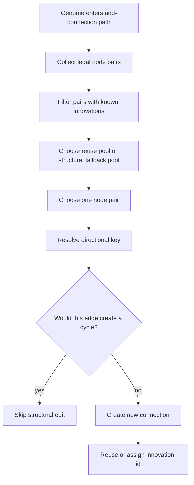

# neat/mutation/add-conn

Add-connection mutation helpers.

This chapter owns candidate-pair discovery, cycle guarding, and innovation-id
reuse for newly added structural connections.

Where `add-node/` grows structure by splitting one existing edge, this
chapter grows structure by discovering a legal pair of nodes that are not yet
connected. That sounds simpler, but it still has several responsibilities:
preserve innovation identity when the same directed edge has been connected
before, prefer historically meaningful or structurally useful candidates,
and avoid illegal recurrent edges when acyclic topology is required.

The flow is easiest to read as a pipeline:

1. enumerate legal candidate pairs,
2. narrow the pool toward reusable or hidden-hidden pairs when possible,
3. choose one pair,
4. resolve the directional innovation key for that pair,
5. abort if the new edge would violate cycle policy,
6. connect the pair and assign a reused or fresh innovation id.

Read this chapter in that order when debugging connection growth.



## neat/mutation/add-conn/mutation.add-conn.ts

### assignInnovationForConnection

```ts
assignInnovationForConnection(
  connection: ConnectionWithMetadata,
  pairNodes: { connectionKey: string; },
  internal: NeatControllerForMutation,
): void
```

Assign an innovation id for a new connection, reusing when possible.

Innovation assignment is the historical memory for connection growth. If the
exact directed edge has already been recorded for the active generation,
this helper reuses that innovation id. Otherwise it allocates a new global
id and stores it under the pair's directional key.

This keeps the revive-vs-recreate contract explicit: currently absent edges
may be recreated with their historical innovation, but currently present
disabled genes are not duplicated here because they never reach the absent
candidate pool.

Parameters:
- `connection` - newly created connection
- `pairNodes` - resolved pair metadata
- `internal` - neat controller context

Returns: void

### buildDirectionalKeyForConn

```ts
buildDirectionalKeyForConn(
  sourceNode: NodeWithMetadata,
  targetNode: NodeWithMetadata,
): string
```

Build a directional innovation key for an exact source-target edge.

Direction matters once recurrent growth is allowed. Forward, backward, and
self edges between the same endpoint gene ids are distinct structural events
and must not alias through one recurrence-blind key.

Parameters:
- `sourceNode` - source node
- `targetNode` - target node

Returns: directional innovation key

### canApplyChosenPairForConn

```ts
canApplyChosenPairForConn(
  genomeToInspect: GenomeWithMetadata,
  chosenPair: [NodeWithMetadata, NodeWithMetadata],
  allowRecurrentConnections: boolean,
): boolean
```

Check whether one exact pair is legal under the active connection policy.

Repair helpers often know the exact endpoint pair they want to reconnect.
This helper lets them ask the same legality question as the generic
add-connection chapter instead of recreating a second pair-validation policy.

Parameters:
- `genomeToInspect` - genome to inspect
- `chosenPair` - exact pair being considered
- `allowRecurrentConnections` - whether recurrent and self candidates may be proposed

Returns: true when the pair is legal and cycle-safe for creation

### choosePairForConn

```ts
choosePairForConn(
  pairs: [NodeWithMetadata, NodeWithMetadata][],
  internal: NeatControllerForMutation,
): [NodeWithMetadata, NodeWithMetadata] | null
```

Choose a pair deterministically when only one candidate exists.

The deterministic single-pair fast path avoids wasting randomness when the
structural search has already collapsed to one legal option.

Parameters:
- `pairs` - selection pool
- `internal` - neat controller context

Returns: chosen pair or null

### collectCandidatePairsForConn

```ts
collectCandidatePairsForConn(
  genomeToInspect: GenomeWithMetadata,
  allowRecurrentConnections: boolean,
): [NodeWithMetadata, NodeWithMetadata][]
```

Collect legal (from,to) node pairs not already connected.

This helper defines the search space for connection growth. It respects the
active topology policy instead of assuming that add-connection is always a
forward-only operator. Feed-forward runs keep the traditional forward source
ordering, while unconstrained recurrent runs also include self and backward
candidates so the mutation shelf follows the same heredity contract as
crossover.

Only truly absent directed edges enter this candidate pool. If a genome
already carries the exact edge in a disabled state, add-connection does not
duplicate it; revival belongs to an explicit re-enable path, while this
chapter only recreates historically known edges when the exact direction is
absent from the genome.

Parameters:
- `genomeToInspect` - genome to scan
- `allowRecurrentConnections` - whether recurrent and self candidates may be proposed

Returns: candidate node pairs

### collectFeedForwardCandidatePairs

```ts
collectFeedForwardCandidatePairs(
  genomeToInspect: GenomeWithMetadata,
): [NodeWithMetadata, NodeWithMetadata][]
```

Collect forward-only connection candidates for feed-forward runs.

Parameters:
- `genomeToInspect` - genome to scan

Returns: candidate node pairs

### collectUnconstrainedCandidatePairs

```ts
collectUnconstrainedCandidatePairs(
  genomeToInspect: GenomeWithMetadata,
): [NodeWithMetadata, NodeWithMetadata][]
```

Collect forward, backward, and self candidates for unconstrained runs.

Input nodes remain invalid targets, but any non-input node may receive a new
connection, including self loops or edges from later nodes.

Parameters:
- `genomeToInspect` - genome to scan

Returns: candidate node pairs

### connectChosenPair

```ts
connectChosenPair(
  genomeToEdit: GenomeWithMetadata,
  pairNodes: { sourceNode: NodeWithMetadata; targetNode: NodeWithMetadata; },
  internal: NeatControllerForMutation,
): ConnectionWithMetadata | undefined
```

Create the connection for the chosen pair.

This helper is intentionally thin: by the time the flow reaches it, pair
discovery, policy filtering, and cycle guards should already be complete.
The remaining job is just to materialize the chosen edge.

Parameters:
- `genomeToEdit` - genome to edit
- `pairNodes` - resolved pair nodes

Returns: created connection or undefined

### connectChosenPairWithInnovationReuse

```ts
connectChosenPairWithInnovationReuse(
  genomeToEdit: GenomeWithMetadata,
  chosenPair: [NodeWithMetadata, NodeWithMetadata],
  internal: NeatControllerForMutation,
  allowRecurrentConnections: boolean,
): ConnectionWithMetadata | undefined
```

Create one exact connection using canonical innovation reuse.

The generic add-connection operator chooses the pair for itself, but repair
helpers often need to reconnect a known source and target. This service keeps
those maintenance paths on the same innovation and topology-policy contract
as the main mutation operator instead of letting them materialize edges with
direct runtime connects.

Parameters:
- `genomeToEdit` - genome to edit
- `chosenPair` - exact source-target pair to connect
- `internal` - neat controller context
- `allowRecurrentConnections` - whether recurrent and self candidates may be proposed

Returns: created connection or undefined when the pair is not legal

### createsCycle

```ts
createsCycle(
  sourceNode: NodeWithMetadata,
  targetNode: NodeWithMetadata,
): boolean
```

Detect whether adding a connection would create a cycle.

The cycle check walks forward from the proposed target node and looks for a
path back to the proposed source. If one exists, adding the new edge would
close a loop and the caller can abort the structural edit for acyclic runs.

Parameters:
- `sourceNode` - source node of the new connection
- `targetNode` - target node of the new connection

Returns: true when a cycle is detected

### filterPairsWithInnovations

```ts
filterPairsWithInnovations(
  pairs: [NodeWithMetadata, NodeWithMetadata][],
  internal: NeatControllerForMutation,
): [NodeWithMetadata, NodeWithMetadata][]
```

Filter candidate pairs that already have innovation reuse keys.

Reuse candidates are especially valuable because they let independently
discovered structure share the same innovation identity. This helper pulls out
those historically known pairs so the selection path can favor them when such pairs
exist.

Parameters:
- `pairs` - candidate node pairs
- `internal` - neat controller context

Returns: reuse candidates

### isAbsentDirectedEdge

```ts
isAbsentDirectedEdge(
  sourceNode: NodeWithMetadata,
  targetNode: NodeWithMetadata,
): boolean
```

Determine whether the directed edge is absent from the genome.

Disabled connections still count as structurally present genes. This helper
makes the mutation contract explicit: add-connection recreates historically
known edges only when the exact direction is absent, while dormant genes stay
reserved for explicit re-enable flows.

Parameters:
- `sourceNode` - source node of the candidate edge
- `targetNode` - target node of the candidate edge

Returns: true when the directed edge is absent from the genome

### isCandidatePairAllowedForConn

```ts
isCandidatePairAllowedForConn(
  genomeToInspect: GenomeWithMetadata,
  sourceNode: NodeWithMetadata,
  targetNode: NodeWithMetadata,
  allowRecurrentConnections: boolean,
): boolean
```

Check whether one exact pair is eligible for connection creation.

This helper keeps the pair-shape rules for feed-forward and unconstrained
runs in one place so direct repair paths can stay aligned with the generic
candidate-generation chapter.

Parameters:
- `genomeToInspect` - genome to inspect
- `sourceNode` - proposed source node
- `targetNode` - proposed target node
- `allowRecurrentConnections` - whether recurrent and self candidates may be proposed

Returns: true when the pair fits the active candidate policy

### resolvePairNodes

```ts
resolvePairNodes(
  chosenPair: [NodeWithMetadata, NodeWithMetadata],
): { sourceNode: NodeWithMetadata; targetNode: NodeWithMetadata; connectionKey: string; }
```

Resolve nodes and innovation key details for a chosen pair.

Once selection has picked a pair, the mutation path needs more than the raw
nodes. It also needs the exact directional key used for generation-scoped
innovation reuse.

Parameters:
- `chosenPair` - pair to connect

Returns: resolved pair metadata

### selectPairPool

```ts
selectPairPool(
  allPairs: [NodeWithMetadata, NodeWithMetadata][],
  reusePairs: [NodeWithMetadata, NodeWithMetadata][],
): [NodeWithMetadata, NodeWithMetadata][]
```

Build the final selection pool based on reuse and hidden-node preference.

Pool selection is opinionated but still simple: prefer pairs with known
innovation history, otherwise prefer hidden-to-hidden growth, otherwise fall
back to the full candidate set. That keeps the chapter's structural bias
readable in one place.

Parameters:
- `allPairs` - all candidate pairs
- `reusePairs` - pairs with historical innovations

Returns: selection pool

### shouldAbortForCycle

```ts
shouldAbortForCycle(
  genomeToInspect: GenomeWithMetadata,
  pairNodes: { sourceNode: NodeWithMetadata; targetNode: NodeWithMetadata; },
): boolean
```

Determine whether adding the connection would create a cycle.

The add-connection path only enforces cycle checks when the genome requests
acyclic topology. That keeps recurrent-capable runs permissive while still
giving feed-forward-style runs one clear abort seam.

Parameters:
- `genomeToInspect` - genome to inspect
- `pairNodes` - resolved pair nodes

Returns: true if the connection should be aborted
