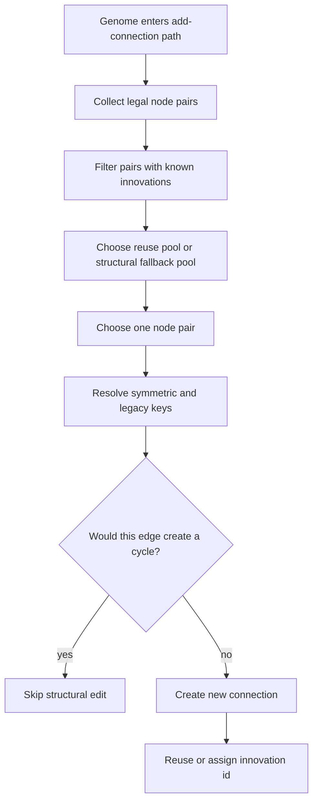

# neat/mutation/add-conn

Add-connection mutation helpers.

This chapter owns candidate-pair discovery, cycle guarding, and innovation-id
reuse for newly added structural connections.

Where `add-node/` grows structure by splitting one existing edge, this
chapter grows structure by discovering a legal pair of nodes that are not yet
connected. That sounds simpler, but it still has several responsibilities:
preserve innovation identity when the same node pair has been connected
before, prefer historically meaningful or structurally useful candidates, and
avoid illegal recurrent edges when acyclic topology is required.

The flow is easiest to read as a pipeline:

1. enumerate legal candidate pairs,
2. narrow the pool toward reusable or hidden-hidden pairs when possible,
3. choose one pair,
4. resolve the innovation keys for that pair,
5. abort if the new edge would violate cycle policy,
6. connect the pair and assign a reused or fresh innovation id.

Read this chapter in that order when debugging connection growth.



## neat/mutation/add-conn/mutation.add-conn.ts

### assignInnovationForConnection

```ts
assignInnovationForConnection(
  connection: ConnectionWithMetadata,
  pairNodes: { symmetricKey: string; legacyForwardKey: string; legacyReverseKey: string; },
  internal: NeatControllerForMutation,
): void
```

Assign an innovation id for a new connection, reusing when possible.

Innovation assignment is the historical memory for connection growth. If the
unordered node pair has been seen before, this helper reuses that innovation
id. Otherwise it allocates a new global id and stores it under both the
symmetric key and the legacy directional aliases.

Parameters:
- `connection` - - newly created connection
- `pairNodes` - - resolved pair metadata
- `internal` - - neat controller context

Returns: void

### buildLegacyKeyForConn

```ts
buildLegacyKeyForConn(
  sourceNode: NodeWithMetadata,
  targetNode: NodeWithMetadata,
): string
```

Build a legacy directional innovation key.

Legacy directional keys are still stored so older code paths or preserved
historical records can resolve to the same innovation id as the modern
symmetric key.

Parameters:
- `sourceNode` - - source node
- `targetNode` - - target node

Returns: directional innovation key

### buildSymmetricKeyForConn

```ts
buildSymmetricKeyForConn(
  sourceNode: NodeWithMetadata,
  targetNode: NodeWithMetadata,
): string
```

Build a symmetric innovation key for an unordered node pair.

The symmetric key is the preferred reuse identity because connection growth
is treated as one structural relationship between two genes, not as a
direction-specific novelty record.

Parameters:
- `sourceNode` - - source node
- `targetNode` - - target node

Returns: symmetric innovation key

### choosePairForConn

```ts
choosePairForConn(
  pairs: [NodeWithMetadata, NodeWithMetadata][],
  internal: NeatControllerForMutation,
): [NodeWithMetadata, NodeWithMetadata] | null
```

Choose a pair deterministically when only one candidate exists.

The deterministic single-pair fast path avoids wasting randomness when the
structural search has already collapsed to one legal option.

Parameters:
- `pairs` - - selection pool
- `internal` - - neat controller context

Returns: chosen pair or null

### collectCandidatePairsForConn

```ts
collectCandidatePairsForConn(
  genomeToInspect: GenomeWithMetadata,
): [NodeWithMetadata, NodeWithMetadata][]
```

Collect legal (from,to) node pairs not already connected.

This helper defines the search space for connection growth. It respects the
node ordering conventions used by the genome representation so mutation does
not propose obviously invalid source-target directions before later cycle
checks even run.

Parameters:
- `genomeToInspect` - - genome to scan

Returns: candidate node pairs

### connectChosenPair

```ts
connectChosenPair(
  genomeToEdit: GenomeWithMetadata,
  pairNodes: { sourceNode: NodeWithMetadata; targetNode: NodeWithMetadata; },
): ConnectionWithMetadata | undefined
```

Create the connection for the chosen pair.

This helper is intentionally thin: by the time the flow reaches it, pair
discovery, policy filtering, and cycle guards should already be complete.
The remaining job is just to materialize the chosen edge.

Parameters:
- `genomeToEdit` - - genome to edit
- `pairNodes` - - resolved pair nodes

Returns: created connection or undefined

### createsCycle

```ts
createsCycle(
  sourceNode: NodeWithMetadata,
  targetNode: NodeWithMetadata,
): boolean
```

Detect whether adding a connection would create a cycle.

The cycle check walks forward from the proposed target node and looks for a
path back to the proposed source. If one exists, adding the new edge would
close a loop and the caller can abort the structural edit for acyclic runs.

Parameters:
- `sourceNode` - - source node of the new connection
- `targetNode` - - target node of the new connection

Returns: true when a cycle is detected

### filterPairsWithInnovations

```ts
filterPairsWithInnovations(
  pairs: [NodeWithMetadata, NodeWithMetadata][],
  internal: NeatControllerForMutation,
): [NodeWithMetadata, NodeWithMetadata][]
```

Filter candidate pairs that already have innovation reuse keys.

Reuse candidates are especially valuable because they let independently
discovered structure share the same innovation identity. This helper pulls out
those historically known pairs so the selection path can favor them when such pairs
exist.

Parameters:
- `pairs` - - candidate node pairs
- `internal` - - neat controller context

Returns: reuse candidates

### resolvePairNodes

```ts
resolvePairNodes(
  chosenPair: [NodeWithMetadata, NodeWithMetadata],
): { sourceNode: NodeWithMetadata; targetNode: NodeWithMetadata; symmetricKey: string; legacyForwardKey: string; legacyReverseKey: string; }
```

Resolve nodes and innovation key details for a chosen pair.

Once selection has picked a pair, the mutation path needs more than the raw
nodes. It also needs the symmetric key used for modern innovation reuse and
the directional legacy keys kept for backward-compatible lookups.

Parameters:
- `chosenPair` - - pair to connect

Returns: resolved pair metadata

### selectPairPool

```ts
selectPairPool(
  allPairs: [NodeWithMetadata, NodeWithMetadata][],
  reusePairs: [NodeWithMetadata, NodeWithMetadata][],
): [NodeWithMetadata, NodeWithMetadata][]
```

Build the final selection pool based on reuse and hidden-node preference.

Pool selection is opinionated but still simple: prefer pairs with known
innovation history, otherwise prefer hidden-to-hidden growth, otherwise fall
back to the full candidate set. That keeps the chapter's structural bias
readable in one place.

Parameters:
- `allPairs` - - all candidate pairs
- `reusePairs` - - pairs with historical innovations

Returns: selection pool

### shouldAbortForCycle

```ts
shouldAbortForCycle(
  genomeToInspect: GenomeWithMetadata,
  pairNodes: { sourceNode: NodeWithMetadata; targetNode: NodeWithMetadata; },
): boolean
```

Determine whether adding the connection would create a cycle.

The add-connection path only enforces cycle checks when the genome requests
acyclic topology. That keeps recurrent-capable runs permissive while still
giving feed-forward-style runs one clear abort seam.

Parameters:
- `genomeToInspect` - - genome to inspect
- `pairNodes` - - resolved pair nodes

Returns: true if the connection should be aborted
