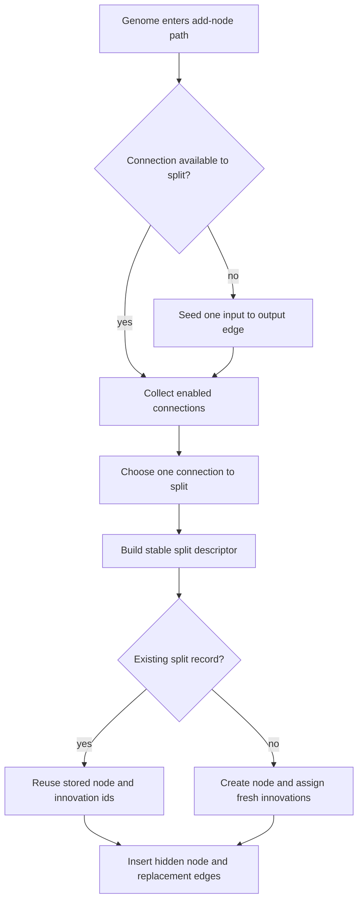

# neat/mutation/add-node

Add-node mutation helpers.

This chapter owns the "split one connection into two" mechanics used by the
root mutation flow when preserving node-split innovation reuse.

Add-node growth is the more identity-sensitive of the two structural mutation
paths. Adding a node is not just "insert one hidden unit." The controller is
trying to remember whether the exact same source-to-target split has already
happened elsewhere so that later crossover and speciation can recognize the
resulting structure as the same historical innovation rather than an
unrelated accident.

The lifecycle in this chapter is therefore deliberate:

1. ensure there is at least one connection worth splitting,
2. choose one enabled connection,
3. derive a stable split-event key from the connection innovation when
   present, with a legacy endpoint fallback only when historical metadata
   is missing,
4. either reuse an existing split record or assign a brand-new one,
5. insert the new hidden node while preserving output ordering.

Read this chapter from top to bottom when debugging structural growth by
connection splitting. The early helpers prepare a valid split target. The
middle helpers explain how one split becomes a reusable innovation record.
The final helpers explain where the new node and edges land in the genome.



## neat/mutation/add-node/mutation.add-node.ts

### applySplitWithExistingRecord

```ts
applySplitWithExistingRecord(
  genomeToEdit: GenomeWithMetadata,
  connectionToSplit: ConnectionWithMetadata,
  splitDescriptor: { splitKey: string; originalWeight: number; },
  splitRecord: NodeSplitRecord,
  NodeClass: new (type: "hidden" | "input" | "output", customActivation?: ((x: number, derivate?: boolean | undefined) => number) | undefined, rng?: (() => number) | undefined) => unknown,
  randomValue: () => number,
): void
```

Apply a split using an existing innovation record.

This is the preferred path when the same structural split has already been
observed elsewhere in the population history. Reusing the stored node gene id
and edge innovation ids preserves historical identity, which makes later
alignment-based operations treat equivalent splits as equivalent structure.

Parameters:
- `genomeToEdit` - genome being modified
- `connectionToSplit` - connection being split
- `splitDescriptor` - metadata for the split
- `splitRecord` - existing innovation record
- `NodeClass` - node constructor
- `randomValue` - RNG callback for deterministic bias initialization.

Returns: void

### applySplitWithFreshIdentity

```ts
applySplitWithFreshIdentity(
  genomeToEdit: GenomeWithMetadata,
  connectionToSplit: ConnectionWithMetadata,
  splitDescriptor: { splitKey: string; originalWeight: number; },
  NodeClass: new (type: "hidden" | "input" | "output", customActivation?: ((x: number, derivate?: boolean | undefined) => number) | undefined, rng?: (() => number) | undefined) => unknown,
  internal: NeatControllerForMutation,
): void
```

Apply a split with fresh local identities without replacing the shared split record.

This is the escape hatch for the rare case where a genome already carries the
node gene id or replacement connection innovations referenced by the active
generation's shared split record. The local genome still needs a valid split,
but the shared record should remain intact for other genomes that do not have
the collision.

Parameters:
- `genomeToEdit` - genome being modified
- `connectionToSplit` - connection being split
- `splitDescriptor` - metadata for the split
- `NodeClass` - node constructor
- `internal` - neat controller context

Returns: void

### applySplitWithNewRecord

```ts
applySplitWithNewRecord(
  genomeToEdit: GenomeWithMetadata,
  connectionToSplit: ConnectionWithMetadata,
  splitDescriptor: { splitKey: string; originalWeight: number; },
  NodeClass: new (type: "hidden" | "input" | "output", customActivation?: ((x: number, derivate?: boolean | undefined) => number) | undefined, rng?: (() => number) | undefined) => unknown,
  internal: NeatControllerForMutation,
): void
```

Apply a split and create a new innovation record.

This path handles genuinely novel structural growth. It inserts a fresh
hidden node, assigns new innovations to the replacement edges, and records
the resulting identity under the split key so future genomes can reuse it.

Parameters:
- `genomeToEdit` - genome being modified
- `connectionToSplit` - connection being split
- `splitDescriptor` - metadata for the split
- `NodeClass` - node constructor
- `internal` - neat controller context

Returns: void

### assignInnovationsForNewSplit

```ts
assignInnovationsForNewSplit(
  newNode: NodeWithMetadata,
  splitConnections: { incomingConnection?: ConnectionWithMetadata | undefined; outgoingConnection?: ConnectionWithMetadata | undefined; },
  internal: NeatControllerForMutation,
): NodeSplitRecord
```

Assign new innovations for a split and build the innovation record.

New split records are the durable memory that turns a one-off structural edit
into reusable innovation history. This helper assigns the next global
innovation ids to the replacement edges and packages those ids together with
the new node gene id so later equivalent splits can be recognized quickly.

Parameters:
- `newNode` - newly created hidden node
- `splitConnections` - incoming/outgoing connections
- `internal` - neat controller context

Returns: innovation record for the split

### buildSplitDescriptor

```ts
buildSplitDescriptor(
  connectionToSplit: ConnectionWithMetadata,
): { splitKey: string; originalWeight: number; }
```

Build the split descriptor used for innovation lookup and connection creation.

The descriptor is the compact identity packet for a split. Its key prefers
the historical identity of the split connection itself so homologous splits
follow the structural event rather than only the current endpoint pair.
When the connection lacks historical metadata, the descriptor falls back to a
legacy endpoint key so bootstrap and imported edge cases remain stable.

Parameters:
- `connectionToSplit` - connection being split

Returns: split descriptor

### buildSplitKeyForConnection

```ts
buildSplitKeyForConnection(
  connectionToSplit: ConnectionWithMetadata,
): string
```

Build the canonical split identity for one connection.

The proper-NEAT path keys split reuse by the historical marking of the edge
being split, which is the actual structural event. The endpoint fallback is
retained only so older or freshly bootstrapped connections without recorded
innovations still behave deterministically.

Parameters:
- `connectionToSplit` - connection whose split identity is being resolved

Returns: canonical split key for tracker lookup

### chooseConnectionForSplit

```ts
chooseConnectionForSplit(
  enabledConnectionsList: ConnectionWithMetadata[],
  internal: NeatControllerForMutation,
): ConnectionWithMetadata | null
```

Choose a random enabled connection to split.

Once the candidate shelf is built, the split path keeps selection light: one
RNG draw chooses the connection whose history may now branch into a hidden
node insertion.

Parameters:
- `enabledConnectionsList` - candidate connections
- `internal` - neat controller context

Returns: selected connection or null

### collectEnabledConnections

```ts
collectEnabledConnections(
  genomeToInspect: GenomeWithMetadata,
): ConnectionWithMetadata[]
```

Collect all enabled connections from a genome.

Split mutations only operate on live structural edges. Disabled connections
remain historical artifacts and should not become split candidates because
doing so would grow new structure from topology the runtime is not currently
using.

Parameters:
- `genomeToInspect` - genome to inspect

Returns: enabled connections list

### connectSplitEdges

```ts
connectSplitEdges(
  genomeToEdit: GenomeWithMetadata,
  connectionToSplit: ConnectionWithMetadata,
  newNode: NodeWithMetadata,
  originalWeight: number,
): { incomingConnection?: ConnectionWithMetadata | undefined; outgoingConnection?: ConnectionWithMetadata | undefined; }
```

Create the incoming and outgoing split connections.

A split replaces one edge with two edges. The incoming edge starts with the
chapter's default bootstrap weight, while the outgoing edge preserves the
original connection weight so the pre-split signal can still pass forward in
a comparable way.

Parameters:
- `genomeToEdit` - genome being modified
- `connectionToSplit` - connection being split
- `newNode` - newly created hidden node
- `originalWeight` - weight to preserve on the outgoing connection

Returns: incoming/outgoing connection handles

### createSplitNode

```ts
createSplitNode(
  NodeClass: new (type: "hidden" | "input" | "output", customActivation?: ((x: number, derivate?: boolean | undefined) => number) | undefined, rng?: (() => number) | undefined) => unknown,
  randomValue: () => number,
): NodeWithMetadata
```

Create a split-inserted hidden node using the controller RNG.

The add-node replay contract depends on the inserted node receiving the same
bias initialization every time the same checkpointed mutation path resumes.
Passing the controller RNG through the node constructor keeps that
initialization deterministic instead of falling back to `Math.random()`.

Parameters:
- `NodeClass` - node constructor used by the mutation path.
- `randomValue` - deterministic controller RNG.

Returns: Newly created hidden node.

### disconnectOriginalConnection

```ts
disconnectOriginalConnection(
  genomeToEdit: GenomeWithMetadata,
  connectionToRemove: ConnectionWithMetadata,
): void
```

Disconnect the original connection before inserting the split node.

The add-node mutation is modeled as a real split, not as a parallel bypass.
Removing the original edge first preserves the intended NEAT-style topology
change: the signal must now pass through the new hidden node.

Parameters:
- `genomeToEdit` - genome to edit
- `connectionToRemove` - original connection to remove

Returns: void

### doesSplitRecordConflictWithGenome

```ts
doesSplitRecordConflictWithGenome(
  genomeToInspect: GenomeWithMetadata,
  splitRecord: NodeSplitRecord,
): boolean
```

Determine whether one reused split record would collide with live genome identity.

Generation-local split reuse is correct across different genomes, but a single
genome must never stamp the same node gene id or connection innovations twice.
This guard detects the collision case so callers can fall back to fresh local
identities while preserving the shared split record for other genomes.

Parameters:
- `genomeToInspect` - genome about to receive the reused split record
- `splitRecord` - existing split identity record

Returns: True when reusing the record would duplicate live structural identity.

### ensureBootstrapConnection

```ts
ensureBootstrapConnection(
  genomeToSeed: GenomeWithMetadata,
  internal: NeatControllerForMutation,
): void
```

Ensure the genome has at least one connection by linking input to output.

A connection split only makes sense when a genome already has an edge to cut.
This helper is the bootstrap escape hatch for extremely sparse genomes. It
seeds the smallest possible forward connection so the add-node path can keep
behaving like a split-based structural mutation instead of bailing out
immediately.

Parameters:
- `genomeToSeed` - genome that may need a bootstrap connection
- `internal` - neat controller context retained for compatibility with existing callers

Returns: void

### findFirstNodeByType

```ts
findFirstNodeByType(
  genomeToSearch: GenomeWithMetadata,
  nodeType: "hidden" | "input" | "output",
): NodeWithMetadata | undefined
```

Find the first node of a given type.

The add-node bootstrap path only needs a minimal node lookup strategy, so
this helper stays intentionally simple and deterministic.

Parameters:
- `genomeToSearch` - genome whose nodes are searched
- `nodeType` - node type to match

Returns: the first matching node or undefined

### resolveInsertIndex

```ts
resolveInsertIndex(
  genomeToEdit: GenomeWithMetadata,
  targetNode: NodeWithMetadata,
): number
```

Resolve the insertion index for a new node, keeping outputs at the end.

Node order matters in this codebase because output nodes are expected to stay
grouped at the tail of the genome node list. This helper preserves that local
invariant while still placing the new hidden node near the split target.

Parameters:
- `genomeToEdit` - genome whose node list is updated
- `targetNode` - original target node of the split connection

Returns: insertion index
