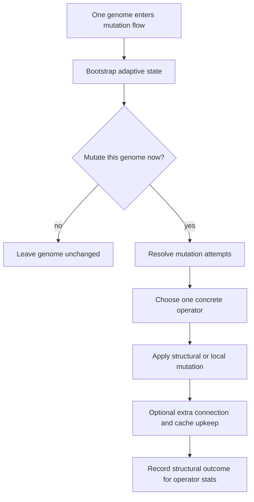

# neat/mutation/flow

Flow helpers for the mutation root orchestration.

This chapter owns the per-genome mutation loop: initialize adaptive state,
resolve effective rates and counts, dispatch operators, and keep operator
statistics in sync with the actual structural outcome.

The root `mutation/` chapter explains the whole-generation view. This file
explains what happens once one genome reaches the front of that queue.
The lifecycle is intentionally split into four small stages:

1. bootstrap per-genome adaptive state,
2. decide whether this genome should mutate at all and how many attempts it
   receives,
3. ask `select/` for one concrete operator at a time and apply it,
4. record the structural outcome so later adaptive policy can learn which
   operators are actually producing growth.

That separation matters because mutation is not just "roll randomness and
edit topology." The controller is trying to preserve several invariants at
once: adaptive per-genome settings should remain stable across generations,
structural operators should reuse innovation-aware helpers, caches should be
invalidated only when topology really changed, and operator statistics
should reflect actual outcomes rather than mere selection attempts.

Read this chapter in execution order:

- `mutateGenome()` for the complete per-genome story,
- `initializeAdaptiveMutation()`, `resolveEffectiveRate()`, and
  `resolveEffectiveAmount()` for the gating setup,
- `selectConcreteMutationMethod()` plus `applyMutationOperator()` for
  operator dispatch,
- `captureStructuralSizes()` and `updateOperatorStatsIfNeeded()` for the
  feedback loop that supports later operator adaptation and bandit policy.



## neat/mutation/flow/mutation.flow.ts

### applyAddConnMutation

```ts
applyAddConnMutation(
  genome: GenomeWithMetadata,
  internal: NeatControllerForMutation,
  methods: { mutation: unknown; },
): void
```

Apply an ADD_CONN mutation with reuse and weight nudging.

This is the connection-growth companion to `applyAddNodeMutation()`. The
structural edit itself is delegated to the reuse-aware connection helper so
identical edge discoveries can still share innovation identity across the
population.

Parameters:
- `genome` - - genome to mutate
- `internal` - - neat controller context
- `methods` - - mutation methods module

Returns: void

### applyAddNodeMutation

```ts
applyAddNodeMutation(
  genome: GenomeWithMetadata,
  internal: NeatControllerForMutation,
  methods: { mutation: unknown; },
): void
```

Apply an ADD_NODE mutation with reuse and weight nudging.

The add-node path is special because it needs both innovation-aware
structural growth and a post-split weight nudge that makes the topology
change observable immediately in downstream behavior and tests. The helper
intentionally treats cache invalidation as part of the operation rather than
leaving it to callers.

Parameters:
- `genome` - - genome to mutate
- `internal` - - neat controller context
- `methods` - - mutation methods module

Returns: void

### applyMutationOperator

```ts
applyMutationOperator(
  genome: GenomeWithMetadata,
  mutationMethod: MutationMethod,
  internal: NeatControllerForMutation,
  methods: { mutation: unknown; },
): void
```

Apply a mutation operator to a genome and invalidate caches as needed.

This helper is the dispatch hinge between policy and topology. Structural
growth operators such as `ADD_NODE` and `ADD_CONN` are routed through the
innovation-reuse helpers because the controller cares about more than local
graph edits; it also needs stable innovation history for later crossover and
speciation.

Non-structural operators stay delegated to the genome's own `mutate()`
implementation. Cache invalidation is then handled separately so the flow can
keep the expensive cleanup targeted to methods that plausibly changed the
structural view of the genome.

Parameters:
- `genome` - - genome to mutate
- `mutationMethod` - - mutation operator to apply
- `internal` - - neat controller context
- `methods` - - mutation methods module

Returns: void

### captureStructuralSizes

```ts
captureStructuralSizes(
  genome: GenomeWithMetadata,
): { beforeNodes: number; beforeConns: number; }
```

Capture structural sizes used to evaluate operator success.

Operator adaptation in this subtree is intentionally coarse-grained: it asks
whether an attempted mutation increased structural size, not whether the
resulting genome later scored better. This helper records the pre-mutation
node and connection counts that make that local success signal possible.

Parameters:
- `genome` - - genome to inspect

Returns: structural size snapshot

### initializeAdaptiveMutation

```ts
initializeAdaptiveMutation(
  genome: GenomeWithMetadata,
  internal: NeatControllerForMutation,
): void
```

Initialize per-genome adaptive mutation parameters if configured.

Adaptive mutation is stateful at the genome level, not just a controller
default. This helper assigns the first persistent rate and optional amount so
later generations can treat the genome as carrying its own mutation budget.

The helper only writes when the genome has not yet been initialized. That is
why it runs at the top of `mutateGenome()` on every pass: it behaves like a
cheap bootstrap check rather than a repeated reset of evolved mutation
behavior.

Parameters:
- `genome` - - genome to initialize
- `internal` - - neat controller context

Returns: void

### maybeAddExtraConnection

```ts
maybeAddExtraConnection(
  genome: GenomeWithMetadata,
  internal: NeatControllerForMutation,
): void
```

Optionally add an extra connection to increase exploration.

This small post-operator hook gives the controller one extra chance to add
connectivity after the main mutation has landed. It is intentionally
probabilistic and lightweight: the flow uses it as a gentle exploration bump,
not as a second full operator-selection phase.

Parameters:
- `genome` - - genome to mutate
- `internal` - - neat controller context

Returns: void

### mutateGenome

```ts
mutateGenome(
  genome: GenomeWithMetadata,
  internal: NeatControllerForMutation,
  methods: { mutation: unknown; },
): Promise<void>
```

Mutate a single genome based on configured mutation policies.

This is the orchestration entry point for the `flow/` chapter. It keeps the
per-genome lifecycle linear: adaptive settings are prepared first, then one
probability gate decides whether work happens at all, and only then does the
helper loop ask `select/` for concrete operators.

The important design choice is that mutation amount is resolved after the
mutate-or-skip gate passes. That keeps genomes with low effective rates from
paying the full operator-selection cost every generation while still letting
successful genomes perform multiple edits once they have been admitted into
the flow.

Each loop iteration captures a before-snapshot, applies one operator,
performs an extra exploration edge when configured, and finally records whether the genome
actually grew. That final feedback is what later allows operator adaptation
and bandit-style policies to reward operators that change structure instead
of merely consuming attempts.

Parameters:
- `genome` - - genome to mutate
- `internal` - - neat controller context
- `methods` - - mutation methods module

Returns: Promise resolving after mutation attempts complete

### resolveEffectiveAmount

```ts
resolveEffectiveAmount(
  genome: GenomeWithMetadata,
  internal: NeatControllerForMutation,
): number
```

Resolve the effective mutation amount for a genome.

Mutation amount answers a different question from mutation rate. Rate decides
whether the genome enters the flow. Amount decides how many operator draws it
receives once admitted. When adaptive mutation amount is enabled, the genome
may carry its own evolving attempt budget; otherwise the controller-wide
amount stays authoritative.

Parameters:
- `genome` - - genome to resolve for
- `internal` - - neat controller context

Returns: effective mutation amount

### resolveEffectiveRate

```ts
resolveEffectiveRate(
  genome: GenomeWithMetadata,
  internal: NeatControllerForMutation,
): number
```

Resolve the effective mutation rate for a genome.

This helper explains the precedence order for rate policy:

1. an explicit controller-level `mutationRate` wins,
2. otherwise an adaptive per-genome `_mutRate` is used when adaptive
   mutation is enabled,
3. otherwise the flow falls back to the local default.

Keeping that precedence isolated here makes the rest of the mutation flow
read as orchestration instead of configuration branching.

Parameters:
- `genome` - - genome to resolve for
- `internal` - - neat controller context

Returns: effective mutation rate

### selectConcreteMutationMethod

```ts
selectConcreteMutationMethod(
  genome: GenomeWithMetadata,
  internal: NeatControllerForMutation,
): Promise<MutationMethod | null>
```

Select a concrete mutation method, resolving legacy arrays when present.

The selection boundary may already return one final operator, or it may
return a legacy array-like pool for backward-compatible paths. This helper is
the bridge between that policy layer and the execution layer in `flow/`: it
guarantees the rest of the loop sees either one concrete operator or `null`.

That normalization keeps `mutateGenome()` focused on lifecycle sequencing
rather than on legacy selection-shape quirks.

Parameters:
- `genome` - - genome to select for
- `internal` - - neat controller context

Returns: resolved mutation method or null

### shouldInvalidateCaches

```ts
shouldInvalidateCaches(
  mutationMethod: MutationMethod,
  methods: { mutation: unknown; },
): boolean
```

Determine whether a mutation method invalidates cached structures.

Not every mutation should force expensive cache rebuilds. This helper keeps
the invalidation policy explicit by listing the operators that can change the
graph structure or traversal semantics enough to make cached topology views
unsafe.

Parameters:
- `mutationMethod` - - mutation operator to inspect
- `methods` - - mutation methods module

Returns: true when caches should be invalidated

### shouldMutateGenome

```ts
shouldMutateGenome(
  effectiveRate: number,
  internal: NeatControllerForMutation,
): boolean
```

Decide whether a genome should be mutated based on probability.

This is the narrow admission gate for the per-genome flow. Keeping the RNG
comparison in one helper makes the orchestration read clearly and gives tests
one stable seam for deterministic gating behavior.

Parameters:
- `effectiveRate` - - effective mutation probability
- `internal` - - neat controller context

Returns: true when the genome should be mutated

### updateOperatorStatsIfNeeded

```ts
updateOperatorStatsIfNeeded(
  genome: GenomeWithMetadata,
  mutationMethod: MutationMethod,
  beforeSizes: { beforeNodes: number; beforeConns: number; },
  internal: NeatControllerForMutation,
): void
```

Update operator statistics when adaptation is enabled.

The mutation subtree measures operator success using a local structural proxy:
did the attempted operator increase nodes or connections compared with the
pre-mutation snapshot? That signal is imperfect, but it is cheap enough to
collect every generation and concrete enough for later adaptation logic to
bias toward operators that are actually creating new structure.

Parameters:
- `genome` - - genome used to compute after-sizes
- `mutationMethod` - - operator being recorded
- `beforeSizes` - - structural sizes captured before mutation
- `internal` - - neat controller context

Returns: void
