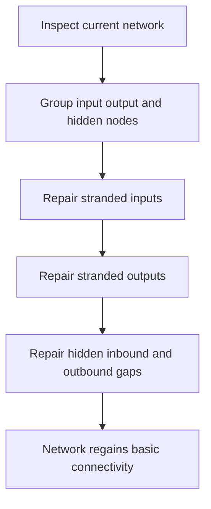

# neat/mutation/repair

Dead-end repair helpers.

This file owns the connectivity half of the mutation-repair chapter.

The surrounding `repair/` folder preserves one structural-viability policy
with two complementary concerns:
- this file repairs nodes that have become stranded with no legal inbound or
  outbound path,
- `mutation.min-hidden.ts` enforces a minimum hidden-node floor when the
  controller expects richer internal structure.

Read this file when the network already has the right rough size but may have
broken local connectivity after import, mutation, crossover, or pruning.
The goal is not to redesign topology. The goal is to restore the smallest
practical set of connections that makes inputs, outputs, and hidden nodes
usable again.

The repair flow is easiest to retain in four steps:
1. split the network into input, output, and hidden node groups,
2. repair stranded inputs,
3. repair stranded outputs,
4. repair hidden nodes that lost either their inbound or outbound side.



## neat/mutation/repair/mutation.dead-ends.ts

### chooseRandomNodeForDeadEnds

```ts
chooseRandomNodeForDeadEnds(
  candidates: NodeWithMetadata[],
  internal: NeatControllerForMutation,
): NodeWithMetadata | null
```

Choose a random node from candidates for dead-end repair.

Repair deliberately stays lightweight and non-optimizing. Once a helper has
found a legal candidate pool, this selector uses the controller RNG to pick
one reconnection target or source without imposing another ranking policy on
the maintenance path.

Parameters:
- `candidates` - - candidate nodes
- `internal` - - neat controller context

Returns: selected node or null

### collectNodeGroupsForDeadEnds

```ts
collectNodeGroupsForDeadEnds(
  networkToInspect: GenomeWithMetadata,
): { inputNodes: NodeWithMetadata[]; outputNodes: NodeWithMetadata[]; hiddenNodes: NodeWithMetadata[]; }
```

Collect categorized node arrays for dead-end repair.

This is the chapter's shared preparation step. The later helpers all ask the
same structural question from different angles, so grouping the nodes once
keeps the repair flow declarative and avoids repeating node-type scans.

Parameters:
- `networkToInspect` - - network to inspect

Returns: grouped node arrays

### connectIfCandidatesExistForDeadEnds

```ts
connectIfCandidatesExistForDeadEnds(
  networkToEdit: GenomeWithMetadata,
  anchorNode: NodeWithMetadata,
  candidates: NodeWithMetadata[],
  reverse: boolean,
  internal: NeatControllerForMutation,
): void
```

Connect a node to a random candidate if candidates exist.

This is the chapter's small best-effort wiring primitive. It does not decide
whether repair should happen; it only applies one candidate connection in the
requested direction and tolerates incompatible node pairs without turning a
maintenance pass into a fatal error.

Parameters:
- `networkToEdit` - - network to edit
- `anchorNode` - - node to connect from/to
- `candidates` - - candidate nodes for connection
- `reverse` - - whether to connect candidate -> anchor
- `internal` - - neat controller context

Returns: void

### ensureHiddenConnectivityForDeadEnds

```ts
ensureHiddenConnectivityForDeadEnds(
  networkToEdit: GenomeWithMetadata,
  nodeGroupsToUse: { inputNodes: NodeWithMetadata[]; outputNodes: NodeWithMetadata[]; hiddenNodes: NodeWithMetadata[]; },
  internal: NeatControllerForMutation,
): void
```

Ensure hidden nodes have both incoming and outgoing connections.

Hidden nodes are the most delicate repair family because they must stay on a
usable path through the network. A hidden node with only one side connected
is structural dead weight, so this helper repairs the missing side without
disturbing hidden nodes that are already participating in a path.

Parameters:
- `networkToEdit` - - network to edit
- `nodeGroupsToUse` - - grouped node arrays
- `internal` - - neat controller context

Returns: void

### ensureInputConnectivityForDeadEnds

```ts
ensureInputConnectivityForDeadEnds(
  networkToEdit: GenomeWithMetadata,
  nodeGroupsToUse: { inputNodes: NodeWithMetadata[]; outputNodes: NodeWithMetadata[]; hiddenNodes: NodeWithMetadata[]; },
  internal: NeatControllerForMutation,
): void
```

Ensure all input nodes have at least one outgoing connection.

Inputs are the first dead-end family because an input with no outgoing edge
cannot influence the rest of the network at all. The helper prefers routing
into hidden nodes when they exist and falls back to direct output links when
the network has no hidden layer yet.

Parameters:
- `networkToEdit` - - network to edit
- `nodeGroupsToUse` - - grouped node arrays
- `internal` - - neat controller context

Returns: void

### ensureOutputConnectivityForDeadEnds

```ts
ensureOutputConnectivityForDeadEnds(
  networkToEdit: GenomeWithMetadata,
  nodeGroupsToUse: { inputNodes: NodeWithMetadata[]; outputNodes: NodeWithMetadata[]; hiddenNodes: NodeWithMetadata[]; },
  internal: NeatControllerForMutation,
): void
```

Ensure all output nodes have at least one incoming connection.

Outputs are the second dead-end family. An output with no inbound edge can be
observed by later scoring code, but it carries no meaningful signal. The
helper therefore reconnects it from hidden nodes first and from inputs when
no hidden layer exists.

Parameters:
- `networkToEdit` - - network to edit
- `nodeGroupsToUse` - - grouped node arrays
- `internal` - - neat controller context

Returns: void

### hasIncomingForDeadEnds

```ts
hasIncomingForDeadEnds(
  node: NodeWithMetadata,
): boolean
```

Check whether a node has any incoming connections.

This is the inbound twin of {@link hasOutgoingForDeadEnds}. It answers the
local question "can any upstream node currently reach this one?" before the
higher-level repair helpers decide whether to reconnect it.

Parameters:
- `node` - - node to inspect

Returns: true when incoming connections exist

### hasOutgoingForDeadEnds

```ts
hasOutgoingForDeadEnds(
  node: NodeWithMetadata,
): boolean
```

Check whether a node has any outgoing connections.

Dead-end repair uses this as the smallest possible structural predicate: if
the outgoing list is empty, the node cannot currently send signal forward.

Parameters:
- `node` - - node to inspect

Returns: true when outgoing connections exist

## neat/mutation/repair/mutation.min-hidden.ts

Minimum-hidden repair helpers.

This file owns the hidden-floor half of the mutation-repair chapter.

Dead-end repair restores missing local connectivity in an already-sized
network. This companion file answers a different question: when controller
policy says the network should keep at least some hidden structure, how do we
compute that floor, add missing hidden nodes, and reconnect them so they are
immediately usable?

Read this file when the network may be structurally valid in the narrowest
sense but still too shallow for the controller's configured maintenance
policy. The helpers here turn policy into concrete edits:
1. resolve the allowed size and minimum hidden requirement,
2. create hidden nodes until the floor is met,
3. wire those hidden nodes into usable inbound and outbound paths,
4. rebuild connection caches after the structural edits.

### chooseRandomNodeForMinHidden

```ts
chooseRandomNodeForMinHidden(
  candidates: NodeWithMetadata[],
  internal: NeatControllerForMutation,
): NodeWithMetadata | null
```

Choose a random node from a candidate list.

Like the dead-end repair selector, this helper keeps minimum-hidden
enforcement policy-light: once a legal candidate pool exists, choose one
using the controller RNG and keep the maintenance pass moving.

Parameters:
- `candidates` - - candidate nodes
- `internal` - - neat controller context

Returns: selected node or null

### collectNodeGroupsForMinHidden

```ts
collectNodeGroupsForMinHidden(
  networkToInspect: GenomeWithMetadata,
): { inputNodes: NodeWithMetadata[]; outputNodes: NodeWithMetadata[]; hiddenNodes: NodeWithMetadata[]; }
```

Collect categorized node arrays for the network.

This mirrors the dead-end repair grouping step so the hidden-floor helpers
can reason about endpoints and hidden nodes without repeatedly rescanning the
whole network.

Parameters:
- `networkToInspect` - - network to inspect

Returns: grouped node arrays

### computeMinimumHiddenSize

```ts
computeMinimumHiddenSize(
  inputCount: number,
  outputCount: number,
  explicitMinimumHidden: number | undefined,
  hiddenMultiplier: number | undefined,
): number
```

Compute the minimum hidden node count using explicit or multiplier-based settings.

This is the policy-resolution helper for the file. An explicit minimum wins
immediately; otherwise the helper derives a hidden target from the visible
endpoint count and the configured multiplier.

Parameters:
- `inputCount` - - Number of input nodes in the network.
- `outputCount` - - Number of output nodes in the network.
- `explicitMinimumHidden` - - Optional explicit minimum hidden count.
- `hiddenMultiplier` - - Optional multiplier used when explicit minimum is absent.

Returns: Minimum hidden node requirement.

### ensureHiddenConnectivityForMinHidden

```ts
ensureHiddenConnectivityForMinHidden(
  networkToEdit: GenomeWithMetadata,
  nodeGroupsToUse: { inputNodes: NodeWithMetadata[]; outputNodes: NodeWithMetadata[]; hiddenNodes: NodeWithMetadata[]; },
  internal: NeatControllerForMutation,
): void
```

Ensure hidden nodes have both incoming and outgoing connections.

New hidden nodes are not useful until they sit on an actual path through the
network. This helper treats the whole hidden set as a post-creation repair
pass so newly added nodes and previously under-connected nodes both leave the
function with usable inbound and outbound links.

Parameters:
- `networkToEdit` - - network to edit
- `nodeGroupsToUse` - - grouped node arrays
- `internal` - - neat controller context

Returns: void

### ensureHiddenNodeCountForMinHidden

```ts
ensureHiddenNodeCountForMinHidden(
  networkToEdit: GenomeWithMetadata,
  nodeGroupsToEdit: { hiddenNodes: NodeWithMetadata[]; },
  minimumHidden: number,
  maxNodesLimit: number,
): Promise<void>
```

Ensure the network has at least the minimum number of hidden nodes.

This is the chapter's structural growth step. It creates fresh hidden nodes
only until the configured floor is met and stops early when the broader
maximum-node cap would be violated.

Parameters:
- `networkToEdit` - - network to edit
- `nodeGroupsToEdit` - - grouped node arrays
- `minimumHidden` - - minimum hidden nodes required
- `maxNodesLimit` - - maximum allowed nodes

Returns: Promise resolving when nodes are created

### ensureIncomingConnectionForMinHidden

```ts
ensureIncomingConnectionForMinHidden(
  networkToEdit: GenomeWithMetadata,
  nodeGroupsToUse: { inputNodes: NodeWithMetadata[]; hiddenNodes: NodeWithMetadata[]; },
  hiddenNode: NodeWithMetadata,
  internal: NeatControllerForMutation,
): void
```

Ensure a hidden node has at least one incoming connection.

The helper prefers the smallest legal repair: if a hidden node already has an
inbound edge it is left untouched; otherwise one random input or peer hidden
node is allowed to become the new source.

Parameters:
- `networkToEdit` - - network to edit
- `nodeGroupsToUse` - - grouped node arrays
- `hiddenNode` - - hidden node to connect
- `internal` - - neat controller context

Returns: void

### ensureOutgoingConnectionForMinHidden

```ts
ensureOutgoingConnectionForMinHidden(
  networkToEdit: GenomeWithMetadata,
  nodeGroupsToUse: { outputNodes: NodeWithMetadata[]; hiddenNodes: NodeWithMetadata[]; },
  hiddenNode: NodeWithMetadata,
  internal: NeatControllerForMutation,
): void
```

Ensure a hidden node has at least one outgoing connection.

This is the outbound twin of {@link ensureIncomingConnectionForMinHidden}.
It reconnects a hidden node only when it would otherwise remain a sink with
no downstream effect on outputs or later hidden nodes.

Parameters:
- `networkToEdit` - - network to edit
- `nodeGroupsToUse` - - grouped node arrays
- `hiddenNode` - - hidden node to connect
- `internal` - - neat controller context

Returns: void

### hasRequiredEndpointsForMinHidden

```ts
hasRequiredEndpointsForMinHidden(
  nodeGroupsToCheck: { inputNodes: NodeWithMetadata[]; outputNodes: NodeWithMetadata[]; },
): boolean
```

Check whether the network has at least one input and output node.

Minimum-hidden enforcement only makes sense when there is an actual endpoint
path to support. If either side is missing, the helper chapter stops before
creating hidden nodes that would have nowhere useful to connect.

Parameters:
- `nodeGroupsToCheck` - - grouped node arrays

Returns: true when inputs and outputs are present

### MINIMUM_HIDDEN_BASELINE

Baseline minimum hidden nodes when no configuration is provided.

### rebuildNetworkConnectionsForMinHidden

```ts
rebuildNetworkConnectionsForMinHidden(
  networkToEdit: GenomeWithMetadata,
): Promise<void>
```

Rebuild connection caches after structural edits.

Hidden-node creation and rewiring change the structural truth of the network.
Rebuilding cached connection views here keeps later mutation, evaluation, and
repair helpers aligned with the newly edited topology.

Parameters:
- `networkToEdit` - - network to rebuild

Returns: Promise resolving after rebuild completes

### resolveMaxNodesForMinHidden

```ts
resolveMaxNodesForMinHidden(
  internal: NeatControllerForMutation,
): number
```

Resolve the maximum node limit for the network.

The hidden-floor policy must stay inside the broader controller cap. This
helper centralizes that read so later creation logic can treat "unbounded"
and "explicitly capped" networks with one consistent limit value.

Parameters:
- `internal` - - neat controller context

Returns: maximum node limit

### resolveMinHiddenForMinHidden

```ts
resolveMinHiddenForMinHidden(
  networkToInspect: GenomeWithMetadata,
  maxNodesLimit: number,
  multiplier: number | undefined,
  internal: NeatControllerForMutation,
): number
```

Resolve the minimum hidden node requirement for the network.

This converts controller policy into one concrete hidden-node target for the
current network. The result respects both the configured minimum-hidden rule
and the remaining room beneath the maximum-node limit.

Parameters:
- `networkToInspect` - - network to inspect
- `maxNodesLimit` - - maximum allowed nodes
- `multiplier` - - optional size multiplier
- `internal` - - neat controller context

Returns: minimum hidden node count

### warnMissingEndpointsForMinHidden

```ts
warnMissingEndpointsForMinHidden(): void
```

Emit a warning when the network lacks input or output nodes.

This preserves the chapter's best-effort maintenance contract: endpoint-free
networks are notable enough to warn about, but not severe enough to justify a
hard failure during repair.

Returns: void
