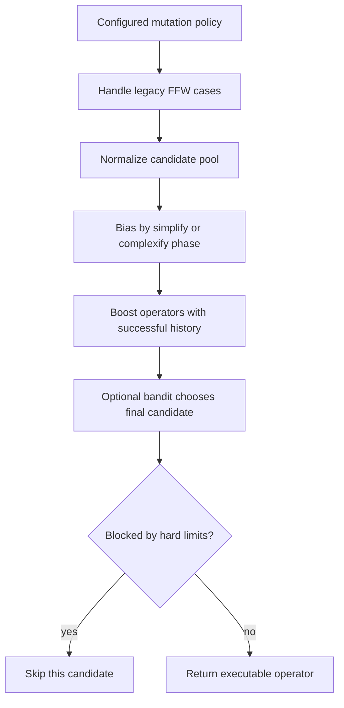

# neat/mutation/select

Mutation-method selection helpers.

This chapter owns policy resolution for mutation operator choice: normalize
legacy pools, bias the pool for simplify/complexify phases, boost successful
operators, and optionally hand final choice to the operator bandit.

The selection boundary answers a controller question that is easy to phrase
but subtle to implement: given the current genome, controller mode, and
mutation policy history, which operator should the flow execute right now?

That decision is intentionally staged rather than monolithic:

1. recognize legacy policy shapes such as FFW presets,
2. normalize the configured operator pool into one flat candidate list,
3. bias that pool for the current complexity phase,
4. optionally boost operators that have recently produced structure,
5. optionally let a bandit choose among the candidate operators,
6. block operators that violate hard structural or recurrent-policy limits.

Splitting the logic this way gives the mutation root a clean public story:
`flow/` executes one operator at a time, while `select/` explains why that
operator was even eligible in the first place.

Read this chapter from top to bottom when debugging operator choice. The
early helpers explain pool shape and legacy compatibility. The middle helpers
explain policy bias. The final helpers explain the hard stop conditions that
keep illegal operators from reaching execution.



## neat/mutation/select/mutation.select.ts

### resolveFFWPolicyForSelect

```ts
resolveFFWPolicyForSelect(
  internal: NeatControllerForMutation,
  methods: { mutation: unknown; },
  rawReturnForTest: boolean,
): MutationMethod | MutationMethod[] | null
```

Resolve legacy FFW policy behavior, including test-specific returns.

Older feed-forward configuration paths can encode mutation policy in shapes
that do not look like the newer flat operator pool. This helper isolates that
compatibility layer so the rest of selection can operate on a predictable
surface.

The `rawReturnForTest` flag exists because some tests assert the preserved
legacy pool shape rather than one sampled method. Production mutation flow,
by contrast, normally wants one concrete operator.

Parameters:
- `internal` - - neat controller context
- `methods` - - methods module
- `rawReturnForTest` - - whether to return raw FFW array for tests

Returns: mutation method or null when not handled

### normalizeMutationPoolForSelect

```ts
normalizeMutationPoolForSelect(
  internal: NeatControllerForMutation,
  methods: { mutation: unknown; },
  rawReturnForTest: boolean,
): MutationMethod[]
```

Normalize the configured mutation pool to a flat operator list.

This helper is the bridge from loose policy configuration to a concrete
candidate shelf. It flattens nested legacy arrays and preserves the special
FFW path when tests explicitly need the historical representation.

Parameters:
- `internal` - - neat controller context
- `methods` - - methods module
- `rawReturnForTest` - - whether to return raw FFW for tests

Returns: normalized mutation pool

### isLegacyFFWPoolForSelect

```ts
isLegacyFFWPoolForSelect(
  configuredPool: MutationMethod[],
  methods: { mutation: unknown; },
): boolean
```

Check whether a pool matches the legacy FFW operator ordering.

The selection boundary uses this check as a compatibility detector, not as a
generic equality helper. Matching the canonical FFW ordering tells the caller
that the configured pool is really a feed-forward preset that may deserve
special handling.

Parameters:
- `configuredPool` - - configured operator pool
- `methods` - - methods module

Returns: true when the pool matches FFW

### applyPhasedComplexityForSelect

```ts
applyPhasedComplexityForSelect(
  pool: MutationMethod[],
  internal: NeatControllerForMutation,
): MutationMethod[]
```

Apply phased complexity adjustments to the pool when enabled.

Phased complexity nudges operator choice without banning the rest of the
pool outright. In simplify mode the helper duplicates subtractive operators.
In complexify mode it duplicates additive operators. That duplication acts as
a soft bias rather than a hard switch, which keeps the controller from losing
all policy diversity when it changes search phase.

Parameters:
- `pool` - - base operator pool
- `internal` - - neat controller context

Returns: pool with phased complexity adjustments

### applyOperatorAdaptationForSelect

```ts
applyOperatorAdaptationForSelect(
  pool: MutationMethod[],
  internal: NeatControllerForMutation,
): MutationMethod[]
```

Apply operator adaptation weighting to the pool when enabled.

Operator adaptation uses recent structural success as a lightweight teaching
signal. Operators that have enough attempts and a sufficiently high success
ratio are duplicated into the candidate pool, increasing their sampling
probability without changing the operator interface itself.

The helper intentionally does not compute a fancy score. It just reshapes the
pool, which keeps the later selection steps simple and preserves compatibility
with random sampling and bandit-based final choice.

Parameters:
- `pool` - - base pool
- `internal` - - neat controller context

Returns: augmented pool

### sampleFromPoolForSelect

```ts
sampleFromPoolForSelect(
  pool: MutationMethod[],
  internal: NeatControllerForMutation,
): MutationMethod | null
```

Sample a random method from the pool.

This is the uncomplicated fallback selector. It is useful both for direct
legacy sampling paths and for any configuration that wants weighted random
choice without the stronger opinion of the operator bandit.

Parameters:
- `pool` - - operator pool
- `internal` - - neat controller context

Returns: sampled method or null

### isOperatorNamePrefixedForSelect

```ts
isOperatorNamePrefixedForSelect(
  method: MutationMethod,
  prefix: string,
): boolean
```

Check whether an operator name uses a specific prefix.

Prefix checks let the selection layer describe families of operators without
hard-coding every method in multiple places. That keeps phased complexity
logic concise while still making the intent readable in the generated docs.

Parameters:
- `method` - - mutation operator
- `prefix` - - name prefix to match

Returns: true when the operator name matches the prefix

### isBlockedByStructuralLimitsForSelect

```ts
isBlockedByStructuralLimitsForSelect(
  mutationMethod: MutationMethod,
  genome: GenomeWithMetadata,
  internal: NeatControllerForMutation,
  methods: { mutation: unknown; },
): boolean
```

Check whether a mutation is blocked by structural limits.

This helper is one of the hard guard rails after softer policy shaping has
already happened. Even if an operator is favored by phase bias or adaptation,
it must still respect controller-wide caps such as maximum nodes,
connections, or gates.

Parameters:
- `mutationMethod` - - mutation operator to check
- `genome` - - genome to inspect
- `internal` - - neat controller context
- `methods` - - methods module

Returns: true when the mutation should be blocked

### applyOperatorBanditForSelect

```ts
applyOperatorBanditForSelect(
  pool: MutationMethod[],
  fallbackMethod: MutationMethod,
  internal: NeatControllerForMutation,
): MutationMethod
```

Apply operator bandit selection if enabled.

The operator bandit is the strongest opinionated selector in this chapter.
Instead of drawing randomly from the shaped pool, it ranks candidate
operators with a UCB-style score that balances observed success and
exploration.

Early in a run, under-sampled operators receive effectively unbounded
exploration pressure. Later, the choice shifts toward operators with better
observed structural payoff. That makes this helper the bridge between simple
mutation policy configuration and online operator learning.

Parameters:
- `pool` - - operator pool
- `fallbackMethod` - - method used when bandit is disabled
- `internal` - - neat controller context

Returns: selected method

### isBlockedByRecurrentPolicyForSelect

```ts
isBlockedByRecurrentPolicyForSelect(
  mutationMethod: MutationMethod,
  internal: NeatControllerForMutation,
  methods: { mutation: unknown; },
): boolean
```

Check whether a mutation is blocked by recurrent connection policy.

Structural capacity limits are not the only hard guard. Some runs prohibit
recurrent structure entirely, and this helper keeps that policy localized so
the rest of the selection code can stay focused on scoring and weighting.

Parameters:
- `mutationMethod` - - mutation operator to check
- `internal` - - neat controller context
- `methods` - - methods module

Returns: true when the mutation should be blocked
