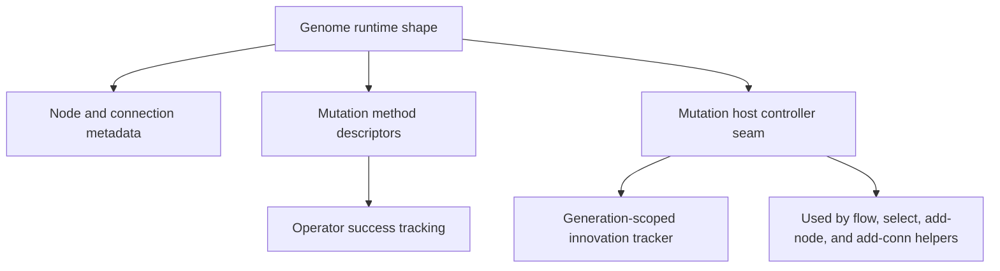

# neat/mutation/shared

Shared contracts for the NEAT mutation chapter.

These types keep the mutation subtree decoupled from the full controller and
network implementations while the direct-path split continues. Every chapter
under `mutation/` depends on this file as a leaf contract surface.

This file is the contract map for the whole mutation subtree. It explains
which parts of a genome mutation helpers are allowed to touch, which pieces
of controller state they can rely on, and which historical stores exist to
preserve structural identity across generations.

The contracts fall into four groups:

1. runtime genome shape: `GenomeWithMetadata`, `NodeWithMetadata`, and
   `ConnectionWithMetadata`,
2. operator description and adaptation state: `MutationMethod` and
   `OperatorStats`,
3. controller-owned innovation tracking: `InnovationTracker`,
4. host controller seam: `NeatControllerForMutation`.

Read this chapter before diving into the helper folders when you need to know
which state is local to a genome, which state belongs to the controller, and
which caches or innovation stores mutation helpers are allowed to mutate.

## neat/mutation/shared/mutation.types.ts

### ConnectionWithMetadata

Runtime interface for a connection within a genome.

This is the minimum edge metadata required by the structural mutation paths.
The add-node and add-conn chapters use it to preserve weights, inspect edge
activation, and attach innovation ids that later support alignment-based
crossover and speciation.

### GenomeWithMetadata

Runtime interface for a genome with mutation-related metadata.

This is the central runtime contract for the mutation subtree. It is smaller
than the full network implementation on purpose: helpers only see the node
list, connection list, a few topology flags, and the mutation-oriented hooks
they actually need to perform structural edits.

The shape makes an architectural distinction explicit. Per-genome mutable
state such as `_mutRate` and `_mutAmount` travels with the genome itself,
while global innovation tables and policy controls stay on the controller
host contract.

### MutationMethod

Runtime interface for a mutation method descriptor.

Mutation operators are represented as descriptive runtime objects rather than
as enum literals alone. That gives selection helpers room to reason about
operator families, sample-count hints, and output-mutation behavior without
having to know the concrete implementation of each operator.

### NeatControllerForMutation

Runtime interface for the NEAT controller used in mutation operations.

This host contract is the bridge between local genome edits and global NEAT
state. It exposes configuration, RNG access, innovation stores, operator
statistics, and the narrow controller callbacks that the mutation helpers need.

The important boundary is that mutation chapters can mutate controller-owned
bookkeeping through this interface, but they do not need the entire `Neat`
class surface to do their work.

### NodeWithMetadata

Runtime interface for a node within a genome.

Mutation helpers only need a narrow node view: topology category, optional
gene identity, adjacency lists, and one projection check. That narrowness is
what lets the structural chapters reason about connection growth and cycle
checks without depending on the whole node implementation.

### OperatorStats

Runtime interface for operator statistics tracking.

These counters support the adaptive side of mutation policy. They do not try
to capture full fitness impact; instead they record a cheap local proxy for
whether an attempted operator actually produced structure often enough to be
favored later by adaptation or bandit logic.
