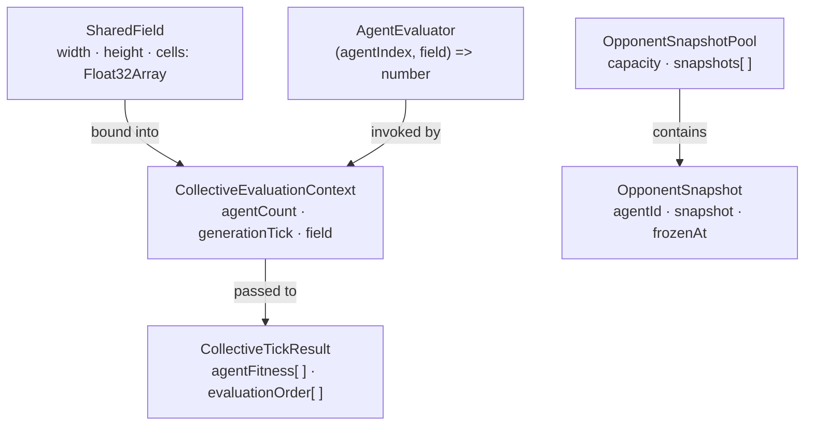
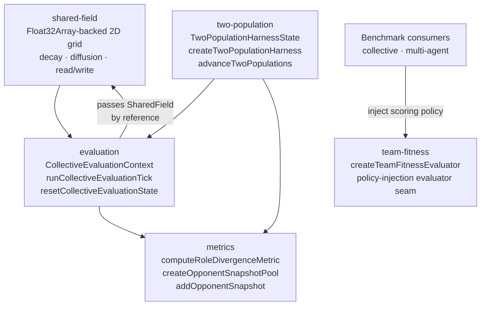

# neat/nge-collective

Shared type definitions for the NGE collective multi-agent system (Phase G).

These types are the shared vocabulary for the shared-field, evaluation, and metrics
sub-modules. Import individual sub-modules directly for their implementation functions.

## Type relationships



### Key invariants

- `SharedField.cells` is row-major: cell `(x, y)` maps to index `y × width + x`.
- `CollectiveEvaluationContext.generationTick` starts at `0` and is immutable within a tick;
  it advances only via `resetCollectiveEvaluationState`.
- `CollectiveTickResult.agentFitness` and `evaluationOrder` are parallel arrays of equal length.
- `OpponentSnapshot.snapshot` is a deep-cloned, frozen payload — post-registration mutations
  to the original object are never reflected.

## neat/nge-collective/neat.nge-collective.types.ts

### AgentEvaluator

```ts
AgentEvaluator(
  agentIndex: number,
  field: SharedField,
): number
```

Evaluator function invoked once per agent per collective tick.

Because `writeCell` mutates the shared field in-place, sequential evaluators
within the same tick can observe writes committed by prior agents.

Parameters:
- `agentIndex` - Zero-based index of the agent being evaluated.
- `field` - Live shared field; sequential evaluators see writes from prior agents.

Returns: Scalar fitness value for the evaluated agent.

### CollectiveEvaluationContext

Persistent state carried across collective evaluation ticks.
Returned by `createCollectiveEvaluationContext` and updated via `resetCollectiveEvaluationState`.

### CollectiveTickResult

Immutable result produced by one collective evaluation tick via `runCollectiveEvaluationTick`.

### OpponentSnapshot

A frozen point-in-time snapshot of an opponent agent for rolling tournament evaluation.
Payloads are deep-cloned at registration time so post-registration mutations are not reflected.

### OpponentSnapshotPool

Rolling circular buffer of opponent snapshots with a fixed capacity.
The oldest snapshot is evicted in FIFO order when the pool reaches capacity.

### SharedField

A row-major Float32Array-backed 2D pheromone/signal field shared across all agents
in one collective evaluation tick.

Cell `(x, y)` maps to flat index `y * width + x`.
All cells are initialized to `0` on creation.

Example:

```ts
const field: SharedField = createSharedField(10, 10);
```

### TeamFitnessPolicy

```ts
TeamFitnessPolicy(
  group: TeamResultGroup<TTeamId, TMemberResult>,
): number
```

Aggregation policy injected into the reusable team-level evaluator seam.

NGE core owns only the orchestration boundary. Consumers such as collective or
multi-agent benchmarks own the scoring policy and can swap it without rewriting
the evaluator pipeline itself.

Parameters:
- `group` - Team-local member results to aggregate.

Returns: Scalar team-level fitness score.

### TeamFitnessResult

Reusable team-level fitness result returned by the collective evaluator seam.

### TeamResultGroup

Generic member-result group scored by a reusable team-level fitness policy.

The collective core keeps this shape intentionally policy-first: benchmark
consumers own the meaning of each member result, while NGE core owns the
orchestration that applies one aggregation policy per team group.

## neat/nge-collective/neat.nge-collective.ts

NGE Collective Intelligence boundary — Phase G public surface.

This module is the entry point for the collective-evaluation primitives that
let multiple agents share a stigmergy field, collect per-tick results, track
divergence metrics, and stand up the smallest honest two-team harness. It
re-exports four cooperating sub-modules as one cohesive boundary so consumers
only need a single import path.
*Design contract:** classic NEAT behavior is entirely unaffected when this
module is not imported. No global state is mutated at import time.

## Architecture



## Sub-modules

### shared-field
A `Float32Array`-backed 2D grid (`SharedField`) shared across all agents during one
evaluation tick. Agents write signals with `writeCell` and read them with `readCell`.
Because the backing array is passed by reference, sequential evaluators within the same
tick observe each other's writes — exactly the stigmergy contract required by collective
benchmarks. Between ticks, `applyDecay` and `applyDiffusion` evolve field
dynamics; `clearField` resets it for the next generation.

### evaluation
`createCollectiveEvaluationContext` initialises a generation counter and binds the shared
field. `runCollectiveEvaluationTick` invokes each `AgentEvaluator` in declared order and
returns per-agent fitness plus the evaluation order. `resetCollectiveEvaluationState`
advances the generation tick and zeros the field, ready for the next generation.

### metrics
`computeRoleDivergenceMetric` measures structural divergence between two agents using the
L1 (Manhattan) distance over their module-size distributions — a zero score means identical
compositions. `createOpponentSnapshotPool` and `addOpponentSnapshot` maintain a rolling
fixed-capacity buffer of deep-cloned opponent payloads for tournament evaluation; the oldest
snapshot is evicted FIFO when the pool reaches capacity.

### team-fitness
`createTeamFitnessEvaluator` keeps team/group aggregation reusable and policy-bound. NGE core
owns the orchestration that maps generic team groups into reusable team-fitness results, while
each benchmark injects its own aggregation rule such as "best finisher wins" or a richer
support-weighted collective score.

### two-population
`createTwoPopulationHarness` builds the smallest honest 2v2 scaffold: two isolated team
controllers, one shared four-row radio field, and one evaluation context that can partition
the race pack back into team-local slices. `runTwoTeamEvaluationTick` keeps the public seam
honest by returning those slices without inventing later-stage game theory, while
`advanceTwoPopulations` cross-registers frozen rival snapshots so each team evolves against a
rolling history of opponent champions rather than only the opponent's latest mutable state.

## Determinism contract
Same agent count + same evaluator array + same initial field ⇒ identical
`CollectiveTickResult` for every call. `applyDecay` and `applyDiffusion` are both
deterministic pure functions that produce new `SharedField` instances without mutating
the source.

Example:

```ts
import {
  createSharedField,
  writeCell,
  readCell,
  applyDecay,
  createCollectiveEvaluationContext,
  runCollectiveEvaluationTick,
  resetCollectiveEvaluationState,
  computeRoleDivergenceMetric,
  createOpponentSnapshotPool,
  addOpponentSnapshot,
  createTeamFitnessEvaluator,
  createTwoPopulationHarness,
  advanceTwoPopulations,
} from './neat.nge-collective';

// 1. Create a 10×10 pheromone field shared across 3 agents.
const field = createSharedField(10, 10);
const context = createCollectiveEvaluationContext(3, field);

// 2. Run one evaluation tick — agent 0 writes a signal; agent 1 reads it.
const result = runCollectiveEvaluationTick(context, [
  (_idx, f) => { writeCell(f, 0, 0, 1.0); return 10; },
  (_idx, f) => readCell(f, 0, 0) * 5,   // sees agent 0's write
  () => 0,
]);
// result.agentFitness === [10, 5, 0]

// 3. Advance to the next generation with decay applied.
const decayed = applyDecay(context.field, 0.95);
const nextContext = resetCollectiveEvaluationState({ ...context, field: decayed });

// 4. Measure role divergence between two agents' module distributions.
const divergence = computeRoleDivergenceMetric([10, 5, 0], [0, 5, 10]); // 20

// 5. Maintain a rolling opponent pool for tournament selection.
let pool = createOpponentSnapshotPool(5);
pool = addOpponentSnapshot(pool, 'agent:alpha', { fitness: 42 }, nextContext.generationTick);

// 6. Stand up the smallest honest 2v2 harness.
const harness = createTwoPopulationHarness({}, {});
advanceTwoPopulations(harness, [{ genomeId: 'a0', fitness: 5 }], [{ genomeId: 'b0', fitness: 4 }]);

// 7. Aggregate team fitness through the shared policy-injection evaluator seam.
//    Benchmark consumers supply their own policies; NGE core owns the fold structure.
const evaluateTeamFitness = createTeamFitnessEvaluator<'team-a', { score: number }>(
  (group) => group.memberResults.reduce((total, member) => total + member.score, 0),
);
const teamResults = evaluateTeamFitness([
  { teamId: 'team-a', memberResults: [{ score: 4 }, { score: 6 }] },
]);
// teamResults[0]?.teamFitness === 10
```

### addOpponentSnapshot

```ts
addOpponentSnapshot(
  pool: OpponentSnapshotPool,
  agentId: string,
  payload: Record<string, unknown>,
  frozenAt: number,
): OpponentSnapshotPool
```

Adds a new snapshot to the opponent pool, evicting the oldest if the pool is at capacity.

The payload is deep-cloned via `safeStructuredClone` at registration time so that
post-registration mutations to the original object are **not** reflected in the stored snapshot.

Returns a **new** `OpponentSnapshotPool`; the original pool is **not** mutated.

Parameters:
- `pool` - Current snapshot pool.
- `agentId` - Stable identifier for the agent being snapshotted.
- `payload` - Arbitrary agent state to freeze at registration time.
- `frozenAt` - Generation tick at which this snapshot is registered.

Returns: A new pool containing the added snapshot, rotated if the pool was at capacity.

Example:

```ts
const updated = addOpponentSnapshot(pool, 'agent:alpha', { fitness: 42 }, 3);
// updated.snapshots[0].agentId === 'agent:alpha'
// updated.snapshots[0].frozenAt === 3
```

### advanceTwoPopulations

```ts
advanceTwoPopulations(
  harness: TwoPopulationHarnessState,
  resultsA: readonly unknown[],
  resultsB: readonly unknown[],
): void
```

Advances both team controllers only after the shared generation barrier completes.

The barrier is **shared**: a generation increment for either team — and any
mutation of either team's `opponentSnapshotPool` — is suppressed until **both**
teams have produced results for the completed shared episode. An empty result
slice on either side means "the shared evaluation has not finished," not
"advance with zero fitness." This invariant keeps the rolling rival archive
aligned to the same generation tick on both sides, which is the smallest
honest contract needed for coevolution-style role specialization.

Once the barrier is complete (both slices non-empty), each team's controller
advances by one generation, and each team's `opponentSnapshotPool` receives
one frozen deep-cloned snapshot of the opposing side's results. Snapshots are
produced through `addOpponentSnapshot`, which preserves the bounded FIFO
invariant and the deep-clone immutability contract.

Transport-neutral by design: this function does not depend on packed
`episode-step` frames, transfer lists, or worker topology. Those details are
deferred to Phase 4 transport normalization.

Parameters:
- `harness` - Active two-population harness.
- `resultsA` - Team A evaluation results for the completed episode.
- `resultsB` - Team B evaluation results for the completed episode.

Example:

```ts
const harness = createTwoPopulationHarness({}, {});

// Partial advance: Team A alone has results — barrier is NOT complete,
// so neither generation nor either snapshot pool is mutated.
advanceTwoPopulations(harness, [{ genomeId: 'team-a-0', fitness: 12 }], []);
harness.teamA.controller.generation; // 0
harness.teamB.opponentSnapshotPool.snapshots.length; // 0

// Barrier complete: both sides advanced and cross-registered.
advanceTwoPopulations(
  harness,
  [{ genomeId: 'team-a-0', fitness: 12 }],
  [{ genomeId: 'team-b-0', fitness: 11 }],
);
harness.teamA.controller.generation; // 1
harness.teamB.controller.generation; // 1
harness.teamA.opponentSnapshotPool.snapshots.length; // 1
harness.teamB.opponentSnapshotPool.snapshots.length; // 1
```

### AgentEvaluator

```ts
AgentEvaluator(
  agentIndex: number,
  field: SharedField,
): number
```

Evaluator function invoked once per agent per collective tick.

Because `writeCell` mutates the shared field in-place, sequential evaluators
within the same tick can observe writes committed by prior agents.

Parameters:
- `agentIndex` - Zero-based index of the agent being evaluated.
- `field` - Live shared field; sequential evaluators see writes from prior agents.

Returns: Scalar fitness value for the evaluated agent.

### applyDecay

```ts
applyDecay(
  field: SharedField,
  factor: number,
): SharedField
```

Applies exponential pheromone decay to every cell in the field.
Returns a **new** `SharedField`; the original is **not** mutated.

Each cell's new value is: `oldValue × factor`.

Parameters:
- `field` - Source field to decay.
- `factor` - Decay multiplier in `[0, 1]`. A value of `0.95` retains 95% per tick.

Returns: A new `SharedField` with decayed cell values.

Example:

```ts
const decayed = applyDecay(field, 0.95); // all cells × 0.95
```

### applyDiffusion

```ts
applyDiffusion(
  field: SharedField,
  rate: number,
): SharedField
```

Applies one lateral diffusion step to the shared field.
Returns a **new** `SharedField`; the original is **not** mutated.

Each cell donates `rate × cellValue / neighborCount` to each of its 4-connected
grid neighbors and retains `cellValue × (1 − rate)`. Deterministic: identical
inputs always produce byte-identical outputs.

Parameters:
- `field` - Source field to diffuse.
- `rate` - Diffusion rate in `[0, 1]`. A value of `0.5` spreads half the cell's value.

Returns: A new `SharedField` with diffused cell values.

Example:

```ts
const diffused = applyDiffusion(field, 0.1); // 10% of each cell spreads to neighbors
```

### clearField

```ts
clearField(
  field: SharedField,
): SharedField
```

Zeros every cell in the field and returns a **new** `SharedField`.
The original field is **not** mutated.

Parameters:
- `field` - Source field to clear.

Returns: A new `SharedField` with all cells set to `0`.

Example:

```ts
const clean = clearField(field); // all cells === 0
```

### CollectiveEvaluationContext

Persistent state carried across collective evaluation ticks.
Returned by `createCollectiveEvaluationContext` and updated via `resetCollectiveEvaluationState`.

### CollectiveTickResult

Immutable result produced by one collective evaluation tick via `runCollectiveEvaluationTick`.

### computeRoleDivergenceMetric

```ts
computeRoleDivergenceMetric(
  distributionA: number[],
  distributionB: number[],
): number
```

Computes a role-divergence metric between two module-size distributions using
the L1 (Manhattan) distance — the sum of absolute per-slot differences.

A value of `0` indicates identical distributions. Larger values indicate greater
structural divergence between the two agents' module compositions.

Parameters:
- `distributionA` - Ordered module-size counts for agent A.
- `distributionB` - Ordered module-size counts for agent B.

Returns: Non-negative divergence score (`0` when distributions are equal).

Example:

```ts
computeRoleDivergenceMetric([10, 5], [10, 5]); // 0
computeRoleDivergenceMetric([20, 0], [0, 20]); // 40
```

### createCollectiveEvaluationContext

```ts
createCollectiveEvaluationContext(
  agentCount: number,
  field: SharedField,
): CollectiveEvaluationContext
```

Creates a new collective evaluation context with an initial generation tick of zero.

Parameters:
- `agentCount` - Number of agents participating in collective evaluation.
- `field` - Shared field visible to all agent evaluators within the current tick.

Returns: A new `CollectiveEvaluationContext` ready for the first evaluation tick.

Example:

```ts
const field = createSharedField(10, 10);
const context = createCollectiveEvaluationContext(4, field);
// context.agentCount === 4, context.generationTick === 0
```

### createOpponentSnapshotPool

```ts
createOpponentSnapshotPool(
  capacity: number,
): OpponentSnapshotPool
```

Creates an empty opponent snapshot pool with the given capacity.

The pool is a rolling circular buffer: when at capacity, the oldest snapshot is
evicted in FIFO order to make room for each new addition.

Parameters:
- `capacity` - Maximum number of snapshots retained at any time.

Returns: A new `OpponentSnapshotPool` with an empty snapshot list.

Example:

```ts
const pool = createOpponentSnapshotPool(5);
// pool.capacity === 5, pool.snapshots.length === 0
```

### createSharedField

```ts
createSharedField(
  width: number,
  height: number,
): SharedField
```

Creates a new zeroed shared field with the given dimensions.

The backing store is a `Float32Array` of `width × height` elements, all initialized to `0`.
Cell `(x, y)` maps to flat index `y * width + x` (row-major order).

Parameters:
- `width` - Number of columns in the 2D grid.
- `height` - Number of rows in the 2D grid.

Returns: A new `SharedField` with all cells initialized to `0`.

Example:

```ts
const field = createSharedField(10, 10); // 100-element Float32Array
```

### createTeamFitnessEvaluator

```ts
createTeamFitnessEvaluator(
  policy: TeamFitnessPolicy<TTeamId, TMemberResult>,
): (groups: readonly TeamResultGroup<TTeamId, TMemberResult>[]) => readonly TeamFitnessResult<TTeamId, TMemberResult>[]
```

Build a reusable team-level fitness evaluator for collective benchmarks.

The returned evaluator preserves the planning seam: NGE core owns the
orchestration that maps generic team groups into reusable team-fitness
results, while each benchmark injects its own aggregation policy. That keeps
collective and multi-agent consumers on one shared evaluator contract
without leaking benchmark-local compensation into the core.

Parameters:
- `policy` - Consumer-owned aggregation rule for one team group.

Returns: Evaluator that folds each team group into one reusable team-fitness result.

Example:

```ts
const evaluateTeamFitness = createTeamFitnessEvaluator((group) =>
  group.memberResults.reduce(
    (totalScore, memberResult) => totalScore + memberResult.rawScore,
    0,
  ),
);

const result = evaluateTeamFitness([
  {
    teamId: 'team-alpha',
    memberResults: [
      { memberId: 'alpha-0', rawScore: 4 },
      { memberId: 'alpha-1', rawScore: 6 },
    ],
  },
]);

result[0]?.teamFitness; // 10
```

### createTwoPopulationHarness

```ts
createTwoPopulationHarness(
  configA: NeatOptions,
  configB: NeatOptions,
  injected: { readonly teamA?: default | undefined; readonly teamB?: default | undefined; } | undefined,
): TwoPopulationHarnessState
```

Creates the smallest honest Phase 3 two-population harness.

The returned scaffold contains two isolated team controllers plus one shared
row-major radio field sized for four agents and seven channels per agent
(`4 × 7 = 28` floats). The field layout matches the episode-pack contract
used by the consumer worker seam: Team A occupies rows `0` and `1`, and
Team B occupies rows `2` and `3`.

Aliasing is rejected when `injected.teamA` and `injected.teamB` point to the
same `Neat` instance because a two-population harness only makes sense when
each side owns independent mutation, speciation, and generation state. If
both teams shared one controller, one side could silently cross-mutate the
other.

Use `injected` for owner-local tests or deterministic fixtures that need to
provide prebuilt controllers instead of allocating fresh ones.

Parameters:
- `configA` - Team A controller configuration.
- `configB` - Team B controller configuration.
- `injected` - Optional prebuilt team controllers for owner-local testing.

Returns: Fully initialized two-population harness state.

Example:

```ts
const harness = createTwoPopulationHarness({}, {});

harness.sharedEvaluationContext.agentCount; // 4
harness.radioChannelCount; // 7
harness.fieldSize; // 28
```

### OpponentSnapshot

A frozen point-in-time snapshot of an opponent agent for rolling tournament evaluation.
Payloads are deep-cloned at registration time so post-registration mutations are not reflected.

### OpponentSnapshotPool

Rolling circular buffer of opponent snapshots with a fixed capacity.
The oldest snapshot is evicted in FIFO order when the pool reaches capacity.

### readCell

```ts
readCell(
  field: SharedField,
  x: number,
  y: number,
): number
```

Reads the value stored at cell `(x, y)` in the shared field.

Parameters:
- `field` - The shared field to read from.
- `x` - Column index (0-based).
- `y` - Row index (0-based).

Returns: The stored cell value, or `0` if the index is out of bounds.

Example:

```ts
const value = readCell(field, 1, 1); // 0.75
```

### resetCollectiveEvaluationState

```ts
resetCollectiveEvaluationState(
  context: CollectiveEvaluationContext,
): CollectiveEvaluationContext
```

Resets the collective evaluation state after a completed generation.

Returns a **new** `CollectiveEvaluationContext` with the generation tick incremented by one
and the shared field zeroed via `clearField`. The original context is **not** mutated.

Parameters:
- `context` - Context from the generation that just completed.

Returns: A new context ready for the next generation's evaluation tick.

Example:

```ts
const nextContext = resetCollectiveEvaluationState(context);
// nextContext.generationTick === context.generationTick + 1
// all cells in nextContext.field === 0
```

### runCollectiveEvaluationTick

```ts
runCollectiveEvaluationTick(
  context: CollectiveEvaluationContext,
  evaluators: AgentEvaluator[],
): CollectiveTickResult
```

Runs one sequential collective evaluation tick.

Evaluators are called in declared order `[0, 1, ..., N-1]`. Because the shared field is
passed by reference and `writeCell` mutates in-place, each evaluator observes writes
committed by all earlier evaluators within the same tick.

Parameters:
- `context` - Current collective evaluation context carrying field and agent count.
- `evaluators` - Ordered array of evaluator functions, one per agent.

Returns: Tick result containing per-agent fitness values and the evaluation order.

Example:

```ts
const result = runCollectiveEvaluationTick(context, [
  (_idx, field) => { writeCell(field, 0, 0, 1.0); return 10; },
  (_idx, field) => readCell(field, 0, 0) * 5,
]);
// result.agentFitness === [10, 5]
```

### runTwoTeamEvaluationTick

```ts
runTwoTeamEvaluationTick(
  harness: TwoPopulationHarnessState,
  episodeState: unknown,
): { readonly teamA: readonly unknown[]; readonly teamB: readonly unknown[]; }
```

Produces the Phase 3 evaluation scaffold for one 2v2 episode tick.

This helper intentionally stays small: it partitions the shared four-agent
context into Team A and Team B slices so the surrounding consumer example can
exercise the two-population seam without pretending that full game-theory
evaluation already exists. Richer payoff shaping, opponent modeling, and
role-specialized coevolution stay Phase 4+ concerns.

Parameters:
- `harness` - Active two-population harness.
- `episodeState` - Current episode state propagated to the placeholder results.

Returns: Distinct Team A and Team B result slices aligned to the shared four-slot pack.

Example:

```ts
const harness = createTwoPopulationHarness({}, {});
const result = runTwoTeamEvaluationTick(harness, { tick: 12 });

result.teamA.length; // 2
result.teamB.length; // 2
```

### SharedField

A row-major Float32Array-backed 2D pheromone/signal field shared across all agents
in one collective evaluation tick.

Cell `(x, y)` maps to flat index `y * width + x`.
All cells are initialized to `0` on creation.

Example:

```ts
const field: SharedField = createSharedField(10, 10);
```

### TeamFitnessPolicy

```ts
TeamFitnessPolicy(
  group: TeamResultGroup<TTeamId, TMemberResult>,
): number
```

Aggregation policy injected into the reusable team-level evaluator seam.

NGE core owns only the orchestration boundary. Consumers such as collective or
multi-agent benchmarks own the scoring policy and can swap it without rewriting
the evaluator pipeline itself.

Parameters:
- `group` - Team-local member results to aggregate.

Returns: Scalar team-level fitness score.

### TeamFitnessResult

Reusable team-level fitness result returned by the collective evaluator seam.

### TeamResultGroup

Generic member-result group scored by a reusable team-level fitness policy.

The collective core keeps this shape intentionally policy-first: benchmark
consumers own the meaning of each member result, while NGE core owns the
orchestration that applies one aggregation policy per team group.

### TeamScopedState

Runtime state owned by one team inside the two-population harness.

A team-scoped state is intentionally narrow: one `Neat` controller owns that
side's population, innovation tracker, and species bookkeeping, while the
rolling `opponentSnapshotPool` preserves frozen rival champions from the
other side. That split lets each team evolve independently without losing the
tournament-style pressure needed for coevolution.

Example:

```ts
const harness = createTwoPopulationHarness({}, {});
const teamAState = harness.teamA;

teamAState.controller.generation;
teamAState.opponentSnapshotPool.snapshots;
```

### TwoPopulationHarnessState

Shared scaffold for the smallest honest 2v2 episode-pack harness.

The harness keeps two isolated `TeamScopedState` objects plus one shared
`CollectiveEvaluationContext`. That context binds four agent slots to a
28-float stigmergy field laid out as 4 rows × 7 channels, so the evaluation
seam can reason about the whole episode pack while each team still owns its
own evolutionary controller.

### writeCell

```ts
writeCell(
  field: SharedField,
  x: number,
  y: number,
  value: number,
): SharedField
```

Writes a value to the cell at `(x, y)` in the shared field.

Mutates the backing `Float32Array` **in-place** so that sequential evaluators
within the same collective tick observe each other's writes via the shared reference.
Returns the same `field` reference for fluent chaining.

Parameters:
- `field` - The shared field to write into.
- `x` - Column index (0-based).
- `y` - Row index (0-based).
- `value` - Value to store at the target cell.

Returns: The same `field` reference (mutation is in-place).

Example:

```ts
const field = createSharedField(3, 3);
writeCell(field, 1, 1, 0.75); // field.cells[4] === 0.75
```

## neat/nge-collective/neat.nge-collective.errors.ts

Error classes for the NGE collective multi-agent system (Phase G).

These errors are raised when shared-field operations receive invalid inputs or
when a collective evaluation tick cannot proceed due to an evaluator mismatch.

Both classes forward an optional `{ cause }` to the base `Error` constructor so
that callers can chain underlying exceptions for full stack attribution.

Example:

```ts
import { NgeCollective_FieldDimensionError, NgeCollective_EvaluationError } from './neat.nge-collective.errors';

// Raised when width or height is non-positive or non-integer.
throw new NgeCollective_FieldDimensionError('width must be a positive integer');

// Raised when evaluator array length does not match registered agent count.
throw new NgeCollective_EvaluationError('no evaluator registered for agent 2');
```

### NgeCollective_EvaluationError

Error raised when a collective evaluation tick cannot proceed due to a
mismatched evaluator count or a missing evaluator for a registered agent.

Example:

```ts
throw new NgeCollective_EvaluationError('no evaluator registered for agent 2');
```

### NgeCollective_FieldDimensionError

Error raised when a shared-field operation receives invalid grid dimensions.

Example:

```ts
throw new NgeCollective_FieldDimensionError('width must be a positive integer');
```

## neat/nge-collective/neat.nge-collective.metrics.ts

### addOpponentSnapshot

```ts
addOpponentSnapshot(
  pool: OpponentSnapshotPool,
  agentId: string,
  payload: Record<string, unknown>,
  frozenAt: number,
): OpponentSnapshotPool
```

Adds a new snapshot to the opponent pool, evicting the oldest if the pool is at capacity.

The payload is deep-cloned via `safeStructuredClone` at registration time so that
post-registration mutations to the original object are **not** reflected in the stored snapshot.

Returns a **new** `OpponentSnapshotPool`; the original pool is **not** mutated.

Parameters:
- `pool` - Current snapshot pool.
- `agentId` - Stable identifier for the agent being snapshotted.
- `payload` - Arbitrary agent state to freeze at registration time.
- `frozenAt` - Generation tick at which this snapshot is registered.

Returns: A new pool containing the added snapshot, rotated if the pool was at capacity.

Example:

```ts
const updated = addOpponentSnapshot(pool, 'agent:alpha', { fitness: 42 }, 3);
// updated.snapshots[0].agentId === 'agent:alpha'
// updated.snapshots[0].frozenAt === 3
```

### computeRoleDivergenceMetric

```ts
computeRoleDivergenceMetric(
  distributionA: number[],
  distributionB: number[],
): number
```

Computes a role-divergence metric between two module-size distributions using
the L1 (Manhattan) distance — the sum of absolute per-slot differences.

A value of `0` indicates identical distributions. Larger values indicate greater
structural divergence between the two agents' module compositions.

Parameters:
- `distributionA` - Ordered module-size counts for agent A.
- `distributionB` - Ordered module-size counts for agent B.

Returns: Non-negative divergence score (`0` when distributions are equal).

Example:

```ts
computeRoleDivergenceMetric([10, 5], [10, 5]); // 0
computeRoleDivergenceMetric([20, 0], [0, 20]); // 40
```

### createOpponentSnapshotPool

```ts
createOpponentSnapshotPool(
  capacity: number,
): OpponentSnapshotPool
```

Creates an empty opponent snapshot pool with the given capacity.

The pool is a rolling circular buffer: when at capacity, the oldest snapshot is
evicted in FIFO order to make room for each new addition.

Parameters:
- `capacity` - Maximum number of snapshots retained at any time.

Returns: A new `OpponentSnapshotPool` with an empty snapshot list.

Example:

```ts
const pool = createOpponentSnapshotPool(5);
// pool.capacity === 5, pool.snapshots.length === 0
```

### OpponentSnapshot

A frozen point-in-time snapshot of an opponent agent for rolling tournament evaluation.
Payloads are deep-cloned at registration time so post-registration mutations are not reflected.

### OpponentSnapshotPool

Rolling circular buffer of opponent snapshots with a fixed capacity.
The oldest snapshot is evicted in FIFO order when the pool reaches capacity.

## neat/nge-collective/neat.nge-collective.constants.ts

Named constants for the NGE collective multi-agent system (Phase G).

These defaults control pheromone field dynamics and snapshot pool sizing.
All values are opt-in; classic NEAT behavior is unaffected when the
collective runtime is not active.

Consumers may override any constant by passing explicit values to the
relevant factory or operator function. The constants exist to document
the recommended starting points, not to impose fixed behaviour.

### Tuning guidance

| Constant | Increase effect | Decrease effect |
|---|---|---|
| `NGE_COLLECTIVE_DEFAULT_DECAY_FACTOR` | Signals persist longer, agents rely on older traces | Signals fade quickly, agents must reinforce paths more often |
| `NGE_COLLECTIVE_DEFAULT_DIFFUSION_RATE` | Signals spread wider, less spatial specificity | Signals stay local, stronger spatial gradients |
| `NGE_COLLECTIVE_DEFAULT_SNAPSHOT_POOL_CAPACITY` | More diverse opponent history; higher memory cost | Recency-biased selection; lower memory cost |

### NGE_COLLECTIVE_DEFAULT_DECAY_FACTOR

Default pheromone/signal decay factor applied to all cells each simulation tick.
A value of `0.95` means cells retain 95% of their value before the next diffusion step.
Lower values make signals fade faster, encouraging agents to reinforce paths more frequently.

### NGE_COLLECTIVE_DEFAULT_DIFFUSION_RATE

Default lateral diffusion rate applied to all cells each simulation tick.
A value of `0.1` means each cell donates 10% of its value spread evenly across
its 4-connected grid neighbors per tick.

### NGE_COLLECTIVE_DEFAULT_SNAPSHOT_POOL_CAPACITY

Default opponent snapshot pool capacity.
Controls how many historical opponent snapshots are retained for rolling tournament selection.
Older snapshots are evicted in FIFO order when the pool is at capacity.

### NGE_COLLECTIVE_INITIAL_GENERATION_TICK

Initial generation tick value assigned to every new `CollectiveEvaluationContext`.
Starts at zero and increments by one each time `resetCollectiveEvaluationState` is called.

## neat/nge-collective/neat.nge-collective.evaluation.ts

### CollectiveEvaluationContext

Persistent state carried across collective evaluation ticks.
Returned by `createCollectiveEvaluationContext` and updated via `resetCollectiveEvaluationState`.

### CollectiveTickResult

Immutable result produced by one collective evaluation tick via `runCollectiveEvaluationTick`.

### createCollectiveEvaluationContext

```ts
createCollectiveEvaluationContext(
  agentCount: number,
  field: SharedField,
): CollectiveEvaluationContext
```

Creates a new collective evaluation context with an initial generation tick of zero.

Parameters:
- `agentCount` - Number of agents participating in collective evaluation.
- `field` - Shared field visible to all agent evaluators within the current tick.

Returns: A new `CollectiveEvaluationContext` ready for the first evaluation tick.

Example:

```ts
const field = createSharedField(10, 10);
const context = createCollectiveEvaluationContext(4, field);
// context.agentCount === 4, context.generationTick === 0
```

### resetCollectiveEvaluationState

```ts
resetCollectiveEvaluationState(
  context: CollectiveEvaluationContext,
): CollectiveEvaluationContext
```

Resets the collective evaluation state after a completed generation.

Returns a **new** `CollectiveEvaluationContext` with the generation tick incremented by one
and the shared field zeroed via `clearField`. The original context is **not** mutated.

Parameters:
- `context` - Context from the generation that just completed.

Returns: A new context ready for the next generation's evaluation tick.

Example:

```ts
const nextContext = resetCollectiveEvaluationState(context);
// nextContext.generationTick === context.generationTick + 1
// all cells in nextContext.field === 0
```

### runCollectiveEvaluationTick

```ts
runCollectiveEvaluationTick(
  context: CollectiveEvaluationContext,
  evaluators: AgentEvaluator[],
): CollectiveTickResult
```

Runs one sequential collective evaluation tick.

Evaluators are called in declared order `[0, 1, ..., N-1]`. Because the shared field is
passed by reference and `writeCell` mutates in-place, each evaluator observes writes
committed by all earlier evaluators within the same tick.

Parameters:
- `context` - Current collective evaluation context carrying field and agent count.
- `evaluators` - Ordered array of evaluator functions, one per agent.

Returns: Tick result containing per-agent fitness values and the evaluation order.

Example:

```ts
const result = runCollectiveEvaluationTick(context, [
  (_idx, field) => { writeCell(field, 0, 0, 1.0); return 10; },
  (_idx, field) => readCell(field, 0, 0) * 5,
]);
// result.agentFitness === [10, 5]
```

## neat/nge-collective/neat.nge-collective.shared-field.ts

### applyDecay

```ts
applyDecay(
  field: SharedField,
  factor: number,
): SharedField
```

Applies exponential pheromone decay to every cell in the field.
Returns a **new** `SharedField`; the original is **not** mutated.

Each cell's new value is: `oldValue × factor`.

Parameters:
- `field` - Source field to decay.
- `factor` - Decay multiplier in `[0, 1]`. A value of `0.95` retains 95% per tick.

Returns: A new `SharedField` with decayed cell values.

Example:

```ts
const decayed = applyDecay(field, 0.95); // all cells × 0.95
```

### applyDiffusion

```ts
applyDiffusion(
  field: SharedField,
  rate: number,
): SharedField
```

Applies one lateral diffusion step to the shared field.
Returns a **new** `SharedField`; the original is **not** mutated.

Each cell donates `rate × cellValue / neighborCount` to each of its 4-connected
grid neighbors and retains `cellValue × (1 − rate)`. Deterministic: identical
inputs always produce byte-identical outputs.

Parameters:
- `field` - Source field to diffuse.
- `rate` - Diffusion rate in `[0, 1]`. A value of `0.5` spreads half the cell's value.

Returns: A new `SharedField` with diffused cell values.

Example:

```ts
const diffused = applyDiffusion(field, 0.1); // 10% of each cell spreads to neighbors
```

### clearField

```ts
clearField(
  field: SharedField,
): SharedField
```

Zeros every cell in the field and returns a **new** `SharedField`.
The original field is **not** mutated.

Parameters:
- `field` - Source field to clear.

Returns: A new `SharedField` with all cells set to `0`.

Example:

```ts
const clean = clearField(field); // all cells === 0
```

### collectNeighborCoordinates

```ts
collectNeighborCoordinates(
  col: number,
  row: number,
  width: number,
  height: number,
): [number, number][]
```

Collects the 4-connected neighbor coordinates for a given grid cell,
filtering out coordinates that fall outside the grid boundaries.

Parameters:
- `col` - Column index of the source cell.
- `row` - Row index of the source cell.
- `width` - Grid width used as the column boundary.
- `height` - Grid height used as the row boundary.

Returns: Array of valid `[col, row]` neighbor coordinate pairs.

### createSharedField

```ts
createSharedField(
  width: number,
  height: number,
): SharedField
```

Creates a new zeroed shared field with the given dimensions.

The backing store is a `Float32Array` of `width × height` elements, all initialized to `0`.
Cell `(x, y)` maps to flat index `y * width + x` (row-major order).

Parameters:
- `width` - Number of columns in the 2D grid.
- `height` - Number of rows in the 2D grid.

Returns: A new `SharedField` with all cells initialized to `0`.

Example:

```ts
const field = createSharedField(10, 10); // 100-element Float32Array
```

### readCell

```ts
readCell(
  field: SharedField,
  x: number,
  y: number,
): number
```

Reads the value stored at cell `(x, y)` in the shared field.

Parameters:
- `field` - The shared field to read from.
- `x` - Column index (0-based).
- `y` - Row index (0-based).

Returns: The stored cell value, or `0` if the index is out of bounds.

Example:

```ts
const value = readCell(field, 1, 1); // 0.75
```

### SharedField

A row-major Float32Array-backed 2D pheromone/signal field shared across all agents
in one collective evaluation tick.

Cell `(x, y)` maps to flat index `y * width + x`.
All cells are initialized to `0` on creation.

Example:

```ts
const field: SharedField = createSharedField(10, 10);
```

### writeCell

```ts
writeCell(
  field: SharedField,
  x: number,
  y: number,
  value: number,
): SharedField
```

Writes a value to the cell at `(x, y)` in the shared field.

Mutates the backing `Float32Array` **in-place** so that sequential evaluators
within the same collective tick observe each other's writes via the shared reference.
Returns the same `field` reference for fluent chaining.

Parameters:
- `field` - The shared field to write into.
- `x` - Column index (0-based).
- `y` - Row index (0-based).
- `value` - Value to store at the target cell.

Returns: The same `field` reference (mutation is in-place).

Example:

```ts
const field = createSharedField(3, 3);
writeCell(field, 1, 1, 0.75); // field.cells[4] === 0.75
```

## neat/nge-collective/neat.nge-collective.team-fitness.ts

### buildTeamFitnessResult

```ts
buildTeamFitnessResult(
  group: TeamResultGroup<TTeamId, TMemberResult>,
  policy: TeamFitnessPolicy<TTeamId, TMemberResult>,
): TeamFitnessResult<TTeamId, TMemberResult>
```

Create one immutable team-fitness result from one generic team group.

Parameters:
- `group` - Team-local member results.
- `policy` - Consumer-owned aggregation rule for this group.

Returns: Reusable team-fitness result preserving the original member slice.

### createTeamFitnessEvaluator

```ts
createTeamFitnessEvaluator(
  policy: TeamFitnessPolicy<TTeamId, TMemberResult>,
): (groups: readonly TeamResultGroup<TTeamId, TMemberResult>[]) => readonly TeamFitnessResult<TTeamId, TMemberResult>[]
```

Build a reusable team-level fitness evaluator for collective benchmarks.

The returned evaluator preserves the planning seam: NGE core owns the
orchestration that maps generic team groups into reusable team-fitness
results, while each benchmark injects its own aggregation policy. That keeps
collective and multi-agent consumers on one shared evaluator contract
without leaking benchmark-local compensation into the core.

Parameters:
- `policy` - Consumer-owned aggregation rule for one team group.

Returns: Evaluator that folds each team group into one reusable team-fitness result.

Example:

```ts
const evaluateTeamFitness = createTeamFitnessEvaluator((group) =>
  group.memberResults.reduce(
    (totalScore, memberResult) => totalScore + memberResult.rawScore,
    0,
  ),
);

const result = evaluateTeamFitness([
  {
    teamId: 'team-alpha',
    memberResults: [
      { memberId: 'alpha-0', rawScore: 4 },
      { memberId: 'alpha-1', rawScore: 6 },
    ],
  },
]);

result[0]?.teamFitness; // 10
```

## neat/nge-collective/neat.nge-collective.two-population.ts

### advanceTwoPopulations

```ts
advanceTwoPopulations(
  harness: TwoPopulationHarnessState,
  resultsA: readonly unknown[],
  resultsB: readonly unknown[],
): void
```

Advances both team controllers only after the shared generation barrier completes.

The barrier is **shared**: a generation increment for either team — and any
mutation of either team's `opponentSnapshotPool` — is suppressed until **both**
teams have produced results for the completed shared episode. An empty result
slice on either side means "the shared evaluation has not finished," not
"advance with zero fitness." This invariant keeps the rolling rival archive
aligned to the same generation tick on both sides, which is the smallest
honest contract needed for coevolution-style role specialization.

Once the barrier is complete (both slices non-empty), each team's controller
advances by one generation, and each team's `opponentSnapshotPool` receives
one frozen deep-cloned snapshot of the opposing side's results. Snapshots are
produced through `addOpponentSnapshot`, which preserves the bounded FIFO
invariant and the deep-clone immutability contract.

Transport-neutral by design: this function does not depend on packed
`episode-step` frames, transfer lists, or worker topology. Those details are
deferred to Phase 4 transport normalization.

Parameters:
- `harness` - Active two-population harness.
- `resultsA` - Team A evaluation results for the completed episode.
- `resultsB` - Team B evaluation results for the completed episode.

Example:

```ts
const harness = createTwoPopulationHarness({}, {});

// Partial advance: Team A alone has results — barrier is NOT complete,
// so neither generation nor either snapshot pool is mutated.
advanceTwoPopulations(harness, [{ genomeId: 'team-a-0', fitness: 12 }], []);
harness.teamA.controller.generation; // 0
harness.teamB.opponentSnapshotPool.snapshots.length; // 0

// Barrier complete: both sides advanced and cross-registered.
advanceTwoPopulations(
  harness,
  [{ genomeId: 'team-a-0', fitness: 12 }],
  [{ genomeId: 'team-b-0', fitness: 11 }],
);
harness.teamA.controller.generation; // 1
harness.teamB.controller.generation; // 1
harness.teamA.opponentSnapshotPool.snapshots.length; // 1
harness.teamB.opponentSnapshotPool.snapshots.length; // 1
```

### createTwoPopulationHarness

```ts
createTwoPopulationHarness(
  configA: NeatOptions,
  configB: NeatOptions,
  injected: { readonly teamA?: default | undefined; readonly teamB?: default | undefined; } | undefined,
): TwoPopulationHarnessState
```

Creates the smallest honest Phase 3 two-population harness.

The returned scaffold contains two isolated team controllers plus one shared
row-major radio field sized for four agents and seven channels per agent
(`4 × 7 = 28` floats). The field layout matches the episode-pack contract
used by the consumer worker seam: Team A occupies rows `0` and `1`, and
Team B occupies rows `2` and `3`.

Aliasing is rejected when `injected.teamA` and `injected.teamB` point to the
same `Neat` instance because a two-population harness only makes sense when
each side owns independent mutation, speciation, and generation state. If
both teams shared one controller, one side could silently cross-mutate the
other.

Use `injected` for owner-local tests or deterministic fixtures that need to
provide prebuilt controllers instead of allocating fresh ones.

Parameters:
- `configA` - Team A controller configuration.
- `configB` - Team B controller configuration.
- `injected` - Optional prebuilt team controllers for owner-local testing.

Returns: Fully initialized two-population harness state.

Example:

```ts
const harness = createTwoPopulationHarness({}, {});

harness.sharedEvaluationContext.agentCount; // 4
harness.radioChannelCount; // 7
harness.fieldSize; // 28
```

### runTwoTeamEvaluationTick

```ts
runTwoTeamEvaluationTick(
  harness: TwoPopulationHarnessState,
  episodeState: unknown,
): { readonly teamA: readonly unknown[]; readonly teamB: readonly unknown[]; }
```

Produces the Phase 3 evaluation scaffold for one 2v2 episode tick.

This helper intentionally stays small: it partitions the shared four-agent
context into Team A and Team B slices so the surrounding consumer example can
exercise the two-population seam without pretending that full game-theory
evaluation already exists. Richer payoff shaping, opponent modeling, and
role-specialized coevolution stay Phase 4+ concerns.

Parameters:
- `harness` - Active two-population harness.
- `episodeState` - Current episode state propagated to the placeholder results.

Returns: Distinct Team A and Team B result slices aligned to the shared four-slot pack.

Example:

```ts
const harness = createTwoPopulationHarness({}, {});
const result = runTwoTeamEvaluationTick(harness, { tick: 12 });

result.teamA.length; // 2
result.teamB.length; // 2
```

### TeamScopedState

Runtime state owned by one team inside the two-population harness.

A team-scoped state is intentionally narrow: one `Neat` controller owns that
side's population, innovation tracker, and species bookkeeping, while the
rolling `opponentSnapshotPool` preserves frozen rival champions from the
other side. That split lets each team evolve independently without losing the
tournament-style pressure needed for coevolution.

Example:

```ts
const harness = createTwoPopulationHarness({}, {});
const teamAState = harness.teamA;

teamAState.controller.generation;
teamAState.opponentSnapshotPool.snapshots;
```

### TwoPopulationHarnessState

Shared scaffold for the smallest honest 2v2 episode-pack harness.

The harness keeps two isolated `TeamScopedState` objects plus one shared
`CollectiveEvaluationContext`. That context binds four agent slots to a
28-float stigmergy field laid out as 4 rows × 7 channels, so the evaluation
seam can reason about the whole episode pack while each team still owns its
own evolutionary controller.
