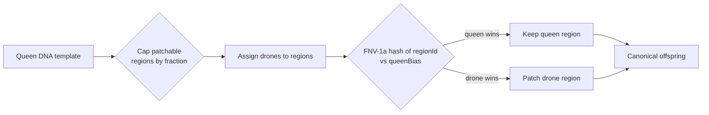

# neat/nge-evolution

Evolution operators for the NGE (Neuro-evolutionary Genesis Engine) extension.

This boundary owns the three reproduction modes — parthenogenesis, polyandric,
and sexual crossover — plus the compatibility-distance and epigenetic-prior
helpers that sit next to them. Callers typically import the stable facade
exports rather than the leaf modules.

The polyandric operator is the multi-parent recombination path: a queen DNA
template receives patch contributions from a small set of drone donors. The
{@link NGE_EVOLUTION_DEFAULT_POLYANDRIC_DRONE_CONTRIBUTION_FRACTION} caps how
many regions may be patched, and the {@link NGE_EVOLUTION_DEFAULT_POLYANDRIC_QUEEN_BIAS}
gate decides, per region, whether the queen or the drone wins the merge.
A deterministic FNV-1a hash of the region identifier converts the bias value
into a repeatable threshold, so the same queen/drone pair and policy always
produce the same offspring.



Background reading: the NEAT algorithm
([Stanley & Miikkulainen (2002)](https://nn.cs.utexas.edu/?stanley:ec02)),
polyandry in evolutionary biology
([Wikipedia — Polyandry](https://en.wikipedia.org/wiki/Polyandry)) and the
FNV-1a hash function
([Wikipedia — Fowler–Noll–Vo hash function](https://en.wikipedia.org/wiki/Fowler%E2%80%93Noll%E2%80%93Vo_hash_function)).

## neat/nge-evolution/neat.nge-evolution.ts

### applyNgeEvolutionEpigeneticPrior

```ts
applyNgeEvolutionEpigeneticPrior(
  input: NgeEvolutionEpigeneticPriorInput<ParameterVector>,
): NgeEvolutionEpigeneticPriorResult<ParameterVector>
```

Public birth-time epigenetic prior entrypoint exposed from one stable owner-local facade.

### computeNgeEvolutionCompatibilityDistance

```ts
computeNgeEvolutionCompatibilityDistance(
  comparison: NgeEvolutionCompatibilityComparisonInput,
  context: NgeEvolutionCompatibilityDistanceContext,
): NgeEvolutionCompatibilityDistanceResult
```

Public NGE evolution compatibility-distance entrypoint exposed from one stable owner-local facade.

### NGE_EVOLUTION_DEFAULT_ALPHA_COMPUTATION

Default alpha weight for the NGE computation-motif distance term used in speciation.

### NGE_EVOLUTION_DEFAULT_ALPHA_LIFECYCLE

Default alpha weight for the NGE lifecycle-policy distance term used in speciation.

### NGE_EVOLUTION_DEFAULT_ALPHA_MEMORY

Default alpha weight for the NGE memory-tier distance term used in speciation.

### NGE_EVOLUTION_DEFAULT_ALPHA_TOPOLOGY

Default alpha weight for the classic NEAT topology-distance term used in speciation.

### NGE_EVOLUTION_DEFAULT_COMPATIBILITY_DISTANCE_WEIGHTS

Default per-term alpha bag for callers that want the NGE evolution compatibility defaults.

### NGE_EVOLUTION_DEFAULT_EPIGENETIC_DECAY

Default weak-reference decay used by the optional epigenetic prior operator.

### NGE_EVOLUTION_DEFAULT_POLYANDRIC_DRONE_CONTRIBUTION_FRACTION

Default fraction of DNA regions that polyandric drone donors may patch.

A value of `0.1` means only the first 10% of the queen's patchable regions
(rounded up) are exposed to drone contributions.

### NGE_EVOLUTION_DEFAULT_POLYANDRIC_QUEEN_BIAS

Default queen-bias multiplier for polyandric region merging.

`1.0` means the queen data wins every conflict; `0.0` means the drone data
always wins; values in between act as a deterministic threshold keyed by the
FNV-1a hash of each region id. The same queen/drone pair and bias therefore
always produce the same offspring region.

See the FNV-1a reference:
[Wikipedia — Fowler–Noll–Vo hash function](https://en.wikipedia.org/wiki/Fowler%E2%80%93Noll%E2%80%93Vo_hash_function).

### ngeEvolution

Default bundle for the nge-evolution owner boundary.

Import this object when a caller wants the full runtime shelf for the NGE
evolution extension from one stable owner-local path instead of stitching
together leaf modules.

### NgeEvolution_BudgetError

Public error class thrown when one operator exceeds the configured budget.

### NgeEvolution_ModeError

Public error class thrown when one requested reproduction mode is unavailable.

### NgeEvolution_RegionError

Public error class thrown when one region-assignment request is invalid.

### NgeEvolutionCompatibilityComparisonInput

One pairwise comparison input evaluated by the NGE composite compatibility calculator.

### NgeEvolutionCompatibilityDistanceContext

Context bag controlling one NGE compatibility-distance computation and normalization scope.

### NgeEvolutionCompatibilityDistanceResult

Composite compatibility-distance result returned by the NGE speciation helper.

### NgeEvolutionCompatibilityDistanceTerm

One weighted compatibility-distance term captured during NGE speciation scoring.

### NgeEvolutionCompatibilityDistanceTermName

Fixed term names used by the NGE composite compatibility-distance calculator.

### NgeEvolutionCompatibilityDistanceTerms

Fully expanded term shelf returned by the NGE compatibility-distance calculator.

### NgeEvolutionCompatibilityDistanceWeights

Alpha weights applied to the four NGE compatibility-distance terms.

### NgeEvolutionCompatibilityGenomeInput

One genome-side input consumed by the NGE composite compatibility calculator.

The canonical DNA envelope does not yet own lifecycle cadence or wiring-preference
knobs, so the calculator accepts those traits as an owner-local sidecar.

### NgeEvolutionCompatibilityWiringCostWeights

Wiring-cost preference knobs compared by the NGE lifecycle-distance term.

### NgeEvolutionContributionKind

High-level contribution kinds used to describe parent input at the reproduction boundary.

### NgeEvolutionEpigeneticPriorInput

Input contract consumed by the optional NGE epigenetic prior operator.

### NgeEvolutionEpigeneticPriorResult

Output contract returned by the optional NGE epigenetic prior operator.

### NgeEvolutionEpigeneticReference

Two-parent weak reference captured for one birth-time epigenetic prior update.

### NgeEvolutionParentContribution

One parent contribution reported by a NGE reproduction operator.

### NgeEvolutionParentRole

Parent-role labels used when NGE operators report how one offspring was assembled.

### NgeEvolutionPolyandricAssignedRegion

Region-assignment record for one drone's patching contribution in polyandric offspring reproduction.

### NgeEvolutionPolyandricRegionAssignmentResult

Polyandric region-assignment result reported before any drone patches are applied to offspring.

### NgeEvolutionReproductionOutcome

High-level offspring outcome labels surfaced by the NGE reproduction operators.

### NgeEvolutionReproductionResult

Shared reproduction result returned by all three NGE reproduction modes.

### NgePolyandricDroneInput

One drone donor offered to the polyandric reproduction operator.

A drone carries a full DNA envelope plus optional bookkeeping: its fitness
ranking drives the `byFitness` assignment strategy, and `specializationKey`
drives the `bySpecialization` strategy. Only regions that are actually
assigned to this drone will be patched into the queen template.

Background reading on multi-parent recombination:
[Wikipedia — Crossover (genetic algorithm)](https://en.wikipedia.org/wiki/Crossover_(genetic_algorithm)).

Example:

```ts
const drone: NgePolyandricDroneInput = {
  dna: donorEnvelope,
  fitness: 0.92,
  parentId: 'donor-a',
  specializationKey: 'moduleArchetypes',
};
```

### NgePolyandricInput

Input contract for the polyandric reproduction operator.

The queen DNA is the stable template. Up to
{@link NgeReproductionPolicy.polyandricDroneCount} drone donors compete to
patch a capped subset of the queen's regions, controlled by
{@link NgeReproductionPolicy.polyandricDroneContributionFraction}. The
{@link NgeReproductionPolicy.queenBias} gate then decides, per region,
whether queen or drone data wins the merge.

Background reading on the biological metaphor:
[Wikipedia — Polyandry](https://en.wikipedia.org/wiki/Polyandry).

Example:

```ts
const input: NgePolyandricInput = {
  ngeEnabled: true,
  queen: queenEnvelope,
  queenId: 'queen-1',
  drones: [
    {
      dna: donorA,
      parentId: 'drone-a',
      fitness: 0.9,
    },
    {
      dna: donorB,
      parentId: 'drone-b',
      fitness: 0.85,
      specializationKey: 'cppnPrograms',
    },
  ],
};
```

### reproduceParthenogenesis

```ts
reproduceParthenogenesis(
  input: NgeParthenogenesisInput,
  mutateOffspring: NgeParthenogenesisMutationApplier,
): NgeEvolutionReproductionResult<NgeDnaCanonicalEnvelope, readonly number[]>
```

Public parthenogenesis reproduction operator exposed from one stable owner-local facade.

### reproducePolyandric

```ts
reproducePolyandric(
  input: NgePolyandricInput,
): NgeEvolutionReproductionResult<NgeDnaCanonicalEnvelope, readonly number[]>
```

Public polyandric reproduction operator exposed from one stable owner-local facade.

Builds a queen-template offspring patched by a capped set of drone donors.
The per-region winner is decided by a deterministic FNV-1a hash of the
region id compared against the resolved `queenBias`; values below the bias
keep the queen region, values above it patch the drone region. See the
module introduction for the full pipeline diagram.

Example:

```ts
const offspring = reproducePolyandric({
  ngeEnabled: true,
  queen: queenEnvelope,
  queenId: 'queen-1',
  drones: [{ dna: donorEnvelope, parentId: 'drone-a', fitness: 0.9 }],
});
```

### reproduceSexual

```ts
reproduceSexual(
  input: NgeSexualInput,
  randomGenerator: () => number,
): NgeEvolutionReproductionResult<NgeDnaCanonicalEnvelope, readonly number[]>
```

Public sexual reproduction operator exposed from one stable owner-local facade.

## neat/nge-evolution/neat.nge-evolution.reproduction.ts

NGE reproduction operators: parthenogenesis, polyandric, and sexual crossover.

The polyandric operator merges a queen DNA template with patch contributions
from a small set of drone donors. Region assignment is controlled by
{@link NgeReproductionPolicy.assignedRegionStrategy}.

## Input shorthand compatibility

The strategy `'non-overlapping'` is input shorthand for the deterministic
single-drone-per-region assignment that the core already implements under
`'roundRobin'`. Both values resolve to identical behavior; only the canonical
string stored in the envelope differs.

This alias preserves the input shorthand while keeping the canonical strategy
string stored in the envelope.

### applyPolyandricAssignments

```ts
applyPolyandricAssignments(
  queenEnvelope: NgeDnaCanonicalEnvelope,
  drones: readonly NgePolyandricDroneInput[],
  regionAssignment: NgeEvolutionPolyandricRegionAssignmentResult,
  queenBias: number,
): NgeDnaCanonicalEnvelope
```

Apply every assigned drone patch to the queen template in region order.

This is the fold that turns the region-assignment report into a concrete
offspring envelope. Each assigned region is passed to
{@link patchPolyandricRegion} with the same `queenBias`, so the queen/drone
winner gate is deterministic across the whole patch set.

Parameters:
- `queenEnvelope` - Queen DNA template.
- `drones` - Eligible drone donors in the order supplied by the caller.
- `regionAssignment` - Region-to-drone mapping produced by the assignment step.
- `queenBias` - Per-region winner bias in [0, 1].

Returns: The patched queen envelope ready for canonicalization.

### hashRegionIdToUnitInterval

```ts
hashRegionIdToUnitInterval(
  regionId: string,
): number
```

Deterministically map a DNA region identifier into the unit interval [0, 1).

Uses the FNV-1a 32-bit hash so the same `regionId` always yields the same
value. The result is combined with `queenBias` to decide whether the queen or
drone wins a patched region.

See the FNV-1a reference:
[Wikipedia — Fowler–Noll–Vo hash function](https://en.wikipedia.org/wiki/Fowler%E2%80%93Noll%E2%80%93Vo_hash_function).

Parameters:
- `regionId` - Stable region identifier emitted by  {@link collectPolyandricRegionIds} .

Returns: A deterministic number in [0, 1).

### mergeModuleArchetypeWithQueenPriority

```ts
mergeModuleArchetypeWithQueenPriority(
  queenRegion: NgeDnaModuleArchetype,
  droneRegion: NgeDnaModuleArchetype,
  regionId: string,
  queenBias: number,
): NgeDnaModuleArchetype
```

Merge one module-archetype region from queen and drone, respecting the queen bias.

The per-region winner is decided by comparing
{@link hashRegionIdToUnitInterval}(regionId) to the clamped `queenBias`.
When the hash is below the bias the queen wins and its fields override the
drone's; otherwise the drone wins. Both cases shallow-merge the losing region
into the winning region and combine `parameterSchema` maps so no keys are
silently dropped.

Parameters:
- `queenRegion` - Module archetype taken from the queen template.
- `droneRegion` - Module archetype taken from the assigned drone.
- `regionId` - Stable region identifier used to seed the deterministic gate.
- `queenBias` - Bias in [0, 1]; higher values make the queen more likely to win.

Returns: The merged module archetype written back into the offspring envelope.

### NgePolyandricDroneInput

One drone donor offered to the polyandric reproduction operator.

A drone carries a full DNA envelope plus optional bookkeeping: its fitness
ranking drives the `byFitness` assignment strategy, and `specializationKey`
drives the `bySpecialization` strategy. Only regions that are actually
assigned to this drone will be patched into the queen template.

Background reading on multi-parent recombination:
[Wikipedia — Crossover (genetic algorithm)](https://en.wikipedia.org/wiki/Crossover_(genetic_algorithm)).

Example:

```ts
const drone: NgePolyandricDroneInput = {
  dna: donorEnvelope,
  fitness: 0.92,
  parentId: 'donor-a',
  specializationKey: 'moduleArchetypes',
};
```

### NgePolyandricInput

Input contract for the polyandric reproduction operator.

The queen DNA is the stable template. Up to
{@link NgeReproductionPolicy.polyandricDroneCount} drone donors compete to
patch a capped subset of the queen's regions, controlled by
{@link NgeReproductionPolicy.polyandricDroneContributionFraction}. The
{@link NgeReproductionPolicy.queenBias} gate then decides, per region,
whether queen or drone data wins the merge.

Background reading on the biological metaphor:
[Wikipedia — Polyandry](https://en.wikipedia.org/wiki/Polyandry).

Example:

```ts
const input: NgePolyandricInput = {
  ngeEnabled: true,
  queen: queenEnvelope,
  queenId: 'queen-1',
  drones: [
    {
      dna: donorA,
      parentId: 'drone-a',
      fitness: 0.9,
    },
    {
      dna: donorB,
      parentId: 'drone-b',
      fitness: 0.85,
      specializationKey: 'cppnPrograms',
    },
  ],
};
```

### patchPolyandricRegion

```ts
patchPolyandricRegion(
  queenEnvelope: NgeDnaCanonicalEnvelope,
  droneEnvelope: NgeDnaCanonicalEnvelope,
  regionId: string,
  queenBias: number,
): NgeDnaCanonicalEnvelope
```

Patch one DNA region of the queen envelope with the matching drone region.

Reads the region family (`cppnPrograms`, `moduleArchetypes`, or `rulePasses`)
and index from `regionId`, then writes back the merged value. Module
archetypes use {@link mergeModuleArchetypeWithQueenPriority}, which keeps the
queen-bias gate explicit and preserves both parameter schemas. Other families
replace the losing region with the winning region under the same FNV-1a gate.
If either side is missing the region, the queen envelope is returned unchanged.

Parameters:
- `queenEnvelope` - Queen DNA template being patched.
- `droneEnvelope` - Drone DNA carrying the candidate replacement region.
- `regionId` - Stable region identifier in `family:index` form.
- `queenBias` - Bias in [0, 1] that controls how often the queen keeps the region.

Returns: A new queen envelope with the region patched, or the original envelope when the region is absent.

### reproduceParthenogenesis

```ts
reproduceParthenogenesis(
  input: NgeParthenogenesisInput,
  mutateOffspring: NgeParthenogenesisMutationApplier,
): NgeEvolutionReproductionResult<NgeDnaCanonicalEnvelope, readonly number[]>
```

Build one parthenogenetic offspring from a single NGE DNA parent.

Parameters:
- `input` - Operator context containing the source parent DNA and mode flags.
- `mutateOffspring` - Optional mutation callback applied only when the configured rate is non-zero.

Returns: Canonical offspring DNA plus parent-contribution metadata.

### reproducePolyandric

```ts
reproducePolyandric(
  input: NgePolyandricInput,
): NgeEvolutionReproductionResult<NgeDnaCanonicalEnvelope, readonly number[]>
```

Build one polyandric offspring from a queen DNA template plus optional drone donors.

Polyandric recombination is a multi-parent operator: the queen template keeps
most of its structure, while a small pool of drones patches a capped subset
of its DNA regions. The cap and drone count come from the resolved policy.
For every assigned region a deterministic FNV-1a hash of the region id is
compared against `queenBias`; when the hash is below the bias the queen wins,
otherwise the drone wins. This makes the merge deterministic and
reproducible for the same queen/drone/policy triple.

See {@link NgePolyandricInput} for the input shape and
{@link NGE_EVOLUTION_DEFAULT_POLYANDRIC_QUEEN_BIAS} for the default bias.

Background reading:
- Polyandry in evolutionary biology:
  [Wikipedia — Polyandry](https://en.wikipedia.org/wiki/Polyandry).
- Multi-parent recombination in evolutionary computing:
  [Wikipedia — Crossover (genetic algorithm)](https://en.wikipedia.org/wiki/Crossover_(genetic_algorithm)).
- The FNV-1a hash function:
  [Wikipedia — Fowler–Noll–Vo hash function](https://en.wikipedia.org/wiki/Fowler%E2%80%93Noll%E2%80%93Vo_hash_function).

Parameters:
- `input` - Operator context containing the queen DNA, drone donors, and policy overrides.

Returns: Canonical offspring DNA plus the resolved region-assignment report.

Example:

```ts
const result = reproducePolyandric({
  ngeEnabled: true,
  queen: queenEnvelope,
  queenId: 'queen-1',
  drones: [
    { dna: donorEnvelope, parentId: 'drone-a', fitness: 0.9 },
  ],
});
console.log(result.outcome); // 'queen-template-patched'
```

### reproduceSexual

```ts
reproduceSexual(
  input: NgeSexualInput,
  randomGenerator: () => number,
): NgeEvolutionReproductionResult<NgeDnaCanonicalEnvelope, readonly number[]>
```

Build one sexual offspring using NEAT-aligned fitter-parent handling for disjoint regions.

Parameters:
- `input` - Operator context containing both parent DNAs and their relative fitness scores.
- `randomGenerator` - Deterministic selector used for matching-region crossover choices.

Returns: Canonical offspring DNA plus per-parent contribution records.

## neat/nge-evolution/neat.nge-evolution.types.ts

### NgeEvolutionCompatibilityComparisonInput

One pairwise comparison input evaluated by the NGE composite compatibility calculator.

### NgeEvolutionCompatibilityDistanceContext

Context bag controlling one NGE compatibility-distance computation and normalization scope.

### NgeEvolutionCompatibilityDistanceResult

Composite compatibility-distance result returned by the NGE speciation helper.

### NgeEvolutionCompatibilityDistanceTerm

One weighted compatibility-distance term captured during NGE speciation scoring.

### NgeEvolutionCompatibilityDistanceTermName

Fixed term names used by the NGE composite compatibility-distance calculator.

### NgeEvolutionCompatibilityDistanceTerms

Fully expanded term shelf returned by the NGE compatibility-distance calculator.

### NgeEvolutionCompatibilityDistanceWeights

Alpha weights applied to the four NGE compatibility-distance terms.

### NgeEvolutionCompatibilityGenomeInput

One genome-side input consumed by the NGE composite compatibility calculator.

The canonical DNA envelope does not yet own lifecycle cadence or wiring-preference
knobs, so the calculator accepts those traits as an owner-local sidecar.

### NgeEvolutionCompatibilityWiringCostWeights

Wiring-cost preference knobs compared by the NGE lifecycle-distance term.

### NgeEvolutionContributionKind

High-level contribution kinds used to describe parent input at the reproduction boundary.

### NgeEvolutionEpigeneticPriorInput

Input contract consumed by the optional NGE epigenetic prior operator.

### NgeEvolutionEpigeneticPriorResult

Output contract returned by the optional NGE epigenetic prior operator.

### NgeEvolutionEpigeneticReference

Two-parent weak reference captured for one birth-time epigenetic prior update.

### NgeEvolutionParentContribution

One parent contribution reported by a NGE reproduction operator.

### NgeEvolutionParentRole

Parent-role labels used when NGE operators report how one offspring was assembled.

### NgeEvolutionPolyandricAssignedRegion

Region-assignment record for one drone's patching contribution in polyandric offspring reproduction.

### NgeEvolutionPolyandricRegionAssignmentResult

Polyandric region-assignment result reported before any drone patches are applied to offspring.

### NgeEvolutionReproductionOutcome

High-level offspring outcome labels surfaced by the NGE reproduction operators.

### NgeEvolutionReproductionResult

Shared reproduction result returned by all three NGE reproduction modes.

## neat/nge-evolution/neat.nge-evolution.constants.ts

### NGE_EVOLUTION_DEFAULT_ALPHA_COMPUTATION

Default alpha weight for the NGE computation-motif distance term used in speciation.

### NGE_EVOLUTION_DEFAULT_ALPHA_LIFECYCLE

Default alpha weight for the NGE lifecycle-policy distance term used in speciation.

### NGE_EVOLUTION_DEFAULT_ALPHA_MEMORY

Default alpha weight for the NGE memory-tier distance term used in speciation.

### NGE_EVOLUTION_DEFAULT_ALPHA_TOPOLOGY

Default alpha weight for the classic NEAT topology-distance term used in speciation.

### NGE_EVOLUTION_DEFAULT_COMPATIBILITY_DISTANCE_WEIGHTS

Default per-term alpha bag used when callers do not inject custom weights.

### NGE_EVOLUTION_DEFAULT_EPIGENETIC_DECAY

Default weak-reference decay used by the optional epigenetic prior operator.

### NGE_EVOLUTION_DEFAULT_POLYANDRIC_DRONE_CONTRIBUTION_FRACTION

Default fraction of DNA regions that polyandric drone donors may patch.

A value of `0.1` means only the first 10% of the queen's patchable regions
(rounded up) are exposed to drone contributions.

### NGE_EVOLUTION_DEFAULT_POLYANDRIC_QUEEN_BIAS

Default queen-bias multiplier for polyandric region merging.

`1.0` means the queen data wins every conflict; `0.0` means the drone data
always wins; values in between act as a deterministic threshold keyed by the
FNV-1a hash of each region id. The same queen/drone pair and bias therefore
always produce the same offspring region.

See the FNV-1a reference:
[Wikipedia — Fowler–Noll–Vo hash function](https://en.wikipedia.org/wiki/Fowler%E2%80%93Noll%E2%80%93Vo_hash_function).

## neat/nge-evolution/neat.nge-evolution.errors.ts

Error thrown when one requested reproduction mode is unavailable for the current evolution context.

### NgeEvolution_BudgetError

Error thrown when one evolution operator exceeds the configured structural or patch budget.

### NgeEvolution_ModeError

Error thrown when one requested reproduction mode is unavailable for the current evolution context.

### NgeEvolution_RegionError

Error thrown when one polyandric or region-based assignment request is invalid.

## neat/nge-evolution/neat.nge-evolution.distance.ts

### averageValues

```ts
averageValues(
  values: readonly number[],
): number
```

Compute the arithmetic mean for one numeric vector.

Parameters:
- `values` - Numeric vector to average.

Returns: Mean of the vector or `0` when the vector is empty.

### buildClassicCompatibilityResult

```ts
buildClassicCompatibilityResult(
  topologyDistance: number,
): NgeEvolutionCompatibilityDistanceResult
```

Build the classic passthrough result used when NGE is disabled.

Parameters:
- `topologyDistance` - Raw classic NEAT compatibility distance.

Returns: Classic passthrough result with the NGE-only terms collapsed to zero.

### buildCompatibilityDistanceTerm

```ts
buildCompatibilityDistanceTerm(
  name: NgeEvolutionCompatibilityDistanceTermName,
  rawDistance: number,
  normalizedDistance: number,
  weight: number,
): NgeEvolutionCompatibilityDistanceTerm
```

Build one weighted compatibility-distance term.

Parameters:
- `name` - Stable term name emitted in the result shelf.
- `rawDistance` - Raw pre-normalization distance.
- `normalizedDistance` - Slice-normalized distance.
- `weight` - Alpha weight applied to the normalized distance.

Returns: Fully expanded weighted term result.

### buildNormalizationBounds

```ts
buildNormalizationBounds(
  rawDistanceRecords: readonly NgeEvolutionRawDistanceRecord[],
): Record<NgeEvolutionCompatibilityDistanceTermName, NgeEvolutionNormalizationBounds>
```

Collect min-max bounds for every normalized term across the active slice.

Parameters:
- `rawDistanceRecords` - Raw slice records prepared ahead of normalization.

Returns: Per-term min-max bounds.

### buildRawDistanceRecord

```ts
buildRawDistanceRecord(
  comparison: NgeEvolutionCompatibilityComparisonInput,
): NgeEvolutionRawDistanceRecord
```

Build the raw term record for one pairwise comparison.

Parameters:
- `comparison` - Pairwise comparison to analyze.

Returns: Raw term distances before slice-level normalization.

### buildTermBounds

```ts
buildTermBounds(
  values: readonly number[],
): NgeEvolutionNormalizationBounds
```

Build the min-max bounds for one normalized term column.

Parameters:
- `values` - Raw numeric term values for the current slice.

Returns: Minimum and maximum values for the column.

### clampUnitInterval

```ts
clampUnitInterval(
  value: number,
): number
```

Clamp one enabled composite distance into the unit interval.

Parameters:
- `value` - Composite weighted distance before clamping.

Returns: Unit-interval bounded composite distance.

### collectComputationCounts

```ts
collectComputationCounts(
  genome: NgeEvolutionCompatibilityGenomeInput,
): Record<string, number>
```

Collect the module-archetype counts keyed by computation type.

Parameters:
- `genome` - Genome-side input carrying the canonical DNA envelope.

Returns: Count map keyed by computation type.

### collectMemoryProfile

```ts
collectMemoryProfile(
  genome: NgeEvolutionCompatibilityGenomeInput,
): NgeEvolutionMemoryProfile
```

Collect the memory-tier profile used by the memory-distance term.

Parameters:
- `genome` - Genome-side comparison input carrying the canonical DNA envelope.

Returns: Presence and capacity-bin summary for recurrent and episodic tiers.

### computeDifferenceRatio

```ts
computeDifferenceRatio(
  leftValue: number,
  rightValue: number,
): number
```

Compute a symmetric normalized difference ratio for two scalar values.

Parameters:
- `leftValue` - Left-side scalar value.
- `rightValue` - Right-side scalar value.

Returns: Absolute difference divided by the larger absolute magnitude.

### computeNgeEvolutionCompatibilityDistance

```ts
computeNgeEvolutionCompatibilityDistance(
  comparison: NgeEvolutionCompatibilityComparisonInput,
  context: NgeEvolutionCompatibilityDistanceContext,
): NgeEvolutionCompatibilityDistanceResult
```

Compute the NGE composite compatibility distance for one NGE genome pair.

The classic NEAT topology distance stays injected rather than recomputed here.
The additional NGE-only terms derive from DNA archetype composition, memory
tier shape, and an owner-local lifecycle sidecar that carries cadence and
wiring-preference knobs until those fields land in the canonical DNA schema.

Parameters:
- `comparison` - Target pairwise comparison to score.
- `context` - Optional normalization slice and alpha-weight overrides.

Returns: Composite NGE compatibility-distance result for the target pair.

### computeRawComputationDistance

```ts
computeRawComputationDistance(
  leftGenome: NgeEvolutionCompatibilityGenomeInput,
  rightGenome: NgeEvolutionCompatibilityGenomeInput,
): number
```

Compute the raw computation-motif distance for one pair.

Parameters:
- `leftGenome` - Left genome-side comparison input.
- `rightGenome` - Right genome-side comparison input.

Returns: Raw computation-motif distance before normalization.

### computeRawLifecycleDistance

```ts
computeRawLifecycleDistance(
  leftGenome: NgeEvolutionCompatibilityGenomeInput,
  rightGenome: NgeEvolutionCompatibilityGenomeInput,
): number
```

Compute the raw lifecycle-governance distance for one pair.

Parameters:
- `leftGenome` - Left genome-side comparison input.
- `rightGenome` - Right genome-side comparison input.

Returns: Raw lifecycle-governance distance before normalization.

### computeRawMemoryDistance

```ts
computeRawMemoryDistance(
  leftGenome: NgeEvolutionCompatibilityGenomeInput,
  rightGenome: NgeEvolutionCompatibilityGenomeInput,
): number
```

Compute the raw memory-tier distance for one pair.

Parameters:
- `leftGenome` - Left genome-side comparison input.
- `rightGenome` - Right genome-side comparison input.

Returns: Raw memory-tier distance before normalization.

### computeWiringPreferenceDifference

```ts
computeWiringPreferenceDifference(
  leftWeights: NgeEvolutionCompatibilityWiringCostWeights | undefined,
  rightWeights: NgeEvolutionCompatibilityWiringCostWeights | undefined,
): number
```

Compute the normalized difference across one wiring-cost preference bag.

Parameters:
- `leftWeights` - Left-side wiring-cost weights.
- `rightWeights` - Right-side wiring-cost weights.

Returns: Mean normalized difference across the shared key union.

### normalizeTermDistance

```ts
normalizeTermDistance(
  rawDistance: number,
  bounds: NgeEvolutionNormalizationBounds,
): number
```

Normalize one raw term distance into the unit interval.

Degenerate non-zero slices resolve to `1` so a single differing pair still
contributes fully when no wider slice context is available.

Parameters:
- `rawDistance` - Raw value to normalize.
- `bounds` - Slice min-max bounds for the term.

Returns: Normalized unit-interval distance.

### resolveCompatibilityDistanceWeights

```ts
resolveCompatibilityDistanceWeights(
  weights: Partial<NgeEvolutionCompatibilityDistanceWeights> | undefined,
): NgeEvolutionCompatibilityDistanceWeights
```

Normalize a weight bag so the enabled composite sum stays bounded by one.

Parameters:
- `weights` - Optional caller overrides merged onto the NGE defaults.

Returns: Normalized alpha weights whose sum is `1` unless every entry is `0`.

### resolveMemoryCapacityBin

```ts
resolveMemoryCapacityBin(
  capacity: number,
): number
```

Resolve the bucketed memory-capacity bin for one total capacity value.

Parameters:
- `capacity` - Aggregate hidden-dimension or slot-count value.

Returns: Stable ordinal capacity bin.

### resolveNumericParameter

```ts
resolveNumericParameter(
  parameterSchema: Record<string, unknown> | undefined,
  parameterName: string,
): number
```

Resolve one numeric module-archetype parameter or return `0` when absent.

Parameters:
- `parameterSchema` - Optional archetype parameter schema.
- `parameterName` - Parameter key to resolve.

Returns: Numeric parameter value or `0` when missing.

### resolvePopulationSlice

```ts
resolvePopulationSlice(
  comparison: NgeEvolutionCompatibilityComparisonInput,
  populationSlice: readonly NgeEvolutionCompatibilityComparisonInput[],
): readonly NgeEvolutionCompatibilityComparisonInput[]
```

Resolve the slice used for min-max normalization while keeping the target pair first.

Parameters:
- `comparison` - Target comparison that must remain the first result row.
- `populationSlice` - Optional additional comparisons from the active population slice.

Returns: Stable slice with the target comparison in the first slot.

## neat/nge-evolution/neat.nge-evolution.epigenetic.ts

### applyNgeEvolutionEpigeneticPrior

```ts
applyNgeEvolutionEpigeneticPrior(
  input: NgeEvolutionEpigeneticPriorInput<ParameterVector>,
): NgeEvolutionEpigeneticPriorResult<ParameterVector>
```

Apply the optional birth-time epigenetic prior to one child parameter vector.

When no two-parent reference is configured, the operator stays a strict no-op and
returns the original child vector reference without allocating any parameter shelves.
When configured, it deterministically blends both parent references, applies the
pending mutation delta, and adds the weak decay-scaled nudge toward that blend.

Parameters:
- `input` - Child parameter state, pending mutation delta, and optional parent reference vectors.

Returns: The final child vector plus the resolved decay metadata for telemetry or tests.

Example:

```ts
const result = applyNgeEvolutionEpigeneticPrior({
  childParameters: [1, 2],
  mutationDelta: [0.5, -0.25],
  reference: {
    firstParentParameters: [2, 4],
    secondParentParameters: [0, 6],
    blendedReference: [1, 5],
  },
  decay: 0.2,
});
```

## neat/nge-evolution/neat.nge-evolution.utils.ts

### ngeEvolutionCompatibilityUtils

NGE compatibility-distance helpers grouped under one stable owner-local namespace object.

### ngeEvolutionConstants

Default NGE constants grouped under one stable owner-local namespace.

### ngeEvolutionEpigeneticUtils

Birth-time epigenetic prior helper grouped under one stable owner-local namespace object.

### ngeEvolutionErrors

NGE evolution error classes grouped under one stable owner-local namespace object.

### ngeEvolutionReproductionUtils

NGE reproduction-mode operator helpers grouped under one stable owner-local namespace.

### ngeEvolutionUtils

Default runtime helper bundle for the entire nge-evolution owner boundary module.
