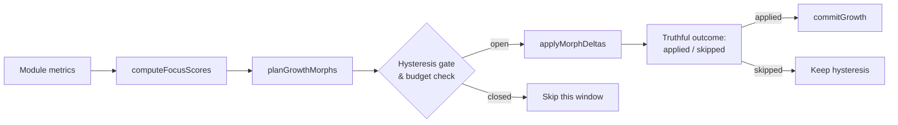
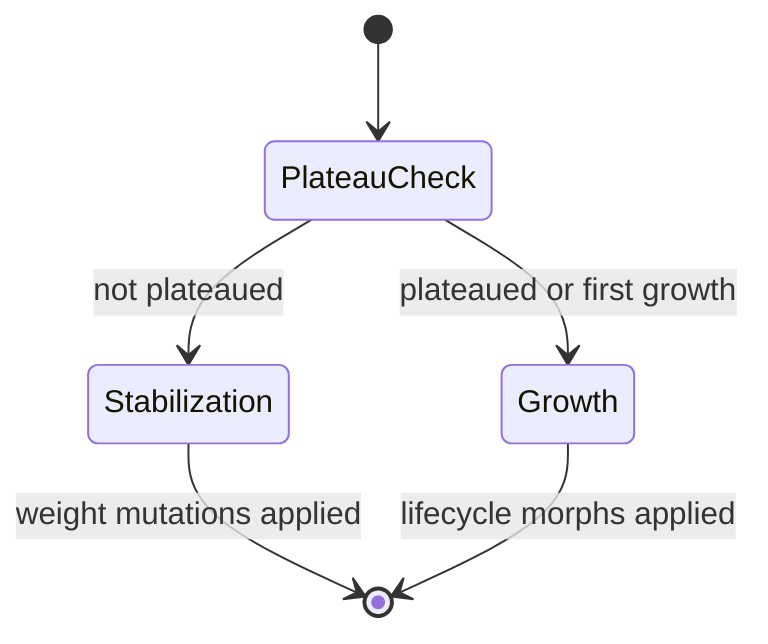
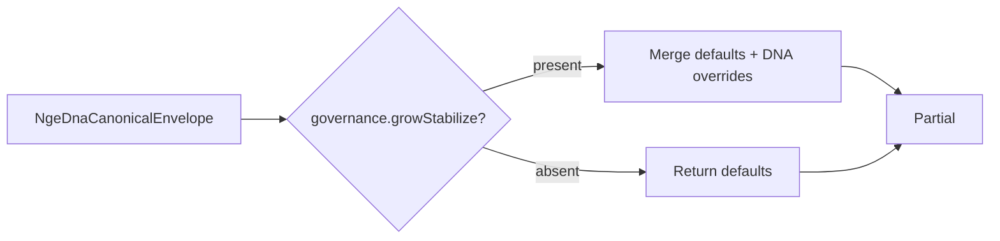
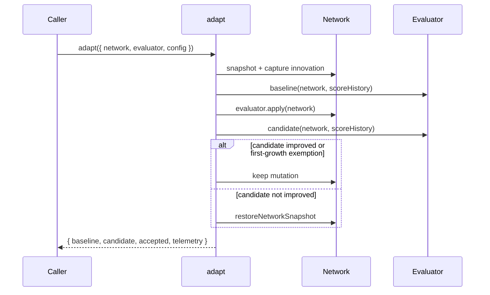
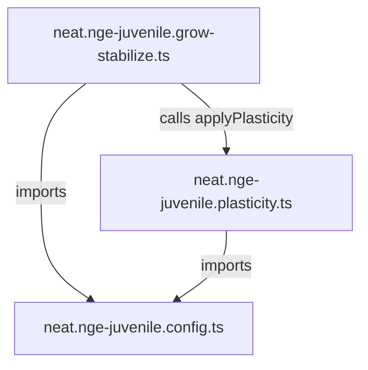

# neat/nge-juvenile

Juvenile phase orchestration surface for the NGE lifecycle.

The juvenile stage is the real-time growth engine of the Neuro-evolutionary
Genesis Engine (NGE). It looks at one module at a time, scores how promising
that module is, and plans small structural edits — denser edges, extra nodes,
or wider episodic slots — that the lifecycle can commit during a single
evaluation window. Growth is continuous: it does not wait for a generation
boundary, a breeding cycle, or any example-side scaffolding. Generations are
for multiplying and fusing successful networks, not a prerequisite for an
agent to grow.

This boundary exists so the policy that decides *where* to grow (focus
scoring, hysteresis, cooldowns, and budgets) stays separate from the lower
level structural mutations that actually change the network. That separation
lets the same engine run inside an application curriculum, a collective
simulation, an agent-based scenario, or a headless unit test with no dependency
on `examples/` or demo code.

## The juvenile growth contract

One lifecycle window follows a strict pipeline:

1. **Collect metrics.** The caller supplies one {@link NgeModuleMetricsSnapshot}
   per module: utilization, reward delta, novelty, stability age, and wiring
   cost.
2. **Score focus.** {@link computeFocusScores} normalizes each metric column
   independently, folds in the configured {@link NgeJuvenileFocusWeights},
   and emits a probability-like focus vector via softmax normalization.
3. **Plan dry-run morphs.** {@link planGrowthMorphs} produces a sorted list of
   {@link NgeMorphDelta} objects in edge-first priority order: edge densify,
   slot expand, then node add. Every plan is checked against the DNA
   {@link NgeGrowthBudget}.
4. **Re-validate and mutate.** {@link applyMorphDeltas} translates each delta
   into the matching NEAT mutation operator, re-checks the live budget, and
   reports the outcome truthfully as `applied` or `skipped`. A saturated graph
   or a conflicting sparsity budget no longer produces a false-positive
   applied report.
5. **Commit hysteresis.** When at least one growth morph is genuinely applied,
   {@link commitGrowth} resets the positive-focus streak and starts the
   cooldown timer so growth stays bursty rather than noisy.



## The grow-stabilize cycle

Above the single-window growth pipeline sits the
{@link runNgeGrowStabilizeCycle} orchestrator, which sequences repeated
adaptation ticks. Each tick decides whether the network should **grow**
(add structural capacity via the lifecycle) or **stabilize** (tune existing
weights to exploit current capacity). The decision is driven by plateau
detection: when the rolling quality-score variance falls below a threshold,
the network has learned to use its current structure and further growth is
permitted.

This separation keeps the engine from growing indiscriminately. A network
that adds structure every tick never learns to use what it already has. By
alternating growth with stabilization, the cycle lets the network consolidate
each structural investment before the next expansion, mirroring the
explore–exploit tradeoff common in reinforcement learning and
neuro-evolution.

Key pure decision functions exported from the grow-stabilize module:

- {@link isPlateauReached} — variance-based plateau detection with
  time-boxed min/max stabilization guards.
- {@link resolveAdaptiveHysteresis} — network-size-aware hysteresis window
  count that accelerates early growth and requires more sustained evidence
  at scale.
- {@link applyWeightMutations} — stochastic weight perturbation during the
  stabilization phase.
- {@link computeGrowthThrottle} — progressive back-off for large networks
  to preserve real-time performance.



## Weight-exhaustion gate and variant scaling

The grow-stabilize cycle does not rely on a fixed improvement threshold. When
weight mutation is active, the cycle compares the best weight variant against
an adaptive **exhaustion** bar that rises as the network ages. If no variant
beats the bar for too many consecutive ticks, the cycle treats structural growth
as the better investment and switches back to the lifecycle pipeline. The bar
is stage-aware: babies tolerate larger jumps, adults require finer evidence.

Three additional signals shape the bar so it cannot be gamed by scale alone:

- **Neuron-budget factor** — small networks are nudged toward structural
  growth because they have headroom; large networks face a tighter bar.
- **Noise-multiplier cap** — the statistical uplift from evaluating many
  variants is bounded so huge variant counts do not drown out real signal.
- **Score-ceiling vs. magnitude scaling** — when a known ceiling exists the
  threshold measures remaining headroom; otherwise it scales with the absolute
  score magnitude.

After a bad growth event the bar doubles briefly (the post-growth anti-runaway
boost) so the cycle does not over-tune weights while ignoring the structural
mistake. The boost is capped and time-boxed so growth is never deferred forever.

Variant patches scale their effective magnitude with lifecycle stage and
network size. A small baby network explores a wide symmetric range around each
weight, while a large adult network shrinks its perturbations so tuning stays
local. The scaling is bounded by clamps so very large variant counts or very
large connection counts cannot explode or collapse the step size.

The exported helpers {@link resolveEffectiveMagnitude} and
{@link resolveRepresentativeDelta} materialize these scaled perturbations for
downstream weight mutation, while {@link resolveExhaustionImprovementThreshold}
and {@link resolveExhaustionForceGrowthThreshold} compute the adaptive
improvement bar and the structural-growth fallback threshold.

## Tuning knobs

Most callers can use the seeded defaults. The constants below are the levers
you actually touch when the default growth personality is too aggressive or
too conservative.

| Constant | What it controls | Default | When to change |
|---|---|---|---|
| {@link NGE_JUVENILE_DEFAULT_FOCUS_WEIGHTS} | Relative weight of utilization, reward, novelty, stability, and cost in the focus score | `w_u=0.25, w_r=0.3, w_n=0.2, w_s=0.15, w_c=0.1` | Increase `w_u` when underused modules should grow faster; increase `w_c` to penalize wiring. |
| {@link NGE_JUVENILE_DEFAULT_HYSTERESIS_WINDOW_COUNT} | Consecutive positive-focus windows required before growth can commit | `2` | Raise to reduce noise, lower to speed up response. |
| {@link NGE_JUVENILE_DEFAULT_EDGE_DENSIFICATION_COUNT} | Forward edges added by one committed edge-densify step | `5` | Raise for faster saturation escape, lower for fine-grained growth. |
| {@link NGE_JUVENILE_DEFAULT_NODE_ADDITION_COUNT} | Hidden nodes inserted by one committed node-add step | `2` | Raise to break past local plateaus, lower to keep networks compact. |
| {@link NGE_JUVENILE_DEFAULT_NODE_GROWTH_SIGNAL_FLOOR} | Minimum composite growth signal that opens the node-add gate | `0.0` | Raise to make node addition rarer and more evidence-gated. |
| {@link NGE_MAX_NODE_CAPACITY} | Absolute node ceiling enforced by the growth budget | `8000` | Match to the memory/performance envelope of your runtime. |
| {@link NGE_MAX_EDGE_CAPACITY} | Absolute edge ceiling enforced by the growth budget | `32000` | Match to the memory/performance envelope of your runtime. |
| {@link NGE_GROW_STABILIZE_PLATEAU_WINDOW_SIZE} | Rolling window length for plateau detection | `5` | Raise for smoother plateau detection, lower for faster response. |
| {@link NGE_GROW_STABILIZE_PLATEAU_VARIANCE_THRESHOLD} | Variance below which quality is considered plateaued | `0.1` | Raise to trigger growth sooner, lower to require tighter convergence. |
| {@link NGE_GROW_STABILIZE_DEFAULT_MAX_STRUCTURAL_EDITS_PER_STEP} | Max structural edits per lifecycle call | `5` | Raise for batch growth, lower for fine-grained morphs. |
| {@link NGE_GROW_STABILIZE_MIN_STABILIZATION_TICKS} | Min ticks after growth before plateau can fire | `5` | Raise to give more learning time, lower for faster cycling. |
| {@link NGE_GROW_STABILIZE_MAX_STABILIZATION_TICKS} | Max ticks before growth is forced regardless of plateau | `25` | Raise to allow longer stabilization, lower to force growth sooner. |
| {@link NGE_EXHAUSTION_STAGE_FRACTION_BABY} | Relative improvement bar for weight variants in the baby stage | `0.01` | Lower to let baby networks commit smaller weight wins; raise to demand stronger evidence. |
| {@link NGE_EXHAUSTION_STAGE_FRACTION_JUVENILE} | Relative improvement bar for weight variants in the juvenile stage | `0.005` | Raise to demand stronger variants, lower to commit smaller improvements. |
| {@link NGE_EXHAUSTION_STAGE_FRACTION_ADULT} | Relative improvement bar for weight variants in the adult stage | `0.003` | Raise to demand stronger variants; adult tuning is intentionally picky. |
| {@link NGE_EXHAUSTION_TICK_BUDGET} | Total exhaustion tick budget before structural growth is forced | `48` | Raise to give weight tuning more total ticks; the per-variant limit is `ceil(tickBudget / variantCount)`. |
| {@link NGE_EXHAUSTION_MIN_CONSECUTIVE_TICKS} | Floor on consecutive exhaustion ticks before forcing growth | `1` | Raise to prevent immediate growth fallback after a single bad variant tick. |
| {@link NGE_EXHAUSTION_MAX_CONSECUTIVE_TICKS} | Consecutive failed variant ticks before forcing structural growth | `8` | Raise to allow more tuning attempts, lower to switch to growth sooner. |
| {@link NGE_EXHAUSTION_POST_GROWTH_EXHAUSTION_BOOST} | Multiplier applied to the exhaustion limit after a bad growth event | `2.0` | Lower to reduce the post-growth anti-runaway back-off. |
| {@link NGE_EXHAUSTION_POST_GROWTH_MAX_CONSECUTIVE_TICKS} | Same cap after a bad growth event triggered the exhaustion boost | `16` | Keeps the doubled back-off from deferring weight tuning forever. |
| {@link NGE_EXHAUSTION_NEURON_BUDGET_FACTOR} | Half-range multiplier for the neuron-budget factor | `0.5` | Raise to push small networks toward growth faster; zero disables the bias. |
| {@link NGE_EXHAUSTION_NOISE_MULTIPLIER_CAP} | Upper bound on the variant-count noise uplift | `2.0` | Lower to make huge variant counts less forgiving of noise. |
| {@link NGE_EXHAUSTION_SCORE_EPSILON} | Minimum absolute scale for the adaptive threshold | `1e-6` | Raise when very small scores need a larger minimum improvement bar. |
| {@link NGE_GROW_STABILIZE_BIAS_MUTATION_RATE} | Fraction of biases perturbed during stabilization | `0.3` | Raise for more aggressive bias exploration; lower for conservative tuning. |
| {@link NGE_GROW_STABILIZE_BIAS_MUTATION_MAGNITUDE} | Maximum bias perturbation during stabilization | `0.1` | Raise for larger bias steps; lower for fine-grained bias tuning. |
| {@link NGE_GROW_STABILIZE_MUTATION_COOLDOWN_TICKS} | Cooldown after a committed mutation attempt | `5` | Raise to make adaptation sparser; lower for faster response. |
| {@link NGE_GROW_STABILIZE_ROLLBACK_COOLDOWN_TICKS} | Cooldown after a rollback outcome | `5` | Raise to throttle retries after a rejected candidate. |
| {@link NGE_VARIANT_WIDTH_FACTOR_MAX} | Upper clamp on stage-driven variant-count magnitude scaling | `1.5` | Lower to cap exploration width for very large variant counts. |
| {@link NGE_VARIANT_SIZE_FACTOR_FLOOR} | Lower clamp on network-size magnitude scaling | `0.1` | Raise to prevent tiny perturbations in very large networks. |

## Determinism boundary

The pipeline is deterministic for a fixed DNA, fixed seed, and fixed
experience stream. {@link runNgeLifecycle} seeds the network RNG before
morph application and pins the global connection innovation counter to the
network's current maximum innovation, so repeated runs produce the same edge
choices and innovation IDs. The `computedAt` timestamp in
{@link NgeFocusVector} is metadata only and must never participate in a
deterministic replay fingerprint.

## Background reading

- NEAT itself: Kenneth O. Stanley and Risto Miikkulainen,
  [Evolving Neural Networks through Augmenting Topologies](https://nn.cs.utexas.edu/?stanley:ec02) (2002).
- Softmax normalization:
  [Wikipedia — Softmax function](https://en.wikipedia.org/wiki/Softmax_function).
- Feature scaling / min-max normalization:
  [Wikipedia — Feature scaling](https://en.wikipedia.org/wiki/Feature_scaling).
- Hysteresis in control systems, which inspires the adaptive hysteresis
  window counts in the grow-stabilize cycle:
  [Wikipedia — Hysteresis](https://en.wikipedia.org/wiki/Hysteresis).
- The explore–exploit tradeoff that the grow-stabilize cycle mirrors:
  [Wikipedia — Exploration vs exploitation](https://en.wikipedia.org/wiki/Exploration_exploitation_dilemma).

Examples:

Dry-run the focus scorer and growth planner for one window.
```ts
import { nge } from 'neataptic';

const metrics = {
  moduleId: 'module:alpha',
  utilization: 0.8,
  rewardDelta: 0.4,
  novelty: 0.2,
  stabilityAge: 5,
  wiringCost: 0.1,
};
const focus = nge.juvenile.computeFocusScores([metrics], {});
const config = nge.juvenile.resolveFocusConfig({});
const deltas = nge.juvenile.planGrowthMorphs(
  'module:alpha',
  focus.scores[0],
  metrics,
  { maxNodes: 8000, maxEdges: 32000, maxEpisodicSlots: 100, currentNodeCount: 10, currentEdgeCount: 20, currentEpisodicSlotCount: 0 },
  config,
  { growthPositiveWindowCount: 2, pruneUnderuseWindowCount: 0, lastMorphKind: 'none', cooldownWindowsRemaining: 0 },
);
```

Apply planned growth to a live network with a deterministic seed.
```ts
import { nge, Network } from 'neataptic';

const network = new Network(2, 1, { seed: 42 });
const budget = {
  growth: { maxNodes: 8000, maxEdges: 32000, maxEpisodicSlots: 100, currentNodeCount: network.nodes.length, currentEdgeCount: network.connections.length, currentEpisodicSlotCount: 0 },
  prune: { minNodes: 1, minEdges: 1, costExemptEdgeIds: [], currentEdgeCount: network.connections.length, currentNodeCount: network.nodes.length, currentWiringCost: 0 },
};
const outcomes = nge.juvenile.applyMorphDeltas(network, deltas, budget);
```

## neat/nge-juvenile/neat.nge-juvenile.constants.ts

### NGE_EXHAUSTION_MAX_CONSECUTIVE_TICKS

Maximum consecutive weight-exhaustion ticks before forcing structural growth
under normal conditions.

Contract: NGE_EXHAUSTION_MAX_CONSECUTIVE_TICKS=8

### NGE_EXHAUSTION_MIN_CONSECUTIVE_TICKS

Minimum consecutive weight-exhaustion ticks before forcing structural growth.

Contract: NGE_EXHAUSTION_MIN_CONSECUTIVE_TICKS=1

### NGE_EXHAUSTION_NEURON_BUDGET_FACTOR

Half-range multiplier used by the neuron-budget factor. The factor equals
`1.0 + factor * (1.0 - current / max)`, clamped to [0.5, 2.0].

Contract: NGE_EXHAUSTION_NEURON_BUDGET_FACTOR=0.5

### NGE_EXHAUSTION_NOISE_MULTIPLIER_CAP

Maximum multiplier applied to the noise-sigma term when computing the
weight-exhaustion improvement threshold. Without a cap, very large variant
counts inflate the noise uplift without bound; this cap keeps the uplift
bounded to twice the per-stage noise sigma.

Contract: NGE_EXHAUSTION_NOISE_MULTIPLIER_CAP=2.0

### NGE_EXHAUSTION_NOISE_SIGMA_FRACTION_ADULT

Noise-sigma fraction for the adult lifecycle stage.

Contract: NGE_EXHAUSTION_NOISE_SIGMA_FRACTION_ADULT=0.001

### NGE_EXHAUSTION_NOISE_SIGMA_FRACTION_BABY

Noise-sigma fraction for the baby lifecycle stage. Controls how much the
adaptive threshold is lifted by variant-count noise in early growth.

Contract: NGE_EXHAUSTION_NOISE_SIGMA_FRACTION_BABY=0.003

### NGE_EXHAUSTION_NOISE_SIGMA_FRACTION_JUVENILE

Noise-sigma fraction for the juvenile lifecycle stage.

Contract: NGE_EXHAUSTION_NOISE_SIGMA_FRACTION_JUVENILE=0.002

### NGE_EXHAUSTION_POST_GROWTH_EXHAUSTION_BOOST

Multiplier applied to the base exhaustion limit after a bad growth event.
The resulting limit is clamped between 4 and 16.

Contract: NGE_EXHAUSTION_POST_GROWTH_EXHAUSTION_BOOST=2.0

### NGE_EXHAUSTION_POST_GROWTH_MAX_CONSECUTIVE_TICKS

Maximum consecutive weight-exhaustion ticks after a post-growth boost is
active. Used to cap the doubled exhaustion limit so bad growth cannot defer
weight tuning indefinitely.

Contract: NGE_EXHAUSTION_POST_GROWTH_MAX_CONSECUTIVE_TICKS=16

### NGE_EXHAUSTION_SCORE_EPSILON

Minimum absolute scale used by the adaptive improvement threshold to avoid
a zero threshold when both baseline and best score are extremely small.

Contract: NGE_EXHAUSTION_SCORE_EPSILON=1e-6

### NGE_EXHAUSTION_STAGE_FRACTION_ADULT

Stage fraction for the adult lifecycle stage.

Contract: NGE_EXHAUSTION_STAGE_FRACTION_ADULT=0.003

### NGE_EXHAUSTION_STAGE_FRACTION_BABY

Stage fraction for the baby lifecycle stage. Determines the relative
improvement bar used to decide whether a weight variant commits.

Contract: NGE_EXHAUSTION_STAGE_FRACTION_BABY=0.01

### NGE_EXHAUSTION_STAGE_FRACTION_JUVENILE

Stage fraction for the juvenile lifecycle stage.

Contract: NGE_EXHAUSTION_STAGE_FRACTION_JUVENILE=0.005

### NGE_EXHAUSTION_THRESHOLD_DECAY_FLOOR

Floor for the adaptive improvement-threshold decay. The decay multiplier is
clamped to this value so the threshold never collapses to zero and allows
random noise to commit.

Contract: NGE_EXHAUSTION_THRESHOLD_DECAY_FLOOR=0.25

### NGE_EXHAUSTION_THRESHOLD_DECAY_RATE

Per-failure decay rate applied to the adaptive improvement threshold. Each
consecutive weight-exhaustion tick multiplies the threshold by
`(1 - NGE_EXHAUSTION_THRESHOLD_DECAY_RATE)` so that near-converged scores can
still commit small-but-useful weight variants.

Contract: NGE_EXHAUSTION_THRESHOLD_DECAY_RATE=0.15

### NGE_EXHAUSTION_TICK_BUDGET

Total tick budget allocated to weight-exhaustion before structural growth is
forced. The raw exhaustion count is `ceil(tickBudget / variantCount)`.

Contract: NGE_EXHAUSTION_TICK_BUDGET=48

### NGE_GROW_STABILIZE_BIAS_MUTATION_MAGNITUDE

Maximum magnitude of bias perturbation applied during grow-stabilize
stabilization. Each selected bias is shifted by a random value in
[-MAGNITUDE, +MAGNITUDE].

Contract: NGE_GROW_STABILIZE_BIAS_MUTATION_MAGNITUDE=0.1

### NGE_GROW_STABILIZE_BIAS_MUTATION_RATE

Fraction of biases perturbed during each grow-stabilize stabilization tick.

Contract: NGE_GROW_STABILIZE_BIAS_MUTATION_RATE=0.3

### NGE_GROW_STABILIZE_DEFAULT_MAX_STRUCTURAL_EDITS_PER_STEP

Default maximum number of structural edits per lifecycle call.
Enables batch growth so multiple morphs can commit in a single tick.

Contract: NGE_GROW_STABILIZE_DEFAULT_MAX_STRUCTURAL_EDITS_PER_STEP=5

### NGE_GROW_STABILIZE_DEFAULT_MODULE_ID

Default module identifier used by the grow-stabilize cycle when no
custom module ID is supplied.

### NGE_GROW_STABILIZE_FORCE_GROWTH_AFTER_FAILED_STABILIZATIONS

Number of consecutive failed stabilization ticks after which the grow-stabilize
cycle skips weight tuning and forces a structural growth attempt. This prevents
the network from remaining stuck in a local weight basin when the score is
no longer improving.

Contract: NGE_GROW_STABILIZE_FORCE_GROWTH_AFTER_FAILED_STABILIZATIONS=3

### NGE_GROW_STABILIZE_GROWTH_THROTTLE_BASE_INTERVAL_TICKS

Base throttle interval (in ticks) applied when the network exceeds the
large-network threshold.

Contract: NGE_GROW_STABILIZE_GROWTH_THROTTLE_BASE_INTERVAL_TICKS=3

### NGE_GROW_STABILIZE_LARGE_NETWORK_NODE_THRESHOLD

Node count above which the growth throttle engages.
Networks exceeding this threshold get progressively longer back-off intervals.

Contract: NGE_GROW_STABILIZE_LARGE_NETWORK_NODE_THRESHOLD=1_000

### NGE_GROW_STABILIZE_LIFECYCLE_COOLDOWN_WINDOW_COUNT

Number of consecutive lifecycle windows used for grow-stabilize cooldown
gating. A morph action may not commit again until this many windows have
elapsed.

Contract: NGE_GROW_STABILIZE_LIFECYCLE_COOLDOWN_WINDOW_COUNT=5

### NGE_GROW_STABILIZE_MAX_EPISODIC_SLOTS

Maximum number of episodic growth slots the NGE lifecycle may allocate.

Contract: NGE_GROW_STABILIZE_MAX_EPISODIC_SLOTS=15

### NGE_GROW_STABILIZE_MAX_FORWARD_PASS_SAMPLES

Maximum number of sample observations drawn from the score history for
forward-pass evaluation.

Contract: NGE_GROW_STABILIZE_MAX_FORWARD_PASS_SAMPLES=5

### NGE_GROW_STABILIZE_MAX_STABILIZATION_TICKS

Maximum stabilization ticks after which growth is forced to re-enter
even if the quality score has not plateaued.

Contract: NGE_GROW_STABILIZE_MAX_STABILIZATION_TICKS=25

### NGE_GROW_STABILIZE_MIN_STABILIZATION_TICKS

Minimum stabilization ticks that must elapse after structural growth
before plateau detection can fire.

Contract: NGE_GROW_STABILIZE_MIN_STABILIZATION_TICKS=5

### NGE_GROW_STABILIZE_MUTATION_COOLDOWN_TICKS

Cooldown ticks between consecutive weight mutations in the grow-stabilize
cycle. Prevents over-tuning within a single stabilization window.

Contract: NGE_GROW_STABILIZE_MUTATION_COOLDOWN_TICKS=10

### NGE_GROW_STABILIZE_PLATEAU_VARIANCE_THRESHOLD

Variance threshold below which the quality score is considered plateaued.
When the rolling-window variance falls below this value, the network is
deemed to have learned to use its current structure and further growth
is permitted.

Contract: NGE_GROW_STABILIZE_PLATEAU_VARIANCE_THRESHOLD=0.1

### NGE_GROW_STABILIZE_PLATEAU_WINDOW_SIZE

Maximum number of quality-score entries retained for plateau detection.
The rolling window tracks the baseline score at each adaptation tick to
determine whether the network has stabilized before allowing growth.

Contract: NGE_GROW_STABILIZE_PLATEAU_WINDOW_SIZE=5

### NGE_GROW_STABILIZE_ROLLBACK_COOLDOWN_TICKS

Cooldown ticks between structural rollbacks in the grow-stabilize cycle.

Contract: NGE_GROW_STABILIZE_ROLLBACK_COOLDOWN_TICKS=3

### NGE_GROW_STABILIZE_STABILIZATION_VARIANT_COUNT

Number of parallel weight variants evaluated during the stabilization phase.

The racing demo's acceleration config uses 1024 variants for growth-oriented
evaluation, but stabilization is a local hill-climb around the current weights
and does not need that resolution. Capping stabilization variants at this count
preserves real-time frame budget without changing the growth-phase variant
budget.

Contract: NGE_GROW_STABILIZE_STABILIZATION_VARIANT_COUNT=32

### NGE_GROW_STABILIZE_WEIGHT_MUTATION_MAGNITUDE

Maximum magnitude of weight perturbation applied during stabilization.
Each selected connection's weight is shifted by a random value in
[-MAGNITUDE, +MAGNITUDE].

Contract: NGE_GROW_STABILIZE_WEIGHT_MUTATION_MAGNITUDE=0.1

### NGE_GROW_STABILIZE_WEIGHT_MUTATION_RATE

Fraction of connections whose weights are perturbed during each
stabilization-phase adaptation tick.

Contract: NGE_GROW_STABILIZE_WEIGHT_MUTATION_RATE=0.3

### NGE_JUVENILE_DEFAULT_EDGE_DENSIFICATION_COUNT

Minimum viable edge increment applied by one approved juvenile densification step.
Each committed grow pass adds at least this many edges to the target module.

### NGE_JUVENILE_DEFAULT_EPISODIC_HIT_RATE_THRESHOLD

Hit-rate floor required before episodic slot growth becomes eligible for commit.
Slot expansion is blocked when a module's episodic recall rate falls at or below this value.

### NGE_JUVENILE_DEFAULT_FOCUS_WEIGHTS

Default focus weights used by the juvenile scorer.
Drives the weighted formula that ranks modules by utilization, reward, novelty, stability, and cost.

### NGE_JUVENILE_DEFAULT_GAIN_STABILITY_TOLERANCE

Allowed mean-gain deviation before one module is treated as unstable.

### NGE_JUVENILE_DEFAULT_GAIN_STABILITY_WINDOW

Rolling-window length used for neuromodulator gain stabilization checks in the juvenile phase.
The mean gain is averaged over this many windows before stability is evaluated.

### NGE_JUVENILE_DEFAULT_GATING_EDGE_LENGTH_THRESHOLD

Default Euclidean edge-length threshold targeted by juvenile gating probes.
Edges shorter than this value are de-prioritized when selecting gating perturbation targets.

### NGE_JUVENILE_DEFAULT_HYSTERESIS_WINDOW_COUNT

Consecutive evaluation windows required before a growth or prune action may commit.
Prevents premature structural changes caused by transient evaluation signal spikes.

### NGE_JUVENILE_DEFAULT_LESION_SEVERITY

Default lesion severity where `1.0` suppresses the full target edge set.

### NGE_JUVENILE_DEFAULT_MIN_EDGE_FLOOR

Safe absolute minimum edge floor when DNA supplies no tighter prune bound.

### NGE_JUVENILE_DEFAULT_NODE_ADDITION_COUNT

Number of hidden nodes one approved node-addition step plans to insert.

### NGE_JUVENILE_DEFAULT_NODE_GROWTH_SIGNAL_FLOOR

Floor below which the composite node-growth signal cannot open the node-add gate.
The signal is derived from the focus-weighted module metrics, so growth evidence is
no longer tied to raw rewardDelta alone.

### NGE_JUVENILE_DEFAULT_NOISE_SIGMA

Default Gaussian standard deviation applied to module activations during noise probes.
Smaller values produce fine-grained perturbations; larger values create more disruptive noise.
See [Normal distribution (Wikipedia)](https://en.wikipedia.org/wiki/Normal_distribution)
for background on the bell-curve noise model.

### NGE_JUVENILE_DEFAULT_PROBE_CADENCE_EPOCHS

Probe scheduler cadence floor keeping expensive perturbations sparse across training epochs.
At least this many epochs must elapse between successive juvenile probe executions.

### NGE_JUVENILE_DEFAULT_PROBE_KINDS

Default deterministic probe-kind rotation applied by the juvenile perturbation scheduler.
Each probe epoch advances the rotation index to cycle through lesion, noise, and gating kinds.

### NGE_JUVENILE_DEFAULT_PROBE_MAX_LEDGER_ENTRIES

Maximum number of append-only probe ledger entries preserved per episode for analysis.
Older entries are evicted in FIFO order when the ledger reaches this cap.

### NGE_JUVENILE_DEFAULT_PRUNE_COST_PRESSURE_THRESHOLD

Cost-pressure fraction above which one window counts as prune evidence.

### NGE_JUVENILE_DEFAULT_RECURRENT_REFRESH_FLOOR

Hidden-state refresh floor below which recurrent state becomes prune evidence.

### NGE_JUVENILE_DEFAULT_SLOT_EXPANSION_COUNT

Minimum viable episodic slot increment applied by one expansion step.

### NGE_LIFECYCLE_DEFAULT_ADULT_GROWTH_CADENCE

Default growth cadence for the adult lifecycle stage.

Contract: NGE_LIFECYCLE_DEFAULT_ADULT_GROWTH_CADENCE=0.2

### NGE_LIFECYCLE_DEFAULT_ADULT_MUTATION_MAGNITUDE

Default weight-mutation magnitude for the adult lifecycle stage.

Contract: NGE_LIFECYCLE_DEFAULT_ADULT_MUTATION_MAGNITUDE=0.05

### NGE_LIFECYCLE_DEFAULT_ADULT_STABILIZATION_INTENSITY

Default stabilization intensity for the adult lifecycle stage.

Contract: NGE_LIFECYCLE_DEFAULT_ADULT_STABILIZATION_INTENSITY=0.7

### NGE_LIFECYCLE_DEFAULT_ADULT_VARIANT_COUNT

Default number of weight variants evaluated in the adult lifecycle stage.

Contract: NGE_LIFECYCLE_DEFAULT_ADULT_VARIANT_COUNT=2

### NGE_LIFECYCLE_DEFAULT_BABY_GROWTH_CADENCE

Default growth cadence for the baby lifecycle stage.

Contract: NGE_LIFECYCLE_DEFAULT_BABY_GROWTH_CADENCE=0.8

### NGE_LIFECYCLE_DEFAULT_BABY_MUTATION_MAGNITUDE

Default weight-mutation magnitude for the baby lifecycle stage.

Contract: NGE_LIFECYCLE_DEFAULT_BABY_MUTATION_MAGNITUDE=0.15

### NGE_LIFECYCLE_DEFAULT_BABY_NODE_THRESHOLD

Default node-count threshold that separates the baby lifecycle stage from
the juvenile stage.

Contract: NGE_LIFECYCLE_DEFAULT_BABY_NODE_THRESHOLD=1_000

### NGE_LIFECYCLE_DEFAULT_BABY_STABILIZATION_INTENSITY

Default stabilization intensity for the baby lifecycle stage.

Contract: NGE_LIFECYCLE_DEFAULT_BABY_STABILIZATION_INTENSITY=0.3

### NGE_LIFECYCLE_DEFAULT_BABY_VARIANT_COUNT

Default number of weight variants evaluated in the baby lifecycle stage.

Contract: NGE_LIFECYCLE_DEFAULT_BABY_VARIANT_COUNT=16

### NGE_LIFECYCLE_DEFAULT_JUVENILE_MUTATION_MAGNITUDE

Default weight-mutation magnitude for the juvenile lifecycle stage.

Contract: NGE_LIFECYCLE_DEFAULT_JUVENILE_MUTATION_MAGNITUDE=0.1

### NGE_LIFECYCLE_DEFAULT_JUVENILE_NODE_THRESHOLD

Default node-count threshold that separates the juvenile lifecycle stage
from the adult stage.

Contract: NGE_LIFECYCLE_DEFAULT_JUVENILE_NODE_THRESHOLD=4_000

### NGE_LIFECYCLE_DEFAULT_JUVENILE_VARIANT_COUNT

Default number of weight variants evaluated in the juvenile lifecycle stage.

Contract: NGE_LIFECYCLE_DEFAULT_JUVENILE_VARIANT_COUNT=8

### NGE_MAX_EDGE_CAPACITY

Maximum edge capacity that the NGE growth budget supports.
Caps the total number of connections a network may grow to during runtime adaptation.
Used by lifecycle runners and callers that need an explicit 32,000-edge ceiling.

Contract: NGE_MAX_EDGE_CAPACITY=32_000

### NGE_MAX_NODE_CAPACITY

Maximum node capacity that the NGE growth budget supports.
Caps the total number of nodes a network may grow to during runtime adaptation.
Used by lifecycle runners and callers that need an explicit 8,000-node ceiling.

Contract: NGE_MAX_NODE_CAPACITY=8_000

### NGE_VARIANT_PATCH_MAX_CONNECTION_COUNT

Maximum number of connections perturbed by a single multi-connection
weight variant patch. Caps patch size independently of network scale so
each variant remains a bounded local search step. Reduced from 16 to 8
because random-sign perturbations scale as sqrt(K), so smaller K loses
little signal while keeping patches local.

Contract: NGE_VARIANT_PATCH_MAX_CONNECTION_COUNT=8

### NGE_VARIANT_PATCH_MIN_CONNECTION_COUNT

Minimum number of connections perturbed by a single multi-connection
weight variant patch. Patches always contain at least this many
perturbations when the network has any trainable connections.

Contract: NGE_VARIANT_PATCH_MIN_CONNECTION_COUNT=1

### NGE_VARIANT_PATCH_SEED_OFFSET

Minimum deterministic seed offset between successive variant patches.
The actual stride is `max(offset, patchSize * strideFactor)` so small
patches remain well-separated while large patches cannot overflow a 32-bit
seed space by using a per-count multiplier.

Contract: NGE_VARIANT_PATCH_SEED_OFFSET=1000

### NGE_VARIANT_PATCH_SEED_STRIDE_FACTOR

Deterministic seed stride multiplier between successive variant patches.
Each patch uses `baseSeed + index * strideFactor`, keeping streams short
and non-overlapping when the same base seed is reused across variant
indices.

Contract: NGE_VARIANT_PATCH_SEED_STRIDE_FACTOR=4

### NGE_VARIANT_PATCH_SIZE_DIVISOR

Divisor used to derive the desired multi-connection patch size from the
total connection count. Combined with
{@link NGE_VARIANT_PATCH_MAX_CONNECTION_COUNT} to keep patch size modest.
A divisor of 50 means a 500-connection network gets a 10-connection patch,
which is then clamped to the patch maximum.

Contract: NGE_VARIANT_PATCH_SIZE_DIVISOR=50

### NGE_VARIANT_SIZE_FACTOR_FLOOR

Lower clamp for the size-factor scaling term. Prevents the magnitude from
collapsing to zero for extremely large networks.

Contract: NGE_VARIANT_SIZE_FACTOR_FLOOR=0.1

### NGE_VARIANT_SIZE_FACTOR_REF_CONNECTIONS

Reference connection count used to scale the effective mutation magnitude
by network size. Derived from the patch defaults as
ceil(NGE_VARIANT_PATCH_MAX_CONNECTION_COUNT / (1 / NGE_VARIANT_PATCH_SIZE_DIVISOR)).

Contract: NGE_VARIANT_SIZE_FACTOR_REF_CONNECTIONS=400

### NGE_VARIANT_WEIGHT_RANGE

Total weight exploration range multiplier. Representative deltas are
symmetric around zero and span [-magnitude, +magnitude], so the
effective exploration width is two magnitudes.

### NGE_VARIANT_WIDTH_FACTOR_MAX

Upper clamp for the width-factor scaling term. Keeps very large variant
counts (for example, the 1024 override) from inflating the effective
magnitude beyond a bounded multiple of the stage baseline. Reduced from 2.0
to 1.5 so the logarithmic width factor does not over-widen the search.

Contract: NGE_VARIANT_WIDTH_FACTOR_MAX=1.5

## neat/nge-juvenile/neat.nge-juvenile.types.ts

### NGE_JUVENILE_TYPES_LOADED

Runtime sentinel confirming the juvenile types module has been loaded.
Ensures Istanbul instruments this file so it appears in coverage reports.

### NgeAdaptConfig

Optional override values for a single `adapt()` call.

### NgeAdaptOptions

Inputs for one score-gated adaptation window.

### NgeAdaptResult

Result of one score-gated adaptation window.

### NgeAdaptTelemetry

Telemetry recorded for one score-gated adaptation window.

### NgeCadencePolicy

Pluggable cadence policy called when supplied to `adapt()`.

### NgeCandidateEvaluator

Injected evaluator contract used by the score-gated adaptation window.

The caller provides baseline scoring, mutation application, and candidate
scoring so `adapt()` can stay domain-agnostic and testable.

### NgeCandidateScoringConfig

Configuration for candidate score-window and sample-index resolution.

### NgeFocusScore

One module-level focus result containing both the raw and normalized score.

### NgeFocusVector

Normalized focus vector emitted for one juvenile evaluation window.
Contains per-module probability-like scores produced by the weighted focus formula.

### NgeGrowStabilizeConfig

Configuration for one grow-stabilize cycle call.

All fields have sensible defaults, so callers can override only the knobs
they need to tune.

### NgeGrowStabilizeInput

Input for one grow-stabilize cycle call.

The first four fields are required and match the minimal red-test contract.
All other fields are optional with sensible defaults, so the cycle can run
with just a network and score history.

### NgeGrowStabilizePhase

Phase label for the NGE grow-stabilize cycle.

The cycle alternates between structural `growth` (adding edges/nodes via the
NGE lifecycle) and `stabilization` (weight tuning to exploit current
capacity before further growth).

### NgeGrowStabilizeResult

Result of one grow-stabilize cycle call.

### NgeGrowthBudget

DNA-configured structural caps and live counts for one locally growing module.

### NgeHysteresisState

JSON-safe hysteresis state tracked persistently across juvenile morphology evaluation windows.
Persists growth and prune streak counts plus cooldown counters between successive windows.

### NgeJuvenileFocusWeights

Focus-weight shelf consumed by the juvenile weighted focus formula for module scoring.
Each weight scales one normalized metric — utilization, reward, novelty, stability, or cost.

### NgeJuvenilePhaseConfig

Resolved juvenile-phase configuration for focus scoring and later morph guards.

### NgeLifecycleRunner

```ts
NgeLifecycleRunner(): void
```

Optional lifecycle runner signature accepted by `adapt()` for dependency
injection and future cycle integration.

### NgeLifecycleStage

Discrete NGE lifecycle stage. The progression is embryo → baby → juvenile →
adult → equilibrium. Each stage carries different defaults for growth cadence,
stabilization intensity, and weight-mutation magnitude.

### NgeLifecycleStageConfig

Optional numeric overrides for lifecycle-stage thresholds and magnitudes.

All fields are optional. When omitted, the lifecycle-stage resolver falls
back to the documented constants in `neat.nge-juvenile.constants.ts`.

### NgeMetricsProvider

Pluggable metrics provider called when supplied to `adapt()`.

The provider is intentionally minimal so tests and callers can inject a
simple spy without implementing a full telemetry surface.

### NgeModuleMetricsSnapshot

Cheap per-module metrics snapshot consumed by the juvenile focus scorer.

### NgeMorphDelta

Dry-run structural delta that later juvenile passes can validate or roll back.

### NgeObservationEncoder

Domain-agnostic encoder that converts an application observation into a
network input vector.

### NgeProbeDecision

Pure scheduler decision emitted for one epoch's cadence check in the juvenile phase.
Signals whether the gate is open and which probe kind has been selected for execution.

### NgeProbeKind

Canonical probe kinds cycled by the juvenile perturbation scheduler across episodes.
Each kind suppresses, perturbs, or gates a different aspect of module behavior.

### NgeProbeLedgerEntry

Append-only probe ledger entry produced by one juvenile scheduled perturbation pass.
Records the probe kind, target module, epoch index, and signed reward delta for analysis.

### NgeProbeSchedulerConfig

Fully resolved configuration for the cadence-gated juvenile perturbation probe scheduler.
Controls probe-kind rotation, ledger size cap, and per-kind severity parameters.

### NgeProbeSchedulerState

JSON-safe probe scheduler state tracked persistently across juvenile evaluation windows.
Holds the last-fired epoch, probe-kind rotation index, and the append-only probe ledger.

### NgePruneBudget

DNA-configured structural floors and permanent prune exemptions for one juvenile module.
Guards the minimum edge and node counts that no morph action may reduce below.

### NgePruneCandidate

One scored prune candidate supplied by the caller for dry-run ranking.

### NgeQualitySignal

Quality signal entry accepted by the grow-stabilize cycle.

The core module operates on plain numeric scores. App layers convert
composite signals (e.g. `RacingQualitySignal`) to scalar numbers before
calling the core cycle, keeping the core free of demo-specific types.

## neat/nge-juvenile/neat.nge-juvenile.focus.ts

### computeFocusScores

```ts
computeFocusScores(
  snapshots: readonly NgeModuleMetricsSnapshot[],
  config: Partial<NgeJuvenilePhaseConfig>,
): NgeFocusVector
```

Compute the weighted juvenile focus vector for one evaluation window.

The score math is deterministic for a fixed snapshot and config. The `computedAt`
field is metadata only and must not participate in any deterministic fingerprint.

Each metric column is min-max normalized independently so mixed units stay
comparable. Raw weighted scores are then softmax-normalized into a
probability-like allocation shelf, following the standard temperature-free
softmax over a discrete option set.

Parameters:
- `snapshots` - Module metrics observed in the active evaluation slice.
- `config` - Partial or fully resolved juvenile focus configuration.

Returns: A focus vector carrying raw and normalized module scores.

Example:

```ts
const vector = computeFocusScores([
  { moduleId: 'policy', utilization: 0.8, rewardDelta: 0.2, novelty: 0.1, stabilityAge: 0.5, wiringCost: 0.3 },
  { moduleId: 'value', utilization: 0.4, rewardDelta: 0.1, novelty: 0.0, stabilityAge: 0.9, wiringCost: 0.1 },
], {});
console.log(vector.scores.map((s) => s.normalizedScore).reduce((a, b) => a + b, 0)); // 1
```

### resolveFocusConfig

```ts
resolveFocusConfig(
  partial: Partial<NgeJuvenilePhaseConfig>,
): NgeJuvenilePhaseConfig
```

Resolve a partial juvenile focus config against the seeded plan defaults.

Any omitted field falls back to a conservative default, so callers can tune
one knob at a time without re-declaring the whole packet.

Parameters:
- `partial` - Partial config whose omitted fields should resolve conservatively.

Returns: A fully resolved config packet ready for deterministic focus scoring.

Example:

```ts
const config = resolveFocusConfig({
  hysteresisWindowCount: 5,
  focusWeights: { w_u: 0.5, w_r: 0.3, w_n: 0.1, w_s: 0.1, w_c: 0.2 },
});
console.log(config.cooldownWindowCount); // 5 (mirrors hysteresisWindowCount)
```

## neat/nge-juvenile/neat.nge-juvenile.grow.ts

### advanceGrowthHysteresis

```ts
advanceGrowthHysteresis(
  hysteresis: NgeHysteresisState,
  isPositiveFocusWindow: boolean,
): NgeHysteresisState
```

Advance the growth-side hysteresis counters for one evaluation window and return fresh state.

Parameters:
- `hysteresis` - Previous hysteresis state.
- `isPositiveFocusWindow` - Whether the current window carried positive focus evidence.

Returns: A fresh hysteresis state with the growth streak and cooldown advanced.

### canGrowNow

```ts
canGrowNow(
  hysteresis: NgeHysteresisState,
  config: NgeJuvenilePhaseConfig,
): boolean
```

Check whether juvenile growth may commit in the current window.

The gate opens only after `hysteresisWindowCount` consecutive windows have
carried positive focus evidence *and* the previous growth cooldown has
expired. Once growth commits, `commitGrowth` resets the streak and starts a
new cooldown, so two morphs cannot fire back-to-back without fresh evidence.

Parameters:
- `hysteresis` - Current hysteresis state tracked across windows.
- `config` - Resolved juvenile-phase configuration.

Returns: `true` when the positive-focus streak is satisfied and cooldown is clear.

Example:

```ts
const hysteresis = { growthPositiveWindowCount: 3, cooldownWindowsRemaining: 0 };
const config = resolveFocusConfig({ hysteresisWindowCount: 3 });
console.log(canGrowNow(hysteresis, config)); // true
```

### commitGrowth

```ts
commitGrowth(
  hysteresis: NgeHysteresisState,
  morphKind: NgeGrowthMorphKind,
  config: NgeJuvenilePhaseConfig,
): NgeHysteresisState
```

Commit one growth-side hysteresis update after a validated morph is applied.

Parameters:
- `hysteresis` - Previous hysteresis state.
- `morphKind` - Concrete growth morph kind that committed.
- `config` - Resolved juvenile-phase configuration.

Returns: A fresh hysteresis state ready for the next cooldown window.

### computeNodeGrowthSignal

```ts
computeNodeGrowthSignal(
  score: NgeFocusScore,
  config: NgeJuvenilePhaseConfig,
): number
```

Compute the composite node-growth signal from a focus score using the same
normalized metric weights that produced the raw focus score. The signal is in
[-1, 1] and replaces the old raw-reward-delta gate.

Parameters:
- `score` - Focus score for the target module.
- `config` - Resolved juvenile configuration carrying focus weights.

Returns: Scalar growth signal; values above the configured floor open the gate.

### MorphDeltaRegistry

Registry of morph-delta validators used by `validateMorphDelta`.

The registry is initialized with the built-in NGE juvenile morph kinds
(`edgeDensify`, `slotExpand`, `nodeAdd`, `edgePrune`, `compact`). Additional
kinds can be registered at runtime; removing a kind causes `validate` to
reject deltas of that kind with {@link NgeJuvenile_MorphError}.

#### register

```ts
register(
  kind: string,
  validator: MorphValidator,
): void
```

Register a validator for a morph kind.

Parameters:
- `kind` - Morph kind to validate.
- `validator` - Function that throws a budget/morph error when invalid.

#### unregister

```ts
unregister(
  kind: string,
): void
```

Remove a previously registered morph kind validator.

Parameters:
- `kind` - Morph kind to remove from the registry.

#### validate

```ts
validate(
  delta: NgeMorphDelta,
  budget: NgeGrowthBudget,
): void
```

Validate a morph delta against the current structural budget.

Parameters:
- `delta` - Planned morph delta to validate.
- `budget` - DNA-configured growth caps and current live counts.

### NgeGrowthMorphKind

Growth-side morph kinds that the juvenile planner can emit and the lifecycle
can commit. Edge densify is the preferred fast path; slot expansion and node
addition are rarer, higher-cost growth actions.

### planEdgeDensification

```ts
planEdgeDensification(
  moduleId: string,
  budget: NgeGrowthBudget,
  focusScore: NgeFocusScore,
  config: NgeJuvenilePhaseConfig,
): NgeMorphDelta
```

Plan one local edge-densification delta for a single module, validating the DNA edge budget.

Parameters:
- `moduleId` - Module receiving the planned densification.
- `budget` - DNA-configured growth caps and current live counts.
- `focusScore` - Focus score for the target module.

Returns: One dry-run edge densification delta.

### planGrowthMorphs

```ts
planGrowthMorphs(
  moduleId: string,
  focusScore: NgeFocusScore,
  metrics: NgeModuleMetricsSnapshot,
  budget: NgeGrowthBudget,
  config: NgeJuvenilePhaseConfig,
  hysteresis: NgeHysteresisState,
): NgeMorphDelta[]
```

Plan all eligible local growth deltas for one module in edge-first priority order.

The planner tries densification first, slot expansion second, and node
addition last. Each candidate is validated against the supplied DNA budget
before it is returned. If the hysteresis gate is closed, the function returns
an empty array without throwing.

Parameters:
- `moduleId` - Module receiving all planned local growth actions.
- `focusScore` - Focus score for the target module.
- `metrics` - Module metrics whose utilization and reward delta drive eligibility.
- `budget` - DNA-configured growth caps and current live counts.
- `config` - Resolved juvenile-phase configuration.
- `hysteresis` - Current growth-side hysteresis state.

Returns: Zero or more validated dry-run morph deltas in edge-first priority order.

Example:

```ts
const deltas = planGrowthMorphs('policy', focus, metrics, budget, config, hysteresis);
console.log(deltas.map((d) => d.kind)); // ['edgeDensify'] (or [] when gated)
```

### planNodeAddition

```ts
planNodeAddition(
  moduleId: string,
  budget: NgeGrowthBudget,
  score: NgeFocusScore,
  config: NgeJuvenilePhaseConfig,
): NgeMorphDelta
```

Plan one rare evidence-gated node-addition delta for a single module.

Eligibility is now driven by the composite focus-derived growth signal rather
than raw reward delta alone. The planned insertion count honors the DNA
`nodeAdditionCount` and available node budget.

Parameters:
- `moduleId` - Module receiving the planned node addition.
- `budget` - DNA-configured growth caps and current live counts.
- `score` - Focus score carrying normalized metrics and the growth flag.
- `config` - Resolved juvenile configuration.

Returns: One dry-run node-addition delta.

### planSlotExpansion

```ts
planSlotExpansion(
  moduleId: string,
  hitRate: number,
  budget: NgeGrowthBudget,
  focusScore: NgeFocusScore,
  config: NgeJuvenilePhaseConfig,
): NgeMorphDelta
```

Plan one local episodic-slot expansion delta for a single module.

This planner uses `metrics.utilization` as the episodic hit-rate proxy until
a dedicated hit-rate metric is added to the module snapshot.

Parameters:
- `moduleId` - Module receiving the planned slot expansion.
- `hitRate` - Episodic hit-rate proxy for the target module.
- `budget` - DNA-configured growth caps and current live counts.
- `focusScore` - Focus score for the target module.
- `config` - Resolved juvenile-phase configuration.

Returns: One dry-run slot expansion delta.

### validateMorphDelta

```ts
validateMorphDelta(
  delta: NgeMorphDelta,
  budget: NgeGrowthBudget,
): void
```

Re-validate one dry-run morph delta against the current structural budget.

Delegates to {@link MorphDeltaRegistry.validate} so that validation is
table-driven and extensible.

Parameters:
- `delta` - Planned morph delta to validate.
- `budget` - DNA-configured growth caps and current live counts.

## neat/nge-juvenile/neat.nge-juvenile.apply.ts

Morph applier for the NGE juvenile phase.

This module owns the translation from dry-run `NgeMorphDelta` structural plans
into concrete `network.mutate()` calls. Each morph kind maps to a specific
NEAT mutation operator (or a documented no-op for `slotExpand`), and every
growth or prune action is re-validated against the supplied DNA budget before
the network is touched.

The applier is the final gate between planning and structural commitment: a
delta that passes the planner's dry-run validation can still be rejected here
if the live network state has drifted past a budget cap or floor since the
plan was produced.

### applyMorphDeltas

```ts
applyMorphDeltas(
  network: default,
  deltas: readonly NgeMorphDelta[],
  budget: MorphApplyBudget,
): MorphApplyOutcome[]
```

Apply a batch of juvenile morph deltas to a network, re-validating DNA
budgets before each structural mutation.

Each delta is translated into the corresponding NEAT mutation operator:

- `edgeDensify` → distinct forward edges added in one deterministic batch via
  a bounded lazy sampler and `network.connectBatch()` (N = `detail.proposedAdditions`).
  The sampler draws source/target indices from the same forward-only ranges used
  by `ADD_CONN`, rejects pairs that already project, deduplicates accepted pairs,
  and stops after a fixed attempt budget so densification stays cheap even near
  the 8,000-node / 32,000-edge capacity ceiling.
- `nodeAdd` → `ADD_NODE`.
- `edgePrune` → direct disconnect of the specific connection identified by
  `detail.candidateId` (not random `SUB_CONN`).
- `compact` → `SUB_NODE`.
- `slotExpand` → documented no-op; returns a skipped outcome.

Growth mutations (`edgeDensify`, `nodeAdd`) are guarded by the growth budget
caps (`maxEdges`, `maxNodes`). Prune mutations (`edgePrune`, `compact`) are
guarded by the prune budget floors (`minEdges`, `minNodes`). If a budget
would be violated, {@link NgeJuvenile_BudgetError} is thrown.

Parameters:
- `network` - The live network to mutate in place.
- `deltas` - Ordered list of dry-run morph deltas to apply.
- `budget` - Combined growth and prune budgets for re-validation.

Returns: One outcome per input delta, preserving order.

Example:

```ts
const outcomes = applyMorphDeltas(network, deltas, budget);
for (const outcome of outcomes) {
  if (outcome.status === 'skipped') {
    console.log(`${outcome.kind} skipped: ${outcome.reason}`);
  }
}
```

### applyOneDelta

```ts
applyOneDelta(
  network: default,
  delta: NgeMorphDelta,
  budget: MorphApplyBudget,
): MorphApplyOutcome
```

Dispatch one morph delta to its handler based on `delta.kind`.

Parameters:
- `network` - The live network to mutate in place.
- `delta` - One dry-run morph delta.
- `budget` - Combined growth and prune budgets for re-validation.

Returns: One morph apply outcome.

### assertGrowthBudget

```ts
assertGrowthBudget(
  projectedCount: number,
  maxCount: number,
  kind: string,
  moduleId: string,
): void
```

Assert that a projected count does not exceed the DNA growth cap.

Parameters:
- `projectedCount` - The count that would result after the growth mutation.
- `maxCount` - The DNA-configured maximum allowed count.
- `kind` - The morph kind label for the error message.
- `moduleId` - The target module identifier for the error message.

### assertPruneBudget

```ts
assertPruneBudget(
  projectedCount: number,
  minCount: number,
  kind: string,
  moduleId: string,
): void
```

Assert that a projected count does not drop below the DNA prune floor.

Parameters:
- `projectedCount` - The count that would result after the prune mutation.
- `minCount` - The DNA-configured minimum required count.
- `kind` - The morph kind label for the error message.
- `moduleId` - The target module identifier for the error message.

### countHiddenNodes

```ts
countHiddenNodes(
  network: default,
): number
```

Count the hidden nodes currently in the network.

Parameters:
- `network` - The live network to inspect.

Returns: The number of nodes whose type is `'hidden'`.

### MorphApplyBudget

Combined growth and prune budget consumed by the morph applier.
The applier re-validates both before mutating.

### MorphApplyOutcome

Outcome produced for one morph delta after the applier processes it.

## neat/nge-juvenile/neat.nge-juvenile.grow-stabilize.ts

NGE grow-stabilize cycle.

This module owns the core grow-stabilize adaptation cycle extracted from the
racing curriculum's runtime adaptation engine. It provides pure decision
functions (plateau detection, adaptive hysteresis, weight mutations, growth
throttle) and a single orchestrator (`runNgeGrowStabilizeCycle`) that
sequences one adaptation tick.

The orchestrator accepts plain numeric score history and a live mutable
network, keeping the core free of demo-specific types (e.g.
`RacingQualitySignal`). App layers convert composite signals to scalar
numbers before calling the core cycle.

## Determinism note

When a deterministic `random` source is supplied, weight mutation selection
is reproducible. When a `lifecycleRunner` is injected, the caller controls
the lifecycle execution, enabling test doubles and cycle breaking.

## Background reading

- NEAT and topology-evolving neuroevolution:
  K. O. Stanley and R. Miikkulainen, "Evolving Neural Networks through
  Augmenting Topologies," *Evolutionary Computation*, vol. 10, no. 2,
  pp. 99-127, 2002.
  [NEAT publications](https://nn.cs.utexas.edu/?neat-papers)
- Growth/stabilization as an explore–exploit tradeoff:
  [Wikipedia — Exploration–exploitation dilemma](https://en.wikipedia.org/wiki/Exploration%E2%80%93exploitation_dilemma)
- Hysteresis in control systems:
  [Wikipedia — Hysteresis](https://en.wikipedia.org/wiki/Hysteresis).
- Plateau detection via rolling-window variance:
  [Wikipedia — Variance](https://en.wikipedia.org/wiki/Variance).
- Mean squared error:
  [Wikipedia — Mean squared error](https://en.wikipedia.org/wiki/Mean_squared_error)


### applyWeightMutations

```ts
applyWeightMutations(
  network: default,
  random: () => number,
  magnitude: number | undefined,
): number
```

Apply random weight perturbations to existing connections.

Each connection is independently selected for mutation with probability
equal to the weight mutation rate. Selected connections have their weight
perturbed by a random amount in the range
[-magnitude, +magnitude]. This helps the network learn to use its current
structure during the stabilization phase between structural growth phases.

Parameters:
- `network` - The network whose connections to perturb.
- `random` - Random number generator returning a float in [0, 1).
- `magnitude` - Optional override for the perturbation magnitude. When
omitted, the default grow-stabilize weight mutation magnitude is used.

Returns: The number of connections that were mutated.

Example:

```ts
const mutated = applyWeightMutations(network, Math.random);
console.log(mutated); // e.g. 3
```

### buildWeightVariants

```ts
buildWeightVariants(
  network: default,
  variantCount: number,
  stage: NgeLifecycleStage,
): WeightVariant[]
```

Build deterministic weight variants that mirror the evaluator's internal
variant list.

The parallel evaluator restores connection weights after each variant, so
the grow-stabilize cycle must reconstruct the same variant list to commit
the winning delta. This builder uses the same endpoint-inclusive delta
distribution and effective-magnitude scaling as the evaluator so that
reconstruction is guaranteed to match the evaluated slot.

Parameters:
- `network` - Network surface whose connection list is used for indexing.
- `variantCount` - Number of parallel variants to reconstruct.
- `stage` - Current NGE lifecycle stage; controls effective magnitude.

Returns: Array of deterministic weight variants.

Example:

```ts
const variants = buildWeightVariants(network, 4, 'juvenile');
// variants[0] targets connection 0 with a small negative delta;
// variants[3] targets connection 3 with the largest positive delta.
```

### computeGrowthThrottle

```ts
computeGrowthThrottle(
  network: default,
  tick: number,
): { shouldThrottle: boolean; interval: number; }
```

Compute whether the growth lifecycle should be throttled for the current tick.

When the network exceeds the large-network node threshold, the effective
throttle interval scales with network size so that larger networks get
progressively longer back-off intervals. This preserves real-time
performance by preventing the lifecycle from running every tick at scale.

Parameters:
- `network` - Live controller network whose size determines throttling.
- `tick` - Current fixed-timestep tick used for interval gating.

Returns: Throttle decision with the computed interval.

Example:

```ts
const { shouldThrottle } = computeGrowthThrottle(network, 42);
console.log(shouldThrottle); // false for small networks
```

### isPlateauReached

```ts
isPlateauReached(
  scoreWindow: readonly number[],
  hasGrownBefore: boolean,
  stabilizationTicksSinceGrowth: number,
): boolean
```

Determine whether the quality score has plateaued based on a rolling
window of recent baseline scores.

Before the first structural growth, the function always returns `true` to
allow initial network development without waiting for a full score window.
After the first growth, the network is considered plateaued when the
rolling window is full and its variance falls below the threshold.

Time-boxed stabilization: a minimum number of ticks must elapse before
plateau can fire (preventing premature growth), and a maximum number of
ticks forces growth re-entry even if the variance remains above threshold.

Parameters:
- `scoreWindow` - Rolling window of recent baseline quality scores.
- `hasGrownBefore` - Whether the network has already undergone at least
one structural growth phase.
- `stabilizationTicksSinceGrowth` - Ticks elapsed in the stabilization
phase since the last structural growth.

Returns: `true` when growth should proceed (first growth, stabilized
plateau, or time-box cap exceeded), `false` when the network is still
stabilizing after growth.

Example:

```ts
const plateaued = isPlateauReached([0.5, 0.51, 0.49, 0.5, 0.5], true, 10);
console.log(plateaued); // true (low variance after min ticks)
```

### resolveAdaptiveHysteresis

```ts
resolveAdaptiveHysteresis(
  nodeCount: number,
): number
```

Resolve the adaptive hysteresis window count based on the live network
node count. Smaller networks use a lower threshold (2 consecutive
positive-quality windows) to accelerate early growth, while larger
networks require more sustained evidence (5 windows) before committing
to further structural expansion.

Parameters:
- `nodeCount` - Current total node count in the live network.

Returns: Hysteresis window count: 2 for ≤ 200 nodes, 3 for ≤ 500, 5 for > 500.

Example:

```ts
const hysteresis = resolveAdaptiveHysteresis(150);
console.log(hysteresis); // 2
```

### resolveExhaustionForceGrowthThreshold

```ts
resolveExhaustionForceGrowthThreshold(
  variantCount: number,
  postGrowthBoostActive: boolean,
): number
```

Resolve the number of consecutive weight-exhaustion ticks before structural
growth is forced.

The raw count is `ceil(tickBudget / variantCount)`, clamped to the allowed
[min, max] range. After a bad growth event the limit is doubled (capped at
16, floored at 4) to prevent the network from over-tuning weights instead of
adding useful structure.

Parameters:
- `variantCount` - Number of parallel variants evaluated.
- `postGrowthBoostActive` - Whether the post-growth anti-runaway boost
is active.

Returns: Allowed consecutive exhaustion ticks before forcing growth.

Example:

```ts
const limit = resolveExhaustionForceGrowthThreshold(16, false);
console.log(limit); // 3
```

### resolveExhaustionImprovementThreshold

```ts
resolveExhaustionImprovementThreshold(
  baseline: number,
  bestScore: number,
  variantCount: number,
  stage: NgeLifecycleStage,
  neuronBudget: { current: number; max: number; },
  scoreCeiling: number,
  consecutiveFailures: number,
): number
```

Resolve the adaptive improvement threshold used by the weight-exhaustion
gate.

The threshold combines:

- a stage-relative improvement bar,
- a noise-aware uplift that grows with the number of evaluated variants,
- a neuron-budget factor that biases small networks toward structural growth.

When the score ceiling is finite and both baseline and best score are below
it, the threshold scales with remaining headroom; otherwise it scales with
the absolute score magnitude.

Parameters:
- `baseline` - Score before evaluating variants.
- `bestScore` - Best score observed across all variants.
- `variantCount` - Number of variants evaluated.
- `stage` - Current NGE lifecycle stage.
- `neuronBudget` - Current and maximum neuron counts.
- `scoreCeiling` - Known score ceiling, or `Infinity` when absent.
- `consecutiveFailures` - Optional number of consecutive failed
stabilization ticks. Each failure decays the threshold so that
near-converged scores can still commit useful weight variants.

Returns: Adaptive improvement threshold; a variant commits when
`bestScore > baseline + threshold`.

Example:

```ts
const threshold = resolveExhaustionImprovementThreshold(
  0.5, 0.6, 16, 'baby', { current: 10, max: 100 }, Infinity,
);
console.log(threshold > 0); // true
```

### resolveNoiseSigmaFraction

```ts
resolveNoiseSigmaFraction(
  stage: NgeLifecycleStage,
): number
```

Resolve the noise-sigma fraction for a lifecycle stage.

The noise-sigma fraction scales the adaptive threshold by the expected
statistical noise from evaluating a finite number of variants. Early stages
get a larger fraction (0.003) because they evaluate more variants and need
a higher uplift; later stages get a smaller fraction (0.001).

Parameters:
- `stage` - Current NGE lifecycle stage.

Returns: Noise-sigma fraction for the stage.

Example:

```ts
const sigmaFraction = resolveNoiseSigmaFraction('juvenile');
console.log(sigmaFraction); // 0.002
```

### resolveStageFraction

```ts
resolveStageFraction(
  stage: NgeLifecycleStage,
): number
```

Resolve the relative improvement fraction for a lifecycle stage.

Baby/embryo networks get the largest bar (1%), juvenile networks get a
tighter bar (0.5%), and adult/equilibrium networks get the tightest bar
(0.3%). This implements the "grow fast past baby, picky in middle, slower
adult" intent by requiring larger improvements early and smaller
improvements later.

Parameters:
- `stage` - Current NGE lifecycle stage.

Returns: Relative improvement fraction for the stage.

Example:

```ts
const fraction = resolveStageFraction('baby');
console.log(fraction); // 0.01
```

### runNgeGrowStabilizeCycle

```ts
runNgeGrowStabilizeCycle(
  input: NgeGrowStabilizeInput,
): Promise<NgeGrowStabilizeResult>
```

Run one NGE grow-stabilize adaptation cycle.

This orchestrator encapsulates the plateau-detection decision and either:

- **Stabilization phase**: applies weight perturbations to existing
  connections so the network can learn to use its current structure.
- **Growth phase**: builds module metrics, a growth budget, and a prune
  budget from the live network state, then delegates to the NGE lifecycle
  runner to plan and apply structural morphs.

For the very first growth (`hasGrownBefore` is `false`), the plateau check
is bypassed and the hysteresis gate is pre-satisfied so the lifecycle
produces candidate morphs immediately — the network needs capacity before
stabilization can tune it. If the lifecycle still returns no applied
operations on that first call, the cycle forces a single `ADD_NODE` mutation
so the network cannot remain stuck at its starting size.

Weight-exhaustion detection is stateful. Supply `consecutiveWeightExhaustion`
and `postGrowthThresholdActive` so the cycle can count failed variant ticks
and activate the post-growth anti-runaway boost. A captured
`preGrowthBaseline` is compared against the stabilization baseline; a large
drop activates the boost and consumes the captured value.

When stabilization repeatedly fails to commit weight variants, the caller
can pass a non-zero `consecutiveStabilizationFailures` count. Once it meets
or exceeds `NGE_GROW_STABILIZE_FORCE_GROWTH_AFTER_FAILED_STABILIZATIONS`,
the cycle skips the stabilization phase and forces a growth attempt with
reason `forced_by_stabilization_failures`. This prevents the network from
staying stuck in local weight-tuning optima.

The adaptive improvement threshold used during variant evaluation decays as
`consecutiveWeightExhaustion` increases, controlled by
`NGE_EXHAUSTION_THRESHOLD_DECAY_RATE` and floored by
`NGE_EXHAUSTION_THRESHOLD_DECAY_FLOOR`. The decay lowers the bar so that
near-converged scores can still commit useful weight variants.

The returned result includes `actualVariantCount`, which reports the number of
weight variants that were actually evaluated during stabilization. When
variants are not evaluated (for example because training data are missing or
growth was forced), the field is zero.

Score-space alignment matters. When a custom `scoreFn` is supplied, it is
used for both the baseline and the variant evaluations. The caller must ensure
the scorer returns values in the same semantic space and direction as the
supplied `baselineScore`; otherwise the commit inequality
`bestScore > baselineScore + threshold` can never be satisfied. A common
mistake is comparing a positive task-specific quality score with the default
negative mean-squared-error scorer.

The caller is responsible for pre-mutation score evaluation, network
snapshot/rollback, and post-mutation score evaluation. The cycle only
handles the core decision and mutation application; commit/rollback based
on score improvement remains the caller's responsibility.

Parameters:
- `input` - Grow-stabilize cycle input with required network,
scoreHistory, hasGrownBefore, and stabilizationTicksSinceGrowth.

Returns: Promise resolving to the result describing whether the cycle
committed, which phase it entered, what operations were applied, and the
updated exhaustion/hysteresis state. When stabilization evaluated weight
variants, `actualVariantCount` reports the count that were used.

Example:

```ts
const result = await runNgeGrowStabilizeCycle({
  network,
  scoreHistory: [1, 2, 3, 4],
  hasGrownBefore: false,
  stabilizationTicksSinceGrowth: 0,
});
console.log(result.committed); // true (first growth)
```

## neat/nge-juvenile/neat.nge-juvenile.probe.ts

### advanceSchedulerState

```ts
advanceSchedulerState(
  state: NgeProbeSchedulerState,
  epochIndex: number,
  entry: NgeProbeLedgerEntry,
  config: NgeProbeSchedulerConfig,
): NgeProbeSchedulerState
```

Advance the scheduler state after one measured probe result is available.

Parameters:
- `state` - Previous scheduler state.
- `epochIndex` - Epoch that produced the new probe result.
- `entry` - Append-only ledger entry describing the probe outcome.
- `config` - Fully resolved scheduler config.

Returns: A fresh scheduler state with updated cadence metadata and ledger.

### appendProbeLedgerEntry

```ts
appendProbeLedgerEntry(
  ledger: NgeProbeLedgerEntry[],
  entry: NgeProbeLedgerEntry,
  maxEntries: number,
): NgeProbeLedgerEntry[]
```

Append one probe entry while preserving immutability and the bounded ledger cap.

Parameters:
- `ledger` - Existing append-only probe ledger.
- `entry` - New entry to append.
- `maxEntries` - Maximum number of entries preserved in the returned ledger.

Returns: A new bounded ledger with the newest entry preserved.

### buildProbeLedgerEntry

```ts
buildProbeLedgerEntry(
  kind: NgeProbeKind,
  targetModuleId: string,
  epochIndex: number,
  rewardBefore: number,
  rewardAfter: number,
): NgeProbeLedgerEntry
```

Build one append-only probe ledger entry from caller-measured before and after reward readings.

Parameters:
- `kind` - Probe kind applied to the target module.
- `targetModuleId` - Module whose local behavior was perturbed.
- `epochIndex` - Epoch that recorded the probe result.
- `rewardBefore` - Reward measured before the perturbation.
- `rewardAfter` - Reward measured after the perturbation.

Returns: One append-only probe ledger entry.

### computeProbeRewardDelta

```ts
computeProbeRewardDelta(
  ledger: NgeProbeLedgerEntry[],
  moduleId: string,
): number
```

Compute the mean signed probe delta for one module across the current ledger.

Parameters:
- `ledger` - Append-only probe ledger.
- `moduleId` - Module whose probe deltas should be averaged.

Returns: Mean signed reward delta, or `0` when no matching probes exist.

### decideProbe

```ts
decideProbe(
  epochIndex: number,
  state: NgeProbeSchedulerState,
  config: NgeProbeSchedulerConfig,
): NgeProbeDecision
```

Decide whether the current epoch may execute one expensive perturbation probe.

Parameters:
- `epochIndex` - Current training or evaluation epoch.
- `state` - Current scheduler state.
- `config` - Fully resolved scheduler config.

Returns: A pure decision packet describing cadence and the selected probe kind.

### defaultProbeSchedulerState

```ts
defaultProbeSchedulerState(): NgeProbeSchedulerState
```

Build the zeroed scheduler state used before any probe has fired.

Returns: A JSON-safe scheduler state packet for one episode.

### deserializeLedger

```ts
deserializeLedger(
  json: string,
): NgeProbeLedgerEntry[]
```

Deserialize one JSON-serialized probe ledger previously produced by `serializeLedger`.
Throws `NgeJuvenile_ProbeError` when the payload cannot be parsed or is not a JSON array.

Parameters:
- `json` - JSON string previously produced by `serializeLedger`.

Returns: Parsed probe ledger entries when the payload is a valid JSON array.

### resolveProbeSchedulerConfig

```ts
resolveProbeSchedulerConfig(
  partial: Partial<NgeProbeSchedulerConfig>,
): NgeProbeSchedulerConfig
```

Resolve a partial probe scheduler config against the seeded plan defaults.

Parameters:
- `partial` - Partial config whose omitted fields should resolve conservatively.

Returns: A fully resolved probe scheduler config packet.

### serializeLedger

```ts
serializeLedger(
  ledger: NgeProbeLedgerEntry[],
): string
```

Serialize the append-only probe ledger into a stable JSON string for checkpoint storage.

Parameters:
- `ledger` - Probe ledger to serialize.

Returns: JSON string containing the ledger entries in order.

## neat/nge-juvenile/neat.nge-juvenile.prune.ts

### advancePruneHysteresis

```ts
advancePruneHysteresis(
  hysteresis: NgeHysteresisState,
  isUnderuseWindow: boolean,
): NgeHysteresisState
```

Advance the prune-side hysteresis counters for one evaluation window and return fresh state.

Parameters:
- `hysteresis` - Previous hysteresis state.
- `isUnderuseWindow` - Whether the current window carried prune evidence.

Returns: A fresh hysteresis state with the prune streak and cooldown advanced.

### canPruneNow

```ts
canPruneNow(
  hysteresis: NgeHysteresisState,
  config: NgeJuvenilePhaseConfig,
): boolean
```

Check whether juvenile prune or compact actions may commit in the current window.

Parameters:
- `hysteresis` - Current prune-side hysteresis state tracked across windows.
- `config` - Resolved juvenile-phase configuration.

Returns: `true` when the underuse streak is satisfied and cooldown is clear.

### commitPrune

```ts
commitPrune(
  hysteresis: NgeHysteresisState,
  morphKind: NgePruneMorphKind,
  config: NgeJuvenilePhaseConfig,
): NgeHysteresisState
```

Commit one prune-side hysteresis update after a validated morph is applied.

Parameters:
- `hysteresis` - Previous hysteresis state.
- `morphKind` - Concrete prune or compact morph kind that committed.
- `config` - Resolved juvenile-phase configuration.

Returns: A fresh hysteresis state ready for the next cooldown window.

### planCompact

```ts
planCompact(
  moduleId: string,
  budget: NgePruneBudget,
): NgeMorphDelta
```

Plan one dry-run compact delta for a single module, verifying the node floor before returning.

Parameters:
- `moduleId` - Module receiving the planned compact action.
- `budget` - DNA floors and current structural counts for the module.

Returns: One dry-run compact delta.

### planEdgePrune

```ts
planEdgePrune(
  moduleId: string,
  candidate: NgePruneCandidate,
  budget: NgePruneBudget,
): NgeMorphDelta
```

Plan one dry-run edge-prune delta for a single module, respecting cost-exempt edges and DNA floor.

Parameters:
- `moduleId` - Module receiving the planned edge prune.
- `candidate` - Candidate edge selected for dry-run pruning.
- `budget` - DNA floors and prune exemptions for the module.

Returns: One dry-run edge-prune delta.

### planPruneMorphs

```ts
planPruneMorphs(
  moduleId: string,
  budget: NgePruneBudget,
  candidates: readonly NgePruneCandidate[],
  config: NgeJuvenilePhaseConfig,
  hysteresis: NgeHysteresisState,
): NgeMorphDelta[]
```

Plan all eligible dry-run prune deltas for one module in prune-before-compact order.

Parameters:
- `moduleId` - Module receiving all planned prune-side actions.
- `budget` - DNA floors, exemptions, and current structural counts.
- `candidates` - Caller-supplied edge candidates ranked locally within the module.
- `config` - Resolved juvenile-phase configuration.
- `hysteresis` - Current prune-side hysteresis state.

Returns: Zero or more validated dry-run prune deltas in priority order.

### selectPruneCandidate

```ts
selectPruneCandidate(
  candidates: readonly NgePruneCandidate[],
  budget: NgePruneBudget,
): NgePruneCandidate
```

Select the highest-priority non-exempt prune candidate for one module, sorted by wiring cost.

Parameters:
- `candidates` - Caller-supplied candidate edges for one prune pass.
- `budget` - DNA floors and permanent prune exemptions for the module.

Returns: The highest-priority non-exempt candidate, ordered by wiring cost then edge length.

### validatePruneDelta

```ts
validatePruneDelta(
  delta: NgeMorphDelta,
  budget: NgePruneBudget,
): void
```

Re-validate one dry-run prune delta against the current structural floors.

Parameters:
- `delta` - Planned morph delta to validate.
- `budget` - DNA floors and current structural counts for the module.

## neat/nge-juvenile/neat.nge-juvenile.errors.ts

Error raised when one juvenile morph delta would exceed a DNA-configured budget.

### NgeJuvenile_BudgetError

Error raised when one juvenile morph delta would exceed a DNA-configured budget.

### NgeJuvenile_MorphError

Error raised when one dry-run juvenile morph validation fails locally.

### NgeJuvenile_ProbeError

Error raised when probe scheduling or ledger deserialization fails validation.

## neat/nge-juvenile/neat.nge-juvenile.utils.ts

Normalize one numeric vector with min-max scaling.

Degenerate vectors with a single value or zero range return uniform weights so
downstream focus math never emits `NaN`.

### minMaxNormalize

```ts
minMaxNormalize(
  values: readonly number[],
): number[]
```

Normalize one numeric vector with min-max scaling.

Degenerate vectors with a single value or zero range return uniform weights so
downstream focus math never emits `NaN`.

Parameters:
- `values` - Raw numeric vector to normalize.

Returns: A normalized vector in the `[0, 1]` range or uniform degenerate weights.

### softmaxTopK

```ts
softmaxTopK(
  items: readonly T[],
  k: number,
): T[]
```

Return the top-k items after softmax normalization of the `score` field.

Parameters:
- `items` - Candidate items carrying one scalar score.
- `k` - Maximum number of items to return.

Returns: The highest-ranked `k` items with stable tie-breaking by input index.

## neat/nge-juvenile/neat.nge-juvenile.dna.ts

NGE DNA governance translator for the grow-stabilize cycle.

This module bridges the canonical NGE DNA envelope to the grow-stabilize
configuration surface. It reads optional `governance.growStabilize` overrides
from the DNA envelope and merges them with caller-supplied defaults, so
DNA-level governance knobs always take priority over runtime defaults
without hardcoding any values into the translator itself.

## Design rationale

The translator is intentionally a thin, pure function:

- It does not mutate the DNA envelope or the defaults object.
- It does not import or call any core algorithm code.
- It does not hardcode defaults; every fallback value comes from the
  caller-supplied `defaults` parameter.
- It preserves the `Partial<NgeGrowStabilizeConfig>` contract: fields absent
  from both sources are simply omitted from the result.

This keeps the DNA → config boundary inspectable, testable, and free of
hidden side effects, which is critical for deterministic development
reproducibility (see `reproducibility-contracts` skill).

## Background reading

- NGE DNA as a compact program rather than an explicit graph:
  see `nge-core-algorithm` skill.
- Governance overlays and morph policy knobs:
  see `plans/NGE_Grow_Stabilize_Cycle.plans.md` slice B7.



### extractGrowStabilizeGovernance

```ts
extractGrowStabilizeGovernance(
  dna: NgeDnaCanonicalEnvelope,
): Partial<NgeGrowStabilizeConfig> | undefined
```

Extract the optional `growStabilize` governance shelf from a DNA envelope.

Returns `undefined` when the envelope carries no governance or when the
governance shelf has no `growStabilize` field. This keeps the merge logic
in the orchestrator clean and makes the governance access inspectable.

Parameters:
- `dna` - Canonical NGE DNA envelope, optionally carrying a governance overlay.

Returns: The grow-stabilize overrides from DNA governance, or `undefined`.

### NgeDnaEnvelopeWithGovernance

A canonical NGE DNA envelope with an optional governance overlay.

The base `NgeDnaCanonicalEnvelope` does not declare a `governance` field.
This helper type extends it so the translator can safely access the
optional governance shelf that DNA envelopes may carry.

### NgeDnaGovernance

Governance overlay carried by a canonical NGE DNA envelope.

Maps stage schedules, budgets, wiring-cost preferences, and morph policy
knobs to canonical NGE_DNA schema fields via the `growStabilize` shelf.
Each field is optional so DNA envelopes that do not specify governance
remain valid.

### translateDnaToGrowStabilizeConfig

```ts
translateDnaToGrowStabilizeConfig(
  dna: NgeDnaCanonicalEnvelope,
  defaults: Partial<NgeGrowStabilizeConfig>,
): Partial<NgeGrowStabilizeConfig>
```

Translate NGE DNA governance overrides into a grow-stabilize config.

Reads the optional `governance.growStabilize` overlay on the DNA envelope
and merges it with caller-supplied defaults. DNA governance values take
priority over defaults for any field present in the governance block.
Fields absent from both sources are omitted from the result, preserving
the `Partial<NgeGrowStabilizeConfig>` contract.

All fallback values come from the `defaults` parameter — the translator
never hardcodes config values. This ensures that the caller (typically the
lifecycle runner or a higher-level orchestrator) controls every default,
while DNA governance can override individual knobs without rewriting the
entire config.

Parameters:
- `dna` - Canonical NGE DNA envelope, optionally carrying a governance overlay.
- `defaults` - Caller-supplied default values for grow-stabilize config fields.

Returns: Merged grow-stabilize config with DNA governance overrides applied.

Example:

```ts
const config = translateDnaToGrowStabilizeConfig(dna, {
  maxStructuralEditsPerStep: 5,
  maxNodes: 8_000,
  maxConnections: 32_000,
  maxEpisodicSlots: 15,
  moduleId: 'nge:runtime',
});
```

## neat/nge-juvenile/neat.nge-juvenile.adapt.ts

Score-gated adaptation API for the NGE juvenile phase.

This module extracts the commit/rollback loop used by the racing curriculum's
runtime adaptation engine into a small, testable, domain-agnostic core
function. The caller supplies a live network, a score history, and an
injected {@link NgeCandidateEvaluator}. `adapt()` snapshots the network and
the global connection innovation counter, evaluates a baseline score, applies
the candidate mutation, evaluates a candidate score, and either commits the
mutation or rolls back to the snapshot based on a configurable improvement
threshold.

The first structural growth may be exempted from the improvement check via
`config.overrides.firstGrowthExemption`. All policy values are defaults that
callers can override; no thresholds are hardcoded.



### adapt

```ts
adapt(
  options: NgeAdaptOptions,
): NgeAdaptResult
```

Run one score-gated adaptation window.

Steps:
1. Snapshot the live network and global connection innovation counter.
2. Evaluate the baseline score using the injected evaluator.
3. Apply the candidate mutation using `evaluator.apply(network)`.
4. Evaluate the candidate score using the injected evaluator.
5. If the candidate improves enough (or the first-growth exemption applies),
   keep the mutation; otherwise restore the snapshot and roll back the
   global innovation counter.

Parameters:
- `options` - Inputs for the adaptation window, including the live
network, score history, injected evaluator, and optional config overrides.

Returns: Result containing the baseline and candidate scores, whether the
mutation was accepted, and telemetry for the window.

Example:

```ts
import { adapt } from './neat.nge-juvenile.adapt';
import Network from '../../architecture/network';

const network = new Network(4, 2, { seed: 42 });
const result = adapt({
  network,
  scoreHistory: [0.5, 0.55, 0.52],
  evaluator: {
    baseline: () => 0.5,
    apply: (net) => net.mutate(mutation.ADD_NODE),
    candidate: () => 0.7,
  },
});
console.log(result.accepted); // true
```

### captureNetworkSnapshot

```ts
captureNetworkSnapshot(
  network: default,
): { snapshot: Record<string, unknown>; capturedInnovation: number; }
```

Snapshot the current network state and global connection innovation counter.

The returned snapshot is a deep JSON representation of the network plus the
counter value captured before any candidate mutation. Restoring uses
{@link restoreNetworkSnapshot} so the live network reference and the global
innovation cursor can both be rewound.

Parameters:
- `network` - Live network whose state should be preserved.

Returns: Object holding the JSON snapshot and captured innovation counter.

### resolveAdaptConfig

```ts
resolveAdaptConfig(
  partial: Partial<NgeAdaptConfig> | undefined,
): ResolvedAdaptConfig
```

Resolve the effective adaptation config from optional caller overrides.

Any missing override falls back to the documented default constants. This
keeps the core free of hardcoded thresholds while still allowing red-test
fixtures to inject precise values.

Parameters:
- `partial` - Caller-supplied config overrides.

Returns: Fully resolved adaptation config with non-optional override values.

### ResolvedAdaptConfig

Fully resolved adaptation config where all override fields are non-optional.

This is the internal return type of {@link resolveAdaptConfig}, guaranteeing
that downstream consumers never need nullish coalescing on resolved values.

### shouldCommitCandidate

```ts
shouldCommitCandidate(
  baseline: number,
  candidate: number,
  improvementThreshold: number,
  hasGrownBefore: boolean,
  firstGrowthExemption: boolean,
): boolean
```

Decide whether the candidate score should be committed.

A candidate commits when it improves over the baseline by at least the
configured threshold, or when the first-growth exemption applies and the
network has not grown before.

Parameters:
- `baseline` - Score captured before the mutation.
- `candidate` - Score captured after the mutation.
- `improvementThreshold` - Minimum improvement required over baseline.
- `hasGrownBefore` - Whether the network already committed growth.
- `firstGrowthExemption` - Whether the first growth bypasses improvement.

Returns: `true` when the mutation should be kept, `false` when it should roll
back.

## neat/nge-juvenile/neat.nge-juvenile.config.ts

Resolved configuration for the NGE juvenile grow-stabilize cycle.

This module owns `resolveGrowStabilizeConfig`, a pure helper that fills in
every optional field of `NgeGrowStabilizeConfig` with canonical defaults.
Keeping the resolver in its own file breaks the import cycle between the
grow-stabilize orchestrator (which calls `applyPlasticity`) and the
plasticity pass (which needs the resolved config defaults). Both
`grow-stabilize.ts` and `plasticity.ts` now import the resolver from here,
so neither depends on the other for config defaults.



### resolveGrowStabilizeConfig

```ts
resolveGrowStabilizeConfig(
  partial: Partial<NgeGrowStabilizeConfig> | undefined,
): NgeGrowStabilizeConfig
```

Resolve a partial grow-stabilize config with sensible defaults.

Parameters:
- `partial` - Caller-supplied config overrides.

Returns: Fully resolved config.

Example:

```ts
const config = resolveGrowStabilizeConfig({ maxNodes: 500, weightMutationRate: 0.5 });
console.log(config.maxNodes); // 500
console.log(config.plateauWindowSize); // 5 (default)
```

## neat/nge-juvenile/neat.nge-juvenile.variants.ts

NGE juvenile async weight-variant evaluator consumer.

This module builds and evaluates lifecycle-aware **multi-connection** weight
variant patches for NGE juvenile networks. A patch is a set of simultaneous
connection perturbations that are applied, scored as a group, and then rolled
back. The highest-scoring patch's representative perturbation is reported as
the winning single-connection variant so that downstream grow-stabilize
reconstruction (which is outside this slice) can commit it without being
edited.

Stage-specific variant counts are resolved from explicit overrides, the
supplied acceleration configuration, or built-in lifecycle defaults.

### buildVariants

```ts
buildVariants(
  network: VariantEvaluationNetwork,
  stage: NgeLifecycleStage,
  count: number,
  seed: number | undefined,
): NgeWeightVariantPatch[]
```

Build deterministic multi-connection weight variant patches for a network
surface.

Each patch perturbs a small, distinct subset of connections. The first
perturbation in the patch is the **representative**: it uses the same
deterministic rule as the legacy single-connection variant builder so that
downstream grow-stabilize reconstruction can recreate the winning variant
without knowing the full patch contents.

Parameters:
- `network` - Network surface whose connection list is used for indexing.
- `stage` - Current NGE lifecycle stage; controls mutation magnitude.
- `count` - Number of variant patches to generate.
- `seed` - Optional determinism seed for patch generation.

Returns: Array of deterministic weight variant patches.

Example:

```ts
const patches = buildVariants(network, 'baby', 16, 12345);
// patches[0].representative uses connection 0 and the smallest negative delta.
// The same seed reproduces identical patches on every run.
```

### evaluateNgeWeightVariants

```ts
evaluateNgeWeightVariants(
  network: VariantEvaluationNetwork,
  stage: NgeLifecycleStage,
  inputs: number[][],
  target: number[],
  seed: number | undefined,
  options: EvaluateNgeWeightVariantsOptions | undefined,
): Promise<WeightVariantResult>
```

Evaluate multi-connection weight variant patches for an NGE juvenile network
asynchronously.

The function resolves the appropriate variant count from the supplied
lifecycle stage, builds deterministic patches over the network's connection
list, and scores each patch by applying all of its perturbations at once. All
connection weights are restored after every patch, so the network is returned
to its original state once the promise resolves. Patches are evaluated
sequentially on the live network so that activation always reads the patched
weights that were actually applied.

The default scorer returns negative mean-squared-error against `target`.
If the caller supplies a custom `scoreFn`, it must produce values in the
same score space as the caller's baseline; otherwise the stabilization
commit inequality `bestScore > baselineScore + threshold` can never be
satisfied.

Stage-specific variant counts can be supplied through `options` or through
`options.accelerationConfig.stageVariantCounts`. When a stage count is given,
it overrides the built-in default for that stage (for example, `baby: 256`
replaces the default baby count).

Background reading:
- NEAT and topology-evolving neuroevolution:
  K. O. Stanley and R. Miikkulainen, "Evolving Neural Networks through
  Augmenting Topologies," Evolutionary Computation, vol. 10, no. 2,
  pp. 99-127, 2002.
  [NEAT publications](https://nn.cs.utexas.edu/?neat-papers)

Parameters:
- `network` - Network surface to evaluate.
- `stage` - Current NGE lifecycle stage.
- `inputs` - Input batch, one vector per sample.
- `target` - Target output vector for the default scorer.
- `seed` - Optional determinism seed for patch generation.
- `options` - Optional NGE-specific overrides.
May include `accelerationConfig` to control backend selection, or
`stageVariantCounts` to override per-stage variant counts.

Returns: Promise resolving to per-variant scores and backend metadata.

Examples:

```ts
const result = await evaluateNgeWeightVariants(
  network,
  'baby',
  [[0.5, 0.5]],
  [1.0],
  42,
);
console.log(result.metadata.variantCount); // 16 for baby stage
```

```ts
const result = await evaluateNgeWeightVariants(
  network,
  'baby',
  [[0.5, 0.5]],
  [1.0],
  42,
  {
    accelerationConfig: {
      parallelVariantCount: 256,
      stageVariantCounts: { baby: 256 },
    },
  },
);
console.log(result.metadata.variantCount); // 256
```

### EvaluateNgeWeightVariantsOptions

Options forwarded to {@link evaluateNgeWeightVariants}.

### NgeWeightVariantPatch

One representative perturbation plus the full multi-connection patch used
for scoring.

The representative is the single-connection perturbation that downstream
consumers see as the "winning variant". The full patch contains additional
simultaneous perturbations so that the score reflects a broader local
search step.

### resolveEffectiveMagnitude

```ts
resolveEffectiveMagnitude(
  stage: NgeLifecycleStage,
  variantCount: number,
  connectionCount: number,
): number
```

Resolve the effective mutation magnitude for a lifecycle stage, variant
count, and network connection count.

The magnitude scales with both the exploration width (more variants need a
wider total range) and the network size (larger networks need smaller local
steps). Small networks retain the stage baseline because the size factor is
clamped at 1.0.

Parameters:
- `stage` - Current NGE lifecycle stage.
- `variantCount` - Number of parallel variants being evaluated.
- `connectionCount` - Number of connections in the live network.

Returns: Effective absolute delta magnitude to use for this variant batch.

Example:

```ts
const magnitude = resolveEffectiveMagnitude('baby', 16, 5); // 0.15
```

### resolveRepresentativeDelta

```ts
resolveRepresentativeDelta(
  index: number,
  variantCount: number,
  magnitude: number,
): number
```

Resolve the representative delta for a variant index using an
endpoint-inclusive linear spread over [-magnitude, +magnitude].

For a single variant the probe is the positive endpoint, preserving a
non-zero weight nudge. For two or more variants the spread is symmetric,
unique, and reaches the exact endpoints at the first and last indices.

Parameters:
- `index` - Variant index in [0, variantCount).
- `variantCount` - Total number of variants in the spread.
- `magnitude` - Maximum absolute delta for the spread.

Returns: Representative delta for the indexed variant.

Example:

```ts
const delta = resolveRepresentativeDelta(0, 16, 0.15); // -0.15
const last = resolveRepresentativeDelta(15, 16, 0.15); // +0.15
```

### resolveVariantCountForStage

```ts
resolveVariantCountForStage(
  stage: NgeLifecycleStage,
  overrides: Partial<Record<NgeLifecycleStage, number>> | undefined,
  accelerationConfig: AccelerationConfig | undefined,
): number
```

Resolve the variant count for a lifecycle stage.

Resolution order: explicit `overrides` for the stage, then
`accelerationConfig.stageVariantCounts` for the stage, then built-in
lifecycle defaults. Baby-stage networks get many variants (default 16),
adult/equilibrium networks get few (default 4), and juvenile gets the
midpoint (default 8). Embryo mirrors baby because the network is still tiny.

Parameters:
- `stage` - Current NGE lifecycle stage.
- `overrides` - Optional per-stage variant count overrides.
- `accelerationConfig` - Optional acceleration configuration carrying
per-stage variant counts.

Returns: Number of variants to evaluate.

Example:

```ts
// Built-in juvenile default: 8 variants.
const count = resolveVariantCountForStage('juvenile');

// Override for a single stage without touching acceleration config.
const tiny = resolveVariantCountForStage('adult', { adult: 2 });
```

## neat/nge-juvenile/neat.nge-juvenile.candidate.ts

### buildCandidateScoreWindow

```ts
buildCandidateScoreWindow(
  scoreHistory: readonly number[],
  config: Partial<NgeCandidateScoringConfig>,
): number[]
```

Build a sliding window of the most recent scores from a candidate score history.

The window size is config-driven and defaults to
{@link NGE_GROW_STABILIZE_PLATEAU_WINDOW_SIZE}. When the history is shorter
than the requested window, the full history is returned without padding.

Parameters:
- `scoreHistory` - Ordered numeric score history.
- `config` - Optional window size override.

Returns: The last `windowSize` entries, or the full history if shorter.

### collectForwardPassOutputs

```ts
collectForwardPassOutputs(
  network: default,
  observations: readonly T[],
  encoder: NgeObservationEncoder<T>,
): number[][]
```

Collect forward-pass output vectors from a network for a set of observations.

Each observation is encoded through the caller-supplied {@link NgeObservationEncoder}
to match the network's input size, then activated. The returned array preserves
the observation order so downstream scorers can compare behavioral variance or
reduce each output to a scalar quality score.

Parameters:
- `network` - Live network to activate. Must expose `input` and `activate`.
- `observations` - Observations drawn from the evidence window.
- `encoder` - Domain-agnostic encoder that produces an input vector per observation.

Returns: Array of output vectors, one per observation.

### NgeCandidateScoringConfig

Configuration for candidate score-window and sample-index resolution.

### NgeObservationEncoder

Domain-agnostic encoder that converts an application observation into a
network input vector.

### resolveSampleIndices

```ts
resolveSampleIndices(
  totalSamples: number,
  config: Partial<NgeCandidateScoringConfig>,
  _random: (() => number) | undefined,
): number[]
```

Resolve a deterministic, evenly-spaced subset of sample indices.

When `totalSamples` fits within the configured maximum, every index is
returned in order. Otherwise the indices are spread across the full range
using integer floor division so repeated calls with the same parameters
produce the same sample set. The `random` argument is part of the public
surface for future randomized sampling strategies but is intentionally unused
by the current deterministic spread.

Parameters:
- `totalSamples` - Number of observations available.
- `config` - Optional maximum sample count override.
- `_random` - Deterministic random source reserved for future strategies.

Returns: Array of selected indices in ascending order.

## neat/nge-juvenile/neat.nge-juvenile.plasticity.ts

Activity/bias-aware plasticity for the NGE juvenile module.

This boundary provides a reward-gated, activity-aware weight and bias
adjustment that combines three signals:

1. **Activity signal** — per-connection activity (0..1) that scales the
   nudge magnitude.  Connections that fired more strongly get larger
   adjustments.
2. **Reward-gated nudge** — a scalar reward signal (−1..+1) that gates
   whether the activity-driven nudge is positive (reinforce) or negative
   (decay).
3. **Small random noise** — a stochastic perturbation drawn from the
   caller-supplied RNG so that exploration is still possible when
   activity and reward are both near zero.

When `biasMutationRate > 0` the function also perturbs node biases using
the same three-signal model but scoped to per-node activity.

Configuration defaults are imported from `neat.nge-juvenile.config.ts`, the
resolver that broke the `grow-stabilize.ts` ↔ `plasticity.ts` import cycle.

### applyPlasticity

```ts
applyPlasticity(
  network: default,
  random: () => number,
  input: NgePlasticityInput,
  config: Partial<NgeGrowStabilizeConfig> | undefined,
): number
```

Apply activity/bias-aware plasticity to a network.

Combines three signals for each connection: per-connection activity
scales the nudge, a scalar reward signal gates whether the nudge is
positive (reinforce) or negative (decay), and small random noise
enables exploration when activity and reward are both near zero.
When `biasMutationRate > 0`, also perturbs non-input node biases
with random noise.

Parameters:
- `network` - The network whose weights and biases will be adjusted.
- `random` - Caller-supplied RNG function returning [0, 1).
- `input` - Activity map and reward signal driving the plasticity pass.
- `config` - Optional config overrides for mutation rates and magnitudes.

Returns: The number of connections and nodes that were adjusted.

Example:

```ts
const adjusted = applyPlasticity(network, Math.random, {
  activity: new Map([[conn.innovation, 0.8]]),
  rewardSignal: 1.0,
});
console.log(adjusted); // e.g. 5
```

### NgePlasticityInput

Inputs driving one plasticity pass.

## neat/nge-juvenile/neat.nge-juvenile.lifecycle-policy.ts

NGE juvenile lifecycle acceleration policy.

Maps each NGE lifecycle stage (`embryo`, `baby`, `juvenile`, `adult`,
`equilibrium`) to a stage-specific {@link AccelerationConfig}. The policy keeps
NGE's developmental preferences explicit and separate from the generic
acceleration layer so the same `src/acceleration/` machinery can be reused by
non-NGE callers.

The defaults encode the explore–exploit curve of the NGE lifecycle:
- **Embryo/baby** use a modest variant-friendly batch size and rely on CPU
  by default because networks are tiny and setup overhead dominates.
- **Juvenile/adult** may opt into `auto` backend selection once the network is
  large enough for GPU or worker batching to matter.
- **Equilibrium** falls back to CPU to keep inference deterministic and
  lightweight while the network is no longer structurally evolving.

Background reading:
- The explore–exploit tradeoff:
  [Wikipedia — Exploration-exploitation dilemma](https://en.wikipedia.org/wiki/Exploration_exploitation_dilemma).

### buildJuvenileLifecyclePolicy

```ts
buildJuvenileLifecyclePolicy(): { stages: Record<NgeLifecycleStage, AccelerationConfig>; }
```

Build the default NGE juvenile lifecycle acceleration policy.

The returned policy is a pure, deterministic factory: every call produces an
equivalent fresh object. Callers can override individual stage fields by
cloning the returned map and editing the desired stage.

Returns: A record mapping each NGE lifecycle stage to an `AccelerationConfig`.

Example:

```ts
const policy = buildJuvenileLifecyclePolicy();
console.log(policy.stages.baby.backend); // 'cpu'
console.log(policy.stages.adult.backend); // 'auto'
```

## neat/nge-juvenile/neat.nge-juvenile.lifecycle-stages.ts

NGE lifecycle stage resolution for baby/juvenile/adult phases.

The NGE lifecycle progresses through discrete stages: embryo → baby →
juvenile → adult → equilibrium. Each stage carries different defaults for
growth cadence, stabilization intensity, and mutation magnitude, reflecting
the explore–exploit tradeoff that governs brain-like neuro-evolution.

- **Baby** (≤1k nodes): aggressive growth, high variant count (16), high
  mutation magnitude, low stabilization. The network is small enough that
  many weight variants can be evaluated in parallel.
- **Juvenile** (1k–4k nodes): transitioning. Growth cadence and mutation
  magnitude ramp down from baby to adult levels. Variant count ramps from
  16 to 2.
- **Adult** (>4k nodes): stability-focused. Low growth cadence, low mutation
  magnitude, high stabilization intensity, and only 2 variants evaluated
  to preserve real-time performance.

All numeric thresholds and magnitudes are **config-overridable defaults**.
Core code reads values from the config first, falling back to documented
constants in `neat.nge-juvenile.constants.ts`. No policy value is ever
hard-coded.

## Determinism

All resolve functions are pure: same inputs produce the same outputs with
no side effects or randomness. The lifecycle stage resolution is deterministic
given a fixed node count and config.

## Background

The explore–exploit tradeoff that drives these stage-based parameters is
inspired by developmental neuroscience and reinforcement learning:
- [Wikipedia — Exploration vs exploitation](https://en.wikipedia.org/wiki/Exploration_exploitation_dilemma)
- The lifecycle stage model mirrors developmental phases in biological
  neural networks where early plasticity decreases and stability increases
  with maturation.

Example:

Resolve the lifecycle stage and parameters for a 2,500-node network.
```ts
import { resolveLifecycleStage, resolveGrowthCadence } from 'neataptic';

const stage = resolveLifecycleStage(2_500, {});
// stage === 'juvenile'

const cadence = resolveGrowthCadence(stage, {});
// cadence ≈ 0.5 (midpoint of baby 0.8 and adult 0.2)
```

### lerp

```ts
lerp(
  from: number,
  to: number,
  ratio: number,
): number
```

Linearly interpolate between two values at a given ratio.

Parameters:
- `from` - The start value (at ratio 0).
- `to` - The end value (at ratio 1).
- `ratio` - Interpolation ratio in [0, 1].

Returns: The interpolated value, rounded to the nearest integer.

### midpoint

```ts
midpoint(
  low: number,
  high: number,
): number
```

Compute the midpoint between two numbers.

Parameters:
- `low` - The lower value.
- `high` - The higher value.

Returns: The arithmetic mean of `low` and `high`.

### NgeLifecycleStage

Discrete NGE lifecycle stage. The progression is embryo → baby → juvenile →
adult → equilibrium. Each stage carries different defaults for growth cadence,
stabilization intensity, and weight-mutation magnitude.

### NgeLifecycleStageConfig

Optional numeric overrides for lifecycle-stage thresholds and magnitudes.

All fields are optional. When omitted, the lifecycle-stage resolver falls
back to the documented constants in `neat.nge-juvenile.constants.ts`.

### resolveAdultGrowthCadence

```ts
resolveAdultGrowthCadence(
  config: NgeLifecycleStageConfig,
): number
```

Resolve the effective adult growth cadence from config or default.

Parameters:
- `config` - Optional config overrides.

Returns: Effective adult growth cadence.

### resolveAdultMutationMagnitude

```ts
resolveAdultMutationMagnitude(
  config: NgeLifecycleStageConfig,
): number
```

Resolve the effective adult mutation magnitude from config or default.

Parameters:
- `config` - Optional config overrides.

Returns: Effective adult mutation magnitude.

### resolveAdultStabilizationIntensity

```ts
resolveAdultStabilizationIntensity(
  config: NgeLifecycleStageConfig,
): number
```

Resolve the effective adult stabilization intensity from config or default.

Parameters:
- `config` - Optional config overrides.

Returns: Effective adult stabilization intensity.

### resolveAdultVariantCount

```ts
resolveAdultVariantCount(
  config: NgeLifecycleStageConfig,
): number
```

Resolve the effective adult variant count from config or default.

Parameters:
- `config` - Optional config overrides.

Returns: Effective adult variant count.

### resolveBabyGrowthCadence

```ts
resolveBabyGrowthCadence(
  config: NgeLifecycleStageConfig,
): number
```

Resolve the effective baby growth cadence from config or default.

Parameters:
- `config` - Optional config overrides.

Returns: Effective baby growth cadence.

### resolveBabyMutationMagnitude

```ts
resolveBabyMutationMagnitude(
  config: NgeLifecycleStageConfig,
): number
```

Resolve the effective baby mutation magnitude from config or default.

Parameters:
- `config` - Optional config overrides.

Returns: Effective baby mutation magnitude.

### resolveBabyNodeThreshold

```ts
resolveBabyNodeThreshold(
  config: NgeLifecycleStageConfig,
): number
```

Resolve the effective baby node threshold from config or default.

Parameters:
- `config` - Optional config overrides.

Returns: Effective baby node threshold.

### resolveBabyStabilizationIntensity

```ts
resolveBabyStabilizationIntensity(
  config: NgeLifecycleStageConfig,
): number
```

Resolve the effective baby stabilization intensity from config or default.

Parameters:
- `config` - Optional config overrides.

Returns: Effective baby stabilization intensity.

### resolveBabyVariantCount

```ts
resolveBabyVariantCount(
  config: NgeLifecycleStageConfig,
): number
```

Resolve the effective baby variant count from config or default.

Parameters:
- `config` - Optional config overrides.

Returns: Effective baby variant count.

### resolveGrowthCadence

```ts
resolveGrowthCadence(
  stage: NgeLifecycleStage,
  config: NgeLifecycleStageConfig,
): number
```

Resolve the growth cadence for a given lifecycle stage.

Baby-stage networks get aggressive growth cadence (default 0.8) to expand
structural capacity rapidly. Adult-stage networks get stability-focused
cadence (default 0.2). Juvenile-stage networks get the midpoint between
baby and adult. Embryo uses baby defaults; equilibrium uses adult defaults.

Parameters:
- `stage` - The lifecycle stage to resolve cadence for.
- `config` - Optional config overrides; all fields are optional.

Returns: The growth cadence value for the stage.

Example:

```ts
const babyCadence = resolveGrowthCadence('baby', {}); // 0.8
const adultCadence = resolveGrowthCadence('adult', {}); // 0.2
```

### resolveJuvenileNodeThreshold

```ts
resolveJuvenileNodeThreshold(
  config: NgeLifecycleStageConfig,
): number
```

Resolve the effective juvenile node threshold from config or default.

Parameters:
- `config` - Optional config overrides.

Returns: Effective juvenile node threshold.

### resolveJuvenileVariantCount

```ts
resolveJuvenileVariantCount(
  config: NgeLifecycleStageConfig,
): number
```

Resolve the effective juvenile variant count from config or default.

Parameters:
- `config` - Optional config overrides.

Returns: Effective juvenile variant count.

### resolveLifecycleStage

```ts
resolveLifecycleStage(
  nodeCount: number,
  config: NgeLifecycleStageConfig,
): NgeLifecycleStage
```

Resolve the lifecycle stage for a given network node count.

Returns `'baby'` for networks at or below `babyNodeThreshold` (default 1,000),
`'juvenile'` for networks between the baby and juvenile thresholds
(1k–4k), and `'adult'` for networks above `juvenileNodeThreshold`
(default 4,000).

The thresholds are config fields, not hard-coded constants, so callers can
shift the stage boundaries to match their runtime or memory constraints.

Parameters:
- `nodeCount` - Current network node count.
- `config` - Optional config overrides; all fields are optional.

Returns: The resolved lifecycle stage.

Example:

```ts
const stage = resolveLifecycleStage(500, {}); // 'baby'
const stage = resolveLifecycleStage(2_000, {}); // 'juvenile'
const stage = resolveLifecycleStage(5_000, {}); // 'adult'
```

### resolveMutationMagnitude

```ts
resolveMutationMagnitude(
  stage: NgeLifecycleStage,
  config: NgeLifecycleStageConfig,
): number
```

Resolve the mutation magnitude for a given lifecycle stage.

Baby-stage networks use higher mutation magnitude (default 0.5) for broad
exploration of the solution space. Adult-stage networks use lower magnitude
(default 0.05) for fine-tuning. Juvenile-stage networks get the midpoint.
Embryo uses baby defaults; equilibrium uses adult defaults.

Parameters:
- `stage` - The lifecycle stage to resolve magnitude for.
- `config` - Optional config overrides; all fields are optional.

Returns: The mutation magnitude value for the stage.

Example:

```ts
const babyMag = resolveMutationMagnitude('baby', {}); // 0.5
const adultMag = resolveMutationMagnitude('adult', {}); // 0.05
```

### resolveStabilizationIntensity

```ts
resolveStabilizationIntensity(
  stage: NgeLifecycleStage,
  config: NgeLifecycleStageConfig,
): number
```

Resolve the stabilization intensity for a given lifecycle stage.

Adult-stage networks get higher stabilization intensity (default 0.7) to
focus on extracting maximum performance from current structural capacity.
Baby-stage networks get lower intensity (default 0.3) since they prioritize
growth over stabilization. Juvenile-stage networks get the midpoint. Embryo
uses baby defaults; equilibrium uses adult defaults.

Parameters:
- `stage` - The lifecycle stage to resolve intensity for.
- `config` - Optional config overrides; all fields are optional.

Returns: The stabilization intensity value for the stage.

Example:

```ts
const babyIntensity = resolveStabilizationIntensity('baby', {}); // 0.3
const adultIntensity = resolveStabilizationIntensity('adult', {}); // 0.7
```

### resolveVariantCount

```ts
resolveVariantCount(
  nodeCount: number,
  config: NgeLifecycleStageConfig,
): number
```

Resolve the number of weight variants to evaluate for a given network size.

Returns the baby-stage variant count (default 16) for networks at or below
the baby node threshold (default 1,000), ramps linearly to the adult-stage
variant count (default 2) between the baby and juvenile thresholds
(1k–4k), and returns the adult-stage variant count (default 2) for
networks above the juvenile node threshold (default 4,000).

All thresholds and counts are config-overridable via
{@link NgeLifecycleStageConfig}.

Parameters:
- `nodeCount` - Current network node count.
- `config` - Optional config overrides; all fields are optional.

Returns: Number of weight variants to evaluate.

Example:

```ts
const count = resolveVariantCount(500, {}); // 16 (baby stage)
const ramped = resolveVariantCount(2_500, {}); // 8 (juvenile ramp midpoint)
const adult = resolveVariantCount(5_000, {}); // 2 (adult stage)
const custom = resolveVariantCount(500, { babyVariantCount: 24 }); // 24
```
