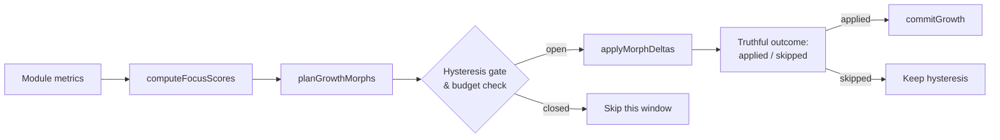
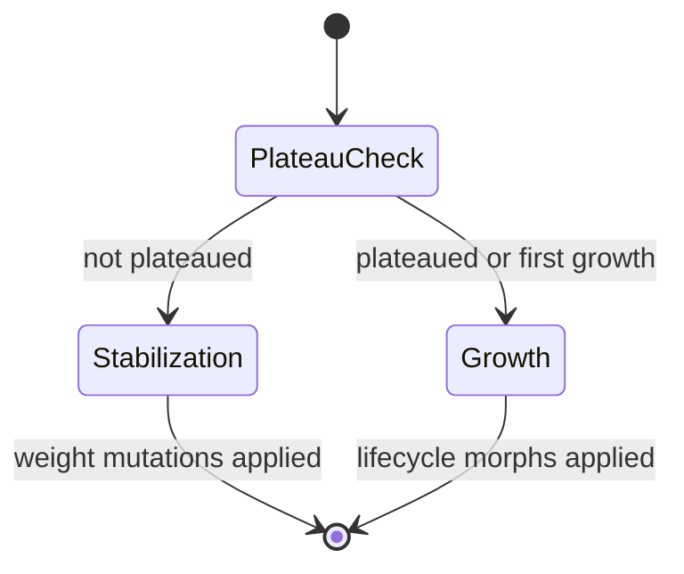

# neat/nge-juvenile

Juvenile phase orchestration surface for the NGE lifecycle.

The juvenile stage is the real-time growth engine of the Neuro-evolutionary
Genesis Engine (NGE). It looks at one module at a time, scores how promising
that module is, and plans small structural edits — denser edges, extra nodes,
or wider episodic slots — that the lifecycle can commit during a single
evaluation window. Growth is continuous: it does not wait for a generation
boundary, a breeding cycle, or any example-side scaffolding. Generations are
for multiplying and fusing successful networks, not a prerequisite for an
agent to grow.

This boundary exists so the policy that decides *where* to grow (focus
scoring, hysteresis, cooldowns, and budgets) stays separate from the lower
level structural mutations that actually change the network. That separation
lets the same engine run inside an application curriculum, a collective
simulation, an agent-based scenario, or a headless unit test with no dependency
on `examples/` or demo
code.

## The juvenile growth contract

One lifecycle window follows a strict pipeline:

1. **Collect metrics.** The caller supplies one {@link NgeModuleMetricsSnapshot}
   per module: utilization, reward delta, novelty, stability age, and wiring
   cost.
2. **Score focus.** {@link computeFocusScores} normalizes each metric column
   independently, folds in the configured {@link NgeJuvenileFocusWeights},
   and emits a probability-like focus vector via softmax normalization.
3. **Plan dry-run morphs.** {@link planGrowthMorphs} produces a sorted list of
   {@link NgeMorphDelta} objects in edge-first priority order: edge densify,
   slot expand, then node add. Every plan is checked against the DNA
   {@link NgeGrowthBudget}.
4. **Re-validate and mutate.** {@link applyMorphDeltas} translates each delta
   into the matching NEAT mutation operator, re-checks the live budget, and
   reports the outcome truthfully as `applied` or `skipped`. A saturated graph
   or a conflicting sparsity budget no longer produces a false-positive
   applied report.
5. **Commit hysteresis.** When at least one growth morph is genuinely applied,
   {@link commitGrowth} resets the positive-focus streak and starts the
   cooldown timer so growth stays bursty rather than noisy.



## The grow-stabilize cycle

Above the single-window growth pipeline sits the
{@link runNgeGrowStabilizeCycle} orchestrator, which sequences repeated
adaptation ticks. Each tick decides whether the network should **grow**
(add structural capacity via the lifecycle) or **stabilize** (tune existing
weights to exploit current capacity). The decision is driven by plateau
detection: when the rolling quality-score variance falls below a threshold,
the network has learned to use its current structure and further growth is
permitted.

This separation keeps the engine from growing indiscriminately. A network
that adds structure every tick never learns to use what it already has. By
alternating growth with stabilization, the cycle lets the network consolidate
each structural investment before the next expansion, mirroring the
explore–exploit tradeoff common in reinforcement learning and
neuro-evolution.

Key pure decision functions exported from the grow-stabilize module:

- {@link isPlateauReached} — variance-based plateau detection with
  time-boxed min/max stabilization guards.
- {@link resolveAdaptiveHysteresis} — network-size-aware hysteresis window
  count that accelerates early growth and requires more sustained evidence
  at scale.
- {@link applyWeightMutations} — stochastic weight perturbation during the
  stabilization phase.
- {@link computeGrowthThrottle} — progressive back-off for large networks
  to preserve real-time performance.



## Tuning knobs

Most callers can use the seeded defaults. The constants below are the levers
you actually touch when the default growth personality is too aggressive or
too conservative.

| Constant | What it controls | Default | When to change |
|---|---|---|---|
| {@link NGE_JUVENILE_DEFAULT_FOCUS_WEIGHTS} | Relative weight of utilization, reward, novelty, stability, and cost in the focus score | `w_u=0.25, w_r=0.3, w_n=0.2, w_s=0.15, w_c=0.1` | Increase `w_u` when underused modules should grow faster; increase `w_c` to penalize wiring. |
| {@link NGE_JUVENILE_DEFAULT_HYSTERESIS_WINDOW_COUNT} | Consecutive positive-focus windows required before growth can commit | `2` | Raise to reduce noise, lower to speed up response. |
| {@link NGE_JUVENILE_DEFAULT_EDGE_DENSIFICATION_COUNT} | Forward edges added by one committed edge-densify step | `5` | Raise for faster saturation escape, lower for fine-grained growth. |
| {@link NGE_JUVENILE_DEFAULT_NODE_ADDITION_COUNT} | Hidden nodes inserted by one committed node-add step | `2` | Raise to break past local plateaus, lower to keep networks compact. |
| {@link NGE_JUVENILE_DEFAULT_NODE_GROWTH_SIGNAL_FLOOR} | Minimum composite growth signal that opens the node-add gate | `0.0` | Raise to make node addition rarer and more evidence-gated. |
| {@link NGE_MAX_NODE_CAPACITY} | Absolute node ceiling enforced by the growth budget | `8000` | Match to the memory/performance envelope of your runtime. |
| {@link NGE_MAX_EDGE_CAPACITY} | Absolute edge ceiling enforced by the growth budget | `32000` | Match to the memory/performance envelope of your runtime. |
| {@link NGE_GROW_STABILIZE_PLATEAU_WINDOW_SIZE} | Rolling window length for plateau detection | `5` | Raise for smoother plateau detection, lower for faster response. |
| {@link NGE_GROW_STABILIZE_PLATEAU_VARIANCE_THRESHOLD} | Variance below which quality is considered plateaued | `0.1` | Raise to trigger growth sooner, lower to require tighter convergence. |
| {@link NGE_GROW_STABILIZE_DEFAULT_MAX_STRUCTURAL_EDITS_PER_STEP} | Max structural edits per lifecycle call | `5` | Raise for batch growth, lower for fine-grained morphs. |
| {@link NGE_GROW_STABILIZE_MIN_STABILIZATION_TICKS} | Min ticks after growth before plateau can fire | `5` | Raise to give more learning time, lower for faster cycling. |
| {@link NGE_GROW_STABILIZE_MAX_STABILIZATION_TICKS} | Max ticks before growth is forced regardless of plateau | `25` | Raise to allow longer stabilization, lower to force growth sooner. |

## Determinism boundary

The pipeline is deterministic for a fixed DNA, fixed seed, and fixed
experience stream. {@link runNgeLifecycle} seeds the network RNG before
morph application and pins the global connection innovation counter to the
network's current maximum innovation, so repeated runs produce the same edge
choices and innovation IDs. The `computedAt` timestamp in
{@link NgeFocusVector} is metadata only and must never participate in a
deterministic replay fingerprint.

## Background reading

- NEAT itself: Kenneth O. Stanley and Risto Miikkulainen,
  [Evolving Neural Networks through Augmenting Topologies](https://nn.cs.utexas.edu/?stanley:ec02) (2002).
- Softmax normalization:
  [Wikipedia — Softmax function](https://en.wikipedia.org/wiki/Softmax_function).
- Feature scaling / min-max normalization:
  [Wikipedia — Feature scaling](https://en.wikipedia.org/wiki/Feature_scaling).
- Hysteresis in control systems, which inspires the adaptive hysteresis
  window counts in the grow-stabilize cycle:
  [Wikipedia — Hysteresis](https://en.wikipedia.org/wiki/Hysteresis).
- The explore–exploit tradeoff that the grow-stabilize cycle mirrors:
  [Wikipedia — Exploration vs exploitation](https://en.wikipedia.org/wiki/Exploration_exploitation_dilemma).

Examples:

Dry-run the focus scorer and growth planner for one window.
```ts
import { nge } from 'neataptic';

const metrics = {
  moduleId: 'module:alpha',
  utilization: 0.8,
  rewardDelta: 0.4,
  novelty: 0.2,
  stabilityAge: 5,
  wiringCost: 0.1,
};
const focus = nge.juvenile.computeFocusScores([metrics], {});
const config = nge.juvenile.resolveFocusConfig({});
const deltas = nge.juvenile.planGrowthMorphs(
  'module:alpha',
  focus.scores[0],
  metrics,
  { maxNodes: 8000, maxEdges: 32000, maxEpisodicSlots: 100, currentNodeCount: 10, currentEdgeCount: 20, currentEpisodicSlotCount: 0 },
  config,
  { growthPositiveWindowCount: 2, pruneUnderuseWindowCount: 0, lastMorphKind: 'none', cooldownWindowsRemaining: 0 },
);
```

Apply planned growth to a live network with a deterministic seed.
```ts
import { nge, Network } from 'neataptic';

const network = new Network(2, 1, { seed: 42 });
const budget = {
  growth: { maxNodes: 8000, maxEdges: 32000, maxEpisodicSlots: 100, currentNodeCount: network.nodes.length, currentEdgeCount: network.connections.length, currentEpisodicSlotCount: 0 },
  prune: { minNodes: 1, minEdges: 1, costExemptEdgeIds: [], currentEdgeCount: network.connections.length, currentNodeCount: network.nodes.length, currentWiringCost: 0 },
};
const outcomes = nge.juvenile.applyMorphDeltas(network, deltas, budget);
```

## neat/nge-juvenile/neat.nge-juvenile.constants.ts

### NGE_GROW_STABILIZE_DEFAULT_MAX_STRUCTURAL_EDITS_PER_STEP

Default maximum number of structural edits per lifecycle call.
Enables batch growth so multiple morphs can commit in a single tick.

Contract: NGE_GROW_STABILIZE_DEFAULT_MAX_STRUCTURAL_EDITS_PER_STEP=5

### NGE_GROW_STABILIZE_DEFAULT_MODULE_ID

Default module identifier used by the grow-stabilize cycle when no
custom module ID is supplied.

### NGE_GROW_STABILIZE_GROWTH_THROTTLE_BASE_INTERVAL_TICKS

Base throttle interval (in ticks) applied when the network exceeds the
large-network threshold.

Contract: NGE_GROW_STABILIZE_GROWTH_THROTTLE_BASE_INTERVAL_TICKS=3

### NGE_GROW_STABILIZE_LARGE_NETWORK_NODE_THRESHOLD

Node count above which the growth throttle engages.
Networks exceeding this threshold get progressively longer back-off intervals.

Contract: NGE_GROW_STABILIZE_LARGE_NETWORK_NODE_THRESHOLD=1_000

### NGE_GROW_STABILIZE_MAX_EPISODIC_SLOTS

Maximum number of episodic growth slots the NGE lifecycle may allocate.

Contract: NGE_GROW_STABILIZE_MAX_EPISODIC_SLOTS=15

### NGE_GROW_STABILIZE_MAX_FORWARD_PASS_SAMPLES

Maximum number of sample observations drawn from the score history for
forward-pass evaluation.

Contract: NGE_GROW_STABILIZE_MAX_FORWARD_PASS_SAMPLES=5

### NGE_GROW_STABILIZE_MAX_STABILIZATION_TICKS

Maximum stabilization ticks after which growth is forced to re-enter
even if the quality score has not plateaued.

Contract: NGE_GROW_STABILIZE_MAX_STABILIZATION_TICKS=25

### NGE_GROW_STABILIZE_MIN_STABILIZATION_TICKS

Minimum stabilization ticks that must elapse after structural growth
before plateau detection can fire.

Contract: NGE_GROW_STABILIZE_MIN_STABILIZATION_TICKS=5

### NGE_GROW_STABILIZE_PLATEAU_VARIANCE_THRESHOLD

Variance threshold below which the quality score is considered plateaued.
When the rolling-window variance falls below this value, the network is
deemed to have learned to use its current structure and further growth
is permitted.

Contract: NGE_GROW_STABILIZE_PLATEAU_VARIANCE_THRESHOLD=0.1

### NGE_GROW_STABILIZE_PLATEAU_WINDOW_SIZE

Maximum number of quality-score entries retained for plateau detection.
The rolling window tracks the baseline score at each adaptation tick to
determine whether the network has stabilized before allowing growth.

Contract: NGE_GROW_STABILIZE_PLATEAU_WINDOW_SIZE=5

### NGE_GROW_STABILIZE_WEIGHT_MUTATION_MAGNITUDE

Maximum magnitude of weight perturbation applied during stabilization.
Each selected connection's weight is shifted by a random value in
[-MAGNITUDE, +MAGNITUDE].

Contract: NGE_GROW_STABILIZE_WEIGHT_MUTATION_MAGNITUDE=0.1

### NGE_GROW_STABILIZE_WEIGHT_MUTATION_RATE

Fraction of connections whose weights are perturbed during each
stabilization-phase adaptation tick.

Contract: NGE_GROW_STABILIZE_WEIGHT_MUTATION_RATE=0.3

### NGE_JUVENILE_DEFAULT_EDGE_DENSIFICATION_COUNT

Minimum viable edge increment applied by one approved juvenile densification step.
Each committed grow pass adds at least this many edges to the target module.

### NGE_JUVENILE_DEFAULT_EPISODIC_HIT_RATE_THRESHOLD

Hit-rate floor required before episodic slot growth becomes eligible for commit.
Slot expansion is blocked when a module's episodic recall rate falls at or below this value.

### NGE_JUVENILE_DEFAULT_FOCUS_WEIGHTS

Default focus weights used by the juvenile scorer.
Drives the weighted formula that ranks modules by utilization, reward, novelty, stability, and cost.

### NGE_JUVENILE_DEFAULT_GAIN_STABILITY_TOLERANCE

Allowed mean-gain deviation before one module is treated as unstable.

### NGE_JUVENILE_DEFAULT_GAIN_STABILITY_WINDOW

Rolling-window length used for neuromodulator gain stabilization checks in the juvenile phase.
The mean gain is averaged over this many windows before stability is evaluated.

### NGE_JUVENILE_DEFAULT_GATING_EDGE_LENGTH_THRESHOLD

Default Euclidean edge-length threshold targeted by juvenile gating probes.
Edges shorter than this value are de-prioritized when selecting gating perturbation targets.

### NGE_JUVENILE_DEFAULT_HYSTERESIS_WINDOW_COUNT

Consecutive evaluation windows required before a growth or prune action may commit.
Prevents premature structural changes caused by transient evaluation signal spikes.

### NGE_JUVENILE_DEFAULT_LESION_SEVERITY

Default lesion severity where `1.0` suppresses the full target edge set.

### NGE_JUVENILE_DEFAULT_MIN_EDGE_FLOOR

Safe absolute minimum edge floor when DNA supplies no tighter prune bound.

### NGE_JUVENILE_DEFAULT_NODE_ADDITION_COUNT

Number of hidden nodes one approved node-addition step plans to insert.

### NGE_JUVENILE_DEFAULT_NODE_GROWTH_SIGNAL_FLOOR

Floor below which the composite node-growth signal cannot open the node-add gate.
The signal is derived from the focus-weighted module metrics, so growth evidence is
no longer tied to raw rewardDelta alone.

### NGE_JUVENILE_DEFAULT_NOISE_SIGMA

Default Gaussian standard deviation applied to module activations during noise probes.
Smaller values produce fine-grained perturbations; larger values create more disruptive noise.

### NGE_JUVENILE_DEFAULT_PROBE_CADENCE_EPOCHS

Probe scheduler cadence floor keeping expensive perturbations sparse across training epochs.
At least this many epochs must elapse between successive juvenile probe executions.

### NGE_JUVENILE_DEFAULT_PROBE_KINDS

Default deterministic probe-kind rotation applied by the juvenile perturbation scheduler.
Each probe epoch advances the rotation index to cycle through lesion, noise, and gating kinds.

### NGE_JUVENILE_DEFAULT_PROBE_MAX_LEDGER_ENTRIES

Maximum number of append-only probe ledger entries preserved per episode for analysis.
Older entries are evicted in FIFO order when the ledger reaches this cap.

### NGE_JUVENILE_DEFAULT_PRUNE_COST_PRESSURE_THRESHOLD

Cost-pressure fraction above which one window counts as prune evidence.

### NGE_JUVENILE_DEFAULT_RECURRENT_REFRESH_FLOOR

Hidden-state refresh floor below which recurrent state becomes prune evidence.

### NGE_JUVENILE_DEFAULT_SLOT_EXPANSION_COUNT

Minimum viable episodic slot increment applied by one expansion step.

### NGE_MAX_EDGE_CAPACITY

Maximum edge capacity that the NGE growth budget supports.
Caps the total number of connections a network may grow to during runtime adaptation.
Used by lifecycle runners and callers that need an explicit 32,000-edge ceiling.

Contract: NGE_MAX_EDGE_CAPACITY=32_000

### NGE_MAX_NODE_CAPACITY

Maximum node capacity that the NGE growth budget supports.
Caps the total number of nodes a network may grow to during runtime adaptation.
Used by lifecycle runners and callers that need an explicit 8,000-node ceiling.

Contract: NGE_MAX_NODE_CAPACITY=8_000

## neat/nge-juvenile/neat.nge-juvenile.types.ts

### NGE_JUVENILE_TYPES_LOADED

Runtime sentinel confirming the juvenile types module has been loaded.
Ensures Istanbul instruments this file so it appears in coverage reports.

### NgeFocusScore

One module-level focus result containing both the raw and normalized score.

### NgeFocusVector

Normalized focus vector emitted for one juvenile evaluation window.
Contains per-module probability-like scores produced by the weighted focus formula.

### NgeGrowStabilizeConfig

Configuration for one grow-stabilize cycle call.

All fields have sensible defaults, so callers can override only the knobs
they need to tune.

### NgeGrowStabilizeInput

Input for one grow-stabilize cycle call.

The first four fields are required and match the minimal red-test contract.
All other fields are optional with sensible defaults, so the cycle can run
with just a network and score history.

### NgeGrowStabilizePhase

Phase label for the NGE grow-stabilize cycle.

The cycle alternates between structural `growth` (adding edges/nodes via the
NGE lifecycle) and `stabilization` (weight tuning to exploit current
capacity before further growth).

### NgeGrowStabilizeResult

Result of one grow-stabilize cycle call.

### NgeGrowthBudget

DNA-configured structural caps and live counts for one locally growing module.

### NgeHysteresisState

JSON-safe hysteresis state tracked persistently across juvenile morphology evaluation windows.
Persists growth and prune streak counts plus cooldown counters between successive windows.

### NgeJuvenileFocusWeights

Focus-weight shelf consumed by the juvenile weighted focus formula for module scoring.
Each weight scales one normalized metric — utilization, reward, novelty, stability, or cost.

### NgeJuvenilePhaseConfig

Resolved juvenile-phase configuration for focus scoring and later morph guards.

### NgeModuleMetricsSnapshot

Cheap per-module metrics snapshot consumed by the juvenile focus scorer.

### NgeMorphDelta

Dry-run structural delta that later juvenile passes can validate or roll back.

### NgeProbeDecision

Pure scheduler decision emitted for one epoch's cadence check in the juvenile phase.
Signals whether the gate is open and which probe kind has been selected for execution.

### NgeProbeKind

Canonical probe kinds cycled by the juvenile perturbation scheduler across episodes.
Each kind suppresses, perturbs, or gates a different aspect of module behavior.

### NgeProbeLedgerEntry

Append-only probe ledger entry produced by one juvenile scheduled perturbation pass.
Records the probe kind, target module, epoch index, and signed reward delta for analysis.

### NgeProbeSchedulerConfig

Fully resolved configuration for the cadence-gated juvenile perturbation probe scheduler.
Controls probe-kind rotation, ledger size cap, and per-kind severity parameters.

### NgeProbeSchedulerState

JSON-safe probe scheduler state tracked persistently across juvenile evaluation windows.
Holds the last-fired epoch, probe-kind rotation index, and the append-only probe ledger.

### NgePruneBudget

DNA-configured structural floors and permanent prune exemptions for one juvenile module.
Guards the minimum edge and node counts that no morph action may reduce below.

### NgePruneCandidate

One scored prune candidate supplied by the caller for dry-run ranking.

### NgeQualitySignal

Quality signal entry accepted by the grow-stabilize cycle.

The core module operates on plain numeric scores. App layers convert
composite signals (e.g. `RacingQualitySignal`) to scalar numbers before
calling the core cycle, keeping the core free of demo-specific types.

## neat/nge-juvenile/neat.nge-juvenile.focus.ts

### computeFocusScores

```ts
computeFocusScores(
  snapshots: readonly NgeModuleMetricsSnapshot[],
  config: Partial<NgeJuvenilePhaseConfig>,
): NgeFocusVector
```

Compute the weighted juvenile focus vector for one evaluation window.

The score math is deterministic for a fixed snapshot and config. The `computedAt`
field is metadata only and must not participate in any deterministic fingerprint.

Each metric column is min-max normalized independently so mixed units stay
comparable. Raw weighted scores are then softmax-normalized into a
probability-like allocation shelf, following the standard temperature-free
softmax over a discrete option set.

Parameters:
- `snapshots` - Module metrics observed in the active evaluation slice.
- `config` - Partial or fully resolved juvenile focus configuration.

Returns: A focus vector carrying raw and normalized module scores.

Example:

```ts
const vector = computeFocusScores([
  { moduleId: 'policy', utilization: 0.8, rewardDelta: 0.2, novelty: 0.1, stabilityAge: 0.5, wiringCost: 0.3 },
  { moduleId: 'value', utilization: 0.4, rewardDelta: 0.1, novelty: 0.0, stabilityAge: 0.9, wiringCost: 0.1 },
], {});
console.log(vector.scores.map((s) => s.normalizedScore).reduce((a, b) => a + b, 0)); // 1
```

### resolveFocusConfig

```ts
resolveFocusConfig(
  partial: Partial<NgeJuvenilePhaseConfig>,
): NgeJuvenilePhaseConfig
```

Resolve a partial juvenile focus config against the seeded plan defaults.

Any omitted field falls back to a conservative default, so callers can tune
one knob at a time without re-declaring the whole packet.

Parameters:
- `partial` - Partial config whose omitted fields should resolve conservatively.

Returns: A fully resolved config packet ready for deterministic focus scoring.

Example:

```ts
const config = resolveFocusConfig({
  hysteresisWindowCount: 5,
  focusWeights: { w_u: 0.5, w_r: 0.3, w_n: 0.1, w_s: 0.1, w_c: 0.2 },
});
console.log(config.cooldownWindowCount); // 5 (mirrors hysteresisWindowCount)
```

## neat/nge-juvenile/neat.nge-juvenile.grow.ts

### advanceGrowthHysteresis

```ts
advanceGrowthHysteresis(
  hysteresis: NgeHysteresisState,
  isPositiveFocusWindow: boolean,
): NgeHysteresisState
```

Advance the growth-side hysteresis counters for one evaluation window and return fresh state.

Parameters:
- `hysteresis` - Previous hysteresis state.
- `isPositiveFocusWindow` - Whether the current window carried positive focus evidence.

Returns: A fresh hysteresis state with the growth streak and cooldown advanced.

### canGrowNow

```ts
canGrowNow(
  hysteresis: NgeHysteresisState,
  config: NgeJuvenilePhaseConfig,
): boolean
```

Check whether juvenile growth may commit in the current window.

The gate opens only after `hysteresisWindowCount` consecutive windows have
carried positive focus evidence *and* the previous growth cooldown has
expired. Once growth commits, `commitGrowth` resets the streak and starts a
new cooldown, so two morphs cannot fire back-to-back without fresh evidence.

Parameters:
- `hysteresis` - Current hysteresis state tracked across windows.
- `config` - Resolved juvenile-phase configuration.

Returns: `true` when the positive-focus streak is satisfied and cooldown is clear.

Example:

```ts
const hysteresis = { growthPositiveWindowCount: 3, cooldownWindowsRemaining: 0 };
const config = resolveFocusConfig({ hysteresisWindowCount: 3 });
console.log(canGrowNow(hysteresis, config)); // true
```

### commitGrowth

```ts
commitGrowth(
  hysteresis: NgeHysteresisState,
  morphKind: NgeGrowthMorphKind,
  config: NgeJuvenilePhaseConfig,
): NgeHysteresisState
```

Commit one growth-side hysteresis update after a validated morph is applied.

Parameters:
- `hysteresis` - Previous hysteresis state.
- `morphKind` - Concrete growth morph kind that committed.
- `config` - Resolved juvenile-phase configuration.

Returns: A fresh hysteresis state ready for the next cooldown window.

### computeNodeGrowthSignal

```ts
computeNodeGrowthSignal(
  score: NgeFocusScore,
  config: NgeJuvenilePhaseConfig,
): number
```

Compute the composite node-growth signal from a focus score using the same
normalized metric weights that produced the raw focus score. The signal is in
[-1, 1] and replaces the old raw-reward-delta gate.

Parameters:
- `score` - Focus score for the target module.
- `config` - Resolved juvenile configuration carrying focus weights.

Returns: Scalar growth signal; values above the configured floor open the gate.

### NgeGrowthMorphKind

Growth-side morph kinds that the juvenile planner can emit and the lifecycle
can commit. Edge densify is the preferred fast path; slot expansion and node
addition are rarer, higher-cost growth actions.

### planEdgeDensification

```ts
planEdgeDensification(
  moduleId: string,
  budget: NgeGrowthBudget,
  focusScore: NgeFocusScore,
  config: NgeJuvenilePhaseConfig,
): NgeMorphDelta
```

Plan one local edge-densification delta for a single module, validating the DNA edge budget.

Parameters:
- `moduleId` - Module receiving the planned densification.
- `budget` - DNA-configured growth caps and current live counts.
- `focusScore` - Focus score for the target module.

Returns: One dry-run edge densification delta.

### planGrowthMorphs

```ts
planGrowthMorphs(
  moduleId: string,
  focusScore: NgeFocusScore,
  metrics: NgeModuleMetricsSnapshot,
  budget: NgeGrowthBudget,
  config: NgeJuvenilePhaseConfig,
  hysteresis: NgeHysteresisState,
): NgeMorphDelta[]
```

Plan all eligible local growth deltas for one module in edge-first priority order.

The planner tries densification first, slot expansion second, and node
addition last. Each candidate is validated against the supplied DNA budget
before it is returned. If the hysteresis gate is closed, the function returns
an empty array without throwing.

Parameters:
- `moduleId` - Module receiving all planned local growth actions.
- `focusScore` - Focus score for the target module.
- `metrics` - Module metrics whose utilization and reward delta drive eligibility.
- `budget` - DNA-configured growth caps and current live counts.
- `config` - Resolved juvenile-phase configuration.
- `hysteresis` - Current growth-side hysteresis state.

Returns: Zero or more validated dry-run morph deltas in edge-first priority order.

Example:

```ts
const deltas = planGrowthMorphs('policy', focus, metrics, budget, config, hysteresis);
console.log(deltas.map((d) => d.kind)); // ['edgeDensify'] (or [] when gated)
```

### planNodeAddition

```ts
planNodeAddition(
  moduleId: string,
  budget: NgeGrowthBudget,
  score: NgeFocusScore,
  config: NgeJuvenilePhaseConfig,
): NgeMorphDelta
```

Plan one rare evidence-gated node-addition delta for a single module.

Eligibility is now driven by the composite focus-derived growth signal rather
than raw reward delta alone. The planned insertion count honors the DNA
`nodeAdditionCount` and available node budget.

Parameters:
- `moduleId` - Module receiving the planned node addition.
- `budget` - DNA-configured growth caps and current live counts.
- `score` - Focus score carrying normalized metrics and the growth flag.
- `config` - Resolved juvenile configuration.

Returns: One dry-run node-addition delta.

### planSlotExpansion

```ts
planSlotExpansion(
  moduleId: string,
  hitRate: number,
  budget: NgeGrowthBudget,
  focusScore: NgeFocusScore,
  config: NgeJuvenilePhaseConfig,
): NgeMorphDelta
```

Plan one local episodic-slot expansion delta for a single module.

This planner uses `metrics.utilization` as the episodic hit-rate proxy until
a dedicated hit-rate metric is added to the module snapshot.

Parameters:
- `moduleId` - Module receiving the planned slot expansion.
- `hitRate` - Episodic hit-rate proxy for the target module.
- `budget` - DNA-configured growth caps and current live counts.
- `focusScore` - Focus score for the target module.
- `config` - Resolved juvenile-phase configuration.

Returns: One dry-run slot expansion delta.

### validateMorphDelta

```ts
validateMorphDelta(
  delta: NgeMorphDelta,
  budget: NgeGrowthBudget,
): void
```

Re-validate one dry-run morph delta against the current structural budget.

Parameters:
- `delta` - Planned morph delta to validate.
- `budget` - DNA-configured growth caps and current live counts.

## neat/nge-juvenile/neat.nge-juvenile.apply.ts

Morph applier for the NGE juvenile phase.

This module owns the translation from dry-run `NgeMorphDelta` structural plans
into concrete `network.mutate()` calls. Each morph kind maps to a specific
NEAT mutation operator (or a documented no-op for `slotExpand`), and every
growth or prune action is re-validated against the supplied DNA budget before
the network is touched.

The applier is the final gate between planning and structural commitment: a
delta that passes the planner's dry-run validation can still be rejected here
if the live network state has drifted past a budget cap or floor since the
plan was produced.

### applyMorphDeltas

```ts
applyMorphDeltas(
  network: default,
  deltas: readonly NgeMorphDelta[],
  budget: MorphApplyBudget,
): MorphApplyOutcome[]
```

Apply a batch of juvenile morph deltas to a network, re-validating DNA
budgets before each structural mutation.

Each delta is translated into the corresponding NEAT mutation operator:

- `edgeDensify` → distinct forward edges added in one deterministic batch via
  a bounded lazy sampler and `network.connectBatch()` (N = `detail.proposedAdditions`).
  The sampler draws source/target indices from the same forward-only ranges used
  by `ADD_CONN`, rejects pairs that already project, deduplicates accepted pairs,
  and stops after a fixed attempt budget so densification stays cheap even near
  the 8,000-node / 32,000-edge capacity ceiling.
- `nodeAdd` → `ADD_NODE`.
- `edgePrune` → direct disconnect of the specific connection identified by
  `detail.candidateId` (not random `SUB_CONN`).
- `compact` → `SUB_NODE`.
- `slotExpand` → documented no-op; returns a skipped outcome.

Growth mutations (`edgeDensify`, `nodeAdd`) are guarded by the growth budget
caps (`maxEdges`, `maxNodes`). Prune mutations (`edgePrune`, `compact`) are
guarded by the prune budget floors (`minEdges`, `minNodes`). If a budget
would be violated, {@link NgeJuvenile_BudgetError} is thrown.

Parameters:
- `network` - The live network to mutate in place.
- `deltas` - Ordered list of dry-run morph deltas to apply.
- `budget` - Combined growth and prune budgets for re-validation.

Returns: One outcome per input delta, preserving order.

Example:

```ts
const outcomes = applyMorphDeltas(network, deltas, budget);
for (const outcome of outcomes) {
  if (outcome.status === 'skipped') {
    console.log(`${outcome.kind} skipped: ${outcome.reason}`);
  }
}
```

### applyOneDelta

```ts
applyOneDelta(
  network: default,
  delta: NgeMorphDelta,
  budget: MorphApplyBudget,
): MorphApplyOutcome
```

Dispatch one morph delta to its handler based on `delta.kind`.

Parameters:
- `network` - The live network to mutate in place.
- `delta` - One dry-run morph delta.
- `budget` - Combined growth and prune budgets for re-validation.

Returns: One morph apply outcome.

### assertGrowthBudget

```ts
assertGrowthBudget(
  projectedCount: number,
  maxCount: number,
  kind: string,
  moduleId: string,
): void
```

Assert that a projected count does not exceed the DNA growth cap.

Parameters:
- `projectedCount` - The count that would result after the growth mutation.
- `maxCount` - The DNA-configured maximum allowed count.
- `kind` - The morph kind label for the error message.
- `moduleId` - The target module identifier for the error message.

### assertPruneBudget

```ts
assertPruneBudget(
  projectedCount: number,
  minCount: number,
  kind: string,
  moduleId: string,
): void
```

Assert that a projected count does not drop below the DNA prune floor.

Parameters:
- `projectedCount` - The count that would result after the prune mutation.
- `minCount` - The DNA-configured minimum required count.
- `kind` - The morph kind label for the error message.
- `moduleId` - The target module identifier for the error message.

### countHiddenNodes

```ts
countHiddenNodes(
  network: default,
): number
```

Count the hidden nodes currently in the network.

Parameters:
- `network` - The live network to inspect.

Returns: The number of nodes whose type is `'hidden'`.

### MorphApplyBudget

Combined growth and prune budget consumed by the morph applier.
The applier re-validates both before mutating.

### MorphApplyOutcome

Outcome produced for one morph delta after the applier processes it.

## neat/nge-juvenile/neat.nge-juvenile.grow-stabilize.ts

NGE grow-stabilize cycle.

This module owns the core grow-stabilize adaptation cycle extracted from the
racing curriculum's runtime adaptation engine. It provides pure decision
functions (plateau detection, adaptive hysteresis, weight mutations, growth
throttle) and a single orchestrator (`runNgeGrowStabilizeCycle`) that
sequences one adaptation tick.

The orchestrator accepts plain numeric score history and a live mutable
network, keeping the core free of demo-specific types (e.g.
`RacingQualitySignal`). App layers convert composite signals to scalar
numbers before calling the core cycle.

## Determinism note

When a deterministic `random` source is supplied, weight mutation selection
is reproducible. When a `lifecycleRunner` is injected, the caller controls
the lifecycle execution, enabling test doubles and cycle breaking.

## Background reading

- Hysteresis in control systems:
  [Wikipedia — Hysteresis](https://en.wikipedia.org/wiki/Hysteresis).
- Plateau detection via rolling-window variance:
  [Wikipedia — Variance](https://en.wikipedia.org/wiki/Variance).


### applyWeightMutations

```ts
applyWeightMutations(
  network: default,
  random: () => number,
): number
```

Apply random weight perturbations to existing connections.

Each connection is independently selected for mutation with probability
equal to the weight mutation rate. Selected connections have their weight
perturbed by a random amount in the range
[-magnitude, +magnitude]. This helps the network learn to use its current
structure during the stabilization phase between structural growth phases.

Parameters:
- `network` - The network whose connections to perturb.
- `random` - Random number generator returning a float in [0, 1).

Returns: The number of connections that were mutated.

Example:

```ts
const mutated = applyWeightMutations(network, Math.random);
console.log(mutated); // e.g. 3
```

### buildDefaultBudget

```ts
buildDefaultBudget(
  network: default,
  config: NgeGrowStabilizeConfig,
): NgeGrowthBudget
```

Build a default growth budget from the live network and resolved config.

Parameters:
- `network` - Live controller network.
- `config` - Resolved grow-stabilize config.

Returns: NGE growth budget for the lifecycle apply phase.

### buildDefaultMetrics

```ts
buildDefaultMetrics(
  scoreHistory: readonly number[],
  network: default,
  moduleId: string,
): NgeModuleMetricsSnapshot
```

Build default module metrics from numeric score history and live network state.

Parameters:
- `scoreHistory` - Rolling numeric score history.
- `network` - Live controller network.
- `moduleId` - Module identifier for the metrics snapshot.

Returns: NGE module metrics for the lifecycle focus scorer.

### buildDefaultPruneBudget

```ts
buildDefaultPruneBudget(
  network: default,
): NgePruneBudget
```

Build a default prune budget from the live network.

Parameters:
- `network` - Live controller network.

Returns: NGE prune budget for the lifecycle apply phase.

### computeGrowthThrottle

```ts
computeGrowthThrottle(
  network: default,
  tick: number,
): { shouldThrottle: boolean; interval: number; }
```

Compute whether the growth lifecycle should be throttled for the current tick.

When the network exceeds the large-network node threshold, the effective
throttle interval scales with network size so that larger networks get
progressively longer back-off intervals. This preserves real-time
performance by preventing the lifecycle from running every tick at scale.

Parameters:
- `network` - Live controller network whose size determines throttling.
- `tick` - Current fixed-timestep tick used for interval gating.

Returns: Throttle decision with the computed interval.

Example:

```ts
const { shouldThrottle } = computeGrowthThrottle(network, 42);
console.log(shouldThrottle); // false for small networks
```

### isPlateauReached

```ts
isPlateauReached(
  scoreWindow: readonly number[],
  hasGrownBefore: boolean,
  stabilizationTicksSinceGrowth: number,
): boolean
```

Determine whether the quality score has plateaued based on a rolling
window of recent baseline scores.

Before the first structural growth, the function always returns `true` to
allow initial network development without waiting for a full score window.
After the first growth, the network is considered plateaued when the
rolling window is full and its variance falls below the threshold.

Time-boxed stabilization: a minimum number of ticks must elapse before
plateau can fire (preventing premature growth), and a maximum number of
ticks forces growth re-entry even if the variance remains above threshold.

Parameters:
- `scoreWindow` - Rolling window of recent baseline quality scores.
- `hasGrownBefore` - Whether the network has already undergone at least
one structural growth phase.
- `stabilizationTicksSinceGrowth` - Ticks elapsed in the stabilization
phase since the last structural growth.

Returns: `true` when growth should proceed (first growth, stabilized
plateau, or time-box cap exceeded), `false` when the network is still
stabilizing after growth.

Example:

```ts
const plateaued = isPlateauReached([0.5, 0.51, 0.49, 0.5, 0.5], true, 10);
console.log(plateaued); // true (low variance after min ticks)
```

### mapOutcomesToOperations

```ts
mapOutcomesToOperations(
  outcomes: readonly { status: string; kind: string; }[],
): string[]
```

Map lifecycle apply outcomes to operation name strings.

Parameters:
- `outcomes` - Apply outcomes from the lifecycle result.

Returns: Operation strings for telemetry, excluding skipped morphs.

### resolveAdaptiveHysteresis

```ts
resolveAdaptiveHysteresis(
  nodeCount: number,
): number
```

Resolve the adaptive hysteresis window count based on the live network
node count. Smaller networks use a lower threshold (2 consecutive
positive-quality windows) to accelerate early growth, while larger
networks require more sustained evidence (5 windows) before committing
to further structural expansion.

Parameters:
- `nodeCount` - Current total node count in the live network.

Returns: Hysteresis window count: 2 for ≤ 200 nodes, 3 for ≤ 500, 5 for > 500.

Example:

```ts
const hysteresis = resolveAdaptiveHysteresis(150);
console.log(hysteresis); // 2
```

### resolveGrowStabilizeConfig

```ts
resolveGrowStabilizeConfig(
  partial: Partial<NgeGrowStabilizeConfig> | undefined,
): NgeGrowStabilizeConfig
```

Resolve a partial grow-stabilize config with sensible defaults.

Parameters:
- `partial` - Caller-supplied config overrides.

Returns: Fully resolved config.

### runNgeGrowStabilizeCycle

```ts
runNgeGrowStabilizeCycle(
  input: NgeGrowStabilizeInput,
): NgeGrowStabilizeResult
```

Run one NGE grow-stabilize adaptation cycle.

This orchestrator encapsulates the plateau-detection decision and either:

- **Stabilization phase**: applies weight perturbations to existing
  connections so the network can learn to use its current structure.
- **Growth phase**: builds module metrics, a growth budget, and a prune
  budget from the live network state, then delegates to the NGE lifecycle
  runner to plan and apply structural morphs.

For the very first growth (`hasGrownBefore` is `false`), the plateau check
is bypassed and the hysteresis gate is pre-satisfied so the lifecycle
produces candidate morphs immediately — the network needs capacity before
stabilization can tune it.

The caller is responsible for pre-mutation score evaluation, network
snapshot/rollback, and post-mutation score evaluation. The cycle only
handles the core decision and mutation application; commit/rollback based
on score improvement remains the caller's responsibility.

Parameters:
- `input` - Grow-stabilize cycle input with required network,
scoreHistory, hasGrownBefore, and stabilizationTicksSinceGrowth.

Returns: Result describing whether the cycle committed, which phase it
entered, and what operations were applied.

Example:

```ts
const result = runNgeGrowStabilizeCycle({
  network,
  scoreHistory: [1, 2, 3, 4],
  hasGrownBefore: false,
  stabilizationTicksSinceGrowth: 0,
});
console.log(result.committed); // true (first growth)
```

## neat/nge-juvenile/neat.nge-juvenile.probe.ts

### advanceSchedulerState

```ts
advanceSchedulerState(
  state: NgeProbeSchedulerState,
  epochIndex: number,
  entry: NgeProbeLedgerEntry,
  config: NgeProbeSchedulerConfig,
): NgeProbeSchedulerState
```

Advance the scheduler state after one measured probe result is available.

Parameters:
- `state` - Previous scheduler state.
- `epochIndex` - Epoch that produced the new probe result.
- `entry` - Append-only ledger entry describing the probe outcome.
- `config` - Fully resolved scheduler config.

Returns: A fresh scheduler state with updated cadence metadata and ledger.

### appendProbeLedgerEntry

```ts
appendProbeLedgerEntry(
  ledger: NgeProbeLedgerEntry[],
  entry: NgeProbeLedgerEntry,
  maxEntries: number,
): NgeProbeLedgerEntry[]
```

Append one probe entry while preserving immutability and the bounded ledger cap.

Parameters:
- `ledger` - Existing append-only probe ledger.
- `entry` - New entry to append.
- `maxEntries` - Maximum number of entries preserved in the returned ledger.

Returns: A new bounded ledger with the newest entry preserved.

### buildProbeLedgerEntry

```ts
buildProbeLedgerEntry(
  kind: NgeProbeKind,
  targetModuleId: string,
  epochIndex: number,
  rewardBefore: number,
  rewardAfter: number,
): NgeProbeLedgerEntry
```

Build one append-only probe ledger entry from caller-measured before and after reward readings.

Parameters:
- `kind` - Probe kind applied to the target module.
- `targetModuleId` - Module whose local behavior was perturbed.
- `epochIndex` - Epoch that recorded the probe result.
- `rewardBefore` - Reward measured before the perturbation.
- `rewardAfter` - Reward measured after the perturbation.

Returns: One append-only probe ledger entry.

### computeProbeRewardDelta

```ts
computeProbeRewardDelta(
  ledger: NgeProbeLedgerEntry[],
  moduleId: string,
): number
```

Compute the mean signed probe delta for one module across the current ledger.

Parameters:
- `ledger` - Append-only probe ledger.
- `moduleId` - Module whose probe deltas should be averaged.

Returns: Mean signed reward delta, or `0` when no matching probes exist.

### decideProbe

```ts
decideProbe(
  epochIndex: number,
  state: NgeProbeSchedulerState,
  config: NgeProbeSchedulerConfig,
): NgeProbeDecision
```

Decide whether the current epoch may execute one expensive perturbation probe.

Parameters:
- `epochIndex` - Current training or evaluation epoch.
- `state` - Current scheduler state.
- `config` - Fully resolved scheduler config.

Returns: A pure decision packet describing cadence and the selected probe kind.

### defaultProbeSchedulerState

```ts
defaultProbeSchedulerState(): NgeProbeSchedulerState
```

Build the zeroed scheduler state used before any probe has fired.

Returns: A JSON-safe scheduler state packet for one episode.

### deserializeLedger

```ts
deserializeLedger(
  json: string,
): NgeProbeLedgerEntry[]
```

Deserialize one JSON-serialized probe ledger previously produced by `serializeLedger`.
Throws `NgeJuvenile_ProbeError` when the payload cannot be parsed or is not a JSON array.

Parameters:
- `json` - JSON string previously produced by `serializeLedger`.

Returns: Parsed probe ledger entries when the payload is a valid JSON array.

### resolveProbeSchedulerConfig

```ts
resolveProbeSchedulerConfig(
  partial: Partial<NgeProbeSchedulerConfig>,
): NgeProbeSchedulerConfig
```

Resolve a partial probe scheduler config against the seeded plan defaults.

Parameters:
- `partial` - Partial config whose omitted fields should resolve conservatively.

Returns: A fully resolved probe scheduler config packet.

### serializeLedger

```ts
serializeLedger(
  ledger: NgeProbeLedgerEntry[],
): string
```

Serialize the append-only probe ledger into a stable JSON string for checkpoint storage.

Parameters:
- `ledger` - Probe ledger to serialize.

Returns: JSON string containing the ledger entries in order.

## neat/nge-juvenile/neat.nge-juvenile.prune.ts

### advancePruneHysteresis

```ts
advancePruneHysteresis(
  hysteresis: NgeHysteresisState,
  isUnderuseWindow: boolean,
): NgeHysteresisState
```

Advance the prune-side hysteresis counters for one evaluation window and return fresh state.

Parameters:
- `hysteresis` - Previous hysteresis state.
- `isUnderuseWindow` - Whether the current window carried prune evidence.

Returns: A fresh hysteresis state with the prune streak and cooldown advanced.

### canPruneNow

```ts
canPruneNow(
  hysteresis: NgeHysteresisState,
  config: NgeJuvenilePhaseConfig,
): boolean
```

Check whether juvenile prune or compact actions may commit in the current window.

Parameters:
- `hysteresis` - Current prune-side hysteresis state tracked across windows.
- `config` - Resolved juvenile-phase configuration.

Returns: `true` when the underuse streak is satisfied and cooldown is clear.

### commitPrune

```ts
commitPrune(
  hysteresis: NgeHysteresisState,
  morphKind: NgePruneMorphKind,
  config: NgeJuvenilePhaseConfig,
): NgeHysteresisState
```

Commit one prune-side hysteresis update after a validated morph is applied.

Parameters:
- `hysteresis` - Previous hysteresis state.
- `morphKind` - Concrete prune or compact morph kind that committed.
- `config` - Resolved juvenile-phase configuration.

Returns: A fresh hysteresis state ready for the next cooldown window.

### planCompact

```ts
planCompact(
  moduleId: string,
  budget: NgePruneBudget,
): NgeMorphDelta
```

Plan one dry-run compact delta for a single module, verifying the node floor before returning.

Parameters:
- `moduleId` - Module receiving the planned compact action.
- `budget` - DNA floors and current structural counts for the module.

Returns: One dry-run compact delta.

### planEdgePrune

```ts
planEdgePrune(
  moduleId: string,
  candidate: NgePruneCandidate,
  budget: NgePruneBudget,
): NgeMorphDelta
```

Plan one dry-run edge-prune delta for a single module, respecting cost-exempt edges and DNA floor.

Parameters:
- `moduleId` - Module receiving the planned edge prune.
- `candidate` - Candidate edge selected for dry-run pruning.
- `budget` - DNA floors and prune exemptions for the module.

Returns: One dry-run edge-prune delta.

### planPruneMorphs

```ts
planPruneMorphs(
  moduleId: string,
  budget: NgePruneBudget,
  candidates: readonly NgePruneCandidate[],
  config: NgeJuvenilePhaseConfig,
  hysteresis: NgeHysteresisState,
): NgeMorphDelta[]
```

Plan all eligible dry-run prune deltas for one module in prune-before-compact order.

Parameters:
- `moduleId` - Module receiving all planned prune-side actions.
- `budget` - DNA floors, exemptions, and current structural counts.
- `candidates` - Caller-supplied edge candidates ranked locally within the module.
- `config` - Resolved juvenile-phase configuration.
- `hysteresis` - Current prune-side hysteresis state.

Returns: Zero or more validated dry-run prune deltas in priority order.

### selectPruneCandidate

```ts
selectPruneCandidate(
  candidates: readonly NgePruneCandidate[],
  budget: NgePruneBudget,
): NgePruneCandidate
```

Select the highest-priority non-exempt prune candidate for one module, sorted by wiring cost.

Parameters:
- `candidates` - Caller-supplied candidate edges for one prune pass.
- `budget` - DNA floors and permanent prune exemptions for the module.

Returns: The highest-priority non-exempt candidate, ordered by wiring cost then edge length.

### validatePruneDelta

```ts
validatePruneDelta(
  delta: NgeMorphDelta,
  budget: NgePruneBudget,
): void
```

Re-validate one dry-run prune delta against the current structural floors.

Parameters:
- `delta` - Planned morph delta to validate.
- `budget` - DNA floors and current structural counts for the module.

## neat/nge-juvenile/neat.nge-juvenile.errors.ts

Error raised when one juvenile morph delta would exceed a DNA-configured budget.

### NgeJuvenile_BudgetError

Error raised when one juvenile morph delta would exceed a DNA-configured budget.

### NgeJuvenile_MorphError

Error raised when one dry-run juvenile morph validation fails locally.

### NgeJuvenile_ProbeError

Error raised when probe scheduling or ledger deserialization fails validation.

## neat/nge-juvenile/neat.nge-juvenile.utils.ts

Normalize one numeric vector with min-max scaling.

Degenerate vectors with a single value or zero range return uniform weights so
downstream focus math never emits `NaN`.

### minMaxNormalize

```ts
minMaxNormalize(
  values: readonly number[],
): number[]
```

Normalize one numeric vector with min-max scaling.

Degenerate vectors with a single value or zero range return uniform weights so
downstream focus math never emits `NaN`.

Parameters:
- `values` - Raw numeric vector to normalize.

Returns: A normalized vector in the `[0, 1]` range or uniform degenerate weights.

### softmaxTopK

```ts
softmaxTopK(
  items: readonly T[],
  k: number,
): T[]
```

Return the top-k items after softmax normalization of the `score` field.

Parameters:
- `items` - Candidate items carrying one scalar score.
- `k` - Maximum number of items to return.

Returns: The highest-ranked `k` items with stable tie-breaking by input index.
