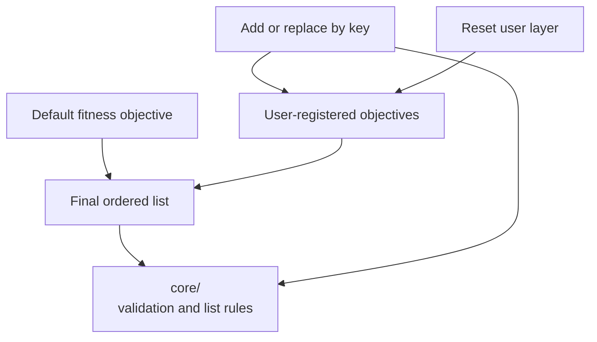

# neat/objectives

Objective-management helpers for the NEAT controller.

Objective management is the layer that decides what "better" means during a
run. In the simplest case that means the default fitness score. In a richer
multi-objective run it can also mean novelty, diversity, complexity, energy
use, or another measurable trait a caller wants to optimize or constrain.

The root chapter keeps the public API small so those responsibilities stay
easy to understand:

1. `_getObjectives()` resolves the final ordered objective list the
   controller should use,
2. `registerObjective()` adds or replaces user-defined objectives by key,
3. `clearObjectives()` removes the user-defined layer and invalidates the
   cached resolution surface.

The detailed mechanics stay in `core/`, where the controller decides when to
keep the default fitness objective, how to validate user-provided objective
descriptors, and how to replace an existing objective without mutating the
old list in place.

Read this root chapter when you want the public controller contract first.
Drop into `core/` when you need the exact validation rules, default-objective
behavior, or list replacement semantics.



Example:

```ts
neat.registerObjective('complexity', 'min', (genome) => genome.nodes.length);
const objectives = neat._getObjectives();
neat.clearObjectives();
```

## neat/objectives/objectives.ts

### _getObjectives

```ts
_getObjectives(): ObjectiveDescriptor[]
```

Build and return the list of registered objectives for this NEAT instance.

This is the resolution step that turns controller configuration into the
final ordered objective list used by the rest of the multi-objective flow.
It reuses a cached list when available, otherwise it composes the active
default objective layer with the valid user-registered objective layer and
stores the resulting sequence for later reads.

Use this when you need to inspect or debug the exact objective set a run will
evaluate rather than the raw options that happened to be configured earlier.

Parameters:
- `this` - - NEAT host exposing multi-objective options and the cached objective list.

Returns: Objective descriptors in the order they should be applied.

Example:

```ts
const objectives = neat._getObjectives();
console.log(objectives.map((objective) => objective.key));
```

### registerObjective

```ts
registerObjective(
  key: string,
  direction: "max" | "min",
  accessor: (genome: GenomeLike) => number,
): void
```

Register a new objective descriptor.

Use this to extend or refine the controller's definition of progress. If an
objective with the same key already exists, the new descriptor replaces it so
callers can update objective behavior without manually clearing the full list
first.

Registering an objective only updates configuration and invalidates the
cached resolved list. The final ordered objective set is rebuilt lazily the
next time {@link _getObjectives} runs.

Parameters:
- `this` - - NEAT host exposing multi-objective options and the cached objective list.
- `key` - - Unique name for the objective.
- `direction` - - Whether the objective should be minimized or maximized.
- `accessor` - - Function that extracts a numeric value from a genome.

Returns: Nothing. The host objective configuration is updated in place.

Example:

```ts
neat.registerObjective('energy', 'min', (genome) => genome.cost ?? 0);
```

### clearObjectives

```ts
clearObjectives(): void
```

Clear all registered multi-objectives.

Use this when a run should fall back to its default objective behavior or
when a test needs a clean objective slate before registering a new set. This
clears the user-defined objective layer and invalidates the cached resolved
list so the next read rebuilds it from the remaining controller defaults.

Parameters:
- `this` - - NEAT host exposing multi-objective options and the cached objective list.

Returns: Nothing. Registered user objectives and the cached objective list are cleared.

Example:

```ts
neat.clearObjectives();
const objectives = neat._getObjectives();
```
