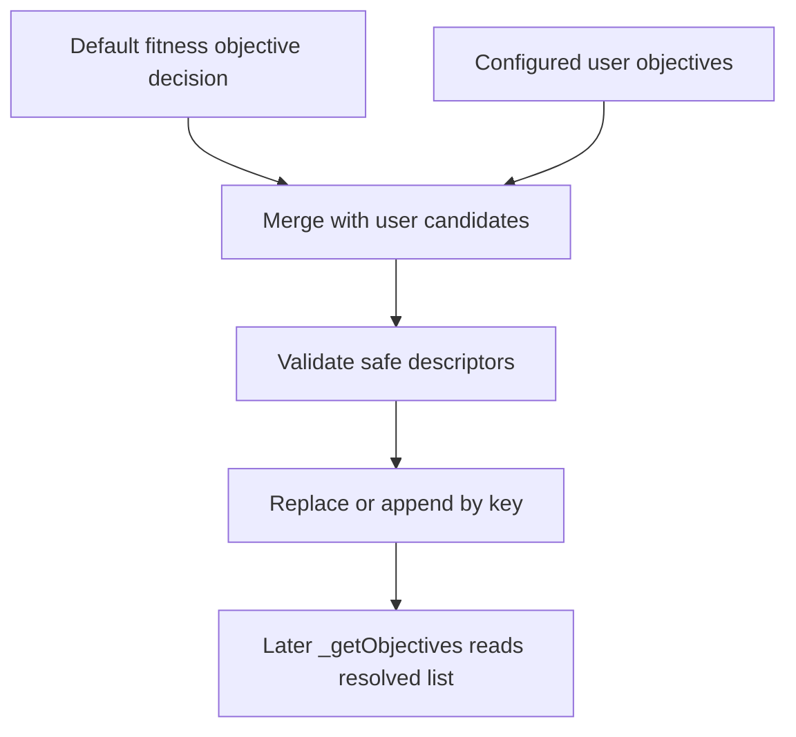

# neat/objectives/core

Shared contracts for the objectives core chapter.

The root `objectives/` chapter explains the public controller API for reading,
registering, and clearing objectives. This narrower file defines the minimal
host shape that the core resolution helpers actually need in order to build
defaults, validate candidates, and manage the cached objective list.

Read this chapter when you want to answer questions such as:
- Which part of the controller state does objective resolution depend on?
- Why does the core mechanics layer use a narrow host contract instead of the
  full `Neat` surface?
- Which settings influence whether the default fitness objective is kept or
  suppressed?

This boundary stays intentionally small so the list-resolution helpers remain
focused on objective mechanics rather than widening into another public
facade.

There is only one exported contract here, but it bundles three important
state families that the core chapter needs to coordinate:

1. configuration for multi-objective mode,
2. the cached resolved objective list,
3. the explicit switch that suppresses the default fitness objective.

Read this file first when you want to understand why the core helpers can
stay small and deterministic: they depend on one narrow host seam instead of
the whole `Neat` controller.

## neat/objectives/core/objectives.types.ts

### NeatLikeWithObjectives

Minimal NEAT host contract required by objective-management helpers.

Objective resolution only needs multi-objective configuration, a cached
objective list, and the flag that suppresses the default fitness objective.
Everything else about the controller is intentionally out of scope for this
mechanics layer.

This host seam is intentionally tiny because the objectives core only answers
one controller question: what should the current resolved objective list be?
State unrelated to that question stays outside the contract.

## neat/objectives/core/objectives.core.ts

Objective-list mechanics used by the NEAT controller.

This chapter holds the default fitness objective, validation helpers, and
the small list-management helpers behind objective registration.

The root objectives chapter explains the public API. This core chapter
explains the mechanics underneath that public surface: when the default
fitness objective appears, how user-provided candidates are filtered,
how the multi-objective container is hydrated lazily, and how replacement by
key stays non-destructive.

Read this chapter when you want to answer questions such as:
- Why does the controller still expose a fitness objective even before the
  user registers anything custom?
- What makes a user objective descriptor safe enough to include?
- Why are objective arrays replaced immutably instead of edited in place?
- Which helpers are responsible for hydrating missing multi-objective state?

The mental model is a four-step resolution flow:
1. decide whether the default fitness objective should exist,
2. collect candidate user objectives when multi-objective mode is active,
3. validate and normalize the candidate list,
4. replace or append objectives by key without mutating the previous list.



The helper order in this file mirrors that flow. Early helpers decide what
must exist by default, middle helpers gather and validate user intent, and
later helpers hydrate missing containers or replace one objective without
mutating an older list in place.

### buildDefaultFitnessObjective

```ts
buildDefaultFitnessObjective(): ObjectiveDescriptor
```

Build the default fitness objective descriptor.

The default fitness objective is the anchor that keeps ordinary NEAT runs
meaningful even when no richer objective policy has been configured yet.
Core resolution builds it on demand so callers do not need a special
bootstrap path elsewhere.

Keeping this builder separate from the collection logic also makes the core
flow easier to teach: one helper decides *whether* the default should exist,
this helper decides *what* that default descriptor looks like.

Returns: Default fitness objective descriptor.

### collectDefaultObjectives

```ts
collectDefaultObjectives(
  neatInstance: NeatLikeWithObjectives,
): ObjectiveDescriptor[]
```

Collect the default objectives when fitness is not suppressed.

This helper keeps the root objective story predictable: unless the host has
explicitly suppressed fitness, the controller still has one baseline notion
of progress even before user-defined objectives are registered.

In other words, this helper keeps ordinary single-objective NEAT behavior as
the default case and makes suppression an explicit opt-out rather than an
accidental side effect of enabling richer objective configuration later.

Parameters:
- `neatInstance` - NEAT host exposing objective settings.

Returns: Default objective descriptors.

### collectUserObjectives

```ts
collectUserObjectives(
  neatInstance: NeatLikeWithObjectives,
): ObjectiveDescriptor[]
```

Collect valid user-registered objectives when multi-objective mode is enabled.

User objectives are intentionally gated twice: multi-objective mode must be
active, and each candidate must still pass structural validation before it is
allowed into the resolved list.

That two-stage gate is what keeps the core chapter honest: configuration may
contain raw candidates, but the resolved objective list only receives entries
that are both contextually enabled and structurally safe.

Parameters:
- `neatInstance` - NEAT host exposing objective settings.

Returns: Valid user objective descriptors.

### ensureMultiObjectiveOptions

```ts
ensureMultiObjectiveOptions(
  neatInstance: NeatLikeWithObjectives,
): { enabled?: boolean | undefined; objectives?: ObjectiveDescriptor[] | undefined; }
```

Ensure the multi-objective options container exists.

Objective registration and resolution are allowed to hydrate this container
lazily so controller construction does not need to eagerly materialize every
optional configuration branch.

This is one of the small helpers that keeps the core chapter mutation-safe:
later logic can assume the container exists without scattering defensive
object creation throughout the file.

Parameters:
- `neatInstance` - NEAT host receiving the multi-objective container.

Returns: Initialized multi-objective options.

### ensureObjectivesList

```ts
ensureObjectivesList(
  multiObjectiveOptions: { enabled?: boolean | undefined; objectives?: ObjectiveDescriptor[] | undefined; },
): ObjectiveDescriptor[]
```

Ensure the objectives list exists on the multi-objective container.

This helper complements container hydration by guaranteeing a writable list
surface for later non-destructive replacement logic.

It exists so registration code can talk about replacing objectives by key
instead of repeatedly guarding against `undefined` lists.

Parameters:
- `multiObjectiveOptions` - Multi-objective container to hydrate.

Returns: Objectives list ready for non-destructive operations.

### getObjectiveCandidates

```ts
getObjectiveCandidates(
  neatInstance: NeatLikeWithObjectives,
): ObjectiveDescriptor[]
```

Get the configured objective candidates.

This helper exposes the raw configured candidates before validation so the
rest of the mechanics layer can separate retrieval from filtering.
That separation makes the later validation helpers easier to test and easier
to explain in the generated docs.

Parameters:
- `neatInstance` - NEAT host exposing objective settings.

Returns: Objective candidates from configuration.

### isMultiObjectiveEnabled

```ts
isMultiObjectiveEnabled(
  neatInstance: NeatLikeWithObjectives,
): boolean
```

Check whether multi-objective mode is enabled with a candidate list.

This guard is intentionally strict: enabling multi-objective mode without an
objective array is treated as incomplete configuration, so downstream helpers
can avoid reasoning about half-hydrated state.

That strictness keeps later helpers simpler because they can assume that a
`true` result means both the mode and the candidate container are present.

Parameters:
- `neatInstance` - NEAT host exposing objective settings.

Returns: `true` when multi-objective mode is enabled and an objective list exists.

### isValidObjective

```ts
isValidObjective(
  candidateObjective: ObjectiveDescriptor | undefined,
): boolean
```

Validate that an objective descriptor has the required shape.

Core resolution only requires a stable key and an accessor function. Other
fields can remain lightweight because this layer's job is to reject clearly
unsafe descriptors, not to impose a heavier policy than the public chapter
promises.

This is intentionally a safety check, not a semantic ranking policy. It tells
the controller whether a descriptor is usable, not whether it is a good idea.

Parameters:
- `candidateObjective` - Candidate descriptor to validate.

Returns: `true` when the descriptor can be used safely.

### replaceObjectiveByKey

```ts
replaceObjectiveByKey(
  objectivesList: ObjectiveDescriptor[],
  objectiveKey: string,
  objectiveDirection: "max" | "min",
  objectiveAccessor: (genome: GenomeLike) => number,
): ObjectiveDescriptor[]
```

Replace the existing objective with the same key and append the new descriptor.

Replacement is immutable on purpose. Callers get a fresh list with prior
matching key removed, which keeps the mechanics predictable and avoids hidden
in-place mutations of a list that another part of the controller might still
be holding.

This is the final fold step in the core flow: once a descriptor is accepted,
replacement by key turns that decision into a new resolved list.

Parameters:
- `objectivesList` - Existing objectives to update.
- `objectiveKey` - Key to replace.
- `objectiveDirection` - Direction for the new objective.
- `objectiveAccessor` - Accessor for the new objective.

Returns: Updated objectives list.
