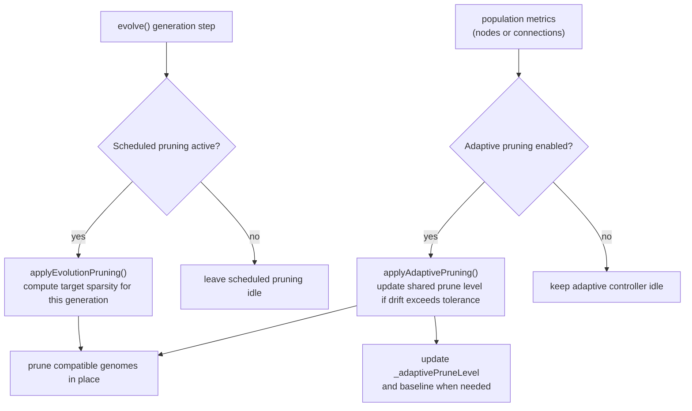

# neat/pruning

Population-pruning orchestration for the NEAT controller.

Pruning is the controller's "remove structure on purpose" chapter.
It answers two different questions that are easy to blur together when you
only look at the public `Neat` methods:

- scheduled evolution pruning: when should the main evolve loop deliberately
  trim genomes according to a generation-based schedule?
- adaptive pruning: when should the controller react to live population
  metrics and move a shared prune level up or down?

The root file keeps those two controller-facing entrypoints together because
callers usually decide between them at the orchestration level, not at the
metric-math level. The lower-level policy resolution and population math live
in `core/`, while `facade/` keeps the stable lazy `Neat` wrappers that call
into this file.

Read this chapter when you want to understand when pruning is triggered and
which controller state changes as a result. Read `core/` when you need the
detailed schedule, baseline, or metric-adjustment rules. Read `facade/` when
you need the public async wrapper behavior on `Neat` itself.



## neat/pruning/pruning.ts

### applyAdaptivePruning

```ts
applyAdaptivePruning(): void
```

Run the adaptive pruning controller.

Use this path when pruning should follow population behavior rather than a
fixed generation calendar. Adaptive pruning watches a chosen population-level
metric, such as mean node count or mean connection count, and nudges one
shared prune level toward the configured sparsity target.

Unlike `applyEvolutionPruning()`, this controller maintains state across
calls. The first adaptive pass captures a baseline metric, later passes
compare the current metric against the target remaining value, and only when
the drift exceeds the tolerance does the controller update
`_adaptivePruneLevel` and reapply that shared level across the population.

This makes adaptive pruning the maintenance-oriented counterpart to the
schedule-driven evolve hook: scheduled pruning answers "is this a pruning
generation?" while adaptive pruning answers "has the population drifted far
enough from the desired complexity level that the prune level should change?"

Returns: Nothing. The baseline and shared prune level may be created or updated, and compatible genomes may then be pruned in place.

Example:

```ts
host.options.adaptivePruning = {
  enabled: true,
  metric: 'connections',
  targetSparsity: 0.4,
  tolerance: 0.05,
  adjustRate: 0.02,
};

applyAdaptivePruning.call(host);
// The host may initialize its baseline, update _adaptivePruneLevel,
// and prune compatible genomes if the metric drift is large enough.
```

### applyEvolutionPruning

```ts
applyEvolutionPruning(): void
```

Apply evolution-time pruning to the current population.

Use this path when pruning should follow the generation schedule rather than
a live feedback loop. The evolve orchestration calls into this entrypoint to
ask a simple controller question: "for this generation, should pruning run,
and if so, how sparse should genomes become right now?"

This function does not maintain long-lived adaptive controller state. Instead
it reads the configured `evolutionPruning` schedule, checks whether the
current generation is inside the active window, computes the ramped target
sparsity for that moment in the run, and forwards the result to the genomes.
The host generation counter is read but not mutated here.

Choose this entrypoint when you want pruning to be predictable and tied to
generation timing. Use `applyAdaptivePruning()` instead when pruning should
react to observed population size or complexity metrics at runtime.

Returns: Nothing. Compatible genomes may be pruned in place when the schedule is active, but no adaptive controller fields are updated.

Example:

```ts
host.generation = 40;
host.options.evolutionPruning = {
  startGeneration: 20,
  interval: 5,
  rampGenerations: 10,
  targetSparsity: 0.3,
};

applyEvolutionPruning.call(host);
// Compatible genomes prune themselves using the schedule-derived sparsity.
```
