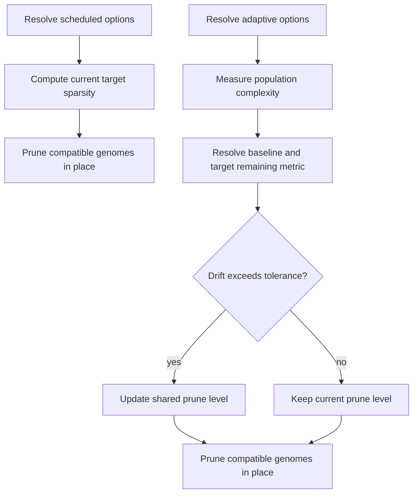

# neat/pruning/core

Minimal NEAT host contract required by pruning helpers.

The pruning boundary only needs schedule settings, population structure, and
two shared adaptive fields, so this contract stays intentionally narrow.

This file is the contract map for the pruning core. It exists so scheduled
pruning and adaptive pruning can share one metric-and-policy layer without
depending on the full `Neat` controller surface.

The contracts divide into three roles:

1. host runtime state: `NeatLikeForPruning`,
2. extracted policy blocks: `EvolutionPruningOptions` and
   `AdaptivePruningOptions`,
3. shared measured evidence: `PopulationMetrics`.

Read this chapter before `pruning.core.ts` when you need to know which state
the pruning helpers are allowed to read, which state they may write back, and
which configuration knobs belong to scheduled versus adaptive control.

## neat/pruning/core/pruning.types.ts

### AdaptivePruningOptions

Adaptive pruning options extracted from the NEAT host.

These options drive the feedback-controller path: which population metric is
observed, what sparsity target should remain, how large a drift is tolerated,
and how quickly the shared prune level is allowed to move.

### EvolutionPruningOptions

Evolution pruning options extracted from the NEAT host.

These options drive the calendar-like pruning path: when pruning starts, how
often it repeats, how quickly the target sparsity ramps in, and which pruning
method is forwarded to compatible genomes.

### NeatLikeForPruning

Minimal NEAT host contract required by pruning helpers.

The pruning boundary only needs schedule settings, population structure, and
two shared adaptive fields, so this contract stays intentionally narrow.

This file is the contract map for the pruning core. It exists so scheduled
pruning and adaptive pruning can share one metric-and-policy layer without
depending on the full `Neat` controller surface.

The contracts divide into three roles:

1. host runtime state: `NeatLikeForPruning`,
2. extracted policy blocks: `EvolutionPruningOptions` and
   `AdaptivePruningOptions`,
3. shared measured evidence: `PopulationMetrics`.

Read this chapter before `pruning.core.ts` when you need to know which state
the pruning helpers are allowed to read, which state they may write back, and
which configuration knobs belong to scheduled versus adaptive control.

### PopulationMetrics

Summary of population metrics used by adaptive pruning.

Adaptive pruning intentionally works on aggregated evidence rather than on
per-genome detail. These means are the small shared measurement surface used
to decide whether the population has drifted far enough from the desired
complexity level to justify changing the prune level.

## neat/pruning/core/pruning.core.ts

Pruning mechanics used by scheduled and adaptive NEAT pruning.

This chapter holds the policy resolution and metric math that sit underneath
the public pruning entrypoints.

The public pruning chapter explains _when_ pruning is invoked. This file
explains how both pruning modes reduce to one shared pipeline:

1. resolve the active policy block,
2. measure the population if adaptive control needs live evidence,
3. compute the target sparsity or shared prune level,
4. apply the resulting pruning instruction across compatible genomes.

Scheduled pruning and adaptive pruning differ mainly in where the target
comes from. Scheduled pruning derives it from generation timing and a ramp.
Adaptive pruning derives it from current population metrics relative to a
remembered baseline.



### applyAdaptivePruneLevelToPopulation

```ts
applyAdaptivePruneLevelToPopulation(
  host: NeatLikeForPruning,
  pruneLevel: number,
): void
```

Apply the shared adaptive prune level to every compatible genome.

This is the final fan-out step for adaptive pruning. The host maintains one
shared prune level, and this helper applies that single controller decision
uniformly across genomes that support sparsity pruning.

Parameters:

- `host` - NEAT host exposing the population.
- `pruneLevel` - Prune level to apply.

Returns: Nothing. Compatible genomes are pruned in place.

### applyPruningToPopulation

```ts
applyPruningToPopulation(
  host: NeatLikeForPruning,
  options: { startGeneration?: number | undefined; interval?: number | undefined; rampGenerations?: number | undefined; targetSparsity?: number | undefined; method?: string | undefined; },
  targetSparsity: number,
): void
```

Apply scheduled pruning to each genome in the population.

By the time this helper runs, policy resolution is already finished. Its job
is simply to fan the computed scheduled sparsity target out across genomes
that actually implement pruning support.

Parameters:

- `host` - NEAT host exposing the population.
- `options` - Active scheduled pruning options.
- `targetSparsity` - Target sparsity to apply.

Returns: Nothing. Genomes are pruned in place when supported.

### computeMeanConnectionCount

```ts
computeMeanConnectionCount(
  host: NeatLikeForPruning,
): number
```

Compute the average connection count per genome.

Connection count is the denser complexity signal commonly used for sparsity
control. Like node count, it is reduced to a population mean so the adaptive
controller reacts to trend rather than to one outlier genome.

Parameters:

- `host` - NEAT host exposing the population.

Returns: Average number of connections per genome.

### computeMeanNodeCount

```ts
computeMeanNodeCount(
  host: NeatLikeForPruning,
): number
```

Compute the average node count per genome.

Node count is one of the two complexity signals the adaptive controller can
watch. It is intentionally averaged so population size changes do not by
themselves distort the pruning signal.

Parameters:

- `host` - NEAT host exposing the population.

Returns: Average number of nodes per genome.

### computeNextAdaptivePruneLevel

```ts
computeNextAdaptivePruneLevel(
  options: { enabled?: boolean | undefined; metric?: string | undefined; targetSparsity?: number | undefined; learningRate?: number | undefined; tolerance?: number | undefined; adjustRate?: number | undefined; },
  currentPruneLevel: number,
  currentMetricValue: number,
  targetRemainingMetric: number,
): number
```

Compute the next adaptive prune level.

Once the controller decides that drift is large enough, this helper turns the
direction of that drift into a bounded update of the shared prune level.
Higher-than-target complexity tightens pruning; lower-than-target complexity
relaxes it.

Parameters:

- `options` - Adaptive pruning options.
- `currentPruneLevel` - Current shared prune level.
- `currentMetricValue` - Current observed metric value.
- `targetRemainingMetric` - Target remaining metric value.

Returns: Updated prune level clamped into the valid sparsity range.

### computePopulationMetrics

```ts
computePopulationMetrics(
  host: NeatLikeForPruning,
): PopulationMetrics
```

Compute the population metrics used by adaptive pruning.

Adaptive pruning reacts to the population as a whole, not to one genome at a
time. This helper produces the small aggregate evidence packet that later
helpers use to decide whether complexity is drifting away from the desired
sparsity target.

Parameters:

- `host` - NEAT host exposing the population.

Returns: Summary of mean node and connection counts.

### computeRampFraction

```ts
computeRampFraction(
  host: NeatLikeForPruning,
  options: { startGeneration?: number | undefined; interval?: number | undefined; rampGenerations?: number | undefined; targetSparsity?: number | undefined; method?: string | undefined; },
): number
```

Compute the ramp completion fraction for scheduled pruning.

The ramp fraction is the soft-start mechanism for scheduled pruning. It lets
the controller phase sparsity in gradually over several generations so the
population does not experience one abrupt structural shock.

Parameters:

- `host` - NEAT host exposing generation state.
- `options` - Active scheduled pruning options.

Returns: Fraction in `[0, 1]` indicating ramp completion.

### computeTargetRemainingMetric

```ts
computeTargetRemainingMetric(
  options: { enabled?: boolean | undefined; metric?: string | undefined; targetSparsity?: number | undefined; learningRate?: number | undefined; tolerance?: number | undefined; adjustRate?: number | undefined; },
  adaptivePruneBaseline: number,
): number
```

Compute the target remaining metric implied by the desired sparsity.

Adaptive pruning expresses its goal as desired sparsity, but the feedback loop
compares live complexity metrics. This helper bridges those two views by
translating the baseline metric into the remaining amount of structure the
controller wants to keep.

Parameters:

- `options` - Adaptive pruning options.
- `adaptivePruneBaseline` - Baseline metric value.

Returns: Target remaining metric value.

### computeTargetSparsityNow

```ts
computeTargetSparsityNow(
  host: NeatLikeForPruning,
  options: { startGeneration?: number | undefined; interval?: number | undefined; rampGenerations?: number | undefined; targetSparsity?: number | undefined; method?: string | undefined; },
): number
```

Compute the target sparsity for the current generation.

Scheduled pruning ramps toward its configured sparsity target instead of
snapping there immediately. This helper converts the current ramp progress
into the exact target sparsity the active generation should use.

Parameters:

- `host` - NEAT host exposing generation state.
- `options` - Active scheduled pruning options.

Returns: Target sparsity for the current generation.

### initializeAdaptivePruningState

```ts
initializeAdaptivePruningState(
  host: NeatLikeForPruning,
): void
```

Ensure the adaptive pruning state exists on the host.

Adaptive pruning keeps one shared prune level on the host so the whole
population can react coherently across generations. This helper bootstraps
that state once, rather than making every downstream helper repeat the same
initialization guard.

Parameters:

- `host` - NEAT host exposing adaptive pruning state.

Returns: Nothing. The shared prune level is initialized when missing.

### resolveActiveAdaptivePruningOptions

```ts
resolveActiveAdaptivePruningOptions(
  host: NeatLikeForPruning,
): { enabled?: boolean | undefined; metric?: string | undefined; targetSparsity?: number | undefined; learningRate?: number | undefined; tolerance?: number | undefined; adjustRate?: number | undefined; } | null
```

Resolve adaptive pruning options when enabled.

This is the narrow on-ramp to the feedback-controller branch. It makes the
rest of the adaptive helpers read linearly by collapsing disabled or missing
configuration into one `null` check.

Parameters:

- `host` - NEAT host exposing adaptive pruning options.

Returns: Adaptive pruning options when enabled, otherwise `null`.

### resolveActiveEvolutionPruningOptions

```ts
resolveActiveEvolutionPruningOptions(
  host: NeatLikeForPruning,
): { startGeneration?: number | undefined; interval?: number | undefined; rampGenerations?: number | undefined; targetSparsity?: number | undefined; method?: string | undefined; } | null
```

Resolve scheduled pruning options when they are active for the current generation.

This helper is the gatekeeper for the calendar-driven pruning path. It keeps
the public pruning wrapper simple by answering one precise question: does the
current generation actually belong to the configured pruning schedule?

Parameters:

- `host` - NEAT host exposing generation and pruning options.

Returns: Evolution pruning options when active, otherwise `null`.

### resolveAdaptivePruneBaseline

```ts
resolveAdaptivePruneBaseline(
  host: NeatLikeForPruning,
  currentMetricValue: number,
): number
```

Resolve and persist the adaptive pruning baseline.

The baseline is adaptive pruning's memory of where the population started
when the controller first engaged. Later drift calculations are measured
against that remembered baseline rather than against a moving target.

Parameters:

- `host` - NEAT host exposing adaptive baseline state.
- `currentMetricValue` - Currently observed metric value.

Returns: Baseline metric value used for adaptation.

### resolveObservedMetricValue

```ts
resolveObservedMetricValue(
  options: { enabled?: boolean | undefined; metric?: string | undefined; targetSparsity?: number | undefined; learningRate?: number | undefined; tolerance?: number | undefined; adjustRate?: number | undefined; },
  metrics: PopulationMetrics,
): number
```

Resolve the currently observed population metric for adaptive pruning.

Adaptive pruning can watch either node count or connection count. This helper
turns the configured metric name into the actual observed value that the rest
of the controller math will compare with the target remaining complexity.

Parameters:

- `options` - Adaptive pruning options.
- `metrics` - Population metric summary.

Returns: Current observed metric value used for adaptation.

### shouldAdjustAdaptivePruning

```ts
shouldAdjustAdaptivePruning(
  options: { enabled?: boolean | undefined; metric?: string | undefined; targetSparsity?: number | undefined; learningRate?: number | undefined; tolerance?: number | undefined; adjustRate?: number | undefined; },
  currentMetricValue: number,
  targetRemainingMetric: number,
  adaptivePruneBaseline: number,
): boolean
```

Decide whether adaptive pruning should adjust the prune level.

This is the dead-band check for the adaptive controller. Small fluctuations
around the target are ignored so the prune level does not chatter on every
minor metric wobble.

Parameters:

- `options` - Adaptive pruning options.
- `currentMetricValue` - Current observed metric value.
- `targetRemainingMetric` - Target remaining metric value.
- `adaptivePruneBaseline` - Baseline metric value.

Returns: `true` when the normalized drift exceeds the configured tolerance.
