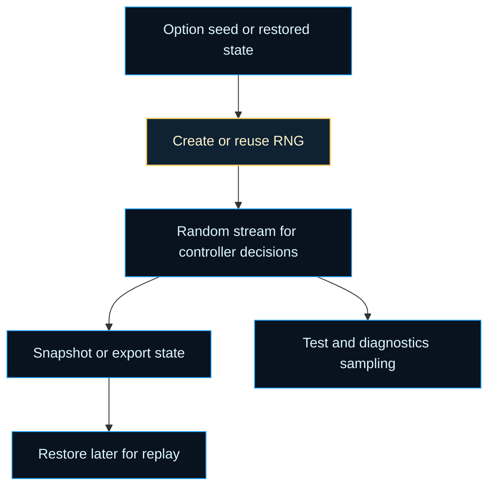
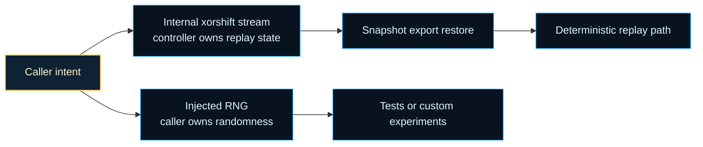

# neat/rng

Deterministic RNG support for the NEAT controller.

This chapter answers the controller-facing randomness question: how does a
NEAT run stay reproducible when mutation, selection, crossover, and other
probabilistic choices all depend on a live random stream? The answer is not
"freeze randomness" but "make randomness inspectable and restorable." The
exported root surface exists so callers can create a deterministic stream,
snapshot its current state, restore that state later, and sample it during
tests or diagnostics without coupling every caller to the full `Neat`
runtime.

The key idea is ownership. Sometimes the caller owns randomness by injecting
an RNG directly. Sometimes the controller owns randomness by advancing and
checkpointing its internal deterministic stream. Replay only makes sense when
that ownership boundary stays explicit. Otherwise a restored run can look
deterministic on paper while silently drawing from a different source of
randomness.

Read this chapter as a replay-oriented map. The root README should help a
reader answer three practical questions quickly:

1. where the RNG comes from,
2. how to capture and restore it,
3. which constants and helper layers define the deterministic contract.



A second way to read the chapter is as an ownership split:



The root RNG entrypoint stays small on purpose because the educational story
has two focused layers underneath it.

- `core/` explains the xorshift-based random stream and seed lifecycle.
- `facade/` explains the stable `Neat` methods used by tests, replay, and
  diagnostics.

Practical reading order:

1. Start with `getOrCreateRng()` to see how the controller resolves its live
   random stream.
2. Read `snapshotRngState()`, `exportRngState()`, and `restoreRngState()` as
   the replay boundary.
3. Read `RngHost` to understand the intentionally small state contract.
4. Use the exported constants when you want to understand the fixed xorshift
   and seed-guarding choices rather than just treat them as opaque numbers.
5. Continue into `facade/` when you want the stable `Neat` wrapper methods.

Historically, reproducible evolutionary runs become much easier to debug once
randomness can be treated as state instead of mystery. This chapter is the
controller-side expression of that shift: not less randomness, but randomness
that can be inspected, exported, restored, and explained.

Example:

```ts
const rng = getOrCreateRng(neat);
const beforeMutation = exportRngState(neat);
const sample = rng();

restoreRngState(neat, beforeMutation);
const replayedSample = getOrCreateRng(neat)();
```

## neat/rng/rng.ts

### RNG_TIME_SCRAMBLE_CONSTANT

Odd scramble factor used while deriving a default seed from time and host
context.

This constant helps mix the fallback seed path before the xorshift stream is
ever created. It matters only when callers did not already provide an RNG,
explicit seed, or restored numeric state.

### RNG_DEFAULT_SEED_FALLBACK

Fallback seed used when the derived or restored seed would otherwise be zero.

Xorshift32 cannot advance from a zero state, so this constant is the guarded
non-zero escape hatch that keeps initialization and restore flows valid.
It is the last-resort seed, not the normal source of entropy.

### RNG_SHIFT_LEFT_PRIMARY

Left-shift used by the first xorshift32 mixing step.

### RNG_SHIFT_RIGHT_PRIMARY

Right-shift used by the middle xorshift32 mixing step.

### RNG_SHIFT_LEFT_SECONDARY

Left-shift used by the final xorshift32 mixing step.

### RNG_NORMALIZATION_DIVISOR

Divisor used to normalize the 32-bit integer state into the `[0, 1)` range.

This is the final step that turns a deterministic integer state transition
into the floating-point random samples consumed by the controller. Keeping it
named makes the integer-state phase and the outward-facing sample phase read
like two explicit steps instead of one opaque formula.

### RNG_POPULATION_OFFSET

Minimum population offset added before time scrambling during default seeding.

The offset keeps empty or tiny populations from collapsing the derived seed
toward zero too easily during initialization. It exists to stabilize the
fallback path, not to encode a meaningful NEAT population heuristic.

### RngHost

Minimal host surface required by the RNG replay utilities.

This contract is deliberately smaller than the full controller. The replay
helpers only need four kinds of state: the live RNG closure, the numeric
checkpoint behind that closure, a little population context for fallback
seeding, and the optional hooks that let callers override the default path.

That small seam is what makes deterministic replay portable. Tests,
diagnostics, import-export helpers, and the controller itself can all reuse
the same RNG utilities without pretending they share one large runtime type.

Example:

```ts
const host: RngHost = {
  population: new Array(10),
  options: { seed: 42 },
};
```

### getOrCreateRng

```ts
getOrCreateRng(
  host: RngHost,
): () => number
```

Return a cached RNG or create a deterministic xorshift RNG when absent.

This is the root runtime entrypoint for randomness. The helper resolves the
random stream in four ordered tiers:

1. reuse a previously created RNG when the stream already exists,
2. prefer a user-supplied RNG when the caller wants to own randomness
   directly,
3. otherwise rebuild the internal stream from restored numeric state or an
   explicit seed,
4. if neither exists, derive a guarded default seed from lightweight host
   context.

That order matters for replay. Once state has been restored, later random
draws should continue from the restored numeric state rather than silently
reseeding the controller. It also matters for ownership: an injected RNG is a
deliberate opt-out from the internal xorshift lifecycle, not just another
fallback.

Parameters:
- `host` - - Object holding RNG state and configuration.

Returns: A function that yields a uniform random value in [0, 1).

Example:

```ts
const rng = getOrCreateRng(neat);
const firstDraw = rng();
const checkpoint = snapshotRngState(neat);
```

### snapshotRngState

```ts
snapshotRngState(
  host: RngHost,
): number | undefined
```

Snapshot the current RNG state for deterministic replay.

Use this when you want an in-memory checkpoint before a risky controller
action such as a mutation batch, debugging session, or deterministic test.
Unlike exporting a whole controller state, this is the smallest replay token:
it captures only the numeric RNG position.

Prefer this helper when the state is staying in memory inside the current
process. Use `exportRngState()` when the same token is about to cross a wider
boundary such as JSON serialization, checkpoint files, or fixture snapshots.

Parameters:
- `host` - - Object holding RNG state.

Returns: The numeric RNG state or undefined when uninitialized.

### restoreRngState

```ts
restoreRngState(
  host: RngHost,
  state: string | number | undefined,
): void
```

Restore a previously captured RNG state.

Restoring state clears the cached RNG function so the next call to
`getOrCreateRng()` rebuilds the stream from the restored numeric position
instead of continuing from an older closure. This separation is deliberate:
the restore step changes replay state immediately, while stream recreation is
deferred until a caller actually needs the next random draw.

Parameters:
- `host` - - Object holding RNG state.
- `state` - - Numeric RNG state to restore.

Example:

```ts
const savedState = exportRngState(neat);
restoreRngState(neat, savedState);
```

### importRngState

```ts
importRngState(
  host: RngHost,
  state: string | number | undefined,
): void
```

Alias for restoring RNG state kept for compatibility with prior surface.

This exists so older callers can keep using the import-style name while the
underlying behavior remains the same replay boundary as `restoreRngState()`.

Parameters:
- `host` - - Object holding RNG state.
- `state` - - Numeric RNG state to restore.

### exportRngState

```ts
exportRngState(
  host: RngHost,
): number | undefined
```

Export the current RNG state for persistence.

Use this when deterministic replay must cross a broader boundary such as
JSON export, checkpointing, or test snapshots. The returned number is the
compact controller-facing representation of the current random stream.

Unlike `snapshotRngState()`, this helper is named for the portability use
case: the returned token is meant to leave the immediate call site and later
come back through `restoreRngState()` or `importRngState()`.

Parameters:
- `host` - - Object holding RNG state.

Returns: The numeric RNG state or undefined when not set.

### sampleRandomSequence

```ts
sampleRandomSequence(
  host: RngHost,
  sampleCount: number,
): number[]
```

Produce a sequence of random samples using the host RNG.

This helper is mainly a diagnostics and testing convenience. It makes the
deterministic stream observable without forcing every caller to hand-roll its
own sampling loop, which is useful when comparing restored-state replay with
fresh execution.

Sampling advances the same live stream used by the controller. Callers that
want a "peek" rather than a committed advance should snapshot first, sample,
then restore the saved state.

Parameters:
- `host` - - Object holding RNG state.
- `sampleCount` - - Number of samples to generate.

Returns: Array of random samples in [0, 1).

Example:

```ts
const before = snapshotRngState(neat);
const samples = sampleRandomSequence(neat, 3);
restoreRngState(neat, before);
```
