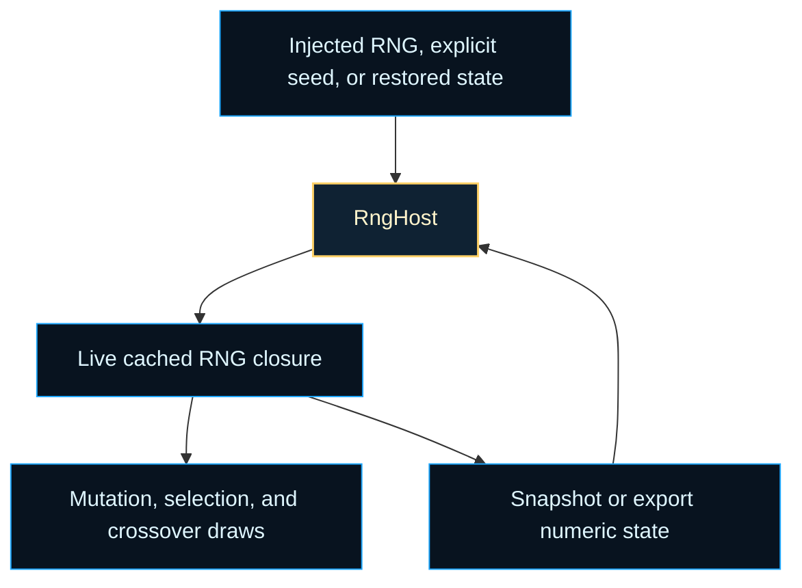

# neat/rng/core

Core contracts for deterministic RNG replay.

This chapter explains the narrow host seam behind the NEAT controller's
random stream. The runtime does not need a heavyweight randomness service to
stay reproducible. It only needs a small place to keep the live generator,
remember its current numeric position, and accept caller-provided randomness
when a test or host wants to own that choice directly.

Read this file as the state map for the replay lifecycle:

1. `options.rng` lets a caller fully own randomness,
2. `options.seed` or `_rngState` gives the utilities enough information to
   rebuild a known stream,
3. `_rng` caches the active closure between draws,
4. `population` provides just enough context to derive a guarded default
   seed when no explicit source is available.

`rng.utils.ts` owns the behavior. This file keeps the required state small
so export, restore, checkpoint, and diagnostics flows can all work without
coupling replay helpers to the full `Neat` implementation.



## neat/rng/core/rng.types.ts

### RngHost

Minimal host surface required by the RNG replay utilities.

This contract is deliberately smaller than the full controller. The replay
helpers only need four kinds of state: the live RNG closure, the numeric
checkpoint behind that closure, a little population context for fallback
seeding, and the optional hooks that let callers override the default path.

That small seam is what makes deterministic replay portable. Tests,
diagnostics, import-export helpers, and the controller itself can all reuse
the same RNG utilities without pretending they share one large runtime type.

Example:

```ts
const host: RngHost = {
  population: new Array(10),
  options: { seed: 42 },
};
```

## neat/rng/core/rng.core.ts

Deterministic RNG primitives used by NEAT replay and diagnostics.

This barrel is the compact reading map for the RNG core layer. Together, the
files re-exported here answer one question: how does a NEAT run make random
choices without giving up deterministic replay?

The story is intentionally split into three shelves:

1. `rng.types.ts` defines the tiny host seam that replay depends on,
2. `rng.utils.ts` turns that seam into a live stream, checkpoint, and
   restore flow,
3. `rng.constants.ts` names the fixed xorshift and seed-guarding choices so
   the algorithm is inspectable instead of magical.

Read the chapter in that order when you want the whole lifecycle: host
state, stream creation, snapshot or export, then later restore.

### RngHost

Minimal host surface required by the RNG replay utilities.

This contract is deliberately smaller than the full controller. The replay
helpers only need four kinds of state: the live RNG closure, the numeric
checkpoint behind that closure, a little population context for fallback
seeding, and the optional hooks that let callers override the default path.

That small seam is what makes deterministic replay portable. Tests,
diagnostics, import-export helpers, and the controller itself can all reuse
the same RNG utilities without pretending they share one large runtime type.

Example:

```ts
const host: RngHost = {
  population: new Array(10),
  options: { seed: 42 },
};
```

### getOrCreateRng

```ts
getOrCreateRng(
  host: RngHost,
): () => number
```

Return a cached RNG or create a deterministic xorshift RNG when absent.

This is the root runtime entrypoint for randomness. The helper resolves the
random stream in four ordered tiers:

1. reuse a previously created RNG when the stream already exists,
2. prefer a user-supplied RNG when the caller wants to own randomness
   directly,
3. otherwise rebuild the internal stream from restored numeric state or an
   explicit seed,
4. if neither exists, derive a guarded default seed from lightweight host
   context.

That order matters for replay. Once state has been restored, later random
draws should continue from the restored numeric state rather than silently
reseeding the controller. It also matters for ownership: an injected RNG is a
deliberate opt-out from the internal xorshift lifecycle, not just another
fallback.

Parameters:
- `host` - - Object holding RNG state and configuration.

Returns: A function that yields a uniform random value in [0, 1).

Example:

```ts
const rng = getOrCreateRng(neat);
const firstDraw = rng();
const checkpoint = snapshotRngState(neat);
```

### snapshotRngState

```ts
snapshotRngState(
  host: RngHost,
): number | undefined
```

Snapshot the current RNG state for deterministic replay.

Use this when you want an in-memory checkpoint before a risky controller
action such as a mutation batch, debugging session, or deterministic test.
Unlike exporting a whole controller state, this is the smallest replay token:
it captures only the numeric RNG position.

Prefer this helper when the state is staying in memory inside the current
process. Use `exportRngState()` when the same token is about to cross a wider
boundary such as JSON serialization, checkpoint files, or fixture snapshots.

Parameters:
- `host` - - Object holding RNG state.

Returns: The numeric RNG state or undefined when uninitialized.

### restoreRngState

```ts
restoreRngState(
  host: RngHost,
  state: string | number | undefined,
): void
```

Restore a previously captured RNG state.

Restoring state clears the cached RNG function so the next call to
`getOrCreateRng()` rebuilds the stream from the restored numeric position
instead of continuing from an older closure. This separation is deliberate:
the restore step changes replay state immediately, while stream recreation is
deferred until a caller actually needs the next random draw.

Parameters:
- `host` - - Object holding RNG state.
- `state` - - Numeric RNG state to restore.

Example:

```ts
const savedState = exportRngState(neat);
restoreRngState(neat, savedState);
```

### importRngState

```ts
importRngState(
  host: RngHost,
  state: string | number | undefined,
): void
```

Alias for restoring RNG state kept for compatibility with prior surface.

This exists so older callers can keep using the import-style name while the
underlying behavior remains the same replay boundary as `restoreRngState()`.

Parameters:
- `host` - - Object holding RNG state.
- `state` - - Numeric RNG state to restore.

### exportRngState

```ts
exportRngState(
  host: RngHost,
): number | undefined
```

Export the current RNG state for persistence.

Use this when deterministic replay must cross a broader boundary such as
JSON export, checkpointing, or test snapshots. The returned number is the
compact controller-facing representation of the current random stream.

Unlike `snapshotRngState()`, this helper is named for the portability use
case: the returned token is meant to leave the immediate call site and later
come back through `restoreRngState()` or `importRngState()`.

Parameters:
- `host` - - Object holding RNG state.

Returns: The numeric RNG state or undefined when not set.

### sampleRandomSequence

```ts
sampleRandomSequence(
  host: RngHost,
  sampleCount: number,
): number[]
```

Produce a sequence of random samples using the host RNG.

This helper is mainly a diagnostics and testing convenience. It makes the
deterministic stream observable without forcing every caller to hand-roll its
own sampling loop, which is useful when comparing restored-state replay with
fresh execution.

Sampling advances the same live stream used by the controller. Callers that
want a "peek" rather than a committed advance should snapshot first, sample,
then restore the saved state.

Parameters:
- `host` - - Object holding RNG state.
- `sampleCount` - - Number of samples to generate.

Returns: Array of random samples in [0, 1).

Example:

```ts
const before = snapshotRngState(neat);
const samples = sampleRandomSequence(neat, 3);
restoreRngState(neat, before);
```

## neat/rng/core/rng.constants.ts

Odd scramble factor used while deriving a default seed from time and host
context.

This constant helps mix the fallback seed path before the xorshift stream is
ever created. It matters only when callers did not already provide an RNG,
explicit seed, or restored numeric state.

### RNG_TIME_SCRAMBLE_CONSTANT

Odd scramble factor used while deriving a default seed from time and host
context.

This constant helps mix the fallback seed path before the xorshift stream is
ever created. It matters only when callers did not already provide an RNG,
explicit seed, or restored numeric state.

### RNG_DEFAULT_SEED_FALLBACK

Fallback seed used when the derived or restored seed would otherwise be zero.

Xorshift32 cannot advance from a zero state, so this constant is the guarded
non-zero escape hatch that keeps initialization and restore flows valid.
It is the last-resort seed, not the normal source of entropy.

### RNG_SHIFT_LEFT_PRIMARY

Left-shift used by the first xorshift32 mixing step.

### RNG_SHIFT_RIGHT_PRIMARY

Right-shift used by the middle xorshift32 mixing step.

### RNG_SHIFT_LEFT_SECONDARY

Left-shift used by the final xorshift32 mixing step.

### RNG_NORMALIZATION_DIVISOR

Divisor used to normalize the 32-bit integer state into the `[0, 1)` range.

This is the final step that turns a deterministic integer state transition
into the floating-point random samples consumed by the controller. Keeping it
named makes the integer-state phase and the outward-facing sample phase read
like two explicit steps instead of one opaque formula.

### RNG_POPULATION_OFFSET

Minimum population offset added before time scrambling during default seeding.

The offset keeps empty or tiny populations from collapsing the derived seed
toward zero too easily during initialization. It exists to stabilize the
fallback path, not to encode a meaningful NEAT population heuristic.

## neat/rng/core/rng.utils.ts

Replay utilities for the deterministic NEAT RNG.

This file turns the small {@link RngHost} contract into one coherent
lifecycle: resolve who owns randomness, create or reuse the active stream,
capture a checkpoint before a risky operation, export that state when it must
cross a persistence boundary, and restore it later so the next draw resumes
from the same numeric position.

The helpers are intentionally small and composable because different callers
care about different slices of that lifecycle. The controller mostly wants a
live RNG, tests often want checkpoints plus short sample runs, and export
logic usually only needs the compact numeric state.

### getOrCreateRng

```ts
getOrCreateRng(
  host: RngHost,
): () => number
```

Return a cached RNG or create a deterministic xorshift RNG when absent.

This is the root runtime entrypoint for randomness. The helper resolves the
random stream in four ordered tiers:

1. reuse a previously created RNG when the stream already exists,
2. prefer a user-supplied RNG when the caller wants to own randomness
   directly,
3. otherwise rebuild the internal stream from restored numeric state or an
   explicit seed,
4. if neither exists, derive a guarded default seed from lightweight host
   context.

That order matters for replay. Once state has been restored, later random
draws should continue from the restored numeric state rather than silently
reseeding the controller. It also matters for ownership: an injected RNG is a
deliberate opt-out from the internal xorshift lifecycle, not just another
fallback.

Parameters:
- `host` - - Object holding RNG state and configuration.

Returns: A function that yields a uniform random value in [0, 1).

Example:

```ts
const rng = getOrCreateRng(neat);
const firstDraw = rng();
const checkpoint = snapshotRngState(neat);
```

### snapshotRngState

```ts
snapshotRngState(
  host: RngHost,
): number | undefined
```

Snapshot the current RNG state for deterministic replay.

Use this when you want an in-memory checkpoint before a risky controller
action such as a mutation batch, debugging session, or deterministic test.
Unlike exporting a whole controller state, this is the smallest replay token:
it captures only the numeric RNG position.

Prefer this helper when the state is staying in memory inside the current
process. Use `exportRngState()` when the same token is about to cross a wider
boundary such as JSON serialization, checkpoint files, or fixture snapshots.

Parameters:
- `host` - - Object holding RNG state.

Returns: The numeric RNG state or undefined when uninitialized.

### restoreRngState

```ts
restoreRngState(
  host: RngHost,
  state: string | number | undefined,
): void
```

Restore a previously captured RNG state.

Restoring state clears the cached RNG function so the next call to
`getOrCreateRng()` rebuilds the stream from the restored numeric position
instead of continuing from an older closure. This separation is deliberate:
the restore step changes replay state immediately, while stream recreation is
deferred until a caller actually needs the next random draw.

Parameters:
- `host` - - Object holding RNG state.
- `state` - - Numeric RNG state to restore.

Example:

```ts
const savedState = exportRngState(neat);
restoreRngState(neat, savedState);
```

### importRngState

```ts
importRngState(
  host: RngHost,
  state: string | number | undefined,
): void
```

Alias for restoring RNG state kept for compatibility with prior surface.

This exists so older callers can keep using the import-style name while the
underlying behavior remains the same replay boundary as `restoreRngState()`.

Parameters:
- `host` - - Object holding RNG state.
- `state` - - Numeric RNG state to restore.

### exportRngState

```ts
exportRngState(
  host: RngHost,
): number | undefined
```

Export the current RNG state for persistence.

Use this when deterministic replay must cross a broader boundary such as
JSON export, checkpointing, or test snapshots. The returned number is the
compact controller-facing representation of the current random stream.

Unlike `snapshotRngState()`, this helper is named for the portability use
case: the returned token is meant to leave the immediate call site and later
come back through `restoreRngState()` or `importRngState()`.

Parameters:
- `host` - - Object holding RNG state.

Returns: The numeric RNG state or undefined when not set.

### sampleRandomSequence

```ts
sampleRandomSequence(
  host: RngHost,
  sampleCount: number,
): number[]
```

Produce a sequence of random samples using the host RNG.

This helper is mainly a diagnostics and testing convenience. It makes the
deterministic stream observable without forcing every caller to hand-roll its
own sampling loop, which is useful when comparing restored-state replay with
fresh execution.

Sampling advances the same live stream used by the controller. Callers that
want a "peek" rather than a committed advance should snapshot first, sample,
then restore the saved state.

Parameters:
- `host` - - Object holding RNG state.
- `sampleCount` - - Number of samples to generate.

Returns: Array of random samples in [0, 1).

Example:

```ts
const before = snapshotRngState(neat);
const samples = sampleRandomSequence(neat, 3);
restoreRngState(neat, before);
```
