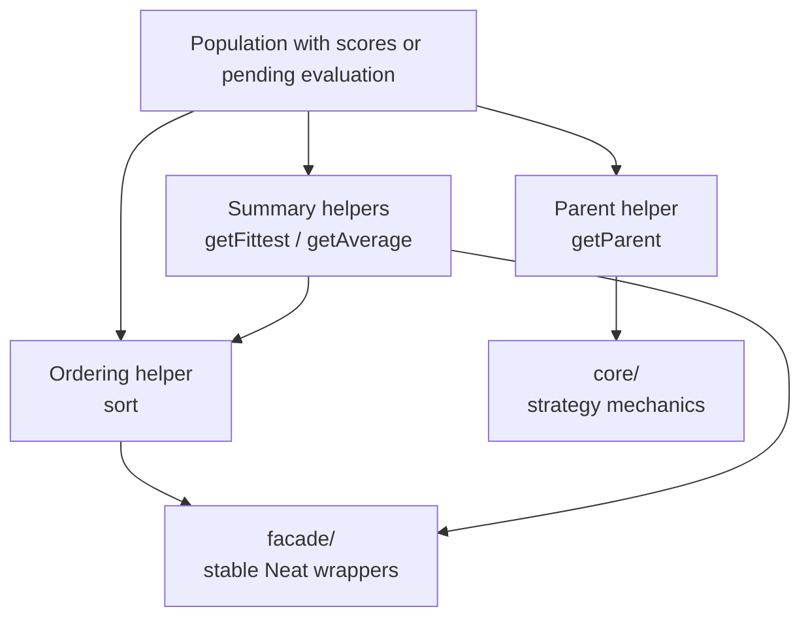

# neat/selection

Controller-facing selection helpers for the NEAT lifecycle.

Selection is the point where a scored population becomes something the rest
of the controller can reason about. The helpers in this root chapter answer
the questions that show up most often during evolution work: which genome is
currently best, what is the current average score, should the population be
re-ordered before inspection, and which parent should breed next under the
active selection strategy.

Keep the mental model in four steps:

1. summary helpers such as {@link getFittest} and {@link getAverage} make
   sure evaluation has happened before they report on the population,
2. ordering helpers such as {@link sort} keep descending-score reads
   deterministic,
3. {@link getParent} delegates the actual parent choice to `core/`, where
   POWER, FITNESS_PROPORTIONATE, and TOURNAMENT strategy mechanics live,
4. `facade/` mirrors the stable `Neat` class entrypoints so callers can use
   these same behaviors without importing the lower-level module directly.

The re-exported constants in this file are the small tuning and traversal
anchors that make those behaviors predictable: fallback scores for
unevaluated genomes, default parameters for the built-in parent-selection
strategies, and explicit index sentinels for threshold scans and tournament
walks.

Read this root chapter when you want the controller story first. Drop into
`core/` when you need to understand the exact selection math, overflow rules,
or threshold scans. Read `facade/` when you are tracing how the public
`Neat` class exposes the same inspection helpers.



Example:

```ts
neat.sort();
const champion = neat.getFittest();
const meanScore = neat.getAverage();
const parent = neat.getParent();
```

## neat/selection/selection.ts

### sort

```ts
sort(): void
```

Sort the internal population in place by descending fitness.

Use this when later controller steps should read the population in explicit
best-first order. The helper applies the same fallback-score semantics used
elsewhere in selection, so genomes without a score are treated as if they had
{@link DEFAULT_SCORE} until evaluation supplies a real value.

This helper is intentionally narrow: it only reorders the current population.
It does not evaluate genomes, mutate them, or change the active parent
selection strategy.

Returns: Nothing. The population array is reordered in place.

Example:

```ts
neat.sort();
const bestScore = neat.population[0]?.score;
```

### getParent

```ts
getParent(): GenomeWithScore
```

Select a parent genome according to the configured selection strategy.

This is the controller-facing gateway into the three built-in strategies:

- `POWER` biases selection toward the front of the sorted population,
- `FITNESS_PROPORTIONATE` performs roulette-style sampling and shifts
  negative scores into a usable threshold space,
- `TOURNAMENT` samples a temporary bracket and walks it with the configured
  win probability.

If the selection mode is unrecognized, the helper falls back to the first
genome in the current population so the controller still has a deterministic
parent candidate instead of failing deep inside crossover logic.

Returns: Genome chosen according to the active selection strategy.

Example:

```ts
const parent = neat.getParent();
const strategyName = neat.options.selection?.name;
```

### getFittest

```ts
getFittest(): GenomeWithScore
```

Return the fittest genome in the population.

This is the safest "show me the current champion" helper for controller code,
telemetry probes, and tests. If the population has not been evaluated yet,
the existing evaluation path is triggered first. If scores exist but the
population is out of descending order, the helper restores that order before
returning the leading genome.

That behavior keeps call sites simple: callers do not need to remember
whether evaluation or sorting has already happened earlier in the generation.

Returns: Genome with the highest current score.

Example:

```ts
const champion = neat.getFittest();
console.log(champion.score);
```

### getAverage

```ts
getAverage(): number
```

Compute the average fitness across the population.

Use this when you want a coarse health signal for the whole generation rather
than the single best genome. The helper ensures evaluation has happened,
folds the total score across the full population, and returns the arithmetic
mean that telemetry, progress logging, and quick sanity checks usually need.

Unlike parent selection, this helper does not care about order. It reports on
the population as a group, which makes it a convenient companion to
{@link getFittest} when you want both "best genome" and "overall generation"
signals side by side.

Returns: Mean fitness across the current population.

Example:

```ts
const meanScore = neat.getAverage();
console.log(`Average score: ${meanScore}`);
```

### DEFAULT_POWER

Default power exponent for POWER selection when none is configured.

A value of `1` keeps POWER selection as a direct index-bias curve without
adding extra front-loading beyond the strategy's normal rank preference.

### DEFAULT_TOURNAMENT_SIZE

Default tournament size when none is configured.

The built-in bracket stays intentionally small so tournament selection keeps
some competitive pressure without collapsing into near-deterministic champion
picks.

### DEFAULT_TOURNAMENT_PROBABILITY

Default tournament win probability when none is configured.

This keeps the top sampled participant favored while still allowing weaker
entrants to remain reachable later in the tournament walk.

### DEFAULT_SCORE

Default score when a genome has no explicit score.

Selection uses one shared fallback so summaries, sorting, and threshold scans
all interpret unevaluated or missing scores consistently.

### FIRST_INDEX

First element index used by guards, fallbacks, and best-first reads.

### SECOND_INDEX

Second element index used by the cheap leading-edge ordering guard.

### LAST_INDEX_OFFSET

Offset for retrieving the last element via length arithmetic.

### LOOP_INDEX_INCREMENT

Loop step used by explicit tournament and threshold walks.

### LAST_ELEMENT_INDEX

Index used with `at()` when checking the tail of the population.

### INITIAL_TOTAL_FITNESS

Initial accumulator value for generation-wide score folds.

### INITIAL_MOST_NEGATIVE_SCORE

Initial most-negative score sentinel for shifted-fitness scans.

### INITIAL_CUMULATIVE_FITNESS

Initial cumulative fitness value for roulette threshold scans.
