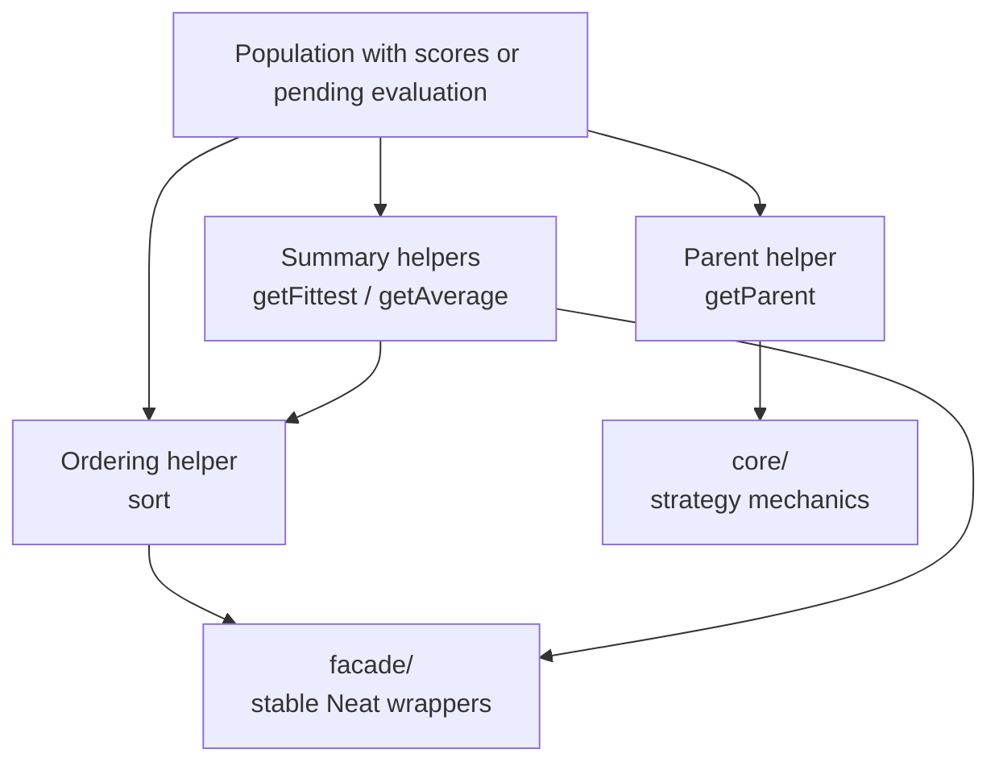
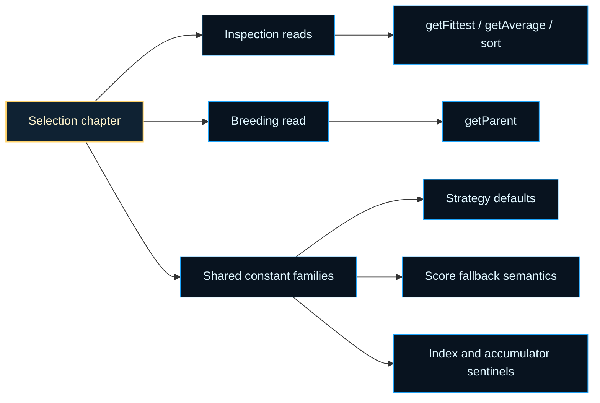

# neat/selection

Controller-facing selection helpers for the NEAT lifecycle.

## Selection Pressure and the Exploration-Exploitation Tradeoff

Selection is the mechanism by which fitness differences translate into
reproductive advantage. The central tension it manages is the *exploration-
exploitation tradeoff*: too much pressure toward the current champion
collapses the population toward one local optimum (exploitation); too little
pressure allows fit solutions to be lost to noise (exploration). The right
balance depends on the problem, the generation count, and how diverse the
current population already is. See Wikipedia contributors,
[Selection (genetic algorithm)](https://en.wikipedia.org/wiki/Selection_(genetic_algorithm)),
for an overview of the design space.

## The Three Built-in Selection Strategies

| Strategy | How parents are chosen | Selection pressure |
|---|---|---|
| `POWER` | bias random selection toward higher-ranked genomes using a power function | tunable via `power` parameter |
| `FITNESS_PROPORTIONATE` | probability proportional to score ("roulette wheel") | moderate, scales with score spread |
| `TOURNAMENT` | sample k random genomes, take the best | tunable via tournament size |

Tournament selection is generally more robust than fitness-proportionate
selection because it is invariant to score scaling and handles negative
fitness values without adjustment.

## What This Boundary Owns

This root chapter answers the questions that show up most often during
evolution work: which genome is currently best, what is the current average
score, should the population be re-ordered before inspection, and which
parent should breed next under the active selection strategy.

The mental model splits into four steps:

1. summary helpers such as {@link getFittest} and {@link getAverage} make
   sure evaluation has happened before they report on the population,
2. ordering helpers such as {@link sort} keep descending-score reads
   deterministic,
3. {@link getParent} delegates the actual parent choice to `core/`, where
   POWER, FITNESS_PROPORTIONATE, and TOURNAMENT strategy mechanics live,
4. `facade/` mirrors the stable `Neat` class entrypoints so callers can use
   these same behaviors without importing the lower-level module directly.

Inspection questions ("who is winning right now?") and breeding questions
("which genome should parent the next child?") are kept separate on purpose
— mixing them would make each call harder to reason about in isolation.

Ownership boundary: selection consumes the current controller-visible
score or objective view. It applies search pressure over that view, but it
does not define canonical fitness, compatibility identity, or species
history by itself.

The re-exported constants in this file are the small tuning and traversal
anchors that make those behaviors predictable: fallback scores for
unevaluated genomes, default parameters for the built-in parent-selection
strategies, and explicit index sentinels for threshold scans and tournament
walks.

It helps to read those constants as three compact families instead of as one
long shelf of numbers:

- selection-pressure defaults such as {@link DEFAULT_POWER} and
  {@link DEFAULT_TOURNAMENT_SIZE} explain how strongly the built-in
  strategies lean toward front-running genomes,
- score semantics such as {@link DEFAULT_SCORE} explain how selection stays
  deterministic before or between evaluation passes,
- traversal sentinels such as {@link FIRST_INDEX} and
  {@link INITIAL_CUMULATIVE_FITNESS} keep the lower-level scans explicit and
  self-consistent.

Read this root chapter when you want the controller story first. Drop into
`core/` when you need to understand the exact selection math, overflow rules,
or threshold scans. Read `facade/` when you are tracing how the public
`Neat` class exposes the same inspection helpers.





Example:

```ts
neat.sort();
const champion = neat.getFittest();
const meanScore = neat.getAverage();
const parent = neat.getParent();
```

## neat/selection/selection.ts

### DEFAULT_POWER

Default power exponent for POWER selection when none is configured.

A value of `1` keeps POWER selection as a direct index-bias curve without
adding extra front-loading beyond the strategy's normal rank preference.
That makes this the mildest built-in pressure setting: strong enough to
prefer the front of the sorted population, but not so aggressive that the
champion becomes nearly inevitable on every draw.

### DEFAULT_SCORE

Default score when a genome has no explicit score.

Selection uses one shared fallback so summaries, sorting, and threshold scans
all interpret unevaluated or missing scores consistently. That matters for
chapter coherence as much as runtime behavior: every inspection helper and
parent-selection guard speaks the same "missing score" language instead of
inventing its own local default.

### DEFAULT_TOURNAMENT_PROBABILITY

Default tournament win probability when none is configured.

This keeps the top sampled participant favored while still allowing weaker
entrants to remain reachable later in the tournament walk. Read it as the
tournament counterpart to selection pressure: a balanced default that keeps
the bracket competitive instead of turning every mini-tournament into a
guaranteed top-seed march.

### DEFAULT_TOURNAMENT_SIZE

Default tournament size when none is configured.

The built-in bracket stays intentionally small so tournament selection keeps
some competitive pressure without collapsing into near-deterministic champion
picks. In practice this means the default strategy samples just enough local
competition to reward strong genomes while still letting non-champion genomes
remain reachable.

### FIRST_INDEX

First element index used by guards, fallbacks, and best-first reads.

Selection logic names this index explicitly because the front of the
population has semantic meaning: it is where champion reads and sorted-bias
strategies begin.

### getAverage

```ts
getAverage(): number
```

Compute the average fitness across the population.

Use this when you want a coarse health signal for the whole generation rather
than the single best genome. The helper ensures evaluation has happened,
folds the total score across the full population, and returns the arithmetic
mean that telemetry, progress logging, and quick sanity checks usually need.

Unlike parent selection, this helper does not care about order. It reports on
the population as a group, which makes it a convenient companion to
{@link getFittest} when you want both "best genome" and "overall generation"
signals side by side.

Parameters:
- `this` - NeatLike NEAT instance containing population and evaluation support.

Returns: Mean fitness across the current population.

Example:

```ts
const meanScore = neat.getAverage();
console.log(`Average score: ${meanScore}`);
```

### getFittest

```ts
getFittest(): GenomeWithScore
```

Return the fittest genome in the population.

This is the safest "show me the current champion" helper for controller code,
telemetry probes, and tests. If the population has not been evaluated yet,
the existing evaluation path is triggered first. If scores exist but the
population is out of descending order, the helper restores that order before
returning the leading genome.

That behavior keeps call sites simple: callers do not need to remember
whether evaluation or sorting has already happened earlier in the generation.

Parameters:
- `this` - NeatLike NEAT instance containing population and evaluation support.

Returns: Genome with the highest current score.

Example:

```ts
const champion = neat.getFittest();
console.log(champion.score);
```

### getParent

```ts
getParent(): GenomeWithScore
```

Select a parent genome according to the configured selection strategy.

This is the controller-facing gateway into the three built-in strategies:

- `POWER` biases selection toward the front of the sorted population,
- `FITNESS_PROPORTIONATE` performs roulette-style sampling and shifts
  negative scores into a usable threshold space,
- `TOURNAMENT` samples a temporary bracket and walks it with the configured
  win probability.

If the selection mode is unrecognized, the helper falls back to the first
genome in the current population so the controller still has a deterministic
parent candidate instead of failing deep inside crossover logic.

Parameters:
- `this` - NeatLike NEAT instance containing population, selection options, and RNG access.

Returns: Genome chosen according to the active selection strategy.

Example:

```ts
const parent = neat.getParent();
const strategyName = neat.options.selection?.name;
```

### INITIAL_CUMULATIVE_FITNESS

Initial cumulative fitness value for roulette threshold scans.

Roulette-style selection accumulates shifted fitness as it walks the
population. This zero point keeps that running threshold explicit and aligned
with the rest of the selection fallback semantics.

### INITIAL_MOST_NEGATIVE_SCORE

Initial most-negative score sentinel for shifted-fitness scans.

FITNESS_PROPORTIONATE selection may need to lift negative scores into a
usable roulette space, and this sentinel marks the baseline from which that
most-negative search starts.

### INITIAL_TOTAL_FITNESS

Initial accumulator value for generation-wide score folds.

Summary helpers begin from this neutral total so whole-population averages
and other folds remain explicit about their starting score semantics.

### LAST_ELEMENT_INDEX

Index used with `at()` when checking the tail of the population.

The evaluation guard only needs the final genome to answer one practical
question: has this generation already been scored all the way through?

### LAST_INDEX_OFFSET

Offset for retrieving the last element via length arithmetic.

This keeps tail access readable in places where explicit length math is more
portable than `at()` for the surrounding helper shape.

### LOOP_INDEX_INCREMENT

Loop step used by explicit tournament and threshold walks.

Naming the increment makes the small index-based scans read like deliberate
traversal code instead of scattered magic numbers.

### SECOND_INDEX

Second element index used by the cheap leading-edge ordering guard.

Comparing the first two genomes is enough for the root helpers' fast
"probably already sorted" check, so this constant marks the smallest useful
comparison boundary.

### sort

```ts
sort(): void
```

Sort the internal population in place by descending fitness.

Use this when later controller steps should read the population in explicit
best-first order. The helper applies the same fallback-score semantics used
elsewhere in selection, so genomes without a score are treated as if they had
{@link DEFAULT_SCORE} until evaluation supplies a real value.

This helper is intentionally narrow: it only reorders the current population.
It does not evaluate genomes, mutate them, or change the active parent
selection strategy.

Parameters:
- `this` - NeatLike NEAT instance whose population should be sorted.

Returns: Nothing. The population array is reordered in place.

Example:

```ts
neat.sort();
const bestScore = neat.population[0]?.score;
```
