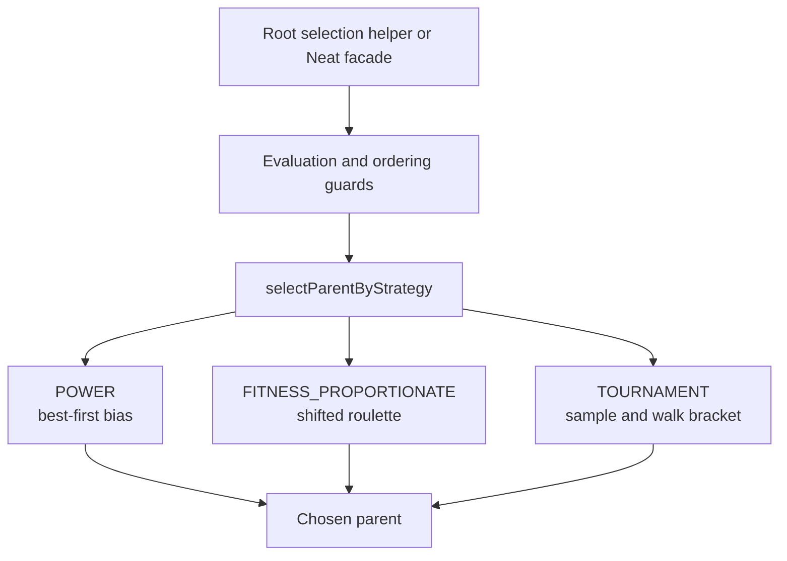

# neat/selection/core

Contracts for the bounded parent-selection mechanics chapter.

The selection core only needs a small runtime seam to answer one practical
question repeatedly during evolution: given an evaluated population, which
genome should parent the next child? These contracts keep that seam narrow so
the mechanics chapter can focus on guard rails, strategy dispatch, and
strategy-specific choice flow rather than broader controller policy.

Read the chapter in this order:
- `GenomeWithScore` narrows the per-genome view to the score-centered fields
  selection actually consumes.
- `SelectionOptions` describes the small set of knobs that alter parent
  choice behavior.
- `NeatLikeWithSelection` captures the host hooks for evaluation, sorting,
  and RNG access.
- `SelectionContext` is the per-call packet shared after dispatch begins.

## neat/selection/core/selection.types.ts

### GenomeWithScore

Genome with a fitness score and arbitrary additional metadata.

The selection core deliberately narrows its view of a genome to one decisive
field: the score that earlier evaluation work produced. That keeps this
boundary reusable across parent selection, ordering, and summary reads
without forcing the selection chapter to understand topology, telemetry,
lineage, or any other controller-owned metadata.

Keep the contract loose when you add new genome-side fields elsewhere in the
controller. If a selection helper can still do its job from score plus opaque
metadata, the extra fields belong outside this boundary.

### SelectionOptions

Selection strategy settings used by the NEAT controller.

These options are intentionally small because the public selection story is
already taught at the root selection chapter and exposed through the stable
`Neat` wrappers. The core layer only needs the knobs that alter actual parent
choice mechanics: which strategy runs, how strongly POWER biases toward the
front, and how TOURNAMENT sizes and probabilistic winner walks behave.

Keeping this contract narrow prevents the core chapter from turning into a
second facade for broader controller policy.

### NeatLikeWithSelection

NEAT-like instance extended with selection-specific state and helpers.

This host contract captures the minimum runtime surface the mechanics need in
order to preserve stable controller assumptions.

Those assumptions are:
- selection reads the current in-memory population rather than rebuilding it,
- evaluation can be triggered before score-dependent reads when needed,
- sorting remains centralized through the host's in-place population order,
- randomness always comes from the controller's configured RNG stream,
- tournament overflow behavior can be relaxed only through an explicit host
  escape hatch.

The result is a small, practical seam for selection behavior and tests rather
than another public API surface.

### SelectionContext

Shared state passed through the internal selection strategies.

This bundles the stable inputs that every strategy needs once dispatch has
already decided which algorithm to run. It lets POWER, FITNESS_PROPORTIONATE,
and TOURNAMENT share one context shape without each helper repeatedly pulling
data off the host.

Read this as the per-selection call frame: one host, one population view,
one resolved selection-options object, and one RNG source.

## neat/selection/core/selection.core.ts

Selection mechanics used by the NEAT controller.

This is the narrow mechanics layer beneath the controller-facing selection
chapter. The root selection helpers answer high-level questions such as
"who is the current champion?" or "which parent should breed next?" This
core chapter explains how those answers stay stable.

Three responsibilities live here:

1. evaluation guards make sure score-dependent reads do not quietly operate
   on an unevaluated population,
2. ordering guards restore descending-score order before strategies that
   depend on best-first traversal,
3. strategy helpers implement the distinct parent-selection flows for POWER,
   FITNESS_PROPORTIONATE, and TOURNAMENT.

Keeping that work in `core/` preserves a clean split. The root selection
chapter stays readable and controller-facing, the facade chapter keeps the
stable `Neat` wrappers thin, and this layer owns the exact mechanics and
fallback rules those higher surfaces rely on.

The exported constants also belong to that story rather than standing alone:
they define the shared defaults, sentinels, and traversal anchors that keep
summary reads, ordering guards, roulette scans, and tournament walks aligned
with one another.

Read the chapter in this order: start with the evaluation and ordering
guards, then the strategy dispatcher, then the strategy-specific helpers for
sorted bias, shifted-fitness roulette, and tournament sampling.



### selectParentByStrategy

```ts
selectParentByStrategy(
  internal: NeatLikeWithSelection,
): GenomeWithScore
```

Select a parent genome according to the configured selection strategy.

This is the single dispatch point shared by the controller-facing selection
helpers. It resolves the active strategy once, builds a compact
{@link SelectionContext}, and then hands off to the concrete algorithm.

The fallback to the first population entry is deliberate. When callers have
configured an unknown strategy name, selection still returns a deterministic
candidate instead of failing unexpectedly deep inside crossover or mutation
flow.

Parameters:
- `internal` - - NEAT host containing population, options, and RNG access.

Returns: A genome chosen according to the active selection strategy.

Example:

```ts
const parent = selectParentByStrategy(neat);
const strategyName = neat.options.selection?.name;
```

### ensurePopulationEvaluated

```ts
ensurePopulationEvaluated(
  internal: NeatLikeWithSelection,
): void
```

Ensure population scores exist by running evaluation if needed.

Selection treats score production as an upstream responsibility, but the
controller still needs a safe guard at the point where score-dependent reads
actually happen. This helper preserves that assumption: callers can ask for
fittest genomes, averages, or parents without manually remembering whether
evaluation already ran this generation.

Parameters:
- `internal` - - NEAT host containing population and evaluation support.

Returns: Nothing. Evaluation is triggered only when the population is unevaluated.

### ensurePopulationSortedDescending

```ts
ensurePopulationSortedDescending(
  internal: NeatLikeWithSelection,
): void
```

Ensure the population is sorted descending by score when out of order.

Several selection reads assume best-first order but should not pay the cost
of sorting when the population is already in the expected shape. This helper
preserves that cheap guard by checking only the leading edge before calling
the shared in-place sort hook.

Parameters:
- `internal` - - NEAT host containing the current population.

Returns: Nothing. Sorting only runs when the first two scores are out of order.

### calculateTotalScore

```ts
calculateTotalScore(
  population: GenomeWithScore[],
): number
```

Calculate the total fitness across the population.

This is the simplest "treat the generation as one pool" fold used by summary
reads. Missing scores are interpreted with the shared selection fallback so
total-score calculations stay aligned with the rest of the chapter.
This helper is not itself a parent-selection strategy, but it lives in the
same mechanics layer because the controller's summary reads should speak the
same score semantics as the parent-selection pipeline.

Parameters:
- `population` - - Genomes in the current population.

Returns: Sum of all scores with missing scores treated as zero.

### DEFAULT_POWER

Default power exponent for POWER selection when none is configured.

A value of `1` keeps POWER selection as a direct index-bias curve without
adding extra front-loading beyond the strategy's normal rank preference.

### DEFAULT_TOURNAMENT_SIZE

Default tournament size when none is configured.

The built-in bracket stays intentionally small so tournament selection keeps
some competitive pressure without collapsing into near-deterministic champion
picks.

### DEFAULT_TOURNAMENT_PROBABILITY

Default tournament win probability when none is configured.

This keeps the top sampled participant favored while still allowing weaker
entrants to remain reachable later in the tournament walk.

### DEFAULT_SCORE

Default score when a genome has no explicit score.

Selection uses one shared fallback so summaries, sorting, and threshold scans
all interpret unevaluated or missing scores consistently.

### FIRST_INDEX

First element index used by guards, fallbacks, and best-first reads.

### SECOND_INDEX

Second element index used by the cheap leading-edge ordering guard.

### LAST_INDEX_OFFSET

Offset for retrieving the last element via length arithmetic.

### LOOP_INDEX_INCREMENT

Loop step used by explicit tournament and threshold walks.

### LAST_ELEMENT_INDEX

Index used with `at()` when checking the tail of the population.

### INITIAL_TOTAL_FITNESS

Initial accumulator value for generation-wide score folds.

### INITIAL_MOST_NEGATIVE_SCORE

Initial most-negative score sentinel for shifted-fitness scans.

### INITIAL_CUMULATIVE_FITNESS

Initial cumulative fitness value for roulette threshold scans.

### selectParentByPower

```ts
selectParentByPower(
  selectionContext: SelectionContext,
): GenomeWithScore
```

Select a parent by power-law distribution on the sorted population.

POWER selection assumes best-first ordering and then biases random choice
toward the front of that ranking. Lower random samples stay near the leading
genomes, while the configured exponent controls how quickly the chance falls
away from the champion.
Read this as the lightest built-in strategy: it does not inspect absolute
score gaps, only the current descending order.

Parameters:
- `selectionContext` - - Shared selection state.

Returns: The chosen parent genome.

### selectParentByFitnessProportionate

```ts
selectParentByFitnessProportionate(
  selectionContext: SelectionContext,
): GenomeWithScore
```

Select a parent using roulette-wheel fitness proportionate selection.

This path turns the current population into a weighted threshold scan. When
some genomes have negative scores, the helper first shifts the whole fitness
space upward so every participant still occupies a non-negative span on the
roulette wheel.
That makes this strategy the most score-sensitive branch in the chapter: it
reacts to relative score magnitude rather than only rank or sampled bracket
ordering.

Parameters:
- `selectionContext` - - Shared selection state.

Returns: The chosen parent genome.

### selectParentByTournament

```ts
selectParentByTournament(
  selectionContext: SelectionContext,
): GenomeWithScore
```

Select a parent by tournament selection.

Tournament selection samples a temporary bracket, orders it by descending
score, then walks from strongest to weakest using the configured win
probability. This gives the controller a middle ground between pure
best-first bias and fully score-proportional roulette.
The sampled bracket is intentionally local: the strategy asks "who wins this
small contest?" rather than "how does the whole population distribute
weight?"

Parameters:
- `selectionContext` - - Shared selection state.

Returns: The chosen parent genome.

### ensurePopulationSortedDescendingForPower

```ts
ensurePopulationSortedDescendingForPower(
  selectionContext: SelectionContext,
): void
```

Ensure the population is sorted descending by score for POWER selection.

POWER selection is the only built-in strategy that depends on the population
already being rank-ordered before index sampling. The narrower guard lives
here instead of in the root chapter so the strategy can preserve that rule
without forcing unrelated selection paths to sort first.

Parameters:
- `selectionContext` - - Shared selection state.

Returns: Nothing. Sorting only runs when the first two entries are out of order.

### calculateFitnessTotals

```ts
calculateFitnessTotals(
  population: GenomeWithScore[],
): { totalFitness: number; minFitnessShift: number; }
```

Compute the total fitness and minimal shift used by roulette selection.

Fitness-proportionate selection must work even when a population contains
negative scores. This helper records the most-negative value, converts that
into a uniform upward shift, and returns the adjusted total that the later
threshold scan uses.
In other words, it prepares the roulette space so every genome still gets a
measurable slice even when raw scores dip below zero.

Parameters:
- `population` - - Genomes in the current population.

Returns: Aggregate fitness totals with the negative-score shift.

### pickByShiftedThreshold

```ts
pickByShiftedThreshold(
  population: GenomeWithScore[],
  selectionThreshold: number,
  minFitnessShift: number,
): GenomeWithScore | undefined
```

Pick the first genome whose shifted cumulative fitness exceeds the threshold.

Read this as the second half of roulette selection. Once the threshold has
been sampled, the helper walks the population once, expanding a cumulative
shifted-fitness window until the threshold lands inside one genome's slice.
This keeps the selection flow linear and deterministic for a fixed RNG draw.

Parameters:
- `population` - - Genomes in the current population.
- `selectionThreshold` - - Random threshold in shifted fitness space.
- `minFitnessShift` - - Amount added to each score to shift negatives.

Returns: The chosen genome when a threshold crossing occurs.

### resolveTournamentOverflow

```ts
resolveTournamentOverflow(
  selectionContext: SelectionContext,
): GenomeWithScore
```

Resolve what happens when tournament size exceeds population size.

Oversized tournaments usually indicate a configuration mistake, so the
default behavior is to fail loudly. Tests and a few tolerant call sites can
opt into the host-level suppression flag when "best effort" random fallback
is more useful than a hard error.
That separation keeps the normal controller path strict while still leaving a
narrow escape hatch for compatibility scenarios.

Parameters:
- `selectionContext` - - Shared selection state.

Returns: A fallback parent genome.

### sampleTournamentParticipants

```ts
sampleTournamentParticipants(
  selectionContext: SelectionContext,
  tournamentSize: number,
): GenomeWithScore[]
```

Sample tournament participants with possible repeats.

Repeats are allowed because this helper models independent random draws from
the current population rather than a unique bracket seeding pass. That keeps
the implementation small and preserves the controller's existing stochastic
behavior.
The result is a lightweight temporary bracket, not a durable roster object.

Parameters:
- `selectionContext` - - Shared selection state.
- `tournamentSize` - - Number of competitors to sample.

Returns: Sampled participants.

### pickTournamentWinner

```ts
pickTournamentWinner(
  selectionContext: SelectionContext,
  sortedParticipants: GenomeWithScore[],
): GenomeWithScore
```

Select a winner from sorted tournament participants.

After participants are sorted best-first, this helper walks the list from the
front and gives each participant a chance to win immediately. The configured
probability therefore controls how often the top entrant wins outright versus
how often weaker entrants remain reachable later in the walk.
This is what makes tournament selection tunable instead of purely greedy.

Parameters:
- `selectionContext` - - Shared selection state.
- `sortedParticipants` - - Participants sorted by descending score.

Returns: The chosen tournament winner.

### getRandomPopulationMember

```ts
getRandomPopulationMember(
  selectionContext: SelectionContext,
): GenomeWithScore
```

Select a random population member using the configured RNG.

This is the small shared fallback used by roulette misses and suppressed
tournament overflow. Centralizing it here keeps every selection path tied to
the same controller RNG stream.
It also makes the fallback semantics explicit instead of hiding ad hoc random
picks inside individual strategies.

Parameters:
- `selectionContext` - - Shared selection state.

Returns: Randomly chosen genome from the current population.
