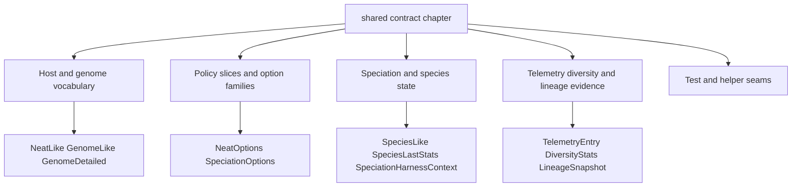

# neat/shared

Shared structural contracts used across the NEAT controller chapters.

This shared chapter keeps the light-weight, controller-facing type surface in
one direct-path location so speciation, telemetry, objectives, species, and
tests can import the same contracts without depending on the heavier root
`Neat` implementation.

The practical value of this boundary is not that it lists many interfaces.
Its value is that it gives the rest of the controller a common language.
Without that common layer, every extracted chapter would gradually invent its
own slightly different idea of what a genome looks like, which option slice
matters, or which telemetry record is considered complete enough to share.
That kind of drift is subtle but expensive: it makes later chapters harder to
read, harder to compose, and harder to trust.

Read this file as the controller's common language layer. Most NEAT chapters
answer behavioral questions such as how speciation works, what telemetry
records, or how objective lists are resolved. This shared surface answers the
structural question underneath them: what is the smallest contract each
chapter needs in order to cooperate without pulling in the full runtime
facade?

The contracts cluster into five practical families:

1. host and genome shapes such as `NeatLike`, `GenomeLike`, and
   `GenomeDetailed`,
2. objective contracts used by `objectives/` and `multiobjective/`,
3. speciation and species-history contracts used by `speciation/` and
   `species/`,
4. telemetry and diagnostics contracts used by `telemetry/`, `diversity/`,
   and `lineage/`,
5. small test-facing seams reused by harnesses and extracted helpers.



Treat the chapter as a reading map rather than a flat glossary. The strongest
way to use it is to start with the smallest shared vocabulary, then move into
the option families that shape controller policy, and only then descend into
the richer evidence contracts used by telemetry and diagnostics.

Practical reading order:

1. Start with `NeatLike`, `GenomeLike`, and `GenomeDetailed` to understand
   the base structural vocabulary.
2. Continue to `NeatOptions` and `SpeciationOptions` when a helper reads or
   rewrites controller policy.
3. Read `TelemetryEntry`, `DiversityStats`, and `LineageSnapshot` when you
   want the evidence layer shared across reporting chapters.
4. Finish with species-history and archive contracts when you need the
   longer-lived reporting or checkpoint surfaces.

## neat/shared/neat.shared.types.ts

### AnyObj

Generic key-value map for temporary shared payloads when helper boundaries
are still being extracted and no stable chapter-specific contract exists yet.
Replace this alias with a dedicated interface as each call boundary settles.

### ComplexityMetrics

Aggregated structural complexity signals for one generation, shared by
telemetry exports, diagnostics summaries, and adaptive budget controllers to
track growth pressure against configured node and connection ceilings.

### ConnectionLike

Lightweight connection shape used by shared telemetry, compatibility, and
history helpers to preserve source/target linkage and optional innovation
provenance without importing runtime connection implementation details.

### DiversityStats

Diversity statistics captured each generation. Individual fields may be
omitted in telemetry output if diversity tracking is partially disabled to
reduce runtime cost.

This contract is the compact summary that lets telemetry, diagnostics, and
dashboards talk about population spread without rerunning the heavier
compatibility, entropy, and lineage calculations. The fields are aggregated
on purpose: they are meant for trend reading, not for reconstructing every
pairwise comparison after the fact.

This is one half of the chapter's evidence language. Diversity tells the
controller how structurally spread out the population currently looks, which
is useful for dashboards, adaptive policies, and regression checks even when
the full pairwise evidence would be too expensive to keep around.

### GenomeDetailed

More concrete genome surface used by telemetry and lineage helpers.
Extends the minimal `GenomeLike` with node/connection shapes and a few
internal bookkeeping fields used by telemetry.

Use this contract when a helper needs more than anonymous structure. The
extra fields here are the ones that repeatedly matter to the read-side NEAT
chapters: stable genome identity, parent tracking, lineage depth, and the
richer node and connection shapes needed for telemetry, history, and
compatibility-adjacent reporting.

In chapter terms, `GenomeDetailed` is the point where the shared vocabulary
stops being merely structural and becomes historically meaningful. Once a
helper needs `_id`, `_parents`, or `_depth`, it is no longer talking about a
generic network shape; it is talking about a genome with an evolutionary
past that later reporting chapters may want to inspect.

### GenomeLike

Minimal genome structural surface used by several helpers (incrementally expanded).

NOTE: `nodes` and `connections` remain intentionally structural/opaque
until a stable public abstraction is finalised.

Read this as the portable genome contract. It is enough for helpers that
need counts, loose structural access, or a primary score, but not enough to
encode every network behavior. More specialized chapters should extend this
shape only when they truly need richer node, connection, or lineage detail.

That restraint matters because this contract sits near the base of the shared
vocabulary. If it grows too eager, every downstream chapter inherits more of
the runtime than it actually needs.

### LineageSnapshot

Snapshot of lineage & ancestry statistics for the current generation.

This is the ancestry companion to `DiversityStats`. Diversity answers how far
apart genomes currently look; lineage answers how much recent family overlap
still exists beneath those structures. Telemetry and adaptive controllers use
both because structural spread and family spread are related but not
interchangeable signals.

Read `LineageSnapshot` and `DiversityStats` together. One describes present
structural variety, the other describes how independent that variety really
is. NEAT benefits from both views because a population can look diverse while
still clustering around a narrow recent ancestry.

### NeatLike

Minimal surface every helper currently expects from a NEAT instance while
extraction continues. Kept intentionally loose; prefer concrete fields
when helpers are stabilised. Represented as a simple record to avoid an
empty interface that duplicates its supertype.

Treat this as the lowest common denominator host type. Serious helper
chapters should usually narrow it quickly into a richer local contract, but
keeping a tiny shared base makes extracted utilities easier to compose
without inventing a fake monolithic controller interface.

Pedagogically, this is the chapter's "start here" host contract. It tells a
reader that the shared layer values portability over completeness, and that a
richer local host contract should only appear when a chapter can justify why.

### NeatOptions

Options subset used by telemetry helpers. Kept narrow to avoid leaking
full runtime options into the helper type surface.

The purpose of this contract is not to model every `Neat` option. It is to
capture the policy knobs that recur across extracted helper chapters:
telemetry flags, diversity sampling, compatibility tuning, species history,
novelty, and a few structural budget fields. If a helper needs more than
this, that is usually a sign it wants a chapter-local host contract instead
of a wider shared type.

Read this as the shared policy slice, not the complete public options model.
It exists so extracted chapters can agree on recurring controller settings
without smuggling the full `Neat` facade through every helper signature.

### NodeLike

Lightweight node shape used by shared telemetry, lineage, and compatibility
contracts that need stable identifiers plus extensible metadata, while
intentionally avoiding coupling to the full runtime `Node` implementation.

### ObjAges

Lookup table from objective key to objective age in generations, used by
dynamic add/remove policies, cooldown gating, and telemetry timeline
reconstruction when objective sets evolve during a run.

### ObjectiveDescriptor

Descriptor for a single optimisation objective (single or multi‑objective runs).

This is the shared currency between the `objectives/` chapter that manages
objective lists and the `multiobjective/` chapter that later ranks genomes by
those objectives. The contract stays intentionally small: a stable key, a
direction, and one accessor that can read the relevant numeric evidence from
a genome.

Examples:

Add a maximisation objective for accuracy
```ts
const accuracyObj: ObjectiveDescriptor = {
  key: 'accuracy',
  direction: 'max',
  accessor: g => g.score ?? 0
};
```

Add a minimisation objective for network complexity
```ts
const complexityObj: ObjectiveDescriptor = {
  key: 'complexity',
  direction: 'min',
  accessor: g => (g.nodes.length + g.connections.length)
};
```

### ObjectiveEvent

Objective lifecycle event emitted whenever a dynamic objective policy adds
or removes an objective during evolution, allowing telemetry and audits to
reconstruct objective-set changes generation by generation.

### ObjEvent

Backward-compatible alias for objective lifecycle events emitted when
objective sets change during dynamic multi-objective runs, preserving older
helper signatures that still reference the historical type name.

**Deprecated:** Use `ObjectiveEvent` instead.

### ObjImportance

Lookup table from objective key to per-objective dispersion metrics, so
dynamic objective scheduling can identify stale, collapsed, or low-signal
objectives without recomputing full per-genome objective distributions.

### ObjImportanceEntry

Dispersion metrics for one objective over a recent sampling window, used to
estimate whether that objective still contributes meaningful ranking signal
before dynamic objective policies decide to keep, demote, or remove it.

### OperatorStat

Per-generation statistic for a genetic operator.

Success is operator‑specific (e.g. produced a structurally valid mutation).
A high attempt count with low success can indicate constraints becoming tight
(e.g. structural budgets reached) – useful for adaptive operator scheduling.

### OperatorStatsRecord

Aggregated operator attempt and success counters folded over a telemetry
window, allowing dashboards and adaptive schedules to compute stable
operator hit rates without replaying per-generation operator rows.

### ParetoArchiveEntry

Pareto archive entry capturing a genome plus its objective values.

This contract is intentionally sparse because the archive is primarily a
preservation boundary. The stored genome captures the candidate itself, while
`objectives` preserves the exact multi-objective evidence that justified its
place on the frontier at the time it was archived.

### PerformanceMetrics

Timing metrics for coarse evolutionary phases (milliseconds).

These timings are intentionally coarse. They exist to reveal where a run is
spending time at the chapter level, not to replace a profiler. That makes
them useful inside telemetry exports and regression-oriented dashboards where
simple evaluation-versus-evolution trends are more valuable than exhaustive
trace detail.

### SpeciationHarnessContext

Minimal runtime surface required by speciation helpers.
Tests and harnesses can narrow the options type via the generic parameter.

This host contract is intentionally more specific than `NeatLike` because
speciation is one of the most stateful controller phases. The helpers need
the live population, the species registry, threshold-tuning accumulators,
and the compatibility read itself, but they still do not need the entire
public `Neat` facade.

### SpeciationOptions

Speciation options for the NEAT speciation controller.

Extends {@link NeatOptions} with speciation-specific configuration used by:
- Compatibility-threshold based species assignment
- Adaptive threshold controllers (PID-like)
- Species allocation telemetry (history snapshots)

This is the shared policy slice that lets speciation helpers stay narrowly
typed without importing the full controller configuration object. Read it as
the option family that shapes how species are formed, protected, and recorded
over time.

### SpeciesAlloc

Per-species offspring allocation result used by reproduction orchestration
to decide how many children each species contributes to the next generation,
whether represented as absolute counts or normalized allocation weights.

### SpeciesHistoryEntry

Species statistics captured for a particular generation.

This is the history-buffer unit used by the `species/` chapter. One entry
answers "what did the species table look like at this generation boundary?"
without requiring callers to inspect the live registry directly.

### SpeciesHistoryStat

Per-species summary row captured at a generation boundary so species-history
exports can report species size, best score trajectory, and stagnation
progression without reading mutable live registry state.

### SpeciesHistoryStatExtended

Extended per-species historical snapshot that adds optional lazily computed
metrics, such as innovation-id spread and enabled-connection ratio, when a
caller requests richer history output beyond the base summary row.

### SpeciesLastStats

Rolling statistics tracked for each species between generations.
These values inform stagnation heuristics and adaptive controllers.

These are controller-maintenance values rather than polished reporting rows.
They exist so live speciation logic can remember recent behavior before the
`species/` chapter later projects that state into user-facing summaries.

### SpeciesLike

Internal species representation used by helpers. Kept minimal and structural.

This is the live registry shape behind the stronger `speciation/` and
`species/` chapters. It is intentionally not a polished reporting format;
instead it holds the small amount of state those chapters repeatedly need to
maintain or summarize: membership, best score, improvement timing, and room
for implementation-specific bookkeeping.

### TelemetryEntry

Telemetry summary for one generation.

Optional properties are feature‑dependent; consumers MUST test for presence.

This is the shared "one generation of evidence" contract behind the
telemetry subtree. Instead of forcing callers to stitch together diversity,
lineage, operator stats, objectives, complexity, and performance from many
different buffers, the recorder and export helpers fold those signals into
one generation-stamped summary row.

In the shared chapter, this is the fullest evidence contract. Earlier types
define the vocabulary; `TelemetryEntry` shows how that vocabulary is folded
into one readable generation snapshot that exporters, dashboards, tests, and
diagnostics can all share.

Read the fields in families:
- run position and headline outcome: `gen`, `best`, `species`, `hyper`
- diversity and lineage evidence: `diversity`, `lineage`
- objective and Pareto context: `objectives`, `objImportance`, `objAges`, `objEvents`, `fronts`
- operator and runtime diagnostics: `ops`, `complexity`, `perf`, `rng`

Example:

```ts
function logSummary(t: TelemetryEntry) {
  console.log(`Gen ${t.gen} best=${t.best.toFixed(4)} species=${t.species}`);
  if (t.diversity) console.log('Mean compat', t.diversity.meanCompat);
}
```
