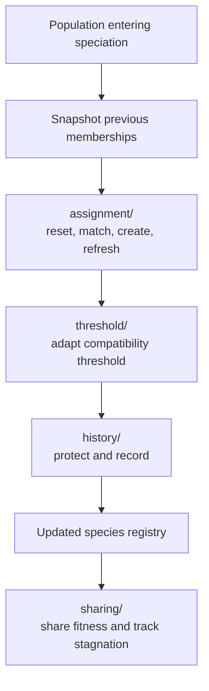

# neat/speciation

Assign genomes into species and maintain the controller's species state.

Speciation is the controller phase that keeps a NEAT population diverse
enough to keep exploring. Instead of letting one temporarily strong lineage
absorb the whole run, this boundary repeatedly answers three practical
questions:

1. which genomes still belong together under the current compatibility rule,
2. whether the compatibility threshold should move to keep the species count
   healthy,
3. which species should remain protected, penalized, or recorded for the next
   generation.

The root file stays orchestration-first so callers can read the full
controller story in one place. The detailed mechanics then branch into the
helper chapters that own one responsibility each:

- `assignment/` snapshots old memberships, clears species, reassigns genomes,
  and refreshes representatives,
- `threshold/` keeps the compatibility threshold near the intended species
  count,
- `history/` records teaching- and telemetry-friendly snapshots and applies
  age-based protection,
- `sharing/` normalizes within-species scores and tracks stagnation.

Read this root chapter when you want the speciation lifecycle first. Drop
into the helper folders when you want the exact assignment heuristics,
threshold controller, or history bookkeeping.



Example:

```ts
neat._speciate();
neat._applyFitnessSharing();
neat._updateSpeciesStagnation();
```

## neat/speciation/speciation.ts

### _speciate

```ts
_speciate(): void
```

Assign genomes into species based on compatibility distance.

This is the main controller-facing speciation pass. It preserves the previous
species snapshot for telemetry and history, rebuilds memberships against the
current representatives, adjusts the compatibility threshold, refreshes the
live representatives, applies optional age-based protection, records a new
history row, and trims the history buffer.

In other words, this helper does not merely "cluster genomes." It keeps the
long-lived species registry coherent across generations so later phases such
as selection, pruning, telemetry, and archive inspection can reason about a
stable notion of species identity.

Parameters:
- `this` - - Speciation harness context.

Returns: Nothing.

Example:

```ts
neat._speciate();
console.log(neat._species.length);
```

### _applyFitnessSharing

```ts
_applyFitnessSharing(): void
```

Apply fitness sharing to penalize similarity within species.

Use this after species assignment when a dense cluster should no longer keep
all of its raw score advantage. The helper resolves the configured sharing
radius and delegates to `sharing/`, where each genome's score contribution is
softened according to how crowded its neighborhood is.

This is intentionally separate from {@link _speciate}. Some runs want species
bookkeeping without immediately renormalizing scores, while others use
sharing as a deliberate second pass after assignment has stabilized.

Parameters:
- `this` - - Neat instance context with species array and compatibility distance function.

Example:

```ts
neat._speciate();
neat._applyFitnessSharing();
```

### _sortSpeciesMembers

```ts
_sortSpeciesMembers(
  species: SpeciesLike,
): void
```

Sort species members by descending score.

This small helper keeps species-local ranking deterministic before best-score
reads, stagnation updates, or representative decisions depend on member
order. Missing scores fall back to the shared speciation score sentinel so
unevaluated members do not break the ordering step.

Even though the implementation is tiny, the helper exists as a named boundary
because multiple speciation flows need the same ordering rule.

Parameters:
- `species` - - Species to sort.

Example:

```ts
neat._sortSpeciesMembers(neat._species[0]);
```

### _updateSpeciesStagnation

```ts
_updateSpeciesStagnation(): void
```

Update stagnation counters for all species.

This is the maintenance pass that decides whether a species is still making
progress. It resolves the configured stagnation window, sorts each species so
"best member" comparisons are stable, and then delegates to `sharing/` to
mark stagnant species and prune them when necessary.

Read this together with {@link _applyFitnessSharing} if you want the
post-assignment story: one helper reduces the dominance of crowded species,
and the other decides whether a species has stopped earning its place in the
run.

Parameters:
- `this` - - Neat instance context with species array and generation counter.

Example:

```ts
neat._speciate();
neat._updateSpeciesStagnation();
```
