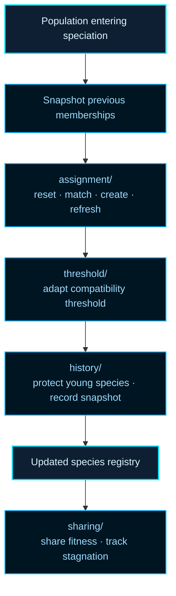

# neat/speciation

Assign genomes into species and maintain the controller's species state.

## Why Speciation Exists

In a purely competitive population, a genome with a temporarily strong
topology would rapidly clone itself and crowd out every structurally different
solution. New topologies — which often need several generations to tune their
weights — would be eliminated before they had a chance to prove useful. NEAT
solves this with _speciation_: genomes are grouped by structural similarity,
and fitness is shared within each group rather than globally. A new topology
that scores below the population average still earns enough shared fitness to
survive long enough to refine itself.

This idea parallels niche preservation in natural evolution, where
ecological niches let different strategies coexist even when one currently
dominates on a shared metric. See Wikipedia contributors,
[Fitness sharing](https://en.wikipedia.org/wiki/Fitness_sharing), and
Stanley and Miikkulainen,
[Evolving Neural Networks through Augmenting Topologies](https://nn.cs.utexas.edu/?stanley:ec02),
for the original motivation and formal definition.

## Compatibility Distance

Two genomes belong to the same species when their _compatibility distance_ δ
falls below the current threshold:

```
δ = (c₁ · E) / N  +  (c₂ · D) / N  +  c₃ · W̄
```

E = excess gene count, D = disjoint gene count, N = larger genome size,
W̄ = mean weight difference of matching genes, c₁/c₂/c₃ = tunable
coefficients. High δ means the genomes represent structurally different
evolutionary lineages.

## Lifecycle

This boundary repeatedly answers three practical questions per generation:

1. Which genomes still belong together under the current compatibility rule?
2. Should the compatibility threshold move to keep the species count healthy?
3. Which species should be protected, penalized, or pruned for the next round?

The root file stays orchestration-first. The detailed mechanics live in four
helper chapters:

- `assignment/` — snapshot old memberships, clear, reassign, refresh representatives,
- `threshold/` — adaptively tune δ to keep the species count near a target,
- `history/` — record teaching-friendly snapshots and apply age-based protection,
- `sharing/` — normalize scores within species and track stagnation.

The two-phase ownership matters: assignment and threshold tuning establish
canonical species identity (which determines crossover alignment and replay
semantics). The history and sharing stages are controller-policy overlays
applied _after_ grouping; they rewrite fitness views and bookkeeping without
changing identity or innovation-number alignment.



Read this root chapter when you want the speciation lifecycle as a whole.
Drop into the helper folders for the exact assignment heuristics, threshold
controller, or history bookkeeping.

Example:

```ts
neat._speciate();
neat._applyFitnessSharing();
neat._updateSpeciesStagnation();
```

## neat/speciation/speciation.ts

### _applyFitnessSharing

```ts
_applyFitnessSharing(): void
```

Apply fitness sharing to penalize similarity within species.

Use this after species assignment when a dense cluster should no longer keep
all of its raw score advantage. The helper resolves the configured sharing
radius and delegates to `sharing/`, where each genome's current score field is
rewritten as a controller-side shared-fitness overlay according to how
crowded its neighborhood is. The underlying evaluated score evidence remains
upstream of this pass.

This is intentionally separate from {@link _speciate}. Some runs want species
bookkeeping without immediately renormalizing scores, while others use
sharing as a deliberate second pass after assignment has stabilized.

Parameters:

- `this` - Neat instance context with species array and compatibility distance function.

Example:

```ts
neat._speciate();
neat._applyFitnessSharing();
```

### _sortSpeciesMembers

```ts
_sortSpeciesMembers(
  species: SpeciesLike,
): void
```

Sort species members by descending score.

This small helper keeps species-local ranking deterministic before best-score
reads, stagnation updates, or representative decisions depend on member
order. Missing scores fall back to the shared speciation score sentinel so
unevaluated members do not break the ordering step.

Even though the implementation is tiny, the helper exists as a named boundary
because multiple speciation flows need the same ordering rule.

Parameters:

- `species` - Species to sort.

Example:

```ts
neat._sortSpeciesMembers(neat._species[0]);
```

### _speciate

```ts
_speciate(): void
```

Assign genomes into species based on compatibility distance.

This is the main controller-facing speciation pass. It preserves the previous
species snapshot for telemetry and history, rebuilds memberships against the
current representatives, adjusts the compatibility threshold, refreshes the
live representatives, applies optional age-based protection, records a new
history row, and trims the history buffer.

In other words, this helper does not merely "cluster genomes." It keeps the
long-lived species registry coherent across generations so later phases such
as selection, pruning, telemetry, and archive inspection can reason about a
stable notion of species identity.

Parameters:

- `this` - Speciation harness context.

Returns: Nothing.

Example:

```ts
neat._speciate();
console.log(neat._species.length);
```

### _updateSpeciesStagnation

```ts
_updateSpeciesStagnation(): void
```

Update stagnation counters for all species.

This is the maintenance pass that decides whether a species is still making
progress. It resolves the configured stagnation window, sorts each species so
"best member" comparisons are stable, and then delegates to `sharing/` to
mark stagnant species and prune them when necessary.

The resulting `bestScore` and `lastImproved` values belong to controller-side
species bookkeeping, not to the canonical genome contract.

Read this together with {@link _applyFitnessSharing} if you want the
post-assignment story: one helper reduces the dominance of crowded species,
and the other decides whether a species has stopped earning its place in the
run.

Parameters:

- `this` - Neat instance context with species array and generation counter.

Example:

```ts
neat._speciate();
neat._updateSpeciesStagnation();
```
