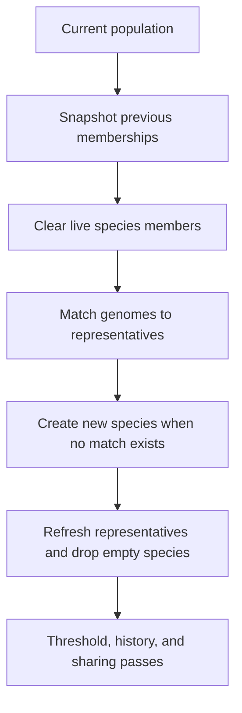

# neat/speciation/assignment

Speciation assignment mechanics.

This chapter owns the population-to-species remap that sits at the front of
every speciation pass. The root speciation chapter explains why the
controller keeps species at all; this file explains how the live registry is
rebuilt once a new generation is ready to be grouped.

Read the assignment flow in four stages:

1. preserve the previous membership picture so telemetry and history can
   compare "before" and "after",
2. clear live member arrays without discarding the long-lived species
   records themselves,
3. walk the population and either match each genome to an existing
   representative or create a fresh species,
4. refresh representatives so later threshold, history, sharing, and
   stagnation passes all read a coherent post-assignment registry.

The boundary stays intentionally narrow. These helpers decide membership,
but they do not tune the compatibility threshold, normalize scores, or write
history rows. That separation keeps the speciation pipeline legible: this
file answers "where does each genome belong right now?" and the neighboring
chapters handle what happens after that answer exists.



## neat/speciation/assignment/speciation.assignment.utils.ts

### assignPopulationToSpecies

```ts
assignPopulationToSpecies(
  speciationContext: SpeciationHarnessContext<TOptions>,
  options: TOptions,
): void
```

Assign each genome in the population to a compatible species.

This is the main assignment walk. Each genome gets one chance to join an
existing species by comparing against the current representatives. When no
representative falls within the active compatibility threshold, the helper
seeds a new species immediately so later genomes can also match against that
new lineage during the same pass.

That "match or create" rule is what keeps the registry coherent for later
threshold adaptation and score sharing: by the time this helper finishes,
every genome belongs to exactly one live species.

Parameters:
- `speciationContext` - - Speciation harness context.
- `options` - - Speciation options.

Returns: Nothing.

### createSpeciesForGenome

```ts
createSpeciesForGenome(
  speciationContext: SpeciationHarnessContext<TOptions>,
  genome: GenomeDetailed,
): void
```

Create a new species for the provided genome.

New species creation is the explicit fallback for genomes that do not fit any
current representative. The helper allocates a fresh species id, seeds the
first member and representative from the incoming genome, initializes the
best-score view for later stagnation logic, and records the creation
generation for age-aware downstream behavior.

Parameters:
- `speciationContext` - - Speciation harness context.
- `genome` - - Genome that starts a new species.

Returns: Nothing.

### findCompatibleSpecies

```ts
findCompatibleSpecies(
  speciationContext: SpeciationHarnessContext<TOptions>,
  options: TOptions,
  genome: GenomeDetailed,
): SpeciesLike | undefined
```

Find a compatible species representative for the given genome.

This is the local "does this genome still belong here?" decision at the
heart of assignment. The helper compares the genome against each current
representative using the controller's compatibility distance and returns the
first species that falls inside the active threshold.

It deliberately does not rank all possible matches or try to optimize global
placement. The assignment contract is smaller: scan the existing registry in
deterministic order, accept the first compatible home, otherwise signal that
a new species should be created.

Parameters:
- `speciationContext` - - Speciation harness context.
- `options` - - Speciation options.
- `genome` - - Genome to match.

Returns: Matching species or undefined.

### refreshSpeciesRepresentatives

```ts
refreshSpeciesRepresentatives(
  speciationContext: SpeciationHarnessContext<TOptions>,
): void
```

Refresh representatives and remove empty species.

After assignment, some prior species may have lost every member and some
surviving species need a new representative taken from their rebuilt member
list. This helper performs that cleanup so downstream passes do not have to
reason about empty shells or stale representative pointers.

Parameters:
- `speciationContext` - - Speciation harness context.

Returns: Nothing.

### resetSpeciesMembers

```ts
resetSpeciesMembers(
  speciationContext: SpeciationHarnessContext<TOptions>,
): void
```

Clear member lists for all species.

Assignment keeps the existing species records, ids, and representatives long
enough to reuse them as comparison anchors for the incoming population. What
must be cleared is only the live member list, so the next pass can rebuild
memberships from scratch instead of accidentally accumulating stale members.

Parameters:
- `speciationContext` - - Speciation harness context.

Returns: Nothing.

### snapshotPreviousMembers

```ts
snapshotPreviousMembers(
  speciationContext: SpeciationHarnessContext<TOptions>,
): void
```

Snapshot current species memberships for telemetry.

This preserves the "before reassignment" view of the registry so later
telemetry, history, and species-reporting code can compare how memberships
moved across the current speciation pass. The helper records only species ids
and genome ids because assignment does not need to duplicate full genome
state in order to preserve that continuity signal.

Parameters:
- `speciationContext` - - Speciation harness context.

Returns: Nothing.
