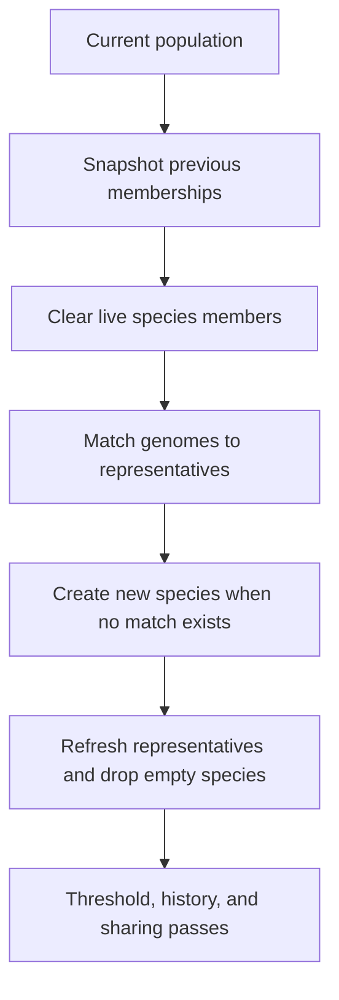
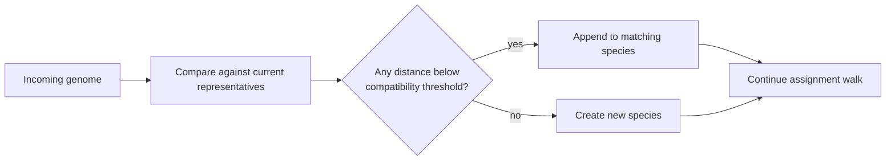

# neat/speciation/assignment

Speciation assignment mechanics.

This chapter owns the population-to-species remap that sits at the front of
every speciation pass. The root speciation chapter explains why the
controller keeps species at all; this file explains how the live registry is
rebuilt once a new generation is ready to be grouped.

In the original NEAT story, speciation matters because new structural ideas
are usually weak before they become useful. Assignment is the moment where
the controller decides whether a genome still belongs to an existing niche or
whether it is different enough to justify a new one. That makes this chapter
the doorway into diversity: not the place where the algorithm judges final
quality, but the place where it decides which experiments are allowed to
develop side by side.

Read the assignment flow in four stages:

1. preserve the previous membership picture so telemetry and history can
   compare "before" and "after",
2. clear live member arrays without discarding the long-lived species
   records themselves,
3. walk the population and either match each genome to an existing
   representative or create a fresh species,
4. refresh representatives so later threshold, history, sharing, and
   stagnation passes all read a coherent post-assignment registry.

The boundary stays intentionally narrow. These helpers decide membership,
but they do not tune the compatibility threshold, normalize scores, or write
history rows. That separation keeps the speciation pipeline legible: this
file answers "where does each genome belong right now?" and the neighboring
chapters handle what happens after that answer exists.

Pedagogically, read the chapter as the gatekeeper for novelty:

1. preserve enough of the previous registry to compare before and after,
2. rebuild membership from scratch against the current representatives,
3. create a new species only when the existing neighborhoods genuinely fail
   to explain the incoming genome,
4. leave behind a clean post-assignment registry that later chapters can
   trust.



The second question readers usually ask is not "what is the order?" but
"what is the actual decision rule?" The chart below condenses that rule into
one glance: compare against the current neighborhoods, accept the first
compatible home, otherwise seed a new niche and continue.



## neat/speciation/assignment/speciation.assignment.utils.ts

### snapshotPreviousMembers

```ts
snapshotPreviousMembers(
  speciationContext: SpeciationHarnessContext<TOptions>,
): void
```

Snapshot current species memberships for telemetry.

This preserves the "before reassignment" view of the registry so later
telemetry, history, and species-reporting code can compare how memberships
moved across the current speciation pass. The helper records only species ids
and genome ids because assignment does not need to duplicate full genome
state in order to preserve that continuity signal.

This is the chapter's opening note-taking step. Before the controller tears
down and rebuilds the live memberships, it keeps the minimal evidence needed
to answer a later teaching question: which genomes stayed together, and which
ones split away into a different niche?

Parameters:
- `speciationContext` - - Speciation harness context.

Returns: Nothing.

Example:

```ts
snapshotPreviousMembers(neat);
```

### resetSpeciesMembers

```ts
resetSpeciesMembers(
  speciationContext: SpeciationHarnessContext<TOptions>,
): void
```

Clear member lists for all species.

Assignment keeps the existing species records, ids, and representatives long
enough to reuse them as comparison anchors for the incoming population. What
must be cleared is only the live member list, so the next pass can rebuild
memberships from scratch instead of accidentally accumulating stale members.

This often surprises first-time readers, because the algorithm is not
discarding species identity here. It is temporarily clearing only the live
roster while keeping each species shell as a comparison anchor for the next
pass.

Parameters:
- `speciationContext` - - Speciation harness context.

Returns: Nothing.

### assignPopulationToSpecies

```ts
assignPopulationToSpecies(
  speciationContext: SpeciationHarnessContext<TOptions>,
  options: TOptions,
): void
```

Assign each genome in the population to a compatible species.

This is the main assignment walk. Each genome gets one chance to join an
existing species by comparing against the current representatives. When no
representative falls within the active compatibility threshold, the helper
seeds a new species immediately so later genomes can also match against that
new lineage during the same pass.

That "match or create" rule is what keeps the registry coherent for later
threshold adaptation and score sharing: by the time this helper finishes,
every genome belongs to exactly one live species.

Read this as a local, greedy clustering pass rather than a global optimizer.
The controller is not trying to discover the mathematically best partition of
the population. It is trying to maintain a stable, interpretable set of
neighborhoods that can protect novel structure without turning every
generation into a fresh clustering problem.

Parameters:
- `speciationContext` - - Speciation harness context.
- `options` - - Speciation options.

Returns: Nothing.

Example:

```ts
assignPopulationToSpecies(neat, neat.options);
```

### findCompatibleSpecies

```ts
findCompatibleSpecies(
  speciationContext: SpeciationHarnessContext<TOptions>,
  options: TOptions,
  genome: GenomeDetailed,
): SpeciesLike | undefined
```

Find a compatible species representative for the given genome.

This is the local "does this genome still belong here?" decision at the
heart of assignment. The helper compares the genome against each current
representative using the controller's compatibility distance and returns the
first species that falls inside the active threshold.

It deliberately does not rank all possible matches or try to optimize global
placement. The assignment contract is smaller: scan the existing registry in
deterministic order, accept the first compatible home, otherwise signal that
a new species should be created.

That first-fit rule is a design choice worth calling out. It favors stable,
easy-to-explain assignment behavior over a heavier global search for the
perfect niche. In a teaching-oriented NEAT implementation, that tradeoff
makes the speciation story easier to follow across many generations.

Parameters:
- `speciationContext` - - Speciation harness context.
- `options` - - Speciation options.
- `genome` - - Genome to match.

Returns: Matching species or undefined.

### createSpeciesForGenome

```ts
createSpeciesForGenome(
  speciationContext: SpeciationHarnessContext<TOptions>,
  genome: GenomeDetailed,
): void
```

Create a new species for the provided genome.

New species creation is the explicit fallback for genomes that do not fit any
current representative. The helper allocates a fresh species id, seeds the
first member and representative from the incoming genome, initializes the
best-score view for later stagnation logic, and records the creation
generation for age-aware downstream behavior.

Conceptually, this is the algorithm saying, "none of the current niches are a
convincing home for this genome, so let it start its own experiment." That
makes new-species creation one of the main ways NEAT preserves novel
structure instead of forcing every mutation to survive inside an already
dominant family.

Parameters:
- `speciationContext` - - Speciation harness context.
- `genome` - - Genome that starts a new species.

Returns: Nothing.

### refreshSpeciesRepresentatives

```ts
refreshSpeciesRepresentatives(
  speciationContext: SpeciationHarnessContext<TOptions>,
): void
```

Refresh representatives and remove empty species.

After assignment, some prior species may have lost every member and some
surviving species need a new representative taken from their rebuilt member
list. This helper performs that cleanup so downstream passes do not have to
reason about empty shells or stale representative pointers.

Read this as the chapter's closing normalization step. Once every genome has
found a home, the controller throws away empty husks and promotes one current
member to stand in for each surviving species during the next generation's
comparisons.

Parameters:
- `speciationContext` - - Speciation harness context.

Returns: Nothing.

Example:

```ts
refreshSpeciesRepresentatives(neat);
```
