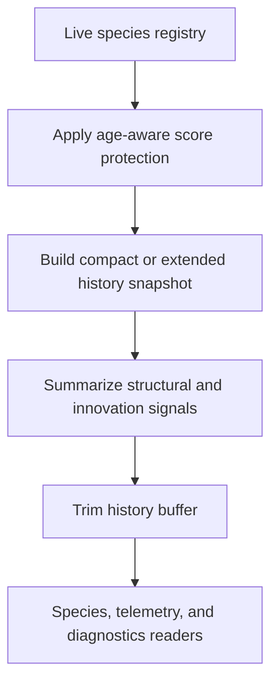
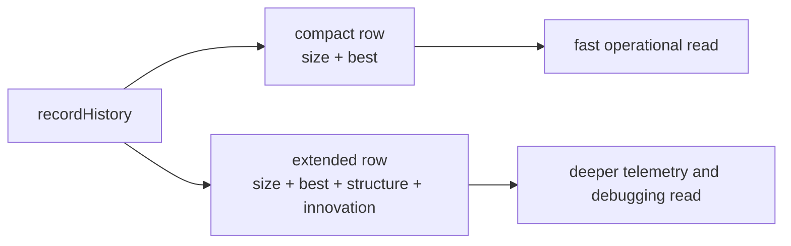

# neat/speciation/history

History and telemetry mechanics for speciation.

This chapter is the memory surface for speciation. Assignment rebuilds the
live registry, threshold tuning adjusts the future grouping boundary, and
sharing or stagnation decide short-term pressure. This file captures what the
controller should remember after those steps have settled.

In classic NEAT, speciation is not bookkeeping for its own sake. It is one of
the mechanisms that protects fragile new structures long enough to prove
whether they deserve to survive. This history boundary carries that idea
forward in two ways: it protects young species from being discounted too
early, and it preserves enough evidence that later readers can see how each
lineage changed over time.

It owns three related jobs:

1. apply age-aware protection so newly formed species are not punished too
   aggressively before they have time to improve,
2. record compact or extended per-generation history rows that later species,
   telemetry, and documentation surfaces can inspect,
3. summarize structural and innovation signals so history entries teach more
   than simple species counts.

Keeping those responsibilities together makes the speciation pipeline easier
to follow: this chapter does not decide who belongs to a species, but it does
decide what evidence about species evolution is preserved once assignment is
finished.

Read the chapter like a lab notebook for evolving niches:

1. first protect young structural experiments from premature pressure,
2. then record a compact or detailed snapshot of the current species state,
3. finally keep only the recent window of memory that still teaches something
   useful about the run.



If assignment answers "where does this genome belong right now?", history
answers two more educational questions: "what should this run remember about
that lineage?" and "how can later readers tell whether a species was merely
surviving or genuinely evolving?"

## neat/speciation/history/speciation.history.utils.ts

### applyAgeProtection

```ts
applyAgeProtection(
  speciationContext: SpeciationHarnessContext<TOptions>,
  options: TOptions,
): void
```

Apply age protection penalties to old species.

This protects newly created species from being penalized too early while also
allowing older species to lose some score advantage when the configured age
policy says they have been around long enough. Read it as a small historical
fairness rule layered on top of the current registry rather than as a new
assignment decision.

Pedagogically, this is the chapter's reminder that NEAT-style speciation is
trying to protect innovation, not just sort genomes. New structural ideas are
often weak before they are refined, so this helper delays harsh pressure long
enough for those ideas to either improve or clearly fail.

Parameters:
- `speciationContext` - - Speciation harness context.
- `options` - - Speciation options.

Returns: Nothing.

Example:

```ts
applyAgeProtection(neat, neat.options);
```

### recordHistory

```ts
recordHistory(
  speciationContext: SpeciationHarnessContext<TOptions>,
  options: TOptions,
): void
```

Record the current species history snapshot.

This writes the per-generation memory row that later chapters inspect. The
helper deliberately supports two levels of detail:
- a compact format for lightweight species history,
- an extended format that adds structural and innovation summaries when the
  caller has opted into a richer teaching or telemetry surface.

Read those two modes as two notebook styles for the same experiment:

1. compact history answers the fast operational question, "how many species
   existed and how strong were they?",
2. extended history answers the richer explanatory question, "what kind of
   structures and innovation patterns were forming inside each lineage?"

That distinction keeps the chapter useful for both lightweight runs and more
forensic debugging passes. The runtime can stay cheap by default, then opt
into a more story-rich snapshot only when the reader needs deeper evidence.

The chart below condenses that fork in one glance: compact mode keeps the
memory row small and operational, while extended mode pays for a richer set
of structural clues that make later charts and diagnostics more teachable.



Parameters:
- `speciationContext` - - Speciation harness context.
- `options` - - Speciation options.

Returns: Nothing.

Example:

```ts
recordHistory(neat, neat.options);
```

### buildExtendedHistoryStats

```ts
buildExtendedHistoryStats(
  speciationContext: SpeciationHarnessContext<TOptions>,
  species: SpeciesLike,
): Record<string, unknown>
```

Build extended history stats for a species.

Extended history mode is the bridge from "species existed" to "species was
evolving in a particular way." The helper folds one species into a richer row
that preserves structural size, best score, and innovation-distribution
signals so downstream charts and diagnostics can explain how that lineage was
changing rather than merely counting it.

This is the real hinge point of the chapter. Above this helper, the runtime is
still holding a live species registry. After this helper, the same lineage has
been translated into something closer to a reader-facing field note: size,
strength, and the structural clues that explain why the species looks the way
it does.

Parameters:
- `speciationContext` - - Speciation harness context.
- `species` - - Species to snapshot.

Returns: Extended history entry.

### summarizeInnovations

```ts
summarizeInnovations(
  speciationContext: SpeciationHarnessContext<TOptions>,
  members: GenomeDetailed[],
): { meanInnovation: number; innovationRange: number; enabledRatio: number; }
```

Summarize innovation statistics for a set of members.

Innovation summaries turn raw connection-level ids into a compact species
signature: where the mean innovation id sits, how wide the innovation spread
is, and how many connections remain enabled. Those signals help the history
layer describe whether a species is converging, staying structurally broad,
or accumulating dormant structure over time.

This is also where the chapter gets a little historical texture. Innovation
ids are the runtime's rough fossil record for structural change: not a full
genealogy, but enough to estimate whether a species is clustered around older
structure, still spreading into newer innovations, or carrying a large amount
of disabled architectural baggage.

Parameters:
- `speciationContext` - - Speciation harness context.
- `members` - - Members to summarize.

Returns: Innovation summary statistics.

### averageNumbers

```ts
averageNumbers(
  values: number[],
): number
```

Average a list of numbers, returning zero when empty.

This small helper keeps history summaries predictable when a derived metric
has no observations. Using the shared score fallback means empty aggregates do
not introduce `NaN` noise into the recorded history surface.

Even tiny helpers matter in educational telemetry code: one unstable average
can turn a readable chapter into a confusing table full of exceptional cases.

Parameters:
- `values` - - Numeric values to average.

Returns: Mean of the values or zero.

### trimHistory

```ts
trimHistory(
  speciationContext: SpeciationHarnessContext<TOptions>,
): void
```

Trim species history to the maximum buffer size.

History is useful only while it stays bounded. This helper enforces the fixed
retention cap so speciation can keep a rolling story of recent generations
without turning a long run into unbounded in-memory accumulation.

This is the closing editorial step for the chapter: keep enough recent memory
to teach the trend, but not so much that yesterday's data overwhelms today's
run.

Parameters:
- `speciationContext` - - Speciation harness context.

Returns: Nothing.
