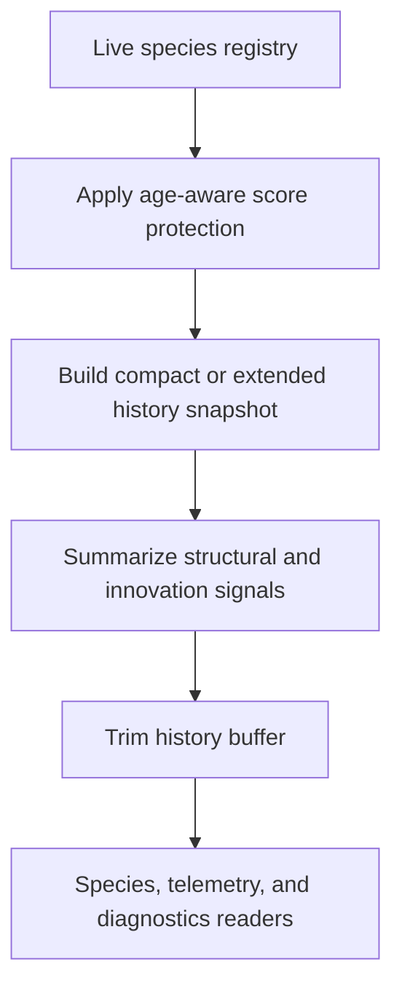

# neat/speciation/history

History and telemetry mechanics for speciation.

This chapter is the memory surface for speciation. Assignment rebuilds the
live registry, threshold tuning adjusts the future grouping boundary, and
sharing or stagnation decide short-term pressure. This file captures what the
controller should remember after those steps have settled.

It owns three related jobs:

1. apply age-aware protection so newly formed species are not punished too
   aggressively before they have time to improve,
2. record compact or extended per-generation history rows that later species,
   telemetry, and documentation surfaces can inspect,
3. summarize structural and innovation signals so history entries teach more
   than simple species counts.

Keeping those responsibilities together makes the speciation pipeline easier
to follow: this chapter does not decide who belongs to a species, but it does
decide what evidence about species evolution is preserved once assignment is
finished.



## neat/speciation/history/speciation.history.utils.ts

### applyAgeProtection

```ts
applyAgeProtection(
  speciationContext: SpeciationHarnessContext<TOptions>,
  options: TOptions,
): void
```

Apply age protection penalties to old species.

This protects newly created species from being penalized too early while also
allowing older species to lose some score advantage when the configured age
policy says they have been around long enough. Read it as a small historical
fairness rule layered on top of the current registry rather than as a new
assignment decision.

Parameters:
- `speciationContext` - - Speciation harness context.
- `options` - - Speciation options.

Returns: Nothing.

### averageNumbers

```ts
averageNumbers(
  values: number[],
): number
```

Average a list of numbers, returning zero when empty.

This small helper keeps history summaries predictable when a derived metric
has no observations. Using the shared score fallback means empty aggregates do
not introduce `NaN` noise into the recorded history surface.

Parameters:
- `values` - - Numeric values to average.

Returns: Mean of the values or zero.

### buildExtendedHistoryStats

```ts
buildExtendedHistoryStats(
  speciationContext: SpeciationHarnessContext<TOptions>,
  species: SpeciesLike,
): Record<string, unknown>
```

Build extended history stats for a species.

Extended history mode is the bridge from "species existed" to "species was
evolving in a particular way." The helper folds one species into a richer row
that preserves structural size, best score, and innovation-distribution
signals so downstream charts and diagnostics can explain how that lineage was
changing rather than merely counting it.

Parameters:
- `speciationContext` - - Speciation harness context.
- `species` - - Species to snapshot.

Returns: Extended history entry.

### recordHistory

```ts
recordHistory(
  speciationContext: SpeciationHarnessContext<TOptions>,
  options: TOptions,
): void
```

Record the current species history snapshot.

This writes the per-generation memory row that later chapters inspect. The
helper deliberately supports two levels of detail:
- a compact format for lightweight species history,
- an extended format that adds structural and innovation summaries when the
  caller has opted into a richer teaching or telemetry surface.

Parameters:
- `speciationContext` - - Speciation harness context.
- `options` - - Speciation options.

Returns: Nothing.

### summarizeInnovations

```ts
summarizeInnovations(
  speciationContext: SpeciationHarnessContext<TOptions>,
  members: GenomeDetailed[],
): { meanInnovation: number; innovationRange: number; enabledRatio: number; }
```

Summarize innovation statistics for a set of members.

Innovation summaries turn raw connection-level ids into a compact species
signature: where the mean innovation id sits, how wide the innovation spread
is, and how many connections remain enabled. Those signals help the history
layer describe whether a species is converging, staying structurally broad,
or accumulating dormant structure over time.

Parameters:
- `speciationContext` - - Speciation harness context.
- `members` - - Members to summarize.

Returns: Innovation summary statistics.

### trimHistory

```ts
trimHistory(
  speciationContext: SpeciationHarnessContext<TOptions>,
): void
```

Trim species history to the maximum buffer size.

History is useful only while it stays bounded. This helper enforces the fixed
retention cap so speciation can keep a rolling story of recent generations
without turning a long run into unbounded in-memory accumulation.

Parameters:
- `speciationContext` - - Speciation harness context.

Returns: Nothing.
