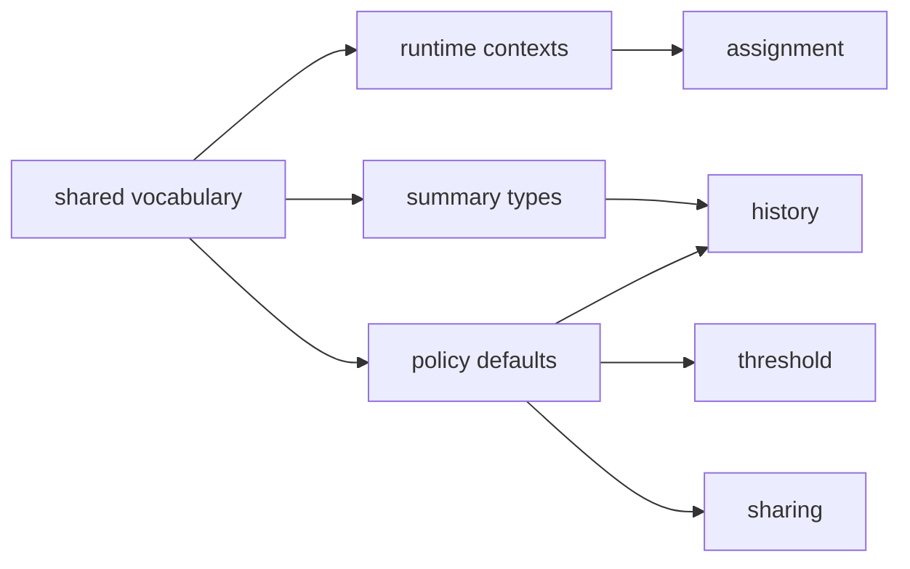

# neat/speciation/shared

Shared vocabulary and defaults for NEAT speciation.

This chapter is the shared language layer beneath the speciation subtree.
The adjacent chapters split responsibilities on purpose: assignment decides
membership, threshold tuning adjusts the future compatibility boundary,
sharing and stagnation reshape pressure after assignment, and history records
what happened. This file supplies the common words and defaults they all need
so those chapters can cooperate without re-defining the same contracts in
each folder.

Read the exports as one compact vocabulary map for the higher speciation
chapters:

1. runtime contexts such as {@link FitnessSharingContext} and
   {@link StagnationContext} describe the smallest live state slices a helper
   needs,
2. summary types such as {@link CompatAdjust} and
   {@link InnovationAccumulator} describe resolved settings and folded
   measurements,
3. grouped defaults define the baseline threshold, sharing, age, history,
   and score semantics that keep the subtree consistent from generation to
   generation.

## neat/speciation/shared/speciation.shared.ts

### CompatAdjust

Resolved compatibility-threshold adjustment settings.

This is the threshold-control policy slice shared by the speciation PID
helpers.

It is the non-nullable form of {@link SpeciationOptions.compatAdjust}, which
keeps the threshold chapter focused on per-generation control math instead of
re-explaining the whole options surface.

Read this as the adapter between user-facing options and the controller's
fully resolved runtime policy. Once this type is in hand, the threshold
helpers can reason about one complete control package: baseline threshold,
target species count, clamp rails, and proportional-plus-integral response.

### FitnessSharingContext

Minimal context required to apply fitness sharing.

This is the live sharing-pressure context for one already-assigned species
registry.

Fitness sharing normalizes per-genome fitness within each species to reduce
selection pressure toward dense clusters of very similar genomes.

The contract stays deliberately small: one current species registry and one
compatibility-distance reader. Sharing does not need assignment state,
history buffers, or threshold integrals, so those concerns stay outside this
context.

In the generated chapter, treat this as the "live neighborhood pressure"
context: just enough information to compare nearby genomes and soften scores
inside crowded species.

### StagnationContext

Minimal context required to update species stagnation.

This is the progress-over-time context for stagnation reads and pruning.

Stagnation pruning removes species that have not improved their best score
within a configured number of generations.

This context is intentionally narrower than the full speciation harness
because stagnation only needs a live registry and a generation counter to
decide whether a species is still earning its place.

Read it as the "progress over time" counterpart to
{@link FitnessSharingContext}: sharing compares neighbors within a generation,
while stagnation compares each species against its own recent history.

### InnovationAccumulator

Accumulator for innovation-id statistics across a set of connections.

This is the history-summary evidence bag used before raw measurements are
folded into reader-facing history metrics.

It is used for extended history telemetry (mean innovation, innovation
range, and enabled/disabled ratios).

Read this as the folded evidence bag for one species-history snapshot. The
history chapter gathers raw connection-level signals here first and only then
converts them into reader-friendly summary numbers.

That separation matters because the history helpers can stay honest about
what they measured before they decide how to summarize it for charts,
exports, or debugging reads.

### DEFAULT_COMPATIBILITY_THRESHOLD

Threshold-control default: baseline compatibility boundary used before adaptive tuning moves it.

Treat this as the speciation subtree's neutral opening guess: later
generations may push it up or down, but new runs start here.

This heading is also the best way to read the next five constants as one
controller family:

1. {@link DEFAULT_TARGET_SPECIES} names the desired live species count,
2. {@link DEFAULT_MIN_COMPATIBILITY_THRESHOLD} and
   {@link DEFAULT_MAX_COMPATIBILITY_THRESHOLD} keep tuning inside safe rails,
3. {@link DEFAULT_COMPATIBILITY_PROPORTIONAL_GAIN},
   {@link DEFAULT_COMPATIBILITY_INTEGRAL_GAIN}, and
   {@link DEFAULT_COMPAT_INTEGRAL} decide how quickly the controller reacts
   when the live count drifts away from that target.

In other words, this part of the chapter is the speciation controller's
thermostat: one starting temperature, one target range, and one set of knobs
that decide how aggressively to correct drift.

### DEFAULT_TARGET_SPECIES

Threshold-control default: species-count target that the controller tries to maintain.

The threshold helpers compare the current live count against this value when
deciding whether to widen or tighten the compatibility boundary.

### DEFAULT_MIN_COMPATIBILITY_THRESHOLD

Threshold-control default: lower bound that keeps adaptive tuning from collapsing to zero.

This prevents the threshold controller from driving the compatibility
boundary so low that almost every small difference forces a new species.

### DEFAULT_MAX_COMPATIBILITY_THRESHOLD

Threshold-control default: upper bound that keeps adaptive tuning from merging too aggressively.

This caps the controller before it broadens the neighborhood rule so far
that distinct niches start collapsing into the same species.

### DEFAULT_COMPATIBILITY_PROPORTIONAL_GAIN

Threshold-control default: proportional gain for immediate species-count response.

Larger values make threshold tuning react more strongly to the current gap
between the live species count and the target count.

### DEFAULT_COMPATIBILITY_INTEGRAL_GAIN

Threshold-control default: integral gain for accumulated response across generations.

This controls how much past count error keeps nudging the threshold even when
the current generation's gap is small.

### DEFAULT_COMPAT_INTEGRAL

Threshold-control default: neutral starting value for the integral accumulator.

New runs begin with no carried correction pressure, then accumulate response
as the threshold controller observes species-count drift.

### DEFAULT_SHARING_SIGMA

Sharing default: radius where zero selects the simpler uniform sharing fallback.

A positive sigma enables distance-aware sharing, while zero keeps the policy
on the simpler equal-share path for each species member.

Read the next four constants as one sharing-policy bundle:

1. this sigma decides whether the subtree uses a distance-aware neighborhood
   kernel or the simpler equal-share fallback,
2. {@link SHARING_SUM_FLOOR} and {@link DEFAULT_MEMBER_COUNT_FALLBACK} keep
   the divisor path safe when neighborhood evidence is sparse,
3. {@link SHARING_MAX_CONTRIBUTION} and {@link SHARING_SELF_DISTANCE} keep
   one neighbor comparison from dominating the crowding calculation.

That bundle matters because fitness sharing is not just one formula; it is a
small policy surface for deciding when crowding should be measured precisely
and when the runtime should fall back to a simpler, stable normalization
rule.

### SHARING_SUM_FLOOR

Sharing default: fallback divisor when the computed sharing sum is zero.

This safety floor keeps shared-fitness normalization well-defined even when a
helper ends up with no effective neighborhood contribution.

### SHARING_MAX_CONTRIBUTION

Sharing default: maximum crowding contribution counted per peer.

The sharing kernel clamps each neighbor's effect so one comparison cannot
contribute more than a full unit of crowding pressure.

### DEFAULT_MEMBER_COUNT_FALLBACK

Sharing default: fallback divisor when a species has zero members.

This protects the uniform-sharing fallback from division-by-zero when a
species briefly has no members during transition work.

### SHARING_SELF_DISTANCE

Sharing default: explicit self-distance used by the sharing kernel.

Keeping the self-distance explicit makes the sharing kernel easier to read
and keeps identity comparisons aligned with the broader distance vocabulary.

### DEFAULT_SPECIES_AGE_GRACE

Species-age default: grace window before older-species penalties may apply.

This keeps recently formed species from being penalized before they have had
enough generations to prove whether they can improve.

### SPECIES_AGE_GRACE_MULTIPLIER

Species-age default: multiplier that expands the grace setting into a runtime age threshold.

The grace option stays intentionally compact for users, while the runtime can
still expand it into a more forgiving generation-based threshold.

### DEFAULT_SPECIES_OLD_PENALTY

Species-age default: score multiplier applied when an old species is no longer protected.

Once the grace window expires, sharing/history helpers use this value to
reduce the influence of species that have aged without meaningful progress.

### PENALTY_NO_EFFECT_THRESHOLD

Species-age default: penalty cutoff where no reduction should occur.

This keeps the age-penalty path from doing unnecessary work when the chosen
penalty effectively means "leave scores alone."

### DEFAULT_STAGNATION_WINDOW

Stagnation default: number of generations a species may stall before pruning is allowed.

The stagnation helpers measure each species against this window before they
decide whether the species has stopped earning room in the population.

Read this together with {@link DEFAULT_LAST_IMPROVED_GENERATION} and
{@link HISTORY_BUFFER_MAX_ENTRIES}. The first two constants define the
runtime bookkeeping contract for deciding when a species has stalled, while
the history cap defines how much evidence the subtree keeps once those
decisions are recorded over time.

In practice this is the chapter's bridge from live maintenance to memory:
one value says when stagnation can matter, one seeds the first comparison,
and one keeps the accumulated record bounded for long-running searches.

### DEFAULT_LAST_IMPROVED_GENERATION

Stagnation default: last-improved generation used when no prior update exists.

This seed value lets stagnation bookkeeping stay numeric even when a species
has not yet recorded a real improvement event.

### HISTORY_BUFFER_MAX_ENTRIES

History default: maximum number of recent species-history rows retained in memory.

The history chapter trims older entries beyond this cap so long runs remain
inspectable without letting in-memory history grow without bound.

### DEFAULT_SCORE_FALLBACK

Summary default: numeric fallback used when a speciation read has a missing score.

History and stagnation summaries use this to keep ordering and projection
helpers stable when a genome has not yet produced a meaningful score.

Read this closing pair with {@link NEGATIVE_INFINITY} as the subtree's score
sentinel shelf. One value is the practical replacement for missing or not-yet
meaningful scores in reader-facing summaries, while the other is the strict
scan sentinel that lets reducers start from a safe worst-case bound.

Ending on these constants is intentional: after threshold, sharing, age, and
history defaults define the policy surface, the final question is how those
helpers stay numerically stable when real scores are sparse or still warming
up.

### NEGATIVE_INFINITY

Summary default: negative infinity sentinel used during score scans.

Summary helpers start from this sentinel when they need a safe "worst seen so
far" value before scanning real species scores.
