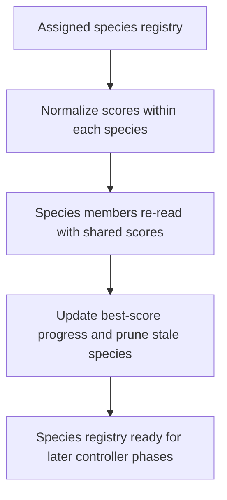

# neat/speciation/sharing

Fitness-sharing and stagnation mechanics for speciation.

This chapter owns the two post-assignment adjustments that make a species
registry useful over time rather than merely descriptive for one generation.
After assignment has grouped genomes and threshold tuning has updated the
future boundary, these helpers answer two follow-up questions:

1. should crowded species keep all of their raw score advantage,
2. has a species stopped improving long enough to be removed from the run.

Read the file in two halves. {@link applyFitnessSharing} reshapes scores so a
dense cluster of very similar genomes does not overwhelm selection simply by
volume. {@link updateSpeciesStagnation} then tracks whether each species is
still producing better members and prunes lineages that have gone stale.

The boundary stays intentionally narrow. These helpers do not decide species
membership, adapt compatibility thresholds, or write history rows. They take
the current species registry as given and adjust how that registry affects
later selection pressure and long-run survival.



## neat/speciation/sharing/speciation.sharing.utils.ts

### applyFitnessSharing

```ts
applyFitnessSharing(
  speciationContext: FitnessSharingContext,
  sharingSigma: number,
): void
```

Apply fitness sharing to penalize similarity within species.

Fitness sharing lowers the effective score of genomes that sit inside a dense
neighborhood of similar peers. That keeps one crowded species from dominating
later parent selection purely because many near-duplicates all retained their
full raw score.

The helper supports two modes:
- sigma-aware sharing, which weights neighbors by compatibility distance when
  the sharing radius is positive,
- uniform sharing, which falls back to dividing each member's score by the
  species size when no positive radius is configured.

Parameters:
- `speciationContext` - - Neat instance context with species and distance function.
- `sharingSigma` - - Sharing radius used for distance weighting.

Returns: Nothing.

### updateSpeciesStagnation

```ts
updateSpeciesStagnation(
  speciationContext: StagnationContext,
  stagnationWindow: number,
  sortSpeciesMembers: (species: SpeciesLike) => void,
): void
```

Update stagnation counters and prune stagnant species.

This is the long-run maintenance half of post-assignment speciation. It first
sorts each species so the "best current member" read is deterministic, then
refreshes best-score and last-improved bookkeeping, and finally removes
species whose improvement gap has exceeded the allowed stagnation window.

Read this as the answer to "is this species still earning its place in the
population?" Species that keep improving remain eligible for future rounds;
species that stop improving long enough are pruned from the live registry.

Parameters:
- `speciationContext` - - Neat instance context with species array and generation counter.
- `stagnationWindow` - - Allowed stagnation window.
- `sortSpeciesMembers` - - Sort function for species members.

Returns: Nothing.
