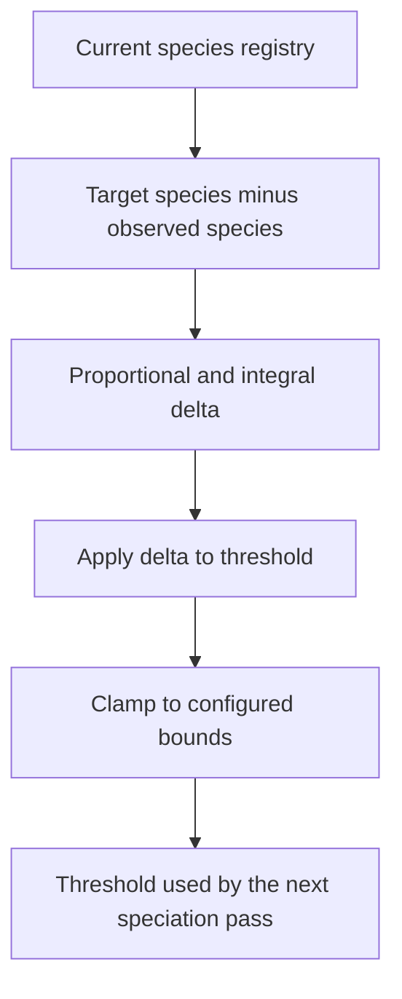

# neat/speciation/threshold

Compatibility-threshold tuning mechanics for speciation.

This chapter owns the small control loop that nudges compatibility distance
toward the species count the controller is aiming for. Assignment answers
"which genomes belong together right now?" Threshold tuning answers the next
question: "should the boundary for belonging move before the next pass?"

Read the control story in three stages:

1. compare the observed species count with the configured target,
2. translate that signed error into a threshold delta using the proportional
   and integral terms stored on the speciation context,
3. clamp the result so the controller never drifts outside the configured
   minimum and maximum threshold range.

Read the exported helpers in this order:

1. {@link adjustCompatibilityThreshold} is the controller-facing entrypoint
   used by the speciation pass,
2. {@link computePidThreshold} converts species-count error into the next
   threshold candidate,
3. {@link clampCompatibilityThreshold} is the last safety rail that keeps
   the resolved threshold inside the shared bounds.

The boundary stays intentionally narrow. These helpers adjust only the
compatibility threshold and its integral state. They do not re-run
assignment, mutate species membership directly, or decide how history and
sharing consume the resulting registry. That separation keeps speciation
readable: assignment groups genomes, threshold tuning updates the next
boundary, and later chapters interpret the resulting species state.

The `compatAdjust` parameter that appears in the generated signatures is the
resolved shared PID policy slice from `shared/`. Read it as one compact bag
of threshold-controller knobs rather than as a new chapter-local type story.



## neat/speciation/threshold/speciation.threshold.utils.ts

### adjustCompatibilityThreshold

```ts
adjustCompatibilityThreshold(
  speciationContext: SpeciationHarnessContext<TOptions>,
  options: TOptions,
  compatAdjust: { smoothingWindow?: number | undefined; decay?: number | undefined; kp?: number | undefined; ki?: number | undefined; minThreshold?: number | undefined; maxThreshold?: number | undefined; },
  minCompatibilityThreshold: number,
  maxCompatibilityThreshold: number,
): void
```

Update the adaptive compatibility threshold and clamp to bounds.

This is the public entrypoint for threshold adaptation inside the speciation
pipeline. It ensures the integral accumulator exists, applies the PID-like
update only when a numeric threshold is already active, and then enforces the
global bounds unconditionally so downstream passes never read an out-of-range
threshold.

Read this as the threshold chapter's orchestration helper. It does not own
the control math itself; it prepares the controller state, delegates the
signed error calculation to {@link computePidThreshold}, and then guarantees
that the public compatibility threshold remains safe for the next speciation
cycle.

Parameters:
- `speciationContext` - Speciation harness context.
- `options` - Speciation options.
- `compatAdjust` - Resolved threshold-controller gains and bounds from the shared speciation vocabulary.
- `minCompatibilityThreshold` - Lower clamp bound.
- `maxCompatibilityThreshold` - Upper clamp bound.

Returns: Nothing.

Example:

```ts
adjustCompatibilityThreshold(
  neat,
  neat.options,
  { kp: 0.5, ki: 0.05 },
  1,
  10,
);
```

### clampCompatibilityThreshold

```ts
clampCompatibilityThreshold(
  options: SpeciationOptions,
  minCompatibilityThreshold: number,
  maxCompatibilityThreshold: number,
): void
```

Clamp the compatibility threshold to configured bounds.

This is the final safety rail for callers that already have a threshold value
but need to ensure it remains inside the allowed range. Unlike the PID clamp
above, this helper only limits the option value itself; it does not interpret
species-count error or recalculate the integral term.

Read this as the small "no surprises" helper at the end of the loop. Once
the controller has chosen a new threshold candidate, this function makes the
public option safe to persist into the next generation even if the caller did
not come through the full PID path.

Parameters:
- `options` - Speciation options.
- `minCompatibilityThreshold` - Lower clamp bound.
- `maxCompatibilityThreshold` - Upper clamp bound.

Returns: Nothing.

Example:

```ts
clampCompatibilityThreshold(neat.options, 1, 10);
```

### computePidThreshold

```ts
computePidThreshold(
  speciationContext: SpeciationHarnessContext<TOptions>,
  options: TOptions,
  compatAdjust: { smoothingWindow?: number | undefined; decay?: number | undefined; kp?: number | undefined; ki?: number | undefined; minThreshold?: number | undefined; maxThreshold?: number | undefined; },
  currentThreshold: number,
  minCompatibilityThreshold: number,
  maxCompatibilityThreshold: number,
): number
```

Compute a PID-based threshold update and clamp when needed.

The control rule here is intentionally compact: count the current species,
compare that count with the configured target, accumulate the signed error,
and convert the proportional plus integral terms into one threshold delta.

A positive error means the controller currently has too few species, so the
resulting delta lowers the compatibility threshold and makes future species
splits easier. A negative error means there are too many species, so the
threshold rises and future passes become more willing to group genomes
together.

This helper is the chapter's control-law core. If the generated README feels
more mathematical than the surrounding speciation chapters, start here: the
only real question it answers is whether the next pass should make forming
new species easier or harder.

Parameters:
- `speciationContext` - Speciation harness context.
- `options` - Speciation options.
- `compatAdjust` - Resolved threshold-controller gains shared across speciation helpers.
- `currentThreshold` - Current compatibility threshold.
- `minCompatibilityThreshold` - Lower clamp bound.
- `maxCompatibilityThreshold` - Upper clamp bound.

Returns: Updated threshold.

Example:

```ts
const nextThreshold = computePidThreshold(
  neat,
  neat.options,
  { kp: 0.5, ki: 0.05 },
  3,
  1,
  10,
);
```
