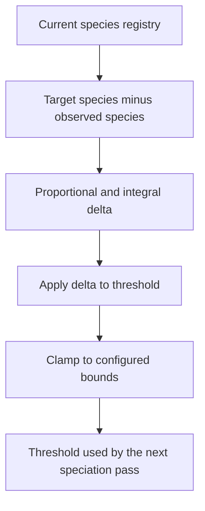

# neat/speciation/threshold

Compatibility-threshold tuning mechanics for speciation.

This chapter owns the small control loop that nudges compatibility distance
toward the species count the controller is aiming for. Assignment answers
"which genomes belong together right now?" Threshold tuning answers the next
question: "should the boundary for belonging move before the next pass?"

Read the control story in three stages:

1. compare the observed species count with the configured target,
2. translate that signed error into a threshold delta using the proportional
   and integral terms stored on the speciation context,
3. clamp the result so the controller never drifts outside the configured
   minimum and maximum threshold range.

The boundary stays intentionally narrow. These helpers adjust only the
compatibility threshold and its integral state. They do not re-run
assignment, mutate species membership directly, or decide how history and
sharing consume the resulting registry. That separation keeps speciation
readable: assignment groups genomes, threshold tuning updates the next
boundary, and later chapters interpret the resulting species state.



## neat/speciation/threshold/speciation.threshold.utils.ts

### adjustCompatibilityThreshold

```ts
adjustCompatibilityThreshold(
  speciationContext: SpeciationHarnessContext<TOptions>,
  options: TOptions,
  compatAdjust: { smoothingWindow?: number | undefined; decay?: number | undefined; kp?: number | undefined; ki?: number | undefined; minThreshold?: number | undefined; maxThreshold?: number | undefined; },
  minCompatibilityThreshold: number,
  maxCompatibilityThreshold: number,
): void
```

Update the adaptive compatibility threshold and clamp to bounds.

This is the public entrypoint for threshold adaptation inside the speciation
pipeline. It ensures the integral accumulator exists, applies the PID-like
update only when a numeric threshold is already active, and then enforces the
global bounds unconditionally so downstream passes never read an out-of-range
threshold.

Parameters:
- `speciationContext` - - Speciation harness context.
- `options` - - Speciation options.
- `compatAdjust` - - Compatibility adjustment settings.
- `minCompatibilityThreshold` - - Lower clamp bound.
- `maxCompatibilityThreshold` - - Upper clamp bound.

Returns: Nothing.

### clampCompatibilityThreshold

```ts
clampCompatibilityThreshold(
  options: SpeciationOptions,
  minCompatibilityThreshold: number,
  maxCompatibilityThreshold: number,
): void
```

Clamp the compatibility threshold to configured bounds.

This is the final safety rail for callers that already have a threshold value
but need to ensure it remains inside the allowed range. Unlike the PID clamp
above, this helper only limits the option value itself; it does not interpret
species-count error or recalculate the integral term.

Parameters:
- `options` - - Speciation options.
- `minCompatibilityThreshold` - - Lower clamp bound.
- `maxCompatibilityThreshold` - - Upper clamp bound.

Returns: Nothing.

### computePidThreshold

```ts
computePidThreshold(
  speciationContext: SpeciationHarnessContext<TOptions>,
  options: TOptions,
  compatAdjust: { smoothingWindow?: number | undefined; decay?: number | undefined; kp?: number | undefined; ki?: number | undefined; minThreshold?: number | undefined; maxThreshold?: number | undefined; },
  currentThreshold: number,
  minCompatibilityThreshold: number,
  maxCompatibilityThreshold: number,
): number
```

Compute a PID-based threshold update and clamp when needed.

The control rule here is intentionally compact: count the current species,
compare that count with the configured target, accumulate the signed error,
and convert the proportional plus integral terms into one threshold delta.

A positive error means the controller currently has too few species, so the
resulting delta lowers the compatibility threshold and makes future species
splits easier. A negative error means there are too many species, so the
threshold rises and future passes become more willing to group genomes
together.

Parameters:
- `speciationContext` - - Speciation harness context.
- `options` - - Speciation options.
- `compatAdjust` - - Compatibility adjustment settings.
- `currentThreshold` - - Current compatibility threshold.
- `minCompatibilityThreshold` - - Lower clamp bound.
- `maxCompatibilityThreshold` - - Upper clamp bound.

Returns: Updated threshold.
