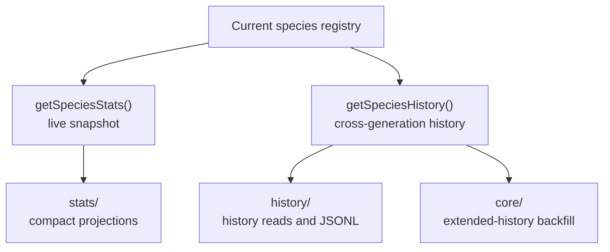

# neat/species

Species-reporting helpers for the NEAT controller.

This root chapter is the read-side companion to speciation. Once the
controller has assigned genomes into species and maintained that registry
across generations, callers usually want one of two reporting views:

1. a compact snapshot of the species that exist right now,
2. a longer historical record that explains how those species changed over
   time.

The public surface stays intentionally small so that those two questions stay
easy to answer. `getSpeciesStats()` is the "what does the current roster look
like?" path. `getSpeciesHistory()` is the "how did we get here across recent
generations?" path.

The helper chapters keep the deeper responsibilities separated:

- `stats/` projects the live species registry into compact reporting rows,
- `core/` explains when extended species history is backfilled and how
  innovation-range summaries are derived,
- `history/` keeps the JSONL export surface and history read machinery scoped
  to one serialization and retrieval concern.

Read this root chapter when you want the reporting map first. Drop into
`stats/` for current dashboards, `history/` for historical export and read
flows, and `core/` when you need to understand how older history rows are
enriched with extended metrics.



Example:

```ts
const currentSpecies = neat.getSpeciesStats();
const history = neat.getSpeciesHistory();
```

## neat/species/species.ts

### getSpeciesHistory

```ts
getSpeciesHistory(): SpeciesHistoryEntry[]
```

Retrieve the recorded species history across generations.

Use this when a current snapshot is no longer enough and you need to inspect
the species story over time: which species persisted, when they improved,
how their sizes changed, and how the controller's recorded view evolved
across generations.

Compared with {@link getSpeciesStats}, this helper is heavier but far more
explanatory. It returns the generation-stamped history buffer rather than a
compact live projection, which makes it the right choice for telemetry,
debugging, teaching material, and post-run analysis.

The underlying history read flow may also backfill extended fields when the
current controller options allow it, so callers get a more useful historical
surface without having to coordinate that enrichment manually.

Parameters:

- `this` - NEAT host exposing species history, species records, fallback innovation logic, and options.

Returns: Generation-stamped species history snapshots.

Example:

```ts
const speciesHistory = neat.getSpeciesHistory();
console.log(speciesHistory.at(-1));
```

### getSpeciesStats

```ts
getSpeciesStats(): { id: number; size: number; bestScore: number; lastImproved: number; }[]
```

Get lightweight per-species statistics for the current population.

This is the shortest read path into the species system. It is useful when a
caller needs dashboard-friendly snapshots such as current species sizes,
recent improvement timestamps, or the best score per species without pulling
the heavier generation-by-generation history buffer.

Parameters:

- `this` - NEAT host exposing the internal species registry.

Returns: Compact per-species summaries suitable for reporting.

Example:

```ts
const speciesSummaries = neat.getSpeciesStats();
console.table(speciesSummaries);
```
