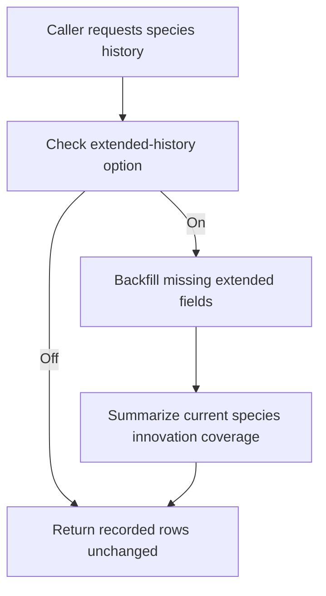

# neat/species/core

Species-history augmentation mechanics used by NEAT reporting helpers.

This chapter is the policy bridge between the read-side species history
surface and the live species registry that still exists in memory.

The surrounding `species/` chapter already explains when callers should read
current species snapshots versus generation-stamped history rows. This
narrower `core/` chapter answers the next question: when a caller requests
species history, should the controller enrich older rows with the extended
structural metrics that are easiest to recover from the current live
registry?

Read this chapter when you want to understand:

- why extended species-history augmentation is optional instead of always on,
- which history fields can be backfilled safely from the current registry,
- why the policy gate stays separate from the concrete augmentation loop.

The flow is intentionally small:

1. check whether the current options asked for extended history,
2. if so, delegate to the augmentation chapter that enriches missing rows in
   place,
3. leave existing extended rows untouched when the evidence is already
   present.



## neat/species/core/species.core.ts

### backfillExtendedHistory

```ts
backfillExtendedHistory(
  history: SpeciesHistoryEntry[],
  context: SpeciesHistoryBackfillContext,
): void
```

This helper is the chapter's orchestration entrypoint. It does not invent a
second history format or recalculate the entire species story; it only asks
the augmentation layer to enrich rows that are missing the extended metrics
while preserving rows that already carry those fields.

Read it as a bounded repair step for history readability. If a recorded row
already contains `innovationRange` and `enabledRatio`, the helper leaves that
row alone. If the row is missing those fields and the current live species
registry can still supply the evidence, the helper fills them in.

Backfill missing extended history fields in place.

Parameters:

- `history` - Recorded species history to enrich.
- `context` - NEAT context exposing current species and optional fallback innovations.

Returns: Nothing. The history entries are mutated in place when backfill succeeds.

Example:

```ts
if (shouldAugmentExtendedHistory(neat.options)) {
  backfillExtendedHistory(history, neat);
}
```

### shouldAugmentExtendedHistory

```ts
shouldAugmentExtendedHistory(
  options: NeatOptions | undefined,
): boolean
```

Check whether extended species history should be augmented.

This is the policy gate for the whole chapter. The read-side species history
flow uses it to decide whether returning the recorded rows is already enough
or whether the caller explicitly asked for the richer innovation-range and
enabled-ratio view.

Parameters:

- `options` - Current NEAT options.

Returns: `true` when extended history is enabled.
