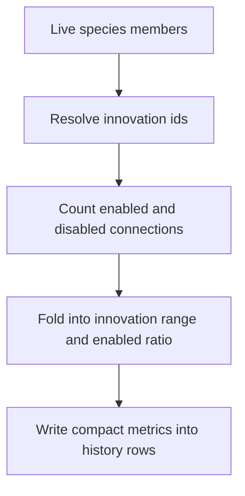

# neat/species/core/shared

Measurement helpers for species-history augmentation.

The surrounding `species/core` chapter decides *when* older history rows may
be enriched. This shared chapter answers the narrower question underneath
that policy gate: *what compact evidence should the controller extract from a
live species once enrichment is allowed?*

The answer is intentionally small. Instead of persisting every connection for
every member genome, the read-side history pipeline reduces one species to a
pair of explanatory signals:

- how wide the innovation span is across the current members,
- how much of that structural material is still enabled.

Those two metrics are enough to make historical species rows more legible in
dashboards and exports without dragging a large connection-level payload into
the reporting surface.

Read this file when the open question is about measurement rather than
orchestration. If you need to know whether augmentation should happen at all,
go back up to `species/core`. If you need to know how missing rows are walked
and filled in place, continue into `augmentation/`.



## neat/species/core/shared/species.core.shared.ts

### SpeciesConnectionSummary

Aggregated innovation coverage for the genomes currently assigned to one species.

The history backfill path uses this compact shape to answer two questions that
are useful in telemetry dashboards:

- how wide the inherited innovation span is across the species members,
- how many of those structural genes are still enabled.

Those two values are enough to make extended history rows much more
explanatory without forcing the species-reporting surface to retain every
connection-level detail from every generation.

Treat it as a reporting summary, not as a lossless reconstruction format.
The goal is to explain structural breadth and retention at a glance, not to
preserve every innovation id for downstream mutation logic.

### summarizeSpeciesConnections

```ts
summarizeSpeciesConnections(
  members: GenomeDetailed[],
  fallbackInnov: ((connection: ConnectionLike) => number) | undefined,
): SpeciesConnectionSummary
```

Summarize innovation spread and enabled-connection ratio for one species.

This helper stays separate from the history backfill orchestration so the
arithmetic can be reused and documented independently from the policy that
decides when augmentation should happen.

Read the fold in three stages:

1. walk every member connection,
2. resolve an innovation id from the connection or, for deliberate
   legacy/import reads only, the fallback resolver,
3. reduce the seen ids and enabled flags into one compact summary.

The fold preserves three small rules:
- connection innovation ids come from the connection itself when present,
- only genomes that opt into `_compatInnovationMode = 'allow-fallback'` may
  use the supplied innovation resolver,
- empty inputs collapse to safe zero-style defaults, while malformed native
  inputs fail fast instead of silently inventing structure.

Parameters:
- `members` - Detailed member genomes for a single species.
- `fallbackInnov` - Optional innovation resolver for legacy connections that do not carry a direct innovation id.

Returns: Compact innovation-range and enabled-ratio telemetry for the species.

Example:

```ts
const summary = summarizeSpeciesConnections(species.members, neat._fallbackInnov);
console.log(summary.innovationRange, summary.enabledRatio);
```
