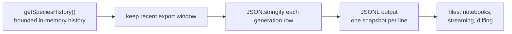

# neat/species/history

Species-history export helpers for the NEAT controller.

This chapter keeps the portable-export story separate from the broader
species-reporting helpers so the generated docs can answer one narrow reader
question cleanly: once you already have species history, how should you carry
it into scripts, notebooks, files, or diff-friendly artifacts?

The neighboring read chapter explains how a caller asks the controller for a
bounded history buffer. This export chapter begins one step later. It assumes
the history rows already exist and focuses on the packaging decision: keep
each generation snapshot independently parseable so downstream tools can
stream, append, or inspect the data without first reconstructing one large
array document.

Read this chapter when you want to answer questions such as:
- Why does species history export live in its own tiny boundary?
- Why is JSONL a better fit here than one large JSON array for many tooling
  workflows?
- How does the export helper keep the history window bounded?
- Which part of the species story is preserved versus trimmed during export?

The mental model is intentionally simple:
1. take the most recent slice of species history,
2. serialize each history row independently,
3. join the rows into a newline-delimited stream.

That shape keeps exports easy to inspect, append, stream, and diff without
widening this chapter into the heavier history-reading and enrichment logic
owned elsewhere in the species subtree.



## neat/species/history/species.history.ts

### exportSpeciesHistoryJsonl

```ts
exportSpeciesHistoryJsonl(
  speciesHistory: SpeciesHistoryEntry[],
  maxEntries: number,
): string
```

Export species history records as JSON Lines.

JSONL is a good fit for species-history export because each generation row
stays independently parseable. That makes the output convenient for log-like
storage, incremental processing, and quick inspection in tooling that prefers
one record per line.

Read this helper as the final packaging step after the history-read boundary
has already decided which generation rows should exist. It does not enrich,
recompute, or filter fields within each history entry. Its only job is to
take the recent slice the caller asked for and preserve that slice in a
format that moves well between scripts and artifacts.

The export sequence is intentionally small:

1. trim the history buffer to the requested recent window,
2. serialize each retained generation snapshot independently,
3. join those serialized rows with newline separators.

Parameters:
- `speciesHistory` - - Recorded species history entries to serialize.
- `maxEntries` - - Maximum number of recent entries to include.

Returns: JSONL payload containing the requested recent history slice.

Example:

```ts
const historyEntries = neat.getSpeciesHistory();
const jsonl = exportSpeciesHistoryJsonl(historyEntries, 50);

console.log(jsonl.split('\n').length);
```

### SPECIES_HISTORY_JSONL_MAX_DEFAULT

Default slice size when exporting species history as JSONL.

The default keeps exports large enough to show recent species turnover and
improvement trends without forcing every notebook, script, or artifact to
serialize the controller's full retained history buffer.

Read this as an export convenience default rather than a storage policy. The
history subsystem may retain more rows in memory; this constant simply picks
a practical recent window when the caller has not asked for a custom slice.
