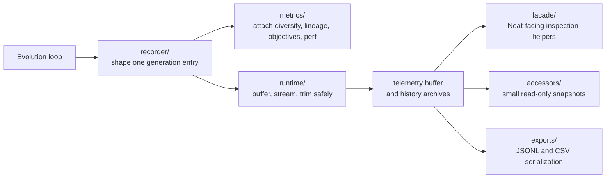

# neat/telemetry

Root bridge for NEAT telemetry, diagnostics, and export surfaces.

Telemetry is the evidence layer for a NEAT run. The controller is constantly
making decisions about search pressure, speciation, lineage, novelty,
complexity, and Pareto tradeoffs, but those decisions are hard to reason
about if all you can see is a single best score. This chapter exists so a
reader can learn how NeatapticTS turns that hidden runtime state into a
readable stream of snapshots, summaries, and exportable artifacts.

The telemetry subtree has two complementary halves:
- write path: `recorder/`, `metrics/`, and `runtime/` build one generation
  snapshot, enrich it with derived signals, and store or stream it safely
- read path: `facade/`, `accessors/`, and `exports/` expose that captured
  state back to callers as inspection helpers, JSONL logs, and CSV reports

Ownership boundary: telemetry is an evidence surface, not a hidden
policy engine. Recording, exporting, and reading these snapshots does not
redefine fitness, compatibility, species identity, or replay semantics
unless another controller loop explicitly consumes the evidence and chooses
to react to it.

Read this chapter when you want to answer questions such as:
- why is a run improving or stalling?
- how much structural diversity is left in the population?
- which species are growing, shrinking, or stagnating?
- which objectives are active, and how did the Pareto frontier evolve?
- what is the lightest export surface for notebooks, spreadsheets, or logs?

Recommended reading inside telemetry:
- `./recorder/README.md` for the write-side orchestration path
- `./metrics/README.md` for the derived-signal builders attached to each entry
- `./runtime/README.md` for buffer and stream safety mechanics
- `./facade/README.md` for the public `Neat` inspection surface
- `./exports/README.md` for CSV and JSONL serialization behavior
- `./accessors/README.md` for the lowest-level read helpers shared across the subtree

## neat/telemetry/telemetry.ts
