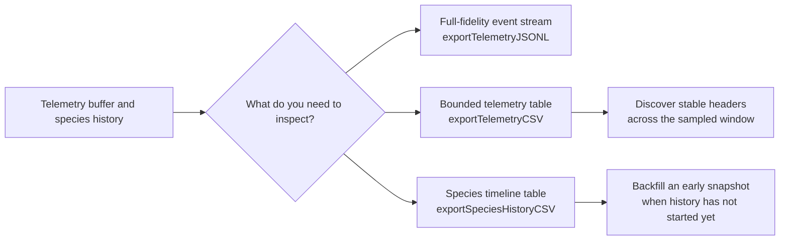

# neat/telemetry/exports

Telemetry export helpers for stream-friendly logs and spreadsheet-oriented analysis.

This chapter keeps the public serialization story together after the telemetry
facade split: JSONL helpers preserve full-fidelity event payloads for log
pipelines, while the CSV helpers flatten the most useful telemetry and
species-history metrics into a deterministic tabular shape for notebooks,
spreadsheets, and quick audits.

The neighboring `telemetry/facade/*` chapters own public `Neat` wrappers.
This exports chapter owns the actual serialization mechanics those wrappers
delegate to.

The main design constraint is determinism across uneven telemetry windows.
A long-running experiment rarely records the same optional fields in every
entry, especially when objective sets, lineage metadata, or Pareto state can
change over time. The helpers in this file therefore do two jobs at once:
they serialize entries, and they first discover a stable export shape so the
resulting CSV can still be compared, plotted, or diffed reliably.

Read this chapter when you want to understand how NeatapticTS turns rich but
irregular telemetry objects into bounded JSONL streams and spreadsheet-ready
CSV output without losing the meaning of sparse runtime fields.

Read the boundary as three export decisions instead of one big serialization
shelf:

1. `exportTelemetryJSONL()` when downstream tools want each full-fidelity
   runtime entry on its own line,
2. `exportTelemetryCSV()` when a notebook or spreadsheet needs one stable
   telemetry table across a bounded recent window,
3. `exportSpeciesHistoryCSV()` when the question is specifically about
   species turnover, growth, stagnation, and timing over generations.

The distinction matters because "export telemetry" is not one reader need.
Log pipelines want raw objects that preserve nested detail. Human analysis
tools usually want a fixed rectangular table. Species history often deserves
its own table entirely because one generation can contain multiple species
rows and because early runs may need a synthesized first snapshot before the
broader telemetry stream becomes interesting.



## neat/telemetry/exports/telemetry.exports.ts

### buildSpeciesHistoryCsv

```ts
buildSpeciesHistoryCsv(
  recentHistory: SpeciesHistoryEntry[],
  headers: string[],
): string
```

Build the full CSV string for species history entries.

Species history exports are row-expanded: each generation snapshot can produce
multiple rows, one for each species stat recorded inside that generation. The
helper therefore writes a single shared header line and then flattens the
nested history structure into one CSV row per species snapshot.

The important teaching point is that species history is not a one-row-per-
generation export. A generation can contain several contemporaneous species,
so the serializer preserves that multiplicity instead of forcing species data
into one over-packed cell.

Parameters:
- `recentHistory` - - History entries to export.
- `headers` - - Ordered headers for the export window.

Returns: Complete CSV payload.

### buildTelemetryHeaders

```ts
buildTelemetryHeaders(
  info: TelemetryHeaderInfo,
): string[]
```

Build the ordered header list for telemetry CSV output.

Once discovery is complete, this helper turns the collected key sets into the
final column order. Group prefixes such as `complexity.` and `perf.` preserve
meaning after flattening so spreadsheet readers can still tell which runtime
family a value came from.

The output order is intentionally grouped rather than purely alphabetical. It
keeps top-level run facts first, then nested metric families, then sparse
optional payload columns that behave more like attachments.

Parameters:
- `info` - - Collected header discovery state.

Returns: Ordered header names used for serialization.

### collectTelemetryHeaderInfo

```ts
collectTelemetryHeaderInfo(
  entries: TelemetryEntry[],
): TelemetryHeaderInfo
```

Collect header metadata from the sampled telemetry entries.

This is the discovery pass that makes CSV exports deterministic. Instead of
assuming every telemetry entry has the same shape, the helper scans the
window first and records which base fields, grouped metrics, and optional
columns actually appear anywhere in the sample.

Conceptually, this is where an irregular event stream becomes a table plan.
The rest of the CSV path is simpler because this helper commits to one export
shape before row serialization starts.

Parameters:
- `entries` - - Telemetry entries included in the export window.

Returns: Flattened header discovery state.

### DEFAULT_SPECIES_BEST_SCORE

Default fallback best score when a synthesized history row lacks a score.

This preserves a numeric best-score column even when the runtime only has a
minimally reconstructed species snapshot.

### DEFAULT_SPECIES_HISTORY_GENERATION

Default fallback generation used when backfilling an early species snapshot.

The synthetic row still prefers the controller's live generation when it is
available. This constant is the final floor for partially initialized hosts.

### DEFAULT_SPECIES_HISTORY_MAX_ENTRIES

Default max entries for species history CSV exports.

This keeps spreadsheet-oriented history exports bounded by default so a long
run does not accidentally dump an unmanageably large CSV when the caller only
wants a recent analytical window.

The default is intentionally generous enough for short trend analysis while
still nudging callers toward deliberate windowing. Species history is often
most useful as a recent timeline, not as an accidental full-run dump.

### DEFAULT_SPECIES_ID

Default fallback species id when a synthesized history row lacks an id.

This only appears in the synthetic early-history path where live species
exist but a formal history snapshot has not been archived yet.

### DEFAULT_SPECIES_LAST_IMPROVED

Default fallback last-improved generation when a synthesized row lacks one.

A neutral default keeps the CSV shape deterministic without pretending the
exporter knows more improvement history than the controller has actually
recorded.

### DEFAULT_SPECIES_SIZE

Default fallback species size when a synthesized history row lacks a size.

The exporter prefers an explicit neutral size over leaving the cell absent so
spreadsheets and notebooks can still treat the backfilled row as a stable
member of the same column contract.

### exportSpeciesHistoryCSV

```ts
exportSpeciesHistoryCSV(
  maxEntries: number,
): string
```

Export species history snapshots to CSV.

The exporter preserves runtime-added species stat fields by discovering the
union of keys across the requested history window. When history has not been
recorded yet but live species data exists, the helper synthesizes a minimal
snapshot so early-run CSV exports remain deterministic.

This is the most timeline-oriented export in the chapter. Instead of one row
per telemetry entry, it expands each generation snapshot into one row per
species so a reader can inspect turnover, stagnation, and size changes with
ordinary tabular tools.

Parameters:
- `this` - - Neat instance exposing species history and optional live species.
- `maxEntries` - - Maximum number of recent history snapshots to include.

Returns: CSV payload describing one species row per generation snapshot.

Example:

```ts
const csv = exportSpeciesHistoryCSV.call(neat, 25);
console.log(csv.split('\n').slice(0, 2).join('\n'));
```

### exportTelemetryCSV

```ts
exportTelemetryCSV(
  maxEntries: number,
): string
```

Export recent telemetry entries to a CSV string.

This is the human-scanning export path. Instead of preserving the exact
object graph like JSONL does, it discovers a stable column set across the
sampled window and then flattens grouped metrics into prefixed columns.

Flattening rules:
- nested `complexity`, `perf`, `lineage`, and selected `diversity` fields
  become `group.key` columns,
- optional arrays and maps are serialized as JSON cells only when present in
  the sampled window,
- the most recent `maxEntries` records are exported to keep output bounded.

Use this path when the reader question is comparative rather than archival:
you want to sort, filter, chart, or diff recent runtime behavior in a tool
that understands rows and columns better than nested objects.

Parameters:
- `this` - - Neat instance exposing the internal telemetry buffer.
- `maxEntries` - - Maximum number of recent telemetry rows to include.

Returns: CSV string containing headers plus one row per exported entry.

Example:

```ts
const csv = exportTelemetryCSV.call(neat, 50);
console.log(csv.split('\n')[0]);
```

### exportTelemetryJSONL

```ts
exportTelemetryJSONL(): string
```

Serialize telemetry as JSON Lines for stream-friendly log exports.

JSONL keeps the export path almost lossless: each telemetry entry is emitted
as one JSON object on one line, which makes the format easy to append to a
file, stream through command-line tools, or reload in notebook code without
flattening nested structures first.

Parameters:
- `this` - - Neat instance exposing the internal telemetry buffer.

Returns: JSONL payload with one telemetry object per line.

Example:

```ts
const jsonl = exportTelemetryJSONL.call(neat);
console.log(jsonl.split('\n').length);
```

### serializeTelemetryEntry

```ts
serializeTelemetryEntry(
  entry: TelemetryEntry,
  headers: string[],
): string
```

Serialize one telemetry entry into a CSV row using the ordered headers.

The serializer follows the header contract built for the whole export window.
That means each row is shaped against the same column set even when a given
entry is missing optional fields. Missing values become empty cells, while
nested structures that do exist are serialized into the cell that matches the
previously discovered column.

This separation is what makes the exporter robust: header discovery decides
what the table means, and row serialization only answers how one entry fits
inside that already chosen shape.

Parameters:
- `entry` - - Telemetry entry being serialized.
- `headers` - - Ordered headers for the whole export window.

Returns: CSV row string.

### TelemetryHeaderInfo

Shape describing collected telemetry header discovery info.

Think of this as the temporary export blueprint for one CSV window. Before a
telemetry entry can be flattened into cells, the exporter needs to know which
top-level fields exist, which nested metric groups need prefixed columns, and
which optional arrays or maps appeared anywhere in the sampled window.

## neat/telemetry/exports/telemetry.exports.utils.ts

Shared header-discovery and species-row helpers for the telemetry exports chapter.

The main exports file owns the user-facing JSONL and CSV entrypoints, while
this companion utility file keeps the lower-level bookkeeping focused on two
jobs: discover a stable flattened column set for telemetry CSV windows, and
normalize species-history rows so early-run exports remain deterministic even
when the live controller state is still sparse.

In other words, this file is where the exporter does its careful prep work.
The public helpers can promise deterministic CSV output because these utility
functions first answer the low-level questions: which columns exist in this
window, which optional structures actually appeared, which species-history
fields must be backfilled, and how should one value become one safe CSV cell.

### buildSpeciesHistoryStats

```ts
buildSpeciesHistoryStats(
  speciesList: SpeciesHistoryStat[],
  defaultSpeciesId: number,
  defaultSpeciesSize: number,
  defaultBestScore: number,
  defaultLastImproved: number,
): SpeciesHistoryStat[]
```

Normalize raw species records into exportable history stats.

Runtime species objects can arrive with slightly different shapes depending
on when they were recorded or which legacy path produced them. This helper
converts those permissive records into one compact export-ready model with
explicit fallbacks for id, size, score, and last-improved generation.

Parameters:
- `speciesList` - - Raw species records to normalize.
- `defaultSpeciesId` - - Default species id when missing.
- `defaultSpeciesSize` - - Default species size when missing.
- `defaultBestScore` - - Default best score when missing.
- `defaultLastImproved` - - Default last improved when missing.

Returns: Normalized stats for CSV export.

Example:

const stats = buildSpeciesHistoryStats(neat._species ?? [], -1, 0, 0, 0);
console.log(stats.length);

### collectBaseKeys

```ts
collectBaseKeys(
  entry: TelemetryEntry,
  state: TelemetryHeaderCollectionState,
  frontsHeader: string,
): void
```

Collect base (top-level) telemetry keys for a single entry.

This is the first header-discovery pass. It records ordinary top-level fields
while deliberately skipping grouped containers that will later be flattened
under prefixed columns.

Parameters:
- `entry` - - Telemetry entry to inspect.
- `state` - - Mutable header collection state.
- `frontsHeader` - - Header label for fronts column.

Returns: void. Mutates `state.baseKeys`.

### collectDiversityLineageMetrics

```ts
collectDiversityLineageMetrics(
  entry: TelemetryEntry,
  state: TelemetryHeaderCollectionState,
): void
```

Collect curated diversity lineage metrics for stable CSV exports.

Diversity objects can contain more information than the CSV surface needs.
This helper intentionally exports only the lineage-related diversity metrics
that are useful and stable enough to deserve fixed columns.

Parameters:
- `entry` - - Telemetry entry to inspect.
- `state` - - Mutable header collection state.

Returns: void. Mutates diversity lineage key set.

### collectGroupedMetricKeys

```ts
collectGroupedMetricKeys(
  entry: TelemetryEntry,
  state: TelemetryHeaderCollectionState,
): void
```

Collect nested metric keys for grouped telemetry fields.

Grouped telemetry objects such as `complexity`, `perf`, and `lineage` become
prefixed CSV columns. This helper discovers those nested keys without mixing
them into the base top-level header set.

Parameters:
- `entry` - - Telemetry entry to inspect.
- `state` - - Mutable header collection state.

Returns: void. Mutates complexity/perf/lineage key sets.

### collectOptionalColumnPresence

```ts
collectOptionalColumnPresence(
  entry: TelemetryEntry,
  state: TelemetryHeaderCollectionState,
): void
```

Collect presence flags for optional telemetry columns.

Some telemetry fields are sparse by design. Rather than creating columns for
every optional structure unconditionally, the exporter first checks whether a
field actually appears in the sampled window and only then enables the
corresponding column.

Parameters:
- `entry` - - Telemetry entry to inspect.
- `state` - - Mutable header collection state.

Returns: void. Mutates optional-column flags.

### collectSpeciesHistoryHeaders

```ts
collectSpeciesHistoryHeaders(
  history: SpeciesHistoryEntry[],
  generationHeader: string,
): string[]
```

Collect ordered header keys for species history CSV export.

Species history rows can grow new fields over time. This helper scans the
selected history window and builds the union of all encountered stat keys so
every emitted row follows one shared, predictable column order.

Parameters:
- `history` - - Recent species history entries.
- `generationHeader` - - Header label for generation column.

Returns: Ordered header list for CSV output.

### ensureMinimalSpeciesSnapshot

```ts
ensureMinimalSpeciesSnapshot(
  neatInstance: NeatLike & { _speciesHistory?: SpeciesHistoryEntry[] | undefined; _species?: SpeciesHistoryStat[] | undefined; generation?: number | undefined; },
  history: SpeciesHistoryEntry[],
  fallbackGeneration: number,
  defaultSpeciesId: number,
  defaultSpeciesSize: number,
  defaultBestScore: number,
  defaultLastImproved: number,
): void
```

Ensure a minimal species snapshot exists for deterministic CSV headers.

Early in a run, live species data can exist before the first formal history entry
has been recorded. This helper bridges that gap by synthesizing one minimal
history snapshot so header discovery and CSV output remain deterministic
instead of depending on whether the first archival step has happened yet.

Parameters:
- `neatInstance` - - Neat instance with optional species history and species.
- `history` - - Species history backing array.
- `fallbackGeneration` - - Generation fallback when missing.
- `defaultSpeciesId` - - Default species id when missing.
- `defaultSpeciesSize` - - Default species size when missing.
- `defaultBestScore` - - Default best score when missing.
- `defaultLastImproved` - - Default last improved when missing.

Returns: void. Mutates history when a minimal snapshot is needed.

Example:

const history = ensureSpeciesHistoryArray(neat);
ensureMinimalSpeciesSnapshot(neat, history, 0, -1, 0, 0, 0);

### ensureSpeciesHistoryArray

```ts
ensureSpeciesHistoryArray(
  neatInstance: NeatLike & { _speciesHistory?: SpeciesHistoryEntry[] | undefined; },
): SpeciesHistoryEntry[]
```

Ensure the species history array exists on the Neat instance.

This helper gives the CSV path one stable backing array to work with, even in
early or partially initialized controller states. It keeps later export code
focused on serialization instead of defensive host checks.

Parameters:
- `neatInstance` - - Neat instance holding species history.

Returns: Species history backing array (ensured on instance).

### resolveSpeciesHistoryCellValue

```ts
resolveSpeciesHistoryCellValue(
  historyEntry: SpeciesHistoryEntry,
  speciesStat: SpeciesHistoryStat,
  headerName: string,
  generationHeader: string,
): string
```

Resolve a single species history cell value for the provided header.

The generation column is special because it lives on the outer history entry,
not on the species stat itself. All remaining headers are treated as dynamic
species-stat fields and are read through the same record-style lookup path.

Parameters:
- `historyEntry` - - A single generation snapshot.
- `speciesStat` - - A single species stat record.
- `headerName` - - Column header name.
- `generationHeader` - - Column header name for generation.

Returns: Serialized cell (JSON) or empty string for missing values.

### safeStringifyCell

```ts
safeStringifyCell(
  value: unknown,
): string
```

Serialize a CSV cell with JSON.stringify safeguards.

The exporter uses JSON stringification for cells so numbers, strings, arrays,
and nested values all flow through one escaping path. Undefined values remain
empty cells to preserve the exporter’s existing sparse-column behavior.

Parameters:
- `value` - - Value to stringify.

Returns: JSON string or empty string when JSON.stringify returns undefined.

### serializeSpeciesHistoryRow

```ts
serializeSpeciesHistoryRow(
  historyEntry: SpeciesHistoryEntry,
  speciesStat: SpeciesHistoryStat,
  orderedHeaders: string[],
  generationHeader: string,
): string
```

Serialize one species history row using the provided headers.

Species history CSV output is built row by row from one generation snapshot
plus one species stat record. This helper guarantees that each row follows
the same previously collected header order, even when some species records
omit optional fields.

Parameters:
- `historyEntry` - - A single generation snapshot.
- `speciesStat` - - A single species stat record for that generation.
- `orderedHeaders` - - Ordered header list for stable CSV.
- `generationHeader` - - Column header name for generation.

Returns: CSV row string matching the provided header order.

### TelemetryHeaderCollectionState

Mutable state container used while collecting telemetry header metadata.

The header collector builds this structure incrementally while scanning a
telemetry window. It acts as a temporary map from irregular runtime objects
to the stable column layout that later CSV rows must follow.
