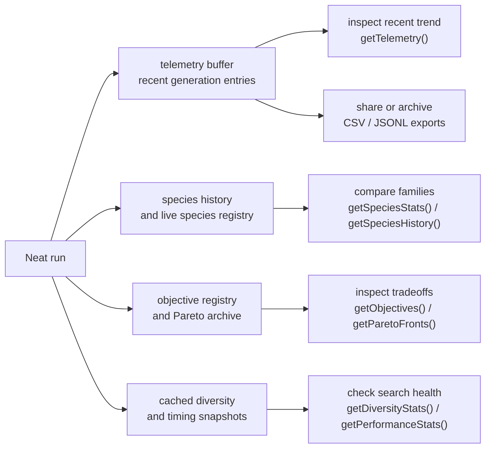

# neat/telemetry/facade

Public read-heavy facade helpers for Neat telemetry, objectives, and archive inspection.

This chapter is the user-facing answer to a practical question: once a NEAT
run has produced telemetry, where should a caller look first?
The write-side telemetry chapters explain how evidence is recorded; this
facade explains how that evidence comes back out as compact snapshots,
species summaries, objective views, diversity reads, and export-friendly logs.

A useful way to read the module is by inspection workflow:

- buffer views answer "what happened recently?" via `getTelemetry()` and telemetry exports
- objective and Pareto helpers answer "what tradeoffs are active right now?"
- species and lineage helpers answer "which families are growing, stalling, or inheriting together?"
- diversity and performance helpers answer "is search still broad, and how expensive was the last step?"
- clearing helpers reset evidence buffers when you want a fresh observation window

The chapter can feel broad because it deliberately gathers many read paths in
one public facade. The unifying idea is not implementation similarity; it is
inspection intent. Every helper here exists so a caller can ask a practical
post-run or mid-run question without reaching into controller internals.

Read the first chart as the main inspection map. Read the generated helper
sections in clusters rather than strict file order: recent buffer reads,
species and lineage reads, objective and archive reads, then reset helpers.



Read this chapter after `recorder/` when you care less about how a telemetry
entry is built and more about how an experimenter, dashboard, notebook, or
test can inspect the recorded state without reaching into controller internals.

## neat/telemetry/facade/telemetry.facade.ts

### clearParetoArchive

```ts
clearParetoArchive(
  host: NeatTelemetryFacadeHost,
): void
```

Clear the Pareto archive metadata stored on the host.

Use this when multi-objective inspection should restart from a clean archive
window, for example between experiments or before capturing a focused new
frontier snapshot.

Parameters:

- `host` - `Neat` instance whose Pareto archive should be emptied.

Returns: Nothing. The archive buffer is reset in place.

### clearTelemetry

```ts
clearTelemetry(
  host: NeatTelemetryFacadeHost,
): void
```

Clear cached telemetry entries.

Use this when you want a fresh observation window without restarting the run.
It is especially useful in notebooks, UI sessions, or targeted experiments
where older telemetry would otherwise drown out the next few generations.

Parameters:

- `host` - `Neat` instance whose telemetry buffer should be reset.

Returns: Nothing. The helper mutates the host buffer in place.

### clearTelemetryObjectives

```ts
clearTelemetryObjectives(
  host: NeatTelemetryFacadeHost,
): void
```

Remove all registered custom objectives so only the default objective path remains.

Read this as the reset companion to {@link registerTelemetryObjective}. It is
useful when one inspection session temporarily added custom objectives and the
caller wants to return the controller to its simpler baseline objective view.

Parameters:

- `host` - `Neat` instance whose objective registry should be cleared.

Returns: Nothing. The helper mutates the objective registry in place.

### exportParetoFrontJSONL

```ts
exportParetoFrontJSONL(
  host: NeatTelemetryFacadeHost,
  maxEntries: number | undefined,
): string
```

Export recent Pareto archive entries as JSON Lines.

Use this when the archive needs to leave the controller for offline analysis,
regression fixtures, or notebook-driven frontier inspection. Compared with
`getParetoArchive()`, the emphasis here is portability rather than immediate
in-memory inspection.

Parameters:

- `host` - `Neat` instance storing Pareto objective snapshots.
- `maxEntries` - Maximum number of entries to serialize.

Returns: JSONL payload for recent Pareto archive entries.

### exportSpeciesHistoryCSV

```ts
exportSpeciesHistoryCSV(
  host: NeatTelemetryFacadeHost,
  maxEntries: number,
): string
```

Export species history as CSV rows.

Prefer this when the reader is a person first and a program second. CSV is
the quickest path from species history into spreadsheets, ad-hoc inspection,
or lightweight experiment notes.

Parameters:

- `host` - `Neat` instance whose species history should be exported.
- `maxEntries` - Maximum number of recent history entries to include.

Returns: CSV payload for offline species analysis.

### exportSpeciesHistoryJSONL

```ts
exportSpeciesHistoryJSONL(
  host: NeatTelemetryFacadeHost,
  maxEntries: number,
): string
```

Export species history as JSON Lines.

Prefer this when the next consumer is a script, notebook, or append-friendly
file sink. JSONL keeps each generation independently parseable while still
preserving the richer row structure that CSV flattens away.

Parameters:

- `host` - `Neat` instance whose species history should be serialized.
- `maxEntries` - Maximum number of recent history entries to include.

Returns: JSONL payload describing recent species history snapshots.

### exportTelemetryCSV

```ts
exportTelemetryCSV(
  host: NeatTelemetryFacadeHost,
  maxEntries: number,
): string
```

Export recent telemetry entries as CSV for quick spreadsheet inspection.

Prefer this when the reader is a person scanning a table instead of a script
parsing nested JSON. The helper intentionally focuses on a recent window so a
long run can still produce a compact worksheet.

Parameters:

- `host` - `Neat` instance whose telemetry buffer should be exported.
- `maxEntries` - Maximum number of recent entries to include.

Returns: CSV string containing the requested telemetry window.

Example:

const csv = exportTelemetryCSV(neat, 100);
console.log(csv.split('\n').slice(0, 3).join('\n'));

### exportTelemetryJSONL

```ts
exportTelemetryJSONL(
  host: NeatTelemetryFacadeHost,
): string
```

Export telemetry as JSON Lines so logs can stream into files or post-processors.

JSONL is the most automation-friendly telemetry surface: one entry per line,
easy to append to a file, easy to pipe into scripts, and stable enough for
notebook or CLI post-processing.

Parameters:

- `host` - `Neat` instance whose telemetry buffer should be serialized.

Returns: JSONL payload with one telemetry object per line.

### getDiversityStats

```ts
getDiversityStats(
  host: NeatTelemetryFacadeHost,
): DiversityStats
```

Return cached diversity metrics, computing a fallback snapshot when needed.

This keeps the public facade resilient: callers can always ask for diversity
stats even before a full metrics pass has run.
The resulting snapshot is especially useful when you need to judge whether a
run is still exploring many structural alternatives or converging too hard.

Parameters:

- `host` - `Neat` instance exposing cached diversity state.

Returns: Diversity metrics for the current population.

Example:

const diversity = getDiversityStats(neat);
console.log(diversity.structuralEntropy, diversity.uniqueStructures);

### getLineageSnapshot

```ts
getLineageSnapshot(
  host: NeatTelemetryFacadeHost,
  limit: number,
): { id: number; parents: number[]; }[]
```

Return a compact lineage sample for the first genomes in the current population.

This is meant for inspection and teaching, not for full genealogy export. It
keeps payloads small by clipping the returned slice while still showing which
genomes share parents.

This is the facade's ancestry peek rather than a full genealogy export. Reach
for it when you want a fast sanity check on inheritance patterns without
paying the cost of a larger lineage report.

Parameters:

- `host` - `Neat` instance whose population lineage should be sampled.
- `limit` - Maximum number of genomes to include in the snapshot.

Returns: Array of `{ id, parents }` lineage entries.

### getMultiObjectiveMetrics

```ts
getMultiObjectiveMetrics(
  host: NeatTelemetryFacadeHost,
): { rank: number; crowding: number; score: number; nodes: number; connections: number; }[]
```

Build compact multi-objective metrics for the current population snapshot.

This helper is meant for inspection surfaces that need the shape of the
current Pareto landscape without pulling every genome field into view.

Read it as the facade's tradeoff-summary helper: enough information to see
rank layers, crowding pressure, and rough structural size, but not so much
detail that dashboards or quick diagnostics have to unpack whole genomes.

Parameters:

- `host` - `Neat` instance whose population should be summarized.

Returns: Rank, crowding, score, and size metrics per genome.

### getNoveltyArchiveSize

```ts
getNoveltyArchiveSize(
  host: NeatTelemetryFacadeHost,
): number
```

Return the current novelty archive size.

This is the smallest novelty-health read in the facade. Use it when you do
not need descriptor payloads, only a quick sense of whether novelty search is
still collecting distinct behaviors or has gone quiet.

Parameters:

- `host` - `Neat` instance tracking novelty behavior descriptors.

Returns: Number of archived novelty descriptors.

### getObjectiveEvents

```ts
getObjectiveEvents(
  host: NeatTelemetryFacadeHost,
): { gen: number; type: "add" | "remove"; key: string; }[]
```

Snapshot recent objective add/remove events for telemetry consumers.

This gives read-side tooling a lightweight history of objective churn without
forcing it to replay the full controller lifecycle. Use it when the question
is "when did the objective set change?" rather than "what are the active
objectives right now?"

Parameters:

- `host` - `Neat` instance storing objective lifecycle events.

Returns: Shallow copy of the recorded objective events.

### getObjectiveKeys

```ts
getObjectiveKeys(
  host: NeatTelemetryFacadeHost,
): string[]
```

Return just the registered objective keys in stable order.

This is the shortest inspection surface for tests and quick diagnostics that
only need to confirm which objectives are active, not the full descriptor
payload.

Parameters:

- `host` - `Neat` instance exposing objective descriptors.

Returns: Ordered list of active objective keys.

### getObjectives

```ts
getObjectives(
  host: NeatTelemetryFacadeHost,
): { key: string; direction: "max" | "min"; }[]
```

Return a compact view of active objective descriptors.

The full objective descriptor includes accessors and internal metadata. This
read model trims that down to the pieces most useful in UI surfaces and
debugging output: the key and whether the objective is minimized or
maximized.

Parameters:

- `host` - `Neat` instance exposing objective descriptors.

Returns: Compact objective summaries in evaluation order.

Example:

const objectives = getObjectives(neat);
console.table(objectives);

### getOperatorStats

```ts
getOperatorStats(
  host: NeatTelemetryFacadeHost,
): { name: string; success: number; attempts: number; }[]
```

Return aggregated mutation/operator statistics.

This is the fastest way to answer "which operators are being tried, and are
they paying off?" without digging through raw telemetry rows generation by
generation.

Parameters:

- `host` - `Neat` instance recording operator attempts and successes.

Returns: Operator summaries suitable for dashboards and debugging.

### getParetoArchive

```ts
getParetoArchive(
  host: NeatTelemetryFacadeHost,
  maxEntries: number | undefined,
): ParetoArchiveEntry[]
```

Return the most recent Pareto archive entries.

Unlike `getParetoFronts()`, which reconstructs the current population view,
this helper reads the historical archive that was captured while the run was
evolving. It is better suited for replaying how the frontier changed over
time.

Parameters:

- `host` - `Neat` instance storing archived Pareto metadata.
- `maxEntries` - Maximum number of archive entries to return.

Returns: Slice of the recent Pareto archive.

### getParetoFronts

```ts
getParetoFronts(
  host: NeatTelemetryFacadeHost,
  maxFronts: number | undefined,
): default[][]
```

Reconstruct Pareto fronts from current rank annotations.

Use this when the question is structural rather than historical: which fronts
exist right now, and how many genomes are sitting on each layer of the
current tradeoff surface?

Parameters:

- `host` - `Neat` instance whose population should be partitioned.
- `maxFronts` - Maximum number of fronts to reconstruct.

Returns: Pareto fronts ordered from best to worst.

### getPerformanceStats

```ts
getPerformanceStats(
  host: NeatTelemetryFacadeHost,
): { lastEvalMs: number | undefined; lastEvolveMs: number | undefined; }
```

Return coarse timing metrics for the last evaluation and evolution passes.

These timings are intentionally simple. They answer "which phase was expensive
last time?" without pretending to replace a profiler.

Parameters:

- `host` - `Neat` instance tracking performance timings.

Returns: Snapshot of the last evaluation and evolution durations.

Example:

const timing = getPerformanceStats(neat);
console.log(timing.lastEvalMs, timing.lastEvolveMs);

### getSpeciesHistory

```ts
getSpeciesHistory(
  host: NeatTelemetryFacadeHost,
): SpeciesHistoryEntry[]
```

Return recorded species history, lazily backfilling extended metrics when enabled.

Use this when you need the story across generations rather than the current
snapshot. It is the better surface for plots, regressions, and post-run
analysis of stagnation or speciation churn.

Parameters:

- `host` - `Neat` instance storing species history snapshots.

Returns: Historical species entries for each recorded generation.

Example:

const historyWindow = getSpeciesHistory(neat).slice(-10);
console.log(historyWindow.length);

### getSpeciesStats

```ts
getSpeciesStats(
  host: NeatTelemetryFacadeHost,
): { id: number; size: number; bestScore: number; lastImproved: number; }[]
```

Return a concise summary for each current species.

This is the fastest species-level diagnostic when you want to see whether the
population is still split across several improving families or collapsing
toward one dominant cluster.

Parameters:

- `host` - `Neat` instance whose live species registry should be summarized.

Returns: Array of current species summaries.

Example:

const speciesSummary = getSpeciesStats(neat);
console.table(speciesSummary);

### getTelemetry

```ts
getTelemetry(
  host: NeatTelemetryFacadeHost,
): TelemetryEntry[]
```

Return the in-memory telemetry buffer.

This is the fastest way to inspect the recent rhythm of a run: score trends,
diversity changes, objective snapshots, and timing evidence exactly as they
were recorded generation by generation.

Parameters:

- `host` - `Neat` instance storing generation telemetry snapshots.

Returns: Telemetry entries captured so far, or an empty array when telemetry
is not initialized.

Example:

const telemetryWindow = getTelemetry(neat).slice(-5);
console.table(telemetryWindow.map((entry) => ({
generation: entry.generation,
bestScore: entry.bestScore,
species: entry.species,
})));

### NeatTelemetryFacadeHost

Narrow `Neat` surface needed by the public telemetry, objective, and archive
facade methods.

This interface exists so the public `src/neat.ts` facade can delegate
read-heavy diagnostics and export helpers into one focused module without
exposing the entire controller implementation. The host shape keeps the
contract small: population snapshots, telemetry caches, objective accessors,
and archive buffers.

### registerTelemetryObjective

```ts
registerTelemetryObjective(
  host: NeatTelemetryFacadeHost,
  key: string,
  direction: "max" | "min",
  accessor: (genome: default) => number,
): void
```

Register or replace a custom objective.

This is the facade's write-side escape hatch for objective inspection flows.
Use it when a dashboard, script, or experiment wants the telemetry and
archive surfaces to start tracking a new tradeoff dimension without dropping
into the lower-level objective modules first.

Parameters:

- `host` - `Neat` instance whose multi-objective registry should change.
- `key` - Unique objective key.
- `direction` - Whether lower or higher values are considered better.
- `accessor` - Function that reads the objective value from a genome.

Returns: Nothing. The objective registry on `host` is updated in place.

### resetNoveltyArchive

```ts
resetNoveltyArchive(
  host: NeatTelemetryFacadeHost,
): void
```

Clear the novelty archive.

This is useful when a caller wants to restart the novelty observation window
without also resetting the rest of telemetry or the broader controller state.

Parameters:

- `host` - `Neat` instance whose novelty archive should be reset.

Returns: Nothing. The archive is mutated in place.
