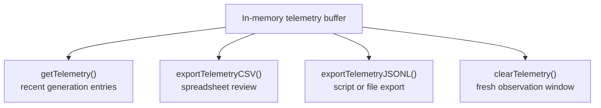

# neat/telemetry/facade/buffer

Telemetry-buffer inspection and export helpers inside the public facade.

This chapter is the shortest path into the raw telemetry stream that a NEAT
run accumulates over time. When a caller asks "what just happened across the
last few generations?", this is the boundary that answers.

The helper set stays intentionally small:

- `getTelemetry()` returns the in-memory generation snapshots,
- `exportTelemetryCSV()` turns a recent window into a table for human review,
- `exportTelemetryJSONL()` turns the same evidence into a script-friendly
  streaming format,
- `clearTelemetry()` resets the observation window without touching the rest
  of the controller state.

Read this chapter after the root telemetry facade when the remaining question
is specifically about recent-generation evidence rather than species,
multi-objective tradeoffs, or derived diversity snapshots.



## neat/telemetry/facade/buffer/telemetry.facade.buffer.ts

### getTelemetry

```ts
getTelemetry(
  host: TelemetryFacadeBufferHost,
): TelemetryEntry[]
```

Return the in-memory telemetry buffer.

This chapter groups the lowest-level telemetry reads with the export helpers
so callers can treat "inspect the buffer" and "serialize the buffer" as one
concept cluster inside the broader telemetry facade.

Parameters:
- `host` - - `Neat` instance storing generation telemetry snapshots.

Returns: Telemetry entries captured so far, or an empty array when telemetry
is not initialized.

Example:

```ts
const recentTelemetry = getTelemetry(neat);
console.log(recentTelemetry.at(-1)?.gen);
```

### exportTelemetryJSONL

```ts
exportTelemetryJSONL(
  host: TelemetryFacadeBufferHost,
): string
```

Export telemetry as JSON Lines so logs can stream into files or post-processors.

Prefer this when telemetry is leaving the process boundary. JSONL keeps the
append-and-pipe workflow simple: one generation snapshot per line, easy to
write to disk, ingest from scripts, or scan in notebooks.

Parameters:
- `host` - - `Neat` instance whose telemetry buffer should be serialized.

Returns: JSONL payload with one telemetry object per line.

Example:

```ts
const jsonl = exportTelemetryJSONL(neat);
console.log(jsonl.split('\n').at(0));
```

### exportTelemetryCSV

```ts
exportTelemetryCSV(
  host: TelemetryFacadeBufferHost,
  maxEntries: number,
): string
```

Export recent telemetry entries as CSV for quick spreadsheet inspection.

Use this when the consumer is a person first. CSV makes it easy to open a
recent telemetry window in a spreadsheet or quick table view without having
to parse nested JSON structures.

Parameters:
- `host` - - `Neat` instance whose telemetry buffer should be exported.
- `maxEntries` - - Maximum number of recent entries to include.

Returns: CSV string containing the requested telemetry window.

Example:

```ts
const csv = exportTelemetryCSV(neat, 100);
console.log(csv.split('\n').slice(0, 3).join('\n'));
```

### clearTelemetry

```ts
clearTelemetry(
  host: TelemetryFacadeBufferHost,
): void
```

Clear cached telemetry entries.

Reach for this when you want a fresh telemetry observation window between
experiment phases without rebuilding the rest of the controller.

Parameters:
- `host` - - `Neat` instance whose telemetry buffer should be reset.

Returns: Nothing. The helper mutates the host buffer in place.

### TelemetryFacadeBufferHost

Narrow telemetry-facade host surface required by the buffer/export chapter.

This chapter exists to keep the root telemetry facade focused on public
orchestration while the mechanics for reading, clearing, and serializing the
telemetry buffer live together in one small boundary.

Only the telemetry array itself is required here because this subchapter is
deliberately about raw recorded entries, not about species registries,
diversity caches, or objective metadata.
