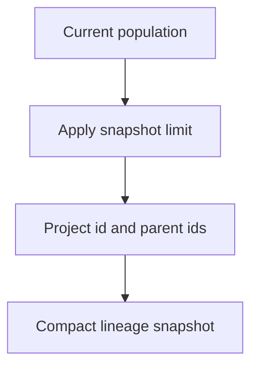

# neat/telemetry/facade/lineage

Compact lineage-inspection helpers inside the public telemetry facade.

This chapter is for the moment when a caller wants a quick ancestry sketch of
the current population without opening the full lineage subsystem. It does
not try to export deep genealogy or historical lineage analytics. Instead, it
provides a clipped read model that is small enough for dashboards, tests, and
teaching examples.

The boundary has three parts:

- `TelemetryLineageSnapshotEntry` defines the small ancestry record exposed publicly,
- `LINEAGE_SNAPSHOT_DEFAULT_LIMIT` keeps the sample size compact by default,
- `getLineageSnapshot()` projects the current population into that sample view.

Read this chapter after the root telemetry facade when the question is about
immediate parentage in the current population rather than long-run species
history, telemetry buffers, or Pareto archives.



## neat/telemetry/facade/lineage/telemetry.facade.lineage.ts

### getLineageSnapshot

```ts
getLineageSnapshot(
  host: TelemetryFacadeLineageHost,
  limit: number,
): TelemetryLineageSnapshotEntry[]
```

Return a compact lineage sample for the first genomes in the current population.

This chapter keeps the public telemetry facade focused on orchestration while
lineage inspection lives beside the narrow host contract and default limit it
depends on.

The helper intentionally clips the result so callers can log or render a
current ancestry sample without paying for a full-population genealogy dump.

Parameters:

- `host` - `Neat` instance whose population lineage should be sampled.
- `limit` - Maximum number of genomes to include in the snapshot.

Returns: Array of `{ id, parents }` lineage entries.

Example:

```ts
const lineageSnapshot = getLineageSnapshot(neat);
console.log(lineageSnapshot.at(-1)?.parents);
```

### LINEAGE_SNAPSHOT_DEFAULT_LIMIT

Default limit for lineage snapshots to avoid large payloads.

The lineage view is meant for inspection, tests, and compact summaries, not
for exporting the full ancestry of every genome in a large population. This
default keeps snapshots small enough to log or render quickly while still
showing inheritance patterns near the front of the population.

### TelemetryFacadeLineageHost

Narrow telemetry-facade host surface required by the lineage chapter.

The lineage snapshot path only needs the current population and the
lightweight ancestry markers stored on each genome.
That narrowness is deliberate: the telemetry facade only needs enough data
to build a compact current snapshot, not the broader history and policy
state owned by the full lineage subsystem.

### TelemetryLineageSnapshotEntry

Compact lineage entry exposed by the telemetry facade.

This read model stays intentionally small so inspection helpers can show
immediate ancestry without exporting full genealogy trees.
It is meant to answer "who were this genome's parents?" quickly, not to
preserve every lineage annotation the deeper lineage subsystem may track.
