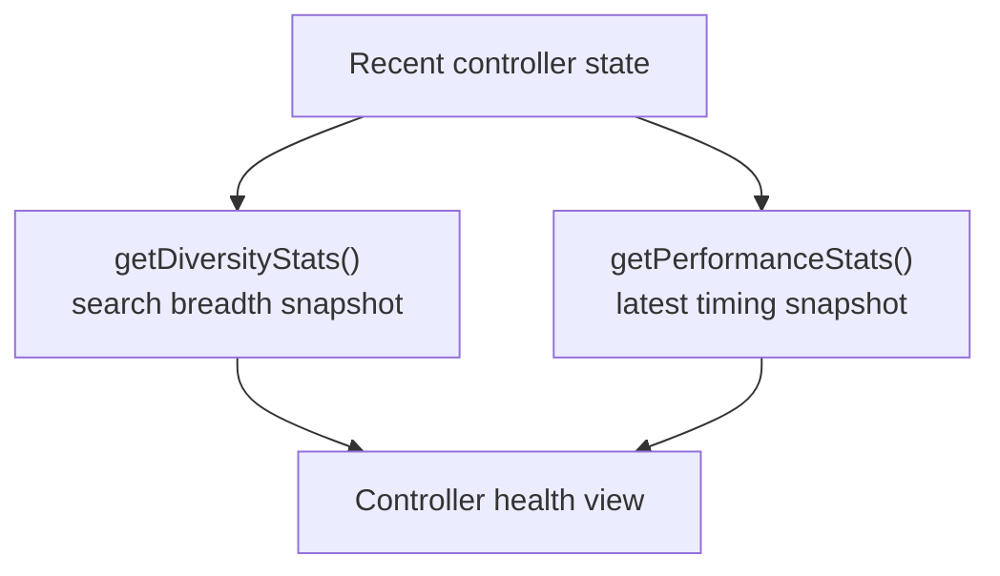

# neat/telemetry/facade/runtime

Controller-health snapshot helpers inside the public telemetry facade.

This chapter groups the smallest read surface for answering a practical
operational question: is the current run still diverse, and how expensive
was the latest controller work?

Those two signals belong together because they describe the present health of
the run from two different angles:

- `getDiversityStats()` summarizes structural breadth and variation,
- `getPerformanceStats()` summarizes recent evaluation and evolution timing.

Read this chapter after the root telemetry facade when you want a compact
controller-health dashboard rather than raw telemetry rows, lineage samples,
or archive/species inspection.



## neat/telemetry/facade/runtime/telemetry.facade.runtime.ts

### getDiversityStats

```ts
getDiversityStats(
  host: TelemetryFacadeRuntimeHost,
): DiversityStats
```

Return cached diversity metrics, computing a fallback snapshot when needed.

This keeps the public facade resilient: callers can always ask for diversity
stats even before a full metrics pass has run.

The helper follows a conservative fallback ladder:

1. return the live cached diversity snapshot when it exists,
2. otherwise try the shared accessor for a retained cached value,
3. otherwise synthesize an empty-but-safe snapshot sized to the current population.

Parameters:

- `host` - `Neat` instance exposing cached diversity state.

Returns: Diversity metrics for the current population.

Example:

```ts
const diversity = getDiversityStats(neat);
console.log(diversity.population, diversity.meanCompat);
```

### getPerformanceStats

```ts
getPerformanceStats(
  host: TelemetryFacadeRuntimeHost,
): { lastEvalMs: number | undefined; lastEvolveMs: number | undefined; }
```

Return coarse timing metrics for the last evaluation and evolution passes.

Keeping this beside the diversity snapshot helper makes the runtime chapter a
compact place to inspect the latest controller-health signals without mixing
them with lineage, species, or archive reads.

Parameters:

- `host` - `Neat` instance tracking performance timings.

Returns: Snapshot of the last evaluation and evolution durations.

Example:

```ts
const performance = getPerformanceStats(neat);
console.log(performance.lastEvalMs, performance.lastEvolveMs);
```

### TelemetryFacadeRuntimeHost

Narrow telemetry-facade host surface required by the runtime-metrics chapter.

This chapter groups the two read paths that summarize recent runtime state:
coarse timing snapshots and the cached diversity view used by diagnostics and
telemetry dashboards.

The host combines one recomputation hook with cached runtime fields so the
facade can stay resilient even when a caller asks for health metrics before a
complete telemetry cycle has populated every cached value.
