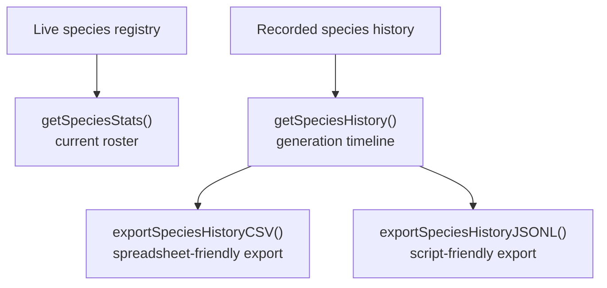

# neat/telemetry/facade/species

Species-focused read and export helpers inside the public telemetry facade.

This micro-chapter answers a practical read-side question: once a NEAT run
has started recording species evidence, which helper should you use when you
want the current roster, the recent cross-generation history, or a portable
export for offline analysis?

The boundary stays intentionally narrow:

- `getSpeciesStats()` is the live-dashboard view of the current species registry,
- `getSpeciesHistory()` is the richer timeline view spanning recent generations,
- `exportSpeciesHistoryCSV()` and `exportSpeciesHistoryJSONL()` turn that
  history into formats that are easier to inspect outside the controller.

Read this chapter after the root telemetry facade when the remaining question
is specifically about species. The broader facade tells you where species
inspection fits alongside objectives, diversity, lineage, and performance.
This file explains the smaller species-only bridge that forwards those reads
into the dedicated `species/` reporting chapters.



## neat/telemetry/facade/species/telemetry.facade.species.ts

### exportSpeciesHistoryCSV

```ts
exportSpeciesHistoryCSV(
  host: TelemetryFacadeSpeciesHost,
  maxEntries: number,
): string
```

Export species history as CSV rows.

Use this when the consumer is a person first and a program second.
CSV is the fastest path from the controller into spreadsheets, quick diffs,
or ad-hoc inspection where the reader wants one row per species snapshot
without parsing nested JSON.

This helper stays in the telemetry facade because species history is often
inspected alongside telemetry trends during experiment review, even though
the underlying export mechanics live in the dedicated telemetry export layer.

Parameters:

- `host` - `Neat` instance whose species history should be exported.
- `maxEntries` - Maximum number of recent history entries to include.

Returns: CSV payload for offline species analysis.

Example:

```ts
const csv = exportSpeciesHistoryCSV(neat, 100);
console.log(csv.split('\n').at(0));
```

### exportSpeciesHistoryJSONL

```ts
exportSpeciesHistoryJSONL(
  host: TelemetryFacadeSpeciesHost,
  maxEntries: number,
): string
```

Export species history as JSON Lines.

Prefer this when the export is headed into a file, notebook, or post-run
script. JSONL keeps one history snapshot per line, which makes it easy to
append, stream, diff, or ingest without loading one large array wrapper.

Parameters:

- `host` - `Neat` instance whose species history should be serialized.
- `maxEntries` - Maximum number of recent history entries to include.

Returns: JSONL payload describing recent species history snapshots.

Example:

```ts
const jsonl = exportSpeciesHistoryJSONL(neat, 50);
console.log(jsonl.split('\n').at(0));
```

### getSpeciesHistory

```ts
getSpeciesHistory(
  host: TelemetryFacadeSpeciesHost,
): SpeciesHistoryEntry[]
```

Return recorded species history, lazily backfilling extended metrics when enabled.

This is the timeline companion to {@link getSpeciesStats}. Instead of only
describing the current registry, it returns the recent generation-by-generation
record so callers can inspect persistence, growth, collapse, and improvement
patterns across time.

The delegated species helper may also enrich the returned rows with extended
metrics when the host options allow it, which keeps the read-side call small
while still producing a more explanatory history surface.

Parameters:

- `host` - `Neat` instance storing species history snapshots.

Returns: Historical species entries for each recorded generation.

Example:

```ts
const speciesHistory = getSpeciesHistory(neat);
console.log(speciesHistory.at(-1));
```

### getSpeciesStats

```ts
getSpeciesStats(
  host: TelemetryFacadeSpeciesHost,
): { id: number; size: number; bestScore: number; lastImproved: number; }[]
```

Return a concise summary for each current species.

This is the "what does the roster look like right now?" read path.
Reach for it when you want dashboard-friendly state such as current species
sizes, best scores, and recent improvement markers without paying for the
heavier historical buffer.

Parameters:

- `host` - `Neat` instance whose live species registry should be summarized.

Returns: Array of current species summaries.

Example:

```ts
const speciesStats = getSpeciesStats(neat);
console.table(speciesStats);
```

### TelemetryFacadeSpeciesHost

Narrow telemetry-facade host surface required by the species chapter.

These helpers sit between the public telemetry facade and the dedicated
species modules, so they only depend on the pieces needed to forward species
reads and exports safely.

The contract intentionally combines three kinds of state:

- current option flags that decide whether history reads may backfill extra metrics,
- live or recorded species buffers that the read helpers project,
- the optional legacy innovation resolver needed when older connection data
  must be summarized into modern history rows.
